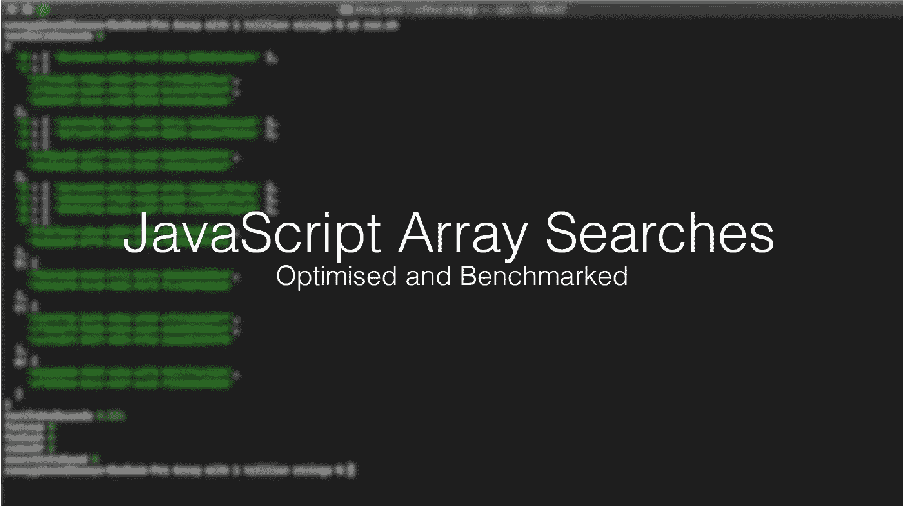
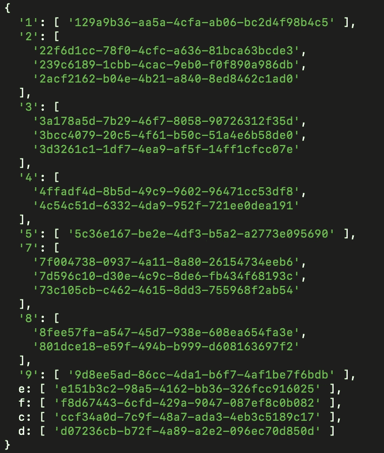
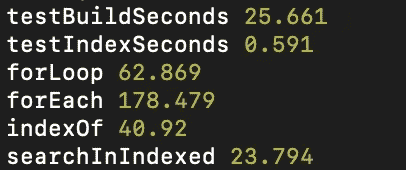
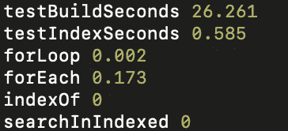

# 优化 JavaScript 数组搜索:基准测试

> 原文：<https://levelup.gitconnected.com/optimising-javascript-array-searches-benchmarked-3d7e2725f17f>



我看过许多关于 JavaScript 字符串数组循环的最佳方式的文章和基准，它们通常都给出相同的结果。我还没有看到任何人试图改进他们使用的循环方法，这给了我挑战。我想看看我们是否能改进数组迭代器，以便更好地找到存储在其中的数据。

让我们来看看 JavaScript 中遍历数组的不同方式

还有传统的`**for**` 循环:

```
for(let i = 0 ; i < maxArraySize; i++) {
    let item = array[i];
}
```

然后是`**forEach**`:

```
array.forEach(val => {
    // Do something with val
});
```

最后，还有`**for…in**`，虽然很少使用，但仍然很有用:

```
for (let val in array) {
    // do something with val
}
```

对于那些懂 JavaScript 的人来说，他们知道有一个内置函数`**indexOf**`:

```
array.indexOf(stringToFind);
```

知道所有这些函数以及何时使用它们是很棒的，但是当你的字符串数组已经达到极限时，为什么不在你可以的地方优化它呢？

我决定用一些不同的方法来看看是否有一种方法可以优化它们，但是这些方法大多依赖于运气。

例如，从结尾开始循环:

```
for(let i = maxArraySize ; i >= 0; i--) {
    // Do something with array(i);
}
```

只有当你知道你的价值接近终点时，上面的方法才有效。

我于是想出了`**stabInTheDark**`方法:

```
function stabInTheDark(array, stringToFind){
    while(true){
        let index = Math.floor(Math.random() * Math.floor(maxArraySize));
        if(array[index] === stringToFind){
            return true;
        }
     }
}
```

上述方法的问题是，它会随机尝试并找到值，由于它不跟踪它以前做了什么(这将浪费时间)，因此有可能出现重复比较。

然后我想到这个解决方案已经用了几十年了:**索引你的数据**。

如果数据库索引它们的数据以避免扫描，为什么我们不在编程语言中使用它？也许是因为我们可能只遍历一组数据一次，然后就将其转储，但是如果您必须多次重用相同的数据呢？我试了一下，结果如下。

我想出了下面的函数和索引生成器:

```
function searchInIndexed(indexedObj, stringToFind){
    let firstChar = stringToFind[0];
    let n = indexedObj[firstChar].length;
    for(let i = 0 ; i < n; i++) {
        if(indexedObj[firstChar][i] === stringToFind){
            return true;
        }
    }
}function createIndexArr(array){
    // Our indexed object
    let newObj = {}
    for(let i = 0 ; i < maxArraySize; i++) {
        // We'll use the first character of the string to base our index. Could in the range of [a-z,1-9]
        let firstChar = array[i][0];
        if(newObj[firstChar]){
            newObj[firstChar].push(array[i]);
        } else {
            newObj[firstChar] = [array[i]];
        }
    }
    return newObj;
}
```

下面是索引数据现在的样子:



索引字符串数组

测试规则如下:

1.  搜索必须使用相同的字符串数组数据
2.  每个方法必须循环 1000 次
3.  结果必须一致才有效

构建单词数组花费了 **25.661 秒，构建索引花费了**0.591 秒。

以下是按最快秒排序的方法时间:

1.  索引搜索: **23.794**
2.  指数: **40.92**
3.  forLoop: **62.869**
4.  预测: **178.479**



循环 1000 次的结果

如果循环只使用一次，那么 **indexOf** 方法将是最快的，因为索引构建时间会增加搜索时间。



循环一次的结果

**总结**:根据这些结果，我们可以了解到，你的应用程序总有优化的空间，尤其是当你知道你的数据看起来像什么，以及它在现实世界中如何运作的时候。如果您有一个包含几十万个字符串的字符串数组，那么索引这些数据将是最快的方法。

即使它不是一个字符串数组，当你遍历你的数据时，总是试图找到最快的方法来得到你想要的数据。这真的会有很大的不同。

下面是完整的运行代码，供感兴趣的人参考:【https://github.com/CyberCyclone/optimising-string-arrays