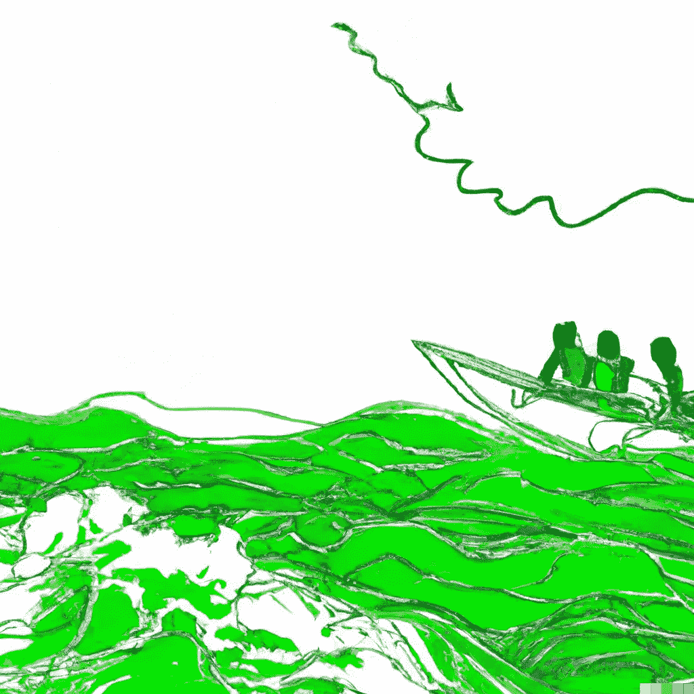

# 最优化(第六章:人工智能手册)

> 原文：<https://levelup.gitconnected.com/optimization-chapter-6-ai-handbook-b3016e90d012>

算法，现实世界的应用，简单解释

来自[作者](https://medium.com/@aniltilbe) : OpenAI 协助了这个视觉的开发

如果你曾经试图找到去工作的最佳方式，或者如果你曾经试图找出穿过拥挤的市场的最有效方式，你知道有时很难找到最佳解决方案。

在本帖中，我们将会看到随着时间的推移，人们用来解决这类问题的一些不同方法。有些相当简单，有些相当复杂。其中一些依赖于统计和概率，而另一些使用启发式或经验法则。

当我们谈论机器学习时，我们往往专注于算法本身。毕竟，这是让我们的算法起作用的东西。但是，如果我们有世界上最好的算法，却没有办法应用它，那会怎么样呢？还是一个太慢没用的烂算法？

这就是[优化](https://books.google.com/books?hl=en&lr=&id=JPQx7s2L1A8C&oi=fnd&pg=PR5&dq=optimization+in+machine+learning&ots=vei8vhmaGc&sig=DzCBPasM0rW4alB1AlFmgByDVt4#v=onepage&q=optimization%20in%20machine%20learning&f=false)发挥作用的地方。优化是采用一种算法并确保它尽可能好地工作的过程。

在机器学习领域，有许多不同的算法和方法来解决问题。一种这样的方法是局部搜索，它使用当前状态和邻居的组合来获得全局最大值。这种搜索算法可以用在有许多不同变量和输入的许多场景中，例如优化计算机的性能或找到汽车行驶的最佳路线。

来自[昆诺艾尔](https://unsplash.com/@quinoal)un splash

局部搜索算法可以进一步分为爬山和模拟退火。这两种方法之间的区别在于，爬山总是朝着图上的最高点移动，而模拟退火有时会朝着较低的点移动，如果它们最终会导致更高的点(就像回到山下)。

除了局部搜索算法，全局最大值也可以通过弧一致性来优化。弧线一致性意味着如果两点之间有多条路径，那么从起点到终点，应该只有一条路径通过每一点。

# **本地搜索**

局部搜索是机器学习中使用的一种技术，用于为具有许多变量的问题找到好的解决方案。它用于优化函数值，通过探索所有可能函数的空间来实现。

局部搜索是一个从初始解开始的迭代过程。然后，系统将初始解决方案与其当前状态进行比较，选择另一个附近的解决方案，并评估它比第一个解决方案好多少。如果第二个解优于第一个解，那么新的解将成为下一次局部搜索迭代的新起点。

算法不断重复这个过程，直到找到一个好的解决方案，或者耗尽时间或内存。局部搜索算法可用于寻找问题的解决方案，例如在图中寻找最小值或最大值，或者在具有许多变量的问题中寻找接近最优的解决方案。

来自[作者](https://medium.com/@aniltilbe)

假设我们试图找到一条穿过迷宫的路。我们从目前的位置(入口)开始，然后随机朝一个方向前进一步。如果这一步让我们比前进前更接近出口，那么我们会继续朝那个方向前进；否则，如果它不能让我们比迈出那一步之前更接近出口，那么我们将回到我们最初的位置(入口)并尝试另一个方向。

我们一遍又一遍地重复这个过程，直到目标达到或者无法再进一步改进。以上是对该过程的简单描述，但应该足以让您了解它是如何工作的。这个主题有许多变体，但它们都有一个共同点:它们利用随机性来引导您搜索更好的解决方案(或至少更接近的解决方案)。

# **爬山和模拟退火算法**

有两种主要的优化方法:爬山和模拟退火。

爬山算法从一个点开始，然后通过尝试不同的动作(即接下来的步骤)朝着一个目标前进。如果一个行动让你更接近你的目标，那么你就继续沿着那条路走下去；如果不行，你试试别的。举个例子:如果你试图穿过一片森林找到一条从一点到另一点的路径，爬山会涉及到每次根据路径是向上还是向下来选择路径(如果有必要的话，还会原路返回)。爬山算法往往很快，但并不总是让我们到达我们需要去的地方——它们有利于找到短期解决方案，但可能对长期解决方案不太适用。

来自[作者](https://medium.com/@aniltilbe) : OpenAI 协助了这个视觉的开发

模拟退火是一种考虑缺陷位置和尺寸的更快的优化方法。爬山找到[局部最优值，](https://epubs.siam.org/doi/abs/10.1137/0606040)对整个系统来说可能是也可能不是最优值。模拟允许团队对大型系统进行更详细的研究，这通常是通过试错法实验无法实现的。

与此同时，爬山可以反馈一个人有多快接近优化一个特定的设定点。最后，这种技术依赖于寻找所谓的[最小值而不是最大值](https://proceedings.mlr.press/v40/Belloni15.html)。尽管爬山会在到达[最大值](https://www.sciencedirect.com/science/article/pii/S2212017312004070)(局部)最小化解时停止，模拟退火可能会继续探索解，直到它到达任何先前发现的解之外的另一个最小值([偏心率](https://iopscience.iop.org/article/10.1088/0004-637X/725/2/2166/meta))。

**离别的思念**

寻找最优解一直是人工智能研究的焦点。结合机器学习、局部搜索和模拟退火的算法已经成功地解决了复杂的优化问题。

如果你对这篇文章有任何建议或拓宽主题的建议，我将非常感谢你的来信。另外，请考虑 [**订阅我的时事通讯。**](https://predictiveventures.substack.com/)

我在 Medium 上创建了以下“列表”，你可以访问以查看这个 [**《人工智能手册》**](https://aniltilbe.medium.com/list/b67f31a002b3) 系列中的所有其他帖子。

如果你喜欢阅读这样的故事，并希望支持我成为一名作家，可以考虑注册成为一名 Medium 会员，并无限制地访问 Medium 上的所有故事:[*** * *订阅 Medium*****](https://medium.com/@AnilTilbe/membership) **。**

**此外，考虑阅读以下来自*人工智能手册*的帖子:**

 [## 人工智能历史(第一章:人工智能手册)

### 开始、中间和现在。一个端到端的，但非常简单的介绍人工智能在这个多部分…

levelup.gitconnected.com](/artificial-intelligence-history-chapter-1-ai-handbook-ae5774ef8026)  [## 知识表示(第 2 章:人工智能手册)

### 所有人工智能产品都采用的基本问题空间，这是一个非常简单的知识表示介绍…

levelup.gitconnected.com](/knowledge-representation-chapter-2-ai-handbook-f37da56d5868)  [## 专家系统(第三章:人工智能手册)

### 简单介绍了三种专家系统及其现代应用。

levelup.gitconnected.com](/expert-systems-chapter-3-ai-handbook-4143cbf6789d)  [## 神经网络(第四章:人工智能手册)

### 简化的、基于当今应用解释的几个神经网络。

levelup.gitconnected.com](/neural-networks-chapter-4-ai-handbook-24c5a569fa05) 

**参考文献:**

都是烤成的帖子。

阿尼尔·蒂尔贝