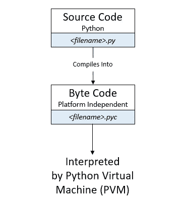
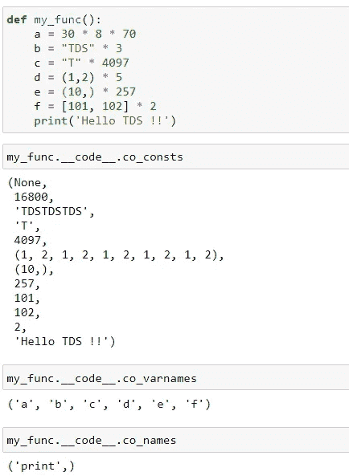
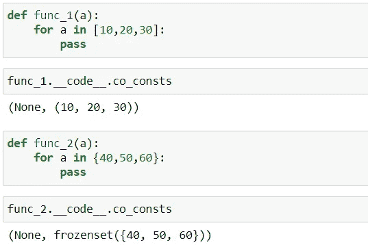

# Python 中的优化—窥视孔

> 原文：<https://levelup.gitconnected.com/optimization-in-python-peephole-e9dc84cc184d>

## 编程，PYTHON

## Python 的窥视孔优化技术简介


由 [Dmitry Ratushny](https://unsplash.com/@ratushny) 在 [Unsplash](https://unsplash.com/photos/xsGApcVbojU) 上拍摄

在我们深入窥视孔优化的细节之前，让我们试着理解 Python 代码是如何执行的。随着 Python 程序的运行，源代码被编译成一组名为`bytecode`的指令。这个中间文件`bytecode`以`.pyc`扩展名存储在`__pycache__`文件夹下，然后由 Python 解释器执行。这个`bytecode`或`.pyc`文件包含一个“更快”或“优化”版本的源代码。



作者图片

[编译后的代码对象](https://stackoverflow.com/questions/5768684/what-is-a-python-code-object)可以通过函数上的属性`__code__`访问，并带有一些重要的属性。这里我们感兴趣的是`co_consts`。当我们浏览下面的例子时，我们会理解这些。

*   `co_consts`返回函数体中出现的任何文字的元组
*   `co_varnames`返回包含函数体中使用的任何局部变量名称的元组
*   `co_names`返回函数体中引用的任何非本地名称的元组

> 代码对象包含`bytecode`以及 CPython 运行`bytecode`所需的一些其他信息。当我们在 Python 中定义一个函数时，它会为它创建一个代码对象，我们可以使用`__code__`属性来访问它。

# **窥视孔优化**

这是 Python 中另一种类型的优化技术。随着 Python 源代码通过编译步骤，某些东西如数值表达式、字符串和元组得到优化并存储在`bytecode`指令中。让我们进入细节。

# 常量表达式

## 数字计算

常量表达式，例如`a = 30 * 8 * 70,`在编译期间得到优化。

假设您的应用程序在程序执行期间必须多次引用这个变量。在这种情况下，Python 决定通过计算值`16800`并将其存储在变量`a`中来优化这个表达式。你可能认为我们可以直接将`16800`赋给变量`a`。但这是以失去可读性为代价的，因为这可能表示 30 天、8 小时和 70 美元/人。这样写比直接使用`16800`更有意义。

## 字符串长度≤ 4096 &元组长度≤ 256

任何长度≤ 4096 的字符串和长度≤ 256 的元组都会像上面解释的数值常量一样得到优化。任何超出这个范围的都不会被 Python 优化。

在这个例子中，a、b 和 c 被优化，因为它们的长度小于上述阈值。

```
a = "TDS" * 5
b = [1, 2] * 7
c = (10, 20, 30) * 3
```

# 会员测试

首先，让我们试试什么是成员操作符。成员资格运算符用于测试列表、元组或字符串等序列中的成员资格。Python 中有两个成员操作符— `**in**`和`**not in**`。为了更好地理解，请参考下面的示例。

```
2 in [1,2,3]
>> True5 in [1,2,3]
>> False5 not in [1,2,3]
>> True
```

既然我们已经理解了什么是成员资格操作符，那么让我们来理解与成员资格测试相关的优化。

每当 Python 遇到可变对象(如列表和集合)的成员测试时，它们将在编译期间被它们的不可变对应物替换。这意味着编译过程中的`lists are converted to tuples`和`sets are converted to frozen sets`。

> 如果你没有看过我之前关于 Python 中可变性和不变性的文章，请 [**点击这里**](https://towardsdatascience.com/optimization-in-python-interning-805be5e9fd3e) 阅读文章。

当 Python 遇到列表[10，20，30]时，它在编译期间被替换为元组，即(10，20，30)。同样的方法`sets`被替换为`frozen sets`。

## 示例 1:



作者图片

*   `30 * 8 * 70`是常量表达式。所以它被编译器赋值给`16800.`
*   `“TDS” * 3`也是常量表达式，长度小于 4096。所以它也被编译器赋值给`TDSTDSTDS.`
*   `“T” * 4097`是长度≥ 4096 的序列，因此编译器不会对其进行评估。
*   `(1, 2) * 5`是长度为 10 的序列，小于元组的阈值，即 256，因此它被评估并存储为`(1,2,1,2,1,2,1,2,1,2).`
*   `(10,)`是一个长度为 257 的序列，超过了元组的阈值，因此编译器不会对其进行评估。
*   `[101, 102] * 2`是列表。因为列表是可变的对象，所以它不会被编译器计算。

## 示例 2:

在这个例子中，我们将看看关于成员测试的窥视孔优化。从下面的代码中我们可以看到，list 和 sets 分别被替换为 tuple 和 freezed sets。



作者图片

> **提示**:相对于链表和元组，我们更喜欢集合成员操作，因为集合成员操作要快得多。

# 结论

希望你已经理解了 Python 中窥孔优化的概念。阅读我之前关于 Python 优化技术“实习”的文章。

[](https://towardsdatascience.com/optimization-in-python-interning-805be5e9fd3e) [## Python 中的优化—实习

### 了解 Python 的优化技术——实习。

towardsdatascience.com](https://towardsdatascience.com/optimization-in-python-interning-805be5e9fd3e) 

*阅读更多关于 Python 和数据科学的此类有趣文章，* [***订阅***](https://pythonsimplified.com/home/) *到我的博客*[***www.pythonsimplified.com***](http://www.pythonsimplified.com/)***。*** 你也可以在[**LinkedIn**](https://www.linkedin.com/in/chetanambi/)**上联系我。**

# 参考

[](https://towardsdatascience.com/understanding-python-bytecode-e7edaae8734d) [## 理解 Python 字节码

### 了解如何反汇编 Python 字节码

towardsdatascience.com](https://towardsdatascience.com/understanding-python-bytecode-e7edaae8734d)