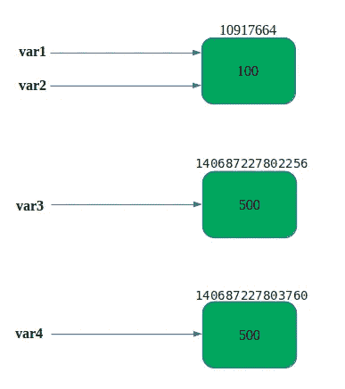
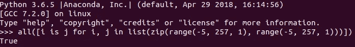
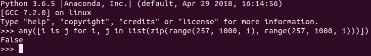
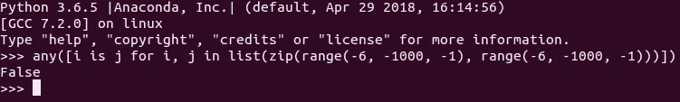
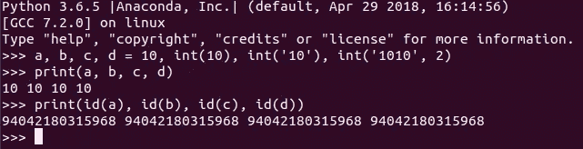
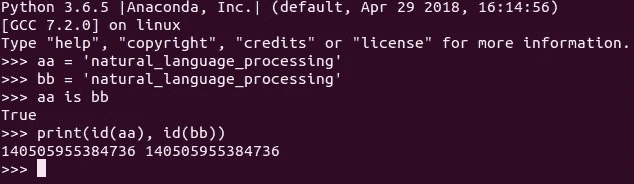
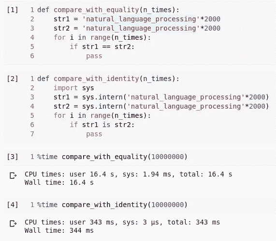

# Python 中的优化——提高性能的内部技术

> 原文：<https://levelup.gitconnected.com/optimization-in-python-the-interning-technique-for-improved-performance-3ff14d376176>

本文探讨了 Python 的标准实现(CPython)如何使用 interning 来优化变量赋值和执行内存管理。

编程中的实习意味着使用引用来代替相同对象的副本的实践。

## **整数实习**

**图 1: Python 实习**

启动时，Python 会缓存一个范围在[-5，256]内的整数全局列表。每当在该范围内引用一个整数时，Python 将使用该对象的缓存版本。因此，如果我们创建两个或更多的变量，并给它们赋一个介于-5 和 256(包括-5 和 256)之间的值，Python 只在内存中存储该数字一次，并将该内存位置的引用赋给这些变量。Python 会自动为我们创建一个共享引用。

如果我们给任意一个整数赋值，而不是范围[-5，256]内的整数，Python 会给每个变量分配不同的内存地址，即使被赋值的值是相同的。

实际上，范围[-5，256]内的整数是一个单例对象，这意味着它只被创建一次。

这是一种优化策略。小整数在代码中出现得更频繁，Python 决定缓存一定范围的整数，以便更快地访问最常见的值。显然，它不会缓存太多的值，因为这会产生内存开销。

现在我们将通过定义和比较变量来观察这种行为。

下面的代码导致 True，因为我们在循环的每次迭代中用范围[-5，256]内的相同值定义了两个变量`i`和`j`。它们将有相同的内存地址，表达式`i is j`将为真。

下面的代码导致 False，因为我们在循环的每次迭代中定义了两个变量`i`和`j`，它们的值在范围【257，1000】内相同。它们将具有不同的存储器地址，并且表达式`i is j`将导致全部为假。

如下面的代码所示，我们如何定义一个值并不重要，最终结果将是一个整数，并使用相同的缓存项。当我们使用四种不同的策略定义`10`时，Python 仍然为所有变量`a`、`b`、`c`和`d`分配相同的内存地址。

## **串实习**

和整数一样，有些字符串也是 Python 所固有的，但不是全部！
在编译 python 代码时，会保留标识符，例如—
◘变量名
◘函数名
◘类名

一些字符串也可以被自动保留，例如，一个看起来像标识符的字符串，例如`‘python_interning’`。但是我们不应该指望它，因为 python 做出这个决定是出于优化的原因，对于不同的 Python 代码可能是不同的。

## **Python 为什么要用实习？**

这一切都是为了优化速度和内存。例如，我们想检查两个很长的字符串是否相等。Python 可以先对它们进行整型，然后比较它们的内存地址，而不是使用`==`操作符逐个字符地比较它们。如果它们被分配到相同的内存地址，这意味着两个字符串是相同的。这样肯定会加快比较的速度。

但是并不是所有的字符串都会被 Python 自动保留。Python 提供了一些功能，通过这些功能，我们可以使用`sys.intern()`方法来强制保留字符串。

## **什么时候应该用实习？**

我们应该非常合理地使用实习。例如，我们可以在 NLP 中使用它，在 NLP 中，我们必须处理大量文本数据，这些文本数据包含大量重复率很高的字符串。当我们对一大组文本数据进行标记时，我们会得到大量出现的单词，如“a”、“the”、“is”。

例如，我们假设单词“the”重复了 10000 次。我们不用为 10000 次重复中的每一次创建 10000 个对象，我们可以使用 interning 来创建一个 singleton 对象，然后每次出现“the”都指向同一个内存位置。在这种情况下，我们可以使用实习来优化代码性能。

**图 2:有实习和无实习的执行时间**

在图 2 中，我们用等式运算符`==`进行比较，它将逐个字符地比较两个字符串，另一方面，我们用等式运算符`is`比较它们的内存地址。我们在`compare_with_identity()`函数中保留了这两个字符串。如果我们将这种比较运行一百万次，我们可以观察到执行时间的显著差异。

如果我们必须多次执行字符串比较，那么这是使用实习的好要求，但是对于一些比较，实习不会帮助提高性能。因此，除非需要，否则我们应该遵循 Python 的默认行为。