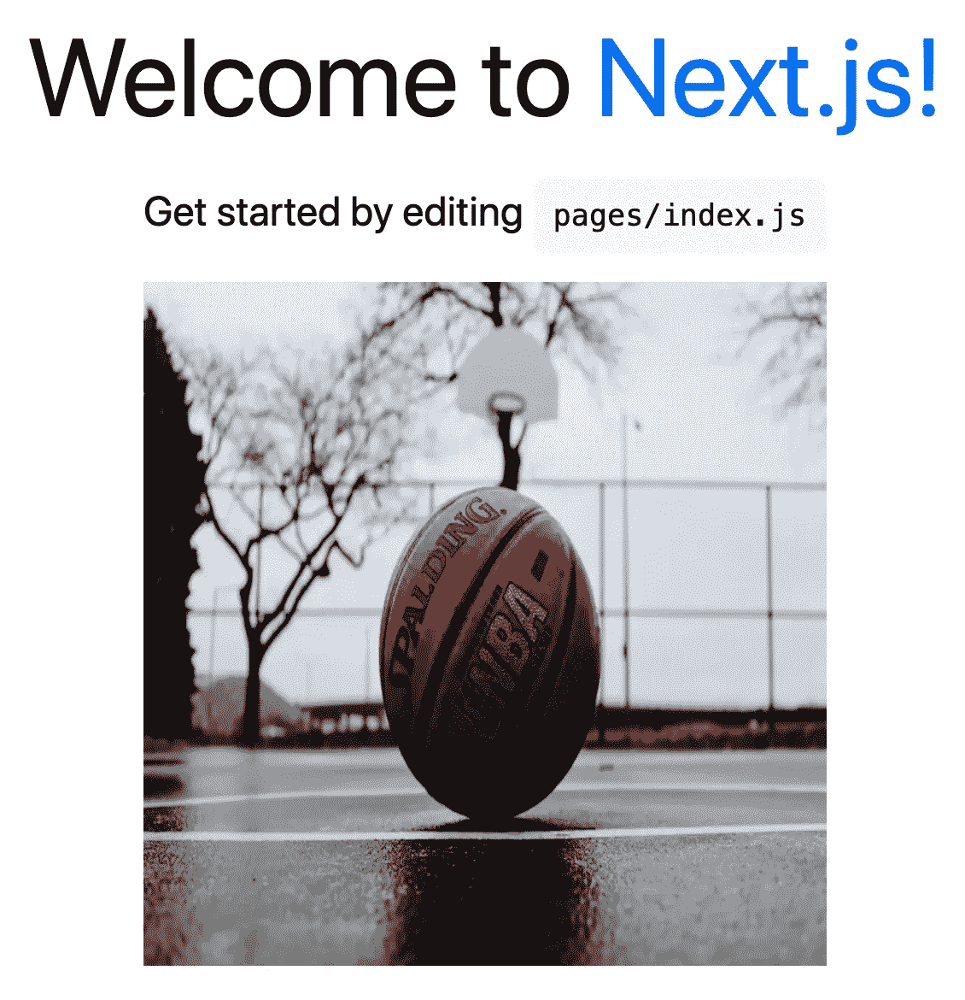

# 使用 Next.js 中的图像组件优化外部网站中的图像

> 原文：<https://levelup.gitconnected.com/optimize-images-from-an-external-website-with-the-image-component-from-next-js-aa104a1f78e0>

## Next.js 中图像组件的介绍


马库斯·斯皮斯克在 [Unsplash](https://unsplash.com?utm_source=medium&utm_medium=referral) 上拍摄的照片

Next.js 是我最喜欢的前端框架，因为它比一个基本的 React 应用程序有很多好处。其中一个好处是他们在版本 10 中添加的内置图像组件和自动图像优化。

在本文中，我们将看看 Next.js 中的 Image 组件，并学习如何使用它来优化来自外部网站的图像。对于这个例子，我们将在一个`create-next-app`起始项目中工作。

如果您不知道 Next.js 是什么，请查看下面的文章开始学习。然后回到本文来学习图像组件。

[](https://blog.devgenius.io/what-i-learned-from-the-create-a-next-js-app-tutorial-1f506b56173d) [## 我从 Create a Next.js 应用程序教程中学到了什么

### Next.js 路由、样式、预渲染和部署简介

blog.devgenius.io](https://blog.devgenius.io/what-i-learned-from-the-create-a-next-js-app-tutorial-1f506b56173d) 

在本文结束时，您应该对以下内容有所了解:

*   图像组件是什么？
*   使用图像组件有什么好处？
*   如何优化外部网站托管的图片？
*   如何在项目中使用图像组件？
*   如何拉伸图像以适合父元素？

# 图像组件

来自 Next.js 的图像组件是 HTML ``元素的扩展。我们可以通过从`next/image`导入图像组件来使用它。

```
import Image from 'next/image';
```

## 利益

*   允许以现代格式调整大小、优化和提供图像，避免将大图像发送到具有较小视窗的设备。
*   允许 Next.js 自动采用未来的图像格式，并提供给支持这些格式的浏览器。
*   按需而不是在构建时优化映像，因此构建时间不会增加。
*   默认情况下，图像是延迟加载的，这意味着页面的速度不受视窗外图像的影响。
*   图像以避免累积布局变化的方式呈现，这有助于提高在谷歌的搜索排名。

# 配置域

我们可以利用 Next.js 的图片优化来处理其他网站上的图片。

为此，我们需要向`next.config.js`文件添加一个配置。我们需要指定允许从哪些域优化图像。

对于这个例子，我想允许来自[https://unsplash.com/](https://unsplash.com/)的图像。因此，我将添加`images.unsplash.com`作为可接受的外部域名。

```
module.exports = {
  **images: {
    domains: ['images.unsplash.com'],
  },**
}
```

# 必需的道具

现在我们可以渲染我们的图像。图像组件需要 4 个必需的道具。

*   **src** —要从 Unsplash 获取任何图像的源，只需右键单击图像并选择*“复制图像地址”*。


*   **alt** —描述图像的有意义的文本。
*   **宽度** —图像的宽度，以像素为单位。
*   **高度** —图像的高度，以像素为单位。

```
<*Image
  src*="https://images.unsplash.com/photo-1519861531473-9200262188bf?ixid=MnwxMjA3fDB8MHxwaG90by1wYWdlfHx8fGVufDB8fHx8*&*ixlib=rb-1.2.1*&*auto=format*&*fit=crop*&*w=2102*&*q=80"
  *alt*="basketball"
  *height*={426}
  *width*={640}
/>
```


添加图像的宽度和高度时，请确保添加正确的图像尺寸。这很重要！

您可以通过点击右上角的箭头在 Unsplash 中找到图像的尺寸。


如果我们添加不同长宽比的宽度和高度，图像会相应地调整。例如，如果我们将此图像的宽度和高度分别更改为 400 个像素的正方形，将会产生以下图像。

```
<*Image
  src*="https://images.unsplash.com/photo-1519861531473-9200262188bf?ixid=MnwxMjA3fDB8MHxwaG90by1wYWdlfHx8fGVufDB8fHx8*&*ixlib=rb-1.2.1*&*auto=format*&*fit=crop*&*w=2102*&*q=80"
  *alt*="basketball"
  ***height*={400}
  *width*={400}**
/>
```



如您所见，图像被压缩以适应我们指定的宽度和高度。

# 处理各种尺寸

有时，您可能不知道图像的宽度和高度，但仍然希望它填充整个空间，同时保持其纵横比。

在这种情况下，您可以省略图像组件上的宽度和高度属性。而是加一个`layout="fill"`的道具。这将把图像拉伸到父元素的宽度和高度。使用`layout="fill"`道具时，通常最好搭配`objectFit="cover"`。这将允许图像在填充元素的整个内容框时保持其纵横比。

为此，将 Image 组件包装成一个`<div>`元素的子元素。然后给父元素`<div>`添加一个宽度和高度，并赋予它一个`position="relative"`。

```
**<div *className*={styles.image}>**
  <*Image
    src*="https://images.unsplash.com/photo-1519861531473-9200262188bf?ixid=MnwxMjA3fDB8MHxwaG90by1wYWdlfHx8fGVufDB8fHx8*&*ixlib=rb-1.2.1*&*auto=format*&*fit=crop*&*w=2102*&*q=80"
    *alt*="basketball"
    ***layout*="fill"
    *objectFit*="cover"**
  />
**</div>***// styles* ***.image* {
  height: 400px;
  width: 400px;
  position: relative;
}**
```

在这里，我们可以看到图像占据了我们想要的 400 像素的正方形，但是图像的纵横比保持不变。不适合父元素的图像部分将被剪裁。


对于更高级的情况，您还可以将其他道具添加到图像组件中。点击查看完整文档[。](https://nextjs.org/docs/api-reference/next/image)

# 结论

感谢阅读！我希望这篇文章对你开始使用 Next.js 的图像组件有所帮助。你可以在这里阅读更多关于图像优化的内容。

如果你正在做一个 Next.js 项目，我强烈推荐使用 Image 组件而不是普通的``标签。实施起来很容易，而且随之而来的好处很多。

如果您想了解如何在 Next.js 中处理路由，请查看下面的文章。

[](/how-to-handle-routing-in-your-next-js-app-6ba71280b922) [## 如何在你的 Next.js 应用中处理路由

### 查看页面目录、动态路由、链接组件和用户外部挂钩

levelup.gitconnected.com](/how-to-handle-routing-in-your-next-js-app-6ba71280b922)