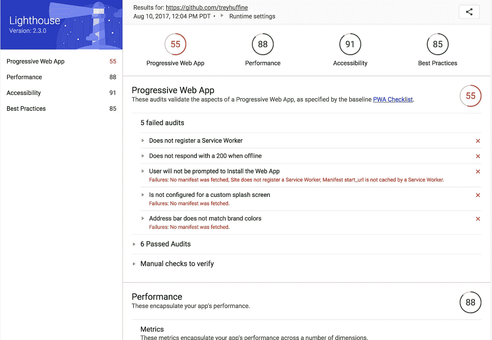
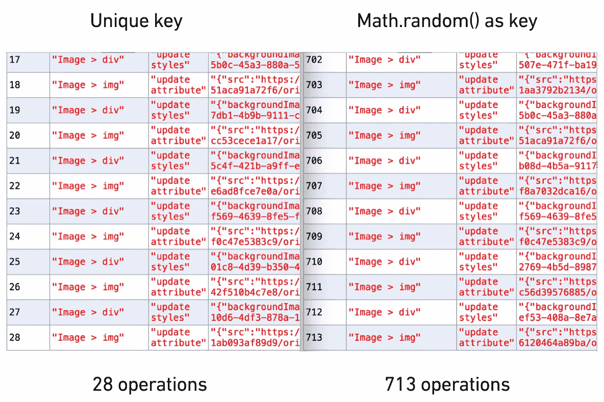

# 优化反应性能

> 原文：<https://levelup.gitconnected.com/optimize-react-performance-c1a491ed9c36>

## 如何提高生产中的反应能力和避免常见错误

您知道在列表中错误地使用`key={}`会使 DOM 操作增加 10 倍以上吗？React 以其虚拟 DOM 实现速度惊人而著称。然而，即使有了 React 的内置性能，也有 UI 开始感觉迟钝的情况。性能不佳的主要原因是生成了太多的渲染和协调。我们将介绍 4 种技术，以帮助确保您的应用程序得到优化，并提供快速的用户体验。

1.  正确使用`key`
2.  管理`shouldComponentUpdate`
3.  延长`PureComponent`而不是`Component`
4.  为生产而制造

 [## 学习 React -最佳 React 教程(2018) | gitconnected

### React 的前 48 门课程。教程由开发者提交并投票，让你找到最好的反应…

gitconnected.com](https://gitconnected.com/learn/react) 

# 衡量绩效

在深入研究代码之前，理解您正在优化的内容及其产生的影响是至关重要的。我建议使用的两个工具是 [Lighthouse](https://developers.google.com/web/tools/lighthouse/) 和 [react-addons-perf](https://facebook.github.io/react/docs/perf.html) 。这两个工具都可以通过 npm ( [1](https://www.npmjs.com/package/lighthouse) 、 [2](https://www.npmjs.com/package/react-addons-perf) )安装，并且都提供了一个 Chrome 扩展( [1](https://chrome.google.com/webstore/detail/lighthouse/blipmdconlkpinefehnmjammfjpmpbjk) 、 [2](https://chrome.google.com/webstore/detail/react-perf/hacmcodfllhbnekmghgdlplbdnahmhmm?hl=en-US) )。我个人推荐对 Lighthouse 使用 npm，因为结果似乎更可靠，对 React Perf 使用 Chrome 扩展。下面是 Lighthouse 的输出示例，我们将在下一节中查看 React Perf 的结果。

注意:Lighthouse 从 60 版本开始通过 Chrome 原生可用，react-addons-perf 将不再与 react 16.o+兼容，但以下结果对 React 的任何版本仍然有效。

# 使用 Key={} `Correctly`

React 使用`key`属性在应用程序生命周期的任何时候惟一地标识列表中的元素。如果 DOM 更新了，React 就能够识别哪些项目发生了变化。因此，组件上的`key`值必须是惟一的，并且与列表中的兄弟组件保持一致。这是较新的 React 开发人员容易犯的一个错误，但是任何经验水平的 React 开发人员可能都不会真正理解在生成列表时正确使用`key`属性的影响。两个常见的错误是在`map(element, index)`期间使用`index`或使用`Math.random()`生成密钥。最佳解决方案是与列表项相关联的 UUID，但是任何唯一标识符都可以。下面是使用键控列表的典型场景。

因为用户 ID 是惟一的，所以我们可以放心地使用它作为列表项的键。对于一个更实际的应用程序，我创建了一个 Postmate 提要的模拟版本，当点击时从 DOM 中删除一个存储。

使用 react-addons-perf Chrome 扩展，我测量了使用 UUID 作为键删除一个元素和使用`Math.random()`作为键删除一个元素的操作数量。结果显示，使用唯一且一致的密钥只需要 28 次操作就可以移除物品，而随机生成的密钥执行完全相同的任务需要超过**25 次操作。小心使用你的钥匙。**

# 管理 shouldComponentUpdate

管理组件生命周期允许您准确指定组件应该何时呈现。因为作为开发人员，您了解 React 不了解的应用程序，所以您可以决定组件是否需要重新呈现。渲染和协调是 React 中开销最大的操作，因此根据您的领域知识消除任何不必要的调用可以极大地改善您的性能和用户体验。

# 使用 React。PureComponent 而不是 React。成分

React 提供了`PureComponent`来为开发者管理`shouldComponentUpdate`生命周期钩子。`PureComponent`会对所有道具/状态做一个浅显的比较，只有其中任何一个改变了才会渲染。大多数时候你可以使用`PureComponent`而不用自己处理它。它确实伴随着一些可能导致讨厌的错误的仔细考虑。JavaScript 在将对象赋给变量时使用指针。这意味着变量指向内存中的特定位置，而不是对象本身的任何特定内容。如果更新对象的属性，指针将保持不变，因此浅层比较不会识别更新。为了避免这种情况，您可以 1)将变量直接传递给组件，而不是传递到对象内部，或者 2)采用不可变的数据结构。

以下使用`PureComponent`的例子将获得与我们使用`shouldComponentUpdate`的例子相同的结果。

最后要考虑的是，功能组件还没有针对 React 进行优化，但是团队已经承诺在未来会这样做。如果您已经确定了应用程序中需要优化的区域，您最好使用类组件来确保获得所需的性能。

必须引用丹·阿布拉莫夫的话

# 为生产而制造

为生产而构建似乎是显而易见的，但是检查您的过程以确保它使用`NODE_ENV = 'production'`编译是非常重要的。React 包含了大量的警告来帮助您进行调试，这些警告在生产中会被去除。这些警告使开发更加友好，但也使 React 构建更大更慢。生产 React 版本的渲染速度比开发版本快 2–8 倍。

以下 Webpack 插件将提供所需的生产版本:

`DefinePlugin`确保`NODE_ENV`设置正确，`UglifyJsPlugin`压缩 JavaScript。`[transform-react-constant-elements](https://babeljs.io/docs/plugins/transform-react-constant-elements/)`将常量元素移到更高的范围，`[transform-react-inline-elements](https://babeljs.io/docs/plugins/transform-react-inline-elements/)`用更优化的版本替换了原生的`React.createElement()`。请注意，这些应该只在生产中使用，因为它们会生成隐含的错误，并使开发中的调试变得困难。你可以使用 Chrome 的 React 开发者工具来评估你是否正在使用 React 的生产版本。

> 如果您觉得这篇文章有帮助，请点击*👏*。[关注我](https://medium.com/@treyhuffine)获取更多关于 React、Node.js、JavaScript 和开源软件的文章！你也可以在 [Twitter](https://twitter.com/treyhuffine) 或 [gitconnected](https://gitconnected.com/treyhuffine) 上找到我。

 [## git connected——开发者和软件工程师社区

### 创建一个帐户或登录 gitconnected，这是连接像您这样的人的最大网络。关注最新打开的…

gitconnected.com](https://gitconnected.com) 

# [工程区块链岗位>](https://blockace.io/blockchain-jobs/engineering)