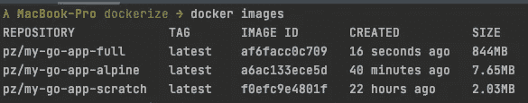
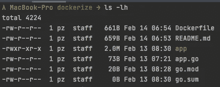
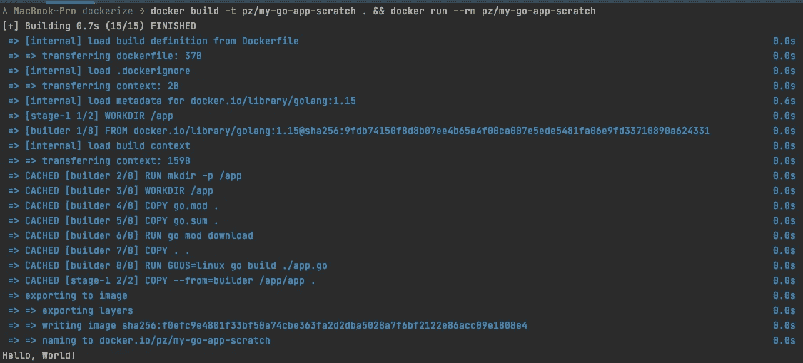

# 将您的 Dockerized Go 应用程序的大小优化到 2MB！

> 原文：<https://levelup.gitconnected.com/optimize-the-size-of-your-dockerized-go-application-down-to-2mb-7b826ecb062d>

想象一下，有一个实际基本映像大小只有 **~30KB** 的工作 Docker 映像，因此您几乎没有任何开销。让我们在这篇文章中实现它。


Wolfgang Hasselmann 在 [Unsplash](https://unsplash.com/) 上拍摄的照片

# 我们能走多远？

因此，您可能会问，是否真的有可能让您的应用程序在 30KB 的基础映像上运行。长话短说:“是的，它是！”尽管当然也有缺点。

所以还是先查一些最终结果吧。在下图中，您可以看到三个不同的 Docker 图像。所有三个图像都包含相同的 runnable Go 应用程序，一个简单的 Hello-World 程序，没有什么特别的。



*   `pz/my-go-app-full` — `[golang:1.15](https://hub.docker.com/_/golang)`被作为基础镜像→整个 Go 运行时+二进制，完全矫枉过正当然。在这里，更好的方法是使用 alpine 或 slim 变体。我还没有在这种特殊情况下测试它，但它应该已经减少了大约 90%左右的大小。
*   `pz/my-go-app-alpine` — `[alpine:3.13.1](https://hub.docker.com/_/alpine)`被用作基础镜像→一个超小型的 Linux 发行版，只包含最重要的东西。这里没有额外的 Go 运行时，只是普通的 Linux。
*   `pz/my-go-app-scratch` — `[scratch](https://hub.docker.com/_/scratch)`被用作基础图像→事实上它不是真正的基础图像，但我们告诉 Docker 我们真的想从*真正的*开始。本文稍后将详细介绍`scratch`。

在下一张图中，您可以看到根文件夹中的文件，Docker 图像是内置的。如你所见，我们的`app`，这是我们通过 Docker 图像运行的 Go 应用程序，大小约为 2MB。由于我们上面从头构建的映像只有 2.03MB，与实际应用程序相比，我们可以估计 Docker 映像的开销只有 30KB 左右。很棒吧？



# “划痕”图像

> "我们能把`FROM scratch`用于各种应用程序/语言吗？"

理论上是的，实际上我们永远不应该。😉

但是让我们先来看看这张`scratch`图片是关于什么的。首先，根据 Docker Hub 上的描述，它是在构建仅包含单个二进制文件的基础映像或超最小映像的上下文中最有用的映像。

此外，从 Docker 1.5.0 开始，`FROM scratch`命令在`Dockerfile`中不起作用，因此不会在图像中创建额外的层。尽管`scratch`映像在 Docker 注册表中可用，但它既不能被提取也不能运行，只能在`Dockerfile`中被引用。

> “好了好了我明白了。但是我现在可以用它运行我的 Node.Js/Python/whatever 应用程序吗？”

**长回答:**除非你在上面装了 Node.js/Python/whatever😐

很不满意吧？没错，但这是有原因的。如前所述,`scratch`形象实际上意味着从零开始。所以里面已经什么都没有了。没有外壳，没有库，没有系统文件，什么都没有。

因为`scratch`图像实际上不包含任何内容，所以你也不能通过典型的`docker exec -it CONTAINER /bin/bash`在容器中打开 bash。因此，在许多情况下，一个至少包含一个 shell 的`alpine`映像可能值额外的 5.5MB。😉

除此之外，像 JavaScript (Node.js)和 Python 这样的语言是解释器语言，它们没有被预构建到二进制文件中，所以没有机会在`scratch`映像上运行它们。对于 JavaScript，您首先必须在那里安装 Node.js，这样您的代码就可以在运行时被解释。在 Node.js 的情况下，我想参考我的另一篇文章[减少你的 Node.js Docker 图片大小 90%！](https://medium.com/faun/decreasing-your-node-js-docker-image-size-by-90-84cc1b1093d9)。

[](https://medium.com/faun/decreasing-your-node-js-docker-image-size-by-90-84cc1b1093d9) [## 将 Node.js Docker 图像尺寸缩小 90%！

### 我将通过几个简单的步骤向您展示如何将 Node.js 应用程序的 docker 图像大小减少 90%左右。

medium.com](https://medium.com/faun/decreasing-your-node-js-docker-image-size-by-90-84cc1b1093d9) 

# 实际的 Dockerfile 文件

> “好吧，我明白了，使用‘scratch’创建了一个超级高度优化的 Docker 图像，使用它应该是一个有意识的决定…但我想使用它，所以请给我看代码！”

既然你问了，我们走吧。在`Dockerfile`中直接描述了各个步骤:

现在让我们构建并运行这个 Dockerfile 文件，请记住，需要有一个使用`app.go`作为入口点的样例 Go 应用程序。或者，您可以查看我的示例存储库，其中包含一个“Hello World”Go 应用程序和上面的`Dockerfile`:

[](https://github.com/Abszissex/medium-go-docker) [## abszisex/中型码头工人

### 在 GitHub 上创建一个帐户，为 abszisex/medium-go-docker 开发做出贡献。

github.com](https://github.com/Abszissex/medium-go-docker) 

```
### Run into root application folder# Build application in current directory
$ docker build -t pz/my-go-app-scratch . # Run built container once.
# '--rm' indicates that the container should be removed aber run
$ docker run --rm pz/my-go-app-scratch
```



构建并运行 Docker 映像

# 最后的话

我希望我能给你一个小诀窍，告诉你如何对你的 Go 应用程序进行 dockerize，并提供一些优化其大小的提示。请记住，从`scratch`开始可能会有陷阱，我一般会推荐使用`alpine`作为基础映像，因为开销非常小，而且你至少有可能将`exec`放入你的运行容器。

感谢您花时间阅读我的文章。

## 你想联系吗？

如果你想联系我，请通过 [LinkedIn](https://www.linkedin.com/in/pascal-zwikirsch-3a95a1177/) 联系我。

另外，请随意查看[我的书籍推荐](https://medium.com/@mr-pascal/my-book-recommendations-4b9f73bf961b)📚。

[](https://mr-pascal.medium.com/my-book-recommendations-4b9f73bf961b) [## 我的书籍推荐

### 在接下来的章节中，你可以找到我对所有日常生活话题的书籍推荐，它们对我帮助很大。

mr-pascal.medium.com](https://mr-pascal.medium.com/my-book-recommendations-4b9f73bf961b) [](https://mr-pascal.medium.com/membership) [## 通过我的推荐链接加入 Medium—Pascal Zwikirsch

### 作为一个媒体会员，你的会员费的一部分会给你阅读的作家，你可以完全接触到每一个故事…

mr-pascal.medium.com](https://mr-pascal.medium.com/membership)