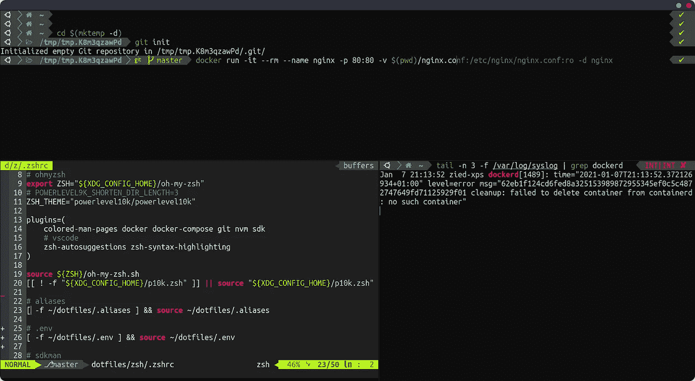
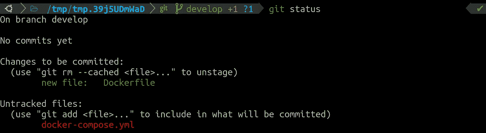
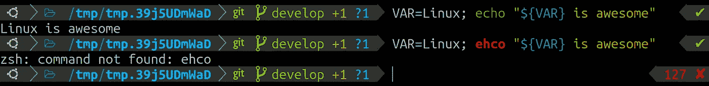
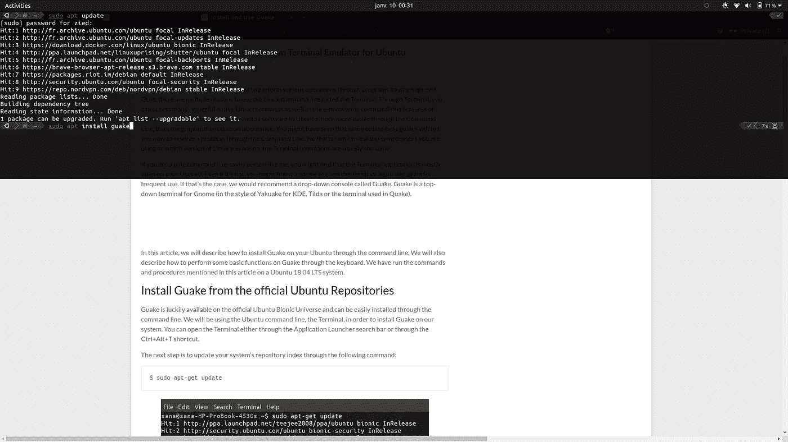
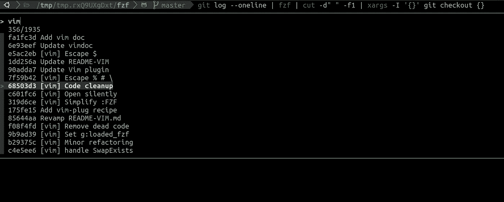
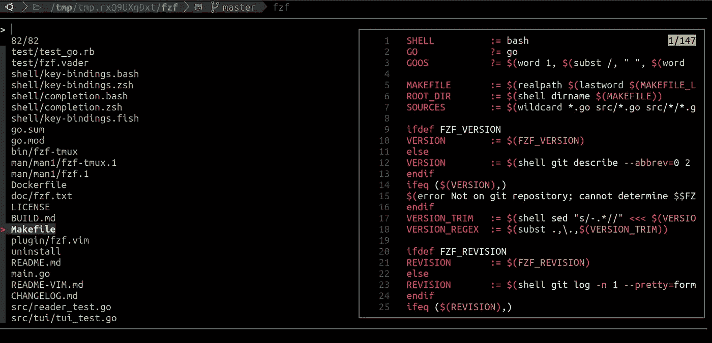
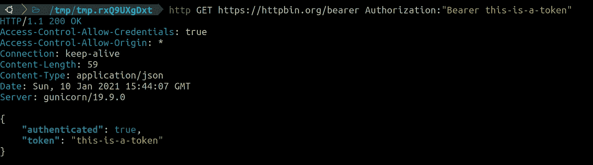

# 首先，优化你的日常工作流程！

> 原文：<https://levelup.gitconnected.com/optimize-your-daily-workflow-first-1e55e1b8985b>

## 细节很重要。


艾玛·马修斯数字内容制作在 [Unsplash](https://unsplash.com?utm_source=medium&utm_medium=referral) 拍摄的照片

一些开发人员会问这样一个问题 ***“如果我可以使用 Windows，为什么还要使用 Linux？”*** ，但是他们弄颠倒了。正确的问题应该是 ***“如果像 Linux 这样的东西存在，为什么是 Windows？”*** 。尤其是软件开发。

我应该注意到，我在这里并不是站在一个铁杆自由软件纯粹主义者的立场上。倒不是说一定是坏事，只是不是今天的话题。我们将以纯粹的实用主义来看待这个问题。因此，我将尝试建立一个动议:*当谈到软件开发的生产力时，Linux 如何成为一个更好的选择？*

# ̶d̶e̶v̶i̶l̶的生产力在于细节！

我们通常倾向于认为生产力是一次性大变革的结果。对我来说，这不是正确的定义方式。相反，生产率是一个持续的递增过程。我们一遍又一遍地迭代，以达到我们做事稍微更快更有效率的状态。然后，丽贝卡！

> 没有任何一个元素会让我们说:“瞧！我刚刚变得富有成效”。

我还得出了一个结论，无论你如何优化你的日程表，无论你使用[番茄工作法](https://en.wikipedia.org/wiki/Pomodoro_Technique)，或者如果你采用最新流行的强力午睡法，如果你日常工作流程的细节没有得到解决，你仍然会远离时间质量等式。换句话说，为了变得更有效率，你的第一个目标应该是日常事务和重复的任务。仅仅因为它们是重复的，你一直在做。

# 让我们具体点

回到软件开发，如果你是这个领域的一员，你肯定知道你一遍又一遍地重复很多相同的任务——对不起，同学们，这不像电影里那样！其中一些任务可能是创建 git 分支、构建项目、运行测试、推送代码、搜索文件等等。您还可以运行 docker 命令、SSH 到服务器、调用 API 等等。由于大多数操作(如果不是全部的话)都发生在您的操作系统中，因此充分利用操作系统来快速高效地完成任务是一个好主意。回到开头的陈述，我发现 Linux 绝对是现有替代方案中最适合实现这一点的。我相信这一点，因为我用了几乎所有的。我从 Windows 到 Linux，到 OSX，再回到 Linux。所以我认为我的声明是充分知情的。

给予 Linux 这些特权的两个主要原因是社区和它是自由软件的事实。前者让你接触到由了不起的人创造的了不起的工具，以节省你重新发明轮子的时间。后者意味着，从字面上看，你可以对你的环境做任何你想做的事情，并以最适合你的方式利用它。

# 让我们说得更具体些

为了说明我的观点，我将在这里列出一些我在旅途中收集的并且每天都在使用的工具和实践。希望它们能帮助你将你的日常工作流程推向更高的生产率。我不会给出安装说明，因为那会让文章变得很长，但我会留下一些可能有帮助的链接。

> **免责声明**:以下列表并不是让你成为忍者软件开发人员的终极生产力圣经。它主要是通过提供一些相关的例子来吸引你对细节的注意。

# 1.幸福终点站

> 显然，一切都从这里开始！



瑞士陆军航站

我尽量多使用终端——或者命令行界面(CLI)——不是因为我想感觉自己像电影黑客——虽然这不是一个无效的理由，而是因为它更快。因为这是我花费大量时间的地方，所以它应该既漂亮又有效率。也许你不太关心“好”的部分，这没什么，但我个人非常重视审美。

[**终结符**](https://launchpad.net/terminator) **:** 这是一个允许在一个窗口中排列多个终端的模拟器。例如，对于同时调试多个服务，或者在本地和远程机器上同时工作时，它非常有用。

[](https://www.zsh.org/)****&**[**Oh-My-Zsh**](https://ohmyz.sh)**:**Zsh——也称为 Z shell——是一个非常棒的类 Unix 操作系统 shell。它使使用命令行更具交互性，并为您节省一些时间和挫折。当涉及到命令、文件名和进程 id 的自动完成时，它特别强大。它会自动纠正拼写，并允许您使用*选项卡*键浏览建议。
关于这些特性和其他特性的更多信息，请点击[此处](https://code.joejag.com/2014/why-zsh.html)和[此处](https://www.sitepoint.com/zsh-tips-tricks/)。**

**为了充分利用 Zsh，它应该与令人愉快的
Oh-My-Zsh 相结合。这是一个社区驱动的框架，带有数以千计的插件和主题，使一个好看的瑞士陆军终端。我强烈推荐那些(至少):**

*   **[**Powerlevel10k 主题**](https://github.com/romkatv/powerlevel10k)**

****

**除了是一个华丽的主题之外，这个主题还提供了一些即时的反馈，否则，就需要运行额外的命令，比如当前目录的路径，当前 git 分支，git 状态，python 的 virtualenv…等等。
*不再有提交追加到错误的分支！***

*   **[**Zsh-自我暗示**](https://github.com/zsh-users/zsh-autosuggestions)**

****

**如果你经常问自己类似*“服务器的 IP 是什么？”*或*“我对这个很长的命令使用了什么选项？”*，那你就需要这个插件。这是一个像鱼一样的自动建议，可以省去你在无聊的讨论中查找 IP 地址或者试图记住一周前运行的长 docker 命令的麻烦。你只需要开始输入一个命令的开头，就可以得到基于你的历史的建议。**

*   **[**Zsh-语法-高亮**](https://github.com/zsh-users/zsh-syntax-highlighting)**

****

**这个插件使命令更容易阅读，并在输入时突出错误或不存在的命令。**

**也有特定技术的插件，具有自动完成和通用别名，如 git、docker & docker-compose、nvm & npm(用于 nodejs)、sdk(用于 java)、ansi ble……完整列表可在此处找到。**

**[**Guake**](http://guake.org/) :是一个下拉终端，可以在旅途中快速运行命令。只需一次按键，它就随处可用。遵循教程说明的最快方法。**

****

**别名:使用它们，它们会让你更有效率。为您一直运行的重复命令使用别名，或者简化长命令。**

```
alias dclsa="docker container ls -a"
alias grdb="gradle clean build --refresh-dependencies"
alias gp="git pull && git fetch -p"
```

****其他有用的终端工具:****

*   **[**Fzf**](https://github.com/junegunn/fzf)**

****

**一个快得惊人的命令行模糊查找器，可以过滤任何文件、进程、主机名、git 提交、命令历史的列表……只需运行`fzf`并开始键入，或者您可以使用它和管道来过滤任何命令的输出。有了这样一个强大的工具，唯一的限制就是想象力。
例如，如果我们需要返回消息中包含单词 vim 的提交，但我们不确定是哪一个，我们可以运行命令
`git log --oneline`，将其输出重定向到`fzf`，这将允许我们交互地过滤和导航提交，然后使用`xargs`检查我们选择的那个。**

*   **[**蝙蝠猫**](https://github.com/sharkdp/bat)**

****

***“一只长着翅膀的克隆猫①。”*显示其 Github 页面。对于 Linux 中的`cat`命令，Bat 是一个更好的选择。除了其他选项之外，它还具有语法突出显示功能，并与`fzf`无缝集成，可以预览正在过滤的文件。**

*   **[**HTTPie**](https://httpie.org)**

****

**Postman 很好，但是它需要点击鼠标，并且不能在无 GUI 环境中使用。可以做到这一点，但是并不那么简单，它需要额外的工具(例如解析 JSON)。这就是 HTTPie 出手相救的地方。一个奇妙的命令行 HTTP 客户端*“API 时代的”*。它支持 JSON 开箱即用，并具有语法高亮和持久会话等功能。**

# **2.代码编辑**

> **一枚戒指统治所有人！**

**我不会在这一部分做太多的阐述，因为，简单地说，没有放之四海而皆准的方法。不过，有一件事值得一提，我尝试对几乎所有的代码使用同一个编辑器。由于我选择使用 [VSCodium](https://vscodium.com/) 作为我的代码编辑器，我必须让它与 Java 和 Spring Boot 兼容。如果你对此感兴趣，我会在[的专用工具](https://medium.com/cllfst/spring-boot-with-visual-studio-code-why-not-530813d6d9ff#Tools) (2)。我不想跟踪我的主目录(1)或依赖更多的第三方软件。我采用了利用 [GNU stow](https://www.gnu.org/software/stow/) (这里解释)的方法，因为它看起来更方便。我会留下一个[链接](https://github.com/zguesmi/dotfiles)到我的 dotfiles 只是为了获得灵感。**

# **外卖食品**

**希望我回答了这个问题*“当谈到软件开发的生产力时，Linux 如何成为更好的选择？”*并给出了一些切实可行的例子，供您从现在开始应用。我要强调的是，这些例子只是 Linux 生态系统中存在的一小部分，这要归功于它令人惊叹的社区。**

> **最后，请记住，细节很重要！**