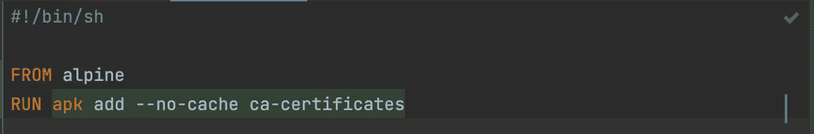
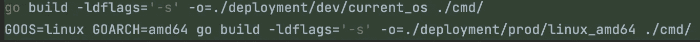
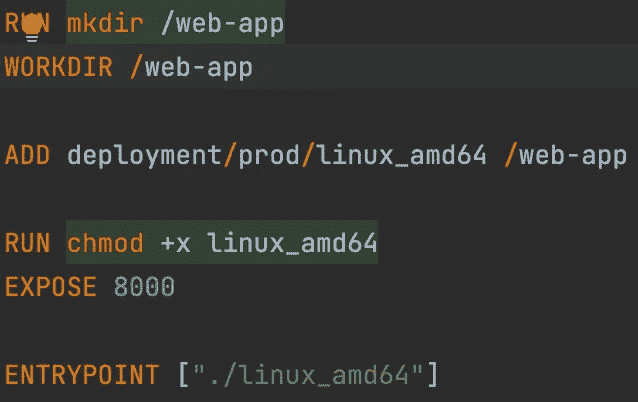
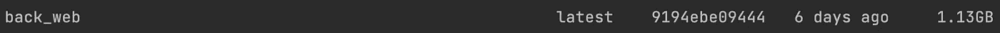
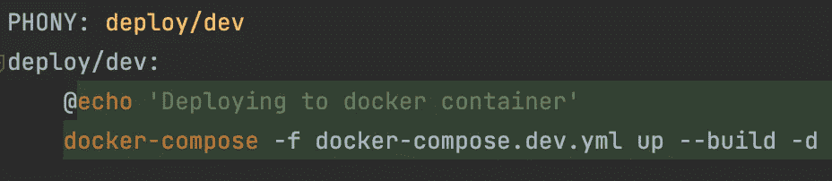

# 我将生产 Docker 容器的尺寸缩小了 96%😎

> 原文：<https://levelup.gitconnected.com/optimize-your-docker-go-web-app-for-production-2c55db4d96ce>

马修·施瓦茨在 [Unsplash](https://unsplash.com?utm_source=medium&utm_medium=referral) 上的照片

## 从巨大的 1.1GB 到只有 40MB！

最近，我一直在做一个副业项目，我希望它能很快成为一家初创企业。

因为我想让它易于部署，所以我将生成类型、构建二进制文件和运行服务器的任务委托给了一个 *Dockerfile* 。

## 我最初的方法

我天真地使用了一个 go docker 图像作为基础😆，将整个项目复制到 docker 目录中，🙄生成类型(+下载依赖项)，😐和构建二进制文件！

## 结果呢？

一个 docker build 命令花了大约 40 秒，速度高达 1.1GBs。这太疯狂了！

经过进一步的检查，我意识到通过对 Dockerfile 做一些小的修改，我可以优化多少。

所以，事不宜迟，下面是你不知道自己需要的清单。

# 从阿尔卑斯山的图像开始

如果您运行的是 go 服务器，那么您不需要安装 go 镜像。

为什么？正如您将在下一节看到的，golang 可以生成特定于操作系统的二进制文件。

生成二进制文件意味着把你的应用程序变成机器代码(想想 0 和 1)，产生一个可执行文件。

二进制文件使得应用程序速度更快，因为计算机不需要安装任何语言环境或依赖关系。

只需运行二进制文件！

因此，您可以**切换到 Alpine 映像(Linux)，** **，它的容量高达 5MB** ，包含了部署服务器所需的大部分内容。

# 使用 Go 的二进制生成

为您的终端系统创建一个二进制文件是您运行应用程序所需要的，不会浪费宝贵的空间或 CPU 周期。

下面是为特定操作系统生成二进制文件的 go 命令。

此命令创建一个可执行文件，您可以使用它运行。/

# 删除不需要的操作和文件

正如我们前面看到的，服务器不需要保存任何项目文件、依赖项，甚至 golang 来运行。

在上图中，我正在做以下事情:

1.  创建一个目录(/web-app)
2.  将二进制文件添加到新目录(/web-app)
3.  授予文件可执行权限(对于 Linux)
4.  暴露我的服务器端口(8000)
5.  将二进制文件声明为入口点。

y docker 容器只保存二进制文件！

我们必须确保在构建 docker 文件之前生成二进制文件，好吗？

这种方法+使用阿尔卑斯山的图像，从这里得到了我的图像😖

对此😎

没什么特别的。那只是尺寸上减少了**96.36%**！

请记住，我的二进制文件是 12MB。

# 额外收获:开始使用制作文件

make 文件可帮助您将项目的所有命令保存在一个地方。

你可以创建命令快捷方式并使用**make 关键字**来运行你的定制命令。

您不必复制粘贴冗长或晦涩的命令。相反，创建一个快捷方式，包括多个命令，并运行它。

使用一个真实世界的例子，**想象一下暂停你的项目两个月后再回来。你认为你会记住你的项目使用的所有命令吗？**

这是我当前的 make 文件，你可以用它作为你项目的基础😘

安装 make，然后运行 make

例如， **make test/int**

就是这样！

我希望我粗心的错误能帮助你减少 docker 容器的尺寸和速度。

一如既往，

**快乐编码😬**

没错；这是我的新商标关闭表情符号😬