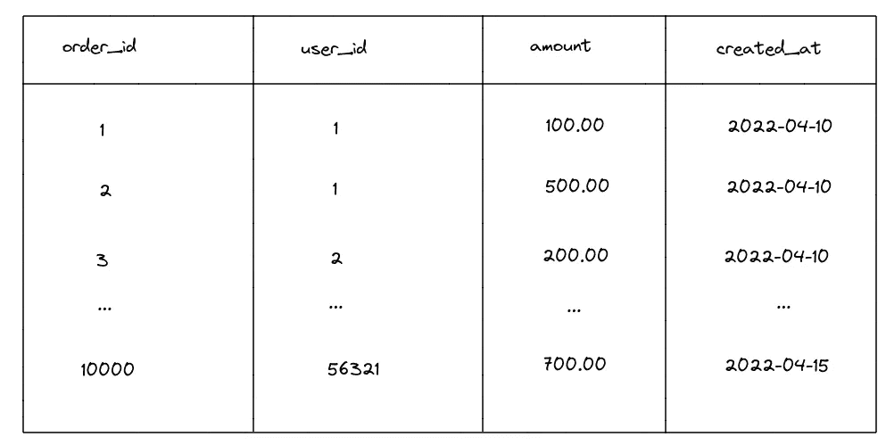
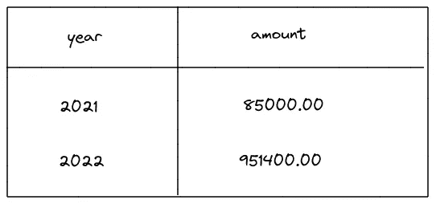
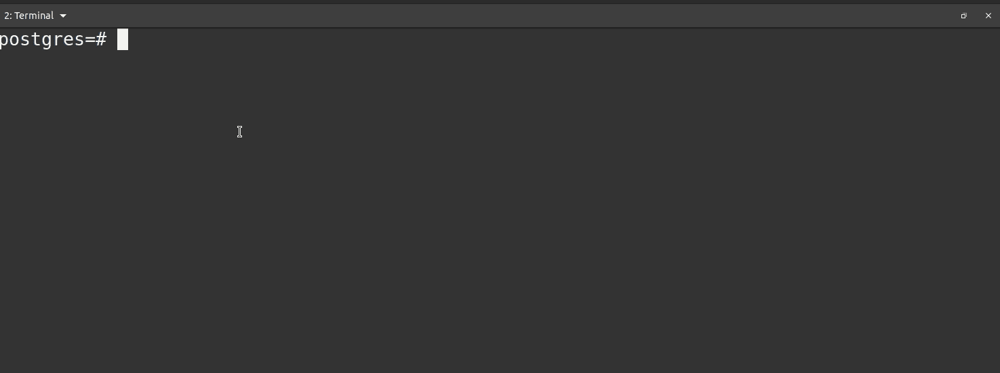
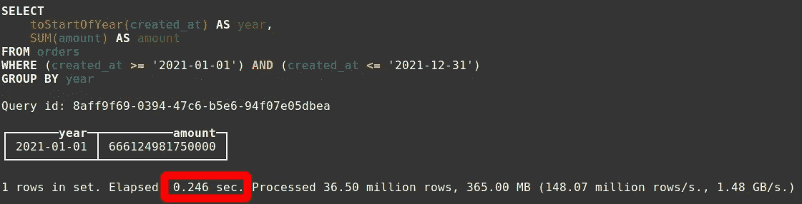
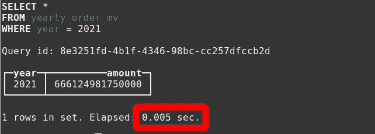
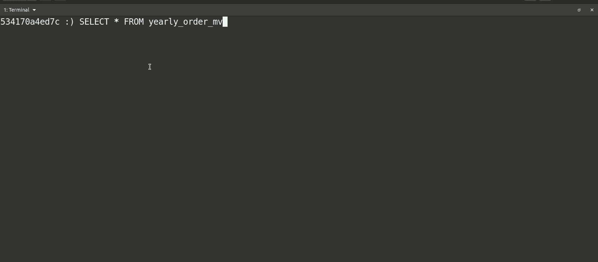

# 优化点击之家:物化视图

> 原文：<https://levelup.gitconnected.com/optimizing-clickhouse-materialized-view-e4ecbdffa08e>

## 根据用户的访问模式设计数据库读取路径

# 什么是物化视图

物化视图是一种数据库技术，它在用户请求查询之前以优化的形式计算或处理数据。数据通常来自另一个基表，这个**有助于加速昂贵的查询，比如聚合大量数据**。例如，您有一个在线商店的数据库。您有一个存储所有订单的数据库表，如下所示(我们将在本文中使用这个例子)。



当经理想要从管理仪表板查看 2021 年的交易总量时，执行的 SQL 查询通常如下所示:

```
SELECT SUM(amount) FROM orders WHERE created_at BETWEEN '2021-01-01 00:00:00' AND '2021-12-31 23:59:59';
```

该查询所做的是遍历订单表中的每一行，其中`created_at`日期在 2021 年之内，获取这些行的金额，并将它们相加。如果在 2021 年创建了 100 万个订单，那么经理每次查看管理仪表板时，数据库都会读取 100 万行。最糟糕的是，如果查询在主数据库节点上运行，它还会严重影响您的最终用户体验！

使用物化视图，您可以设计针对用户访问模式优化的数据。在我们的例子中，我们可以构建如下所示的物化视图:



当管理仪表板查询 2021 年的订单总量时，SQL 查询应该如下所示:

```
SELECT amount FROM yearly_order_mv WHERE year = 2021
```

该数据库仅执行了一次数据查找操作来获得 2021 年的订单总数。与之前的方法相比，这是一个 **1 行读取与一百万行读取**。物化视图就是这么强大。

## PostgreSQL 中的物化视图

相比之下，在 PostgreSQL 中，物化视图是在您第一次创建视图时计算/处理的，您需要刷新物化视图来手动更新物化视图。换句话说，PostgreSQL 物化视图中的数据并不总是最新的，直到您手动刷新视图。这里有一个简短的演示。



关于 PostgreSQL 中物化视图的另一个重要细节是，每当您**创建或刷新物化视图时，PostgreSQL 将读取整个基表以产生新的结果**。如果您经常错误地这样做，您将不断地给数据库本身带来高负载。持续刷新物化视图*的成本可能远远大于从该物化视图中读取数据所获得的收益。*

同样的行为可以在[cocroach db](https://www.cockroachlabs.com/docs/v21.2/views#materialized-views)和其他一些数据库中找到。

## 在 Clickhouse 中有何不同

与 PostgreSQL 实体化视图相比，Clickhouse 实体化视图的显著区别在于，只要在“基”表上有插入，Clickhouse **就会自动更新实体化视图。在我们的例子中，它是`order`表。您不需要手动刷新视图，每次查询都会获得新的数据。**

# 实践教程

## #1 启动 Clickhouse 容器

*如果您已经有一个正在运行的 Clickhouse 数据库服务器*，您可以跳过这一步

```
# Start a Clickhouse server
$ docker run --rm --name some-clickhouse-server --ulimit nofile=262144:262144 yandex/clickhouse-server# Connect to Clickhouse client. Open this in another terminal
$ docker run -it --rm --link some-clickhouse-server:clickhouse-server yandex/clickhouse-client --host clickhouse-server
```

## #2.创建和植入表格

我们将创建一个`orders`表，并用 1 亿行预先填充订单数据。生成的数据不是随机的；然而，这足以证明物化视图可以做什么。

```
CREATE TABLE orders
ENGINE = MergeTree()
PRIMARY KEY (orderId)
PARTITION BY toYYYYMM(created_at)
SETTINGS index_granularity = 8192
AS SELECT
 number as orderId,
 number as userId,
 number as amount,
 toDateTime('2021-01-01') + number/100000 as created_at 
FROM numbers(100000000);
```

在我的笔记本电脑上，对 2021 年的 3650 万行记录求和需要 **246 毫秒**。



## #3 创建物化视图

```
-- Create yearly_order_mv materialized view
CREATE MATERIALIZED VIEW yearly_order_mv 
ENGINE = SummingMergeTree
PARTITION BY year ORDER BY year
POPULATE
AS
SELECT 
  toYear(created_at) AS year,
  SUM(amount) as amount
FROM orders2
GROUP BY year;
```

在物化视图中选择 2021 年总销售额的单个行需要 5 毫秒，**比在步骤#2 中聚合基表快 49 倍。**



当然，加速因子根据不同的情况而变化，但是我们可以在这个例子中看到不同之处。

## **#4 向基表插入数据将不断更新物化视图**



注意，在插入新数据后，在`yearly_order_mv`物化视图中会出现一个新的`2024`行。我不需要像 PostgreSQL 中要求的那样刷新物化视图。

# 缺点

Clickhouse 有一个主要缺点:**它允许将重复的数据插入到表**中。这可能会在调试时造成很多混乱。当涉及到物化视图时，这就更糟了，因为它可能会在您没有注意到的情况下导致重复输入。在 Clickhouse 中使用实例化视图时，应该避免多次插入相同的数据。

物化视图也**占用一些存储空间来存储预先计算的数据**。但是，根据您如何设计您的物化视图，这应该不是一个问题，因为与它的基表相比，它应该占用相对较小的空间。

由于 Clickhouse 的物化视图中的数据总是最新的，这意味着 Clickhouse 正在主动更新物化视图中的数据。**物化视图越多，维护所有物化视图所需的处理能力就越大**。然而，这通常也不是一个大问题，因为这样做只需要相对较少的处理能力。

物化视图中反映的数据是**最终一致**。Clickhouse 将在插入成功后响应客户端，但不会在实例化视图更新时响应。这是因为 Clickhouse 只在部件合并时更新物化视图(你可以多研究一下 Clickhouse 存储引擎是如何工作的，太迷人了！)，这发生在不可预测的时期。尽管如此，从我的经验来看，我从未见过它引人注目。如果您构建报告或商业智能仪表板，您可能能够容忍这种数据一致性。但是，如果你要求强一致性，那么物化视图并不适合你。

# 脚枪

**当构建具有高基数数据的物化视图时，最好限制要处理的行数**。例如，如果您正在为电子商务网站上的每小时或每分钟的销售额创建一个物化视图，那么最好通过在 WHERE 子句中指定来限制行，只显示最近三个月的销售额。否则，Clickhouse 将扫描包含数百万行的整个表，消耗大量内存并最终崩溃(我曾在生产服务器上遇到过)。除此之外，**在那些物化视图上实施数据 TTL 以节省磁盘空间**也是一个好主意。

```
-- BAD: Create order_hourly materialized view
-- without WHERE and enforce data TTL
CREATE MATERIALIZED VIEW hourly_order_mv 
ENGINE = SummingMergeTree
PARTITION BY toYYYYMM(created_at) ORDER BY created_at
POPULATE
AS
SELECT 
  toStartOfHour(toDateTime(created_at)) AS created_at,
  SUM(amount) as amount
FROM orders
GROUP BY created_at-- GOOD: Create order_hourly materialized view 
-- with WHERE clause and enforce data TTL
CREATE MATERIALIZED VIEW hourly_order_mv 
ENGINE = SummingMergeTree
PARTITION BY toYYYYMM(created_at) ORDER BY created_at
TTL created_at + INTERVAL 3MONTH
POPULATE
AS
SELECT 
  toStartOfHour(toDateTime(created_at)) AS created_at,
  SUM(amount) as amount
FROM orders
WHERE created_at < subtractMonths(NOW(), 1)
GROUP BY created_at
```

您可能需要一个每小时的实例化视图，因为您希望根据用户的本地时区向他们显示数据。假设您在 UTC 时区插入时间为`created_at`的数据；如果您在马来西亚(马来西亚时区比 UTC 早 8 小时)的用户打开它，您可以通过将数据按各自的时区偏移量分组来显示马来西亚时区的数据。

# 可供选择的事物

这个数据库和数据流行业最近变得越来越热。出现了许多新的挑战者，如[物化](https://materialize.com/)、[时间加](http://timeplus.com)、[小鸟儿](https://tinybird.co/)、[摇滚集](https://rockset.com/)、[就绪集](https://readyset.io/)等。我个人没有时间去探究其中的许多内容，但是 Clickhouse 对我很有帮助。

# 结论

计算机科学中的一切都是一种交换。如果你正确使用物化视图，你会得到它的好处。然而，**如果您错误地使用物化视图，您将很容易得到不准确的数据、次优的性能、较高的磁盘使用率、较高的内存使用率**等等。所以，在设计你的系统时要小心。