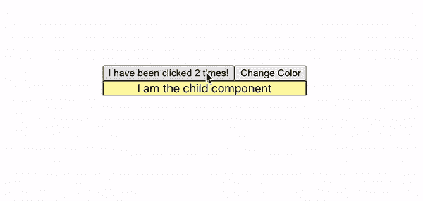
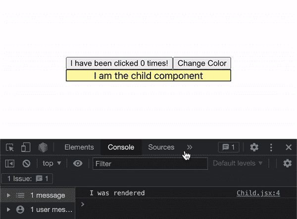
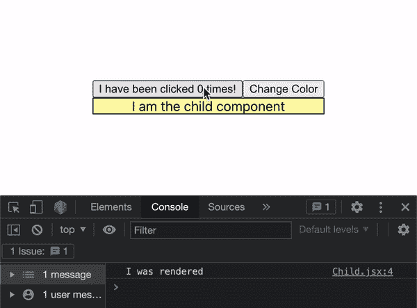

# 使用 React.memo 优化性能

> 原文：<https://levelup.gitconnected.com/optimizing-performance-using-react-memo-cc7d954de309>


React.memo 是 React 库中的高阶组件。高阶组件将另一个组件作为参数，并返回该组件的修改版本。

在实践中，React.memo 会记住一个组件，如果它的属性不变，它就不会重新呈现。当在组件上使用时，它会对每当其父级重新呈现时收到的属性进行简单的比较。让我们来看看我创建的一个演示。



此演示的报告可在此处找到:

[](https://github.com/jonathanbrierre/react.memo-demo) [## GitHub-jonathanbrierre/react . memo-demo

### 这个项目是用 Create React App 引导的。在项目目录中，您可以运行:在…中运行应用程序

github.com](https://github.com/jonathanbrierre/react.memo-demo) 

这里有两个组件:

## App.jsx

```
function App() {
 const [count, setCount] = useState(0)
 const [childColor, setChildColor] = useState('#fffaaa') const generateRandomColor = () => {
    setChildColor( '#' + Math.floor(Math.random()*16777215).toString(16));
  } return (
    <div className="App">
      <div className="demo-container">
        <button 
           onClick={() => setCount(prevCount => prevCount + 1)}
         >
          I have been clicked {count} times!
        </button>
        <button onClick={generateRandomColor}>
          Change Color
        </button>
        <Child color={childColor} />
      </div>
    </div>
  );
}
```

## Child.jsx

```
const Child = (props) => {
 console.log('I was rendered')
 return (
  <div
    className='child' 
    style={{backgroundColor: props.color}}
  >
   I am the child component
  </div>
  )
}export default Child;
```

如果你不熟悉这里如何设置状态，请参考我在 React.js 中关于`useState`钩子的博文。

[](https://betterprogramming.pub/get-to-know-the-usestate-hook-in-react-js-d87797cb5a7) [## 了解 React.js 中的 UseState 钩子

### 因为功能组件很牛逼

better 编程. pub](https://betterprogramming.pub/get-to-know-the-usestate-hook-in-react-js-d87797cb5a7) 

一般来说，在 React 中，每当一个父组件重新渲染时，**其子组件也会重新渲染**。我们可以看到，每当我单击父组件中的两个按钮之一来更改父组件的状态时，都会触发子组件的控制台日志语句。



理想情况下，当单击第一个按钮时，我们不希望这里的子组件重新呈现。该按钮仅更新仅影响其组件的状态。然而，我们仍然希望在单击`Change Color`按钮时重新呈现我们的子组件。当我们点击`Change Color`时，我们更新父组件的状态，并将更新后的状态作为道具传递给子组件。我们如何完成这种优化？

# 我们用 React.memo！

这个功能超级好用。在我的子组件文件的顶部，我将像这样导入它:

```
import { memo } from ‘react’;
```

当我从文件中导出子组件时，我调用 memo 函数，将 Child 作为参数。

```
export default memo(Child);
```

现在我们已经记住了我们的子组件，让我们看看我们是否已经去掉了那些多余的重新呈现器！



如您所见，当我们现在单击第一个按钮来增加其计数时，子组件不再呈现。当我们改变颜色并将改变后的颜色作为道具传递给子组件时，由于使用了 React.memo，子组件会重新渲染。

**注意事项:**

如果您不喜欢 React.memo 的基本浅层比较，您可以向该函数传递第二个参数。这个参数将是一个函数，用来比较你想要的道具。

React.memo 是一个高阶组件，针对功能组件进行了优化。为了有效地防止类组件的过度重新呈现，PureComponents 是最好的选择！

要了解更多关于 PureComponents 的内容，请点击这里查看我的博文！

[](https://medium.com/@jonathanbrierre/optimizing-ui-performance-with-react-purecomponent-and-shallow-comparison-a10cc3073e78) [## 用 React 优化 UI 性能。纯组件和浅层比较

medium.com](https://medium.com/@jonathanbrierre/optimizing-ui-performance-with-react-purecomponent-and-shallow-comparison-a10cc3073e78) 

此外，React.memo 最适合用于没有经常改变的道具的子组件。如果一个组件的属性经常变化，就不值得记住它。

希望您喜欢您的高性能 React 应用程序！