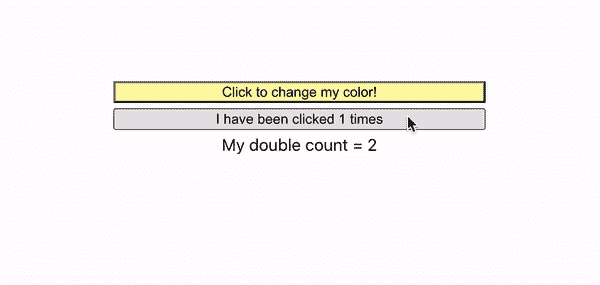
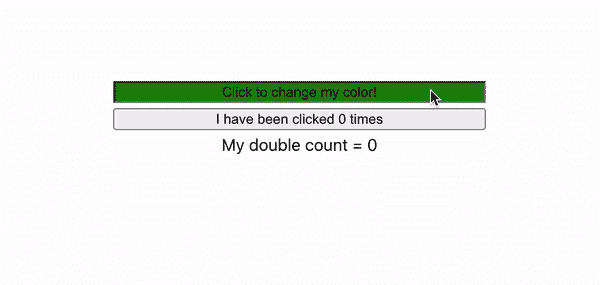

# 使用 React.js 中的 useMemo 钩子优化性能

> 原文：<https://levelup.gitconnected.com/optimizing-performance-using-the-usememo-hook-in-react-js-b8838df478c2>


今天，我将介绍如何使用 useMemo 钩子来优化 React.js 应用程序中函数的性能。我们也将使用 useState 钩子，所以如果你不熟悉它，一定要看看我在这里的博客帖子！

[](https://betterprogramming.pub/get-to-know-the-usestate-hook-in-react-js-d87797cb5a7) [## 了解 React.js 中的 UseState 钩子

### 因为功能组件很牛逼

better 编程. pub](https://betterprogramming.pub/get-to-know-the-usestate-hook-in-react-js-d87797cb5a7) 

此外，这是一个到回购的链接，我将使用它来演示这里的功能！

[](https://github.com/jonathanbrierre/usememo-demo) [## GitHub-jonathanbrierre/use memo-demo

### 这个项目是用 Create React App 引导的。在项目目录中，您可以运行:在…中运行应用程序

github.com](https://github.com/jonathanbrierre/usememo-demo) 

这是一个有性能问题的应用程序。



这是加载该演示的`App.jsx`的内容。

```
import { useState, useMemo } from 'react'
import './App.css';function App() {const [color, setColor] = useState('#fffaaa')
const [count, setCount] = useState(0);
const twiceCount = doubleMyCount(count)const generateRandomColor = () => {
    setColor( '#' + Math.floor(Math.random()*16777215).toString(16));
}return (
    <div className="App">
      <div className="demo-container">
        <button 
          style={{backgroundColor: color}} 
          onClick={generateRandomColor} 
         >
          Click to change my color!
         </button>
        <button 
          onClick={() => setCount(prevCount => prevCount + 1)}
         >
          I have been clicked {count} times
        </button>
        My double count = {twiceCount}
      </div>
    </div>
  );
}const doubleMyCount = (count) => {
  for(let i = 0; i < 1000000000; i++) {}
  return count * 2
}
export default App;
```

您会看到有两个按钮，一个改变`color`的组件状态，另一个改变`count`的组件状态。`twiceCount`变量引用一个函数的返回值，该函数内部有一个长时间运行的 for 循环。这个循环模拟一个运行并返回需要很长时间的函数。

**这里的问题**是不管这个组件的状态如何变化，`doubleMyCount`函数都会在整个组件重新呈现时运行。理想情况下，我们只希望在计数状态改变时运行`doubleMyCount`函数，而不是在其他任何事情改变时运行。然而，即使点击顶部的按钮来改变颜色，也会调用`doubleMyCount`。我们如何解决这个问题？

# **我们用备忘录！**

useMemo 挂钩使用起来超级简单！下面是我们的`twiceCount`变量，声明时没有使用 useMemo 钩子:

```
const twiceCount = doubleMyCount(count)
```

这里是使用备忘录挂钩:

```
const twiceCount = useMemo(() => { return doubleMyCount(count)}, [count])
```

由于我们增加了这里发生的事情的复杂性，**让我们来分解一下！**

UseMemo 是一个钩子，用来记忆函数的返回值。它接受两个参数:第一个是返回要记忆的值的函数，第二个是依赖数组。钩子监视传入这个依赖数组的值是否有任何变化。如果检测到依赖关系的变化，那么作为第一个参数传入的函数将再次运行。如果没有变化，那么 useMemo 钩子返回它在先前调用中存储的 memoized 值。

在这里的演示中，我们只想在计数发生变化时调用`doubleMyCount`函数，别无其他！所以我们将`count`状态变量单独放在依赖数组中。现在，当我们改变颜色和组件重新呈现时，`twiceCount`变量不会被重新计算，因为 useMemo 钩子返回一个记忆化的值。只有当计数按钮被点击并且`count`状态被更新时，`twiceCount`变量才会在下一次刷新时重新计算！



# 结论

通过在组件呈现之间使用内存化，可以使用 useMemo 钩子来提高应用程序的性能。我希望你从这篇文章中学到了一些东西！

# 参考

[](https://reactjs.org/docs/hooks-reference.html#usememo) [## 钩子 API 参考-反应

### 钩子是 React 16.8 中的新增功能。它们允许您使用状态和其他 React 特性，而无需编写类。这个…

reactjs.org](https://reactjs.org/docs/hooks-reference.html#usememo)