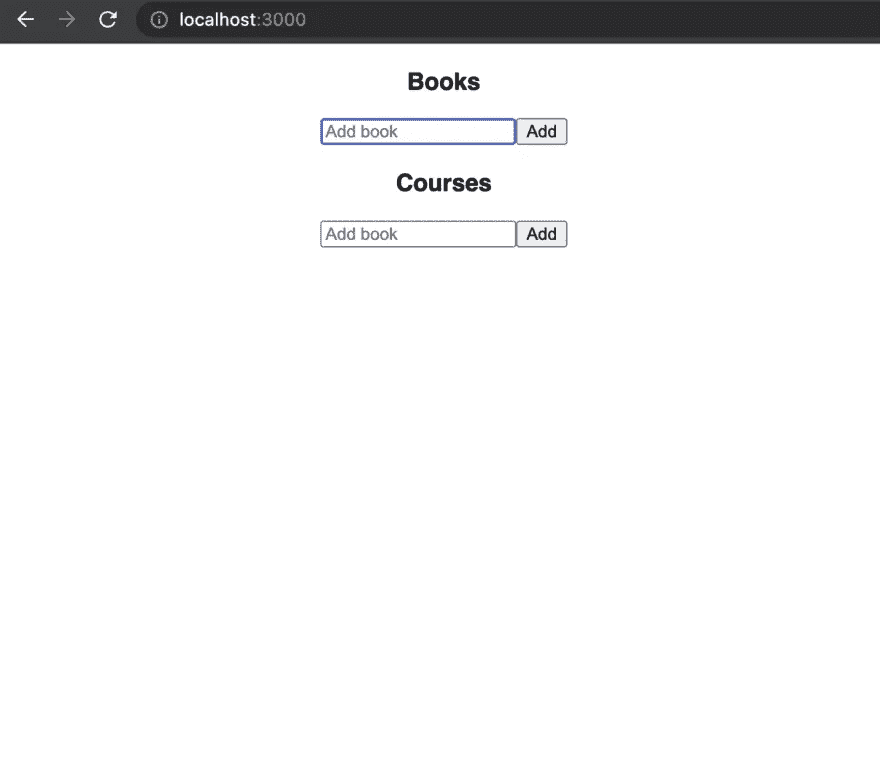
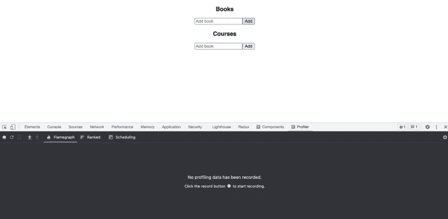
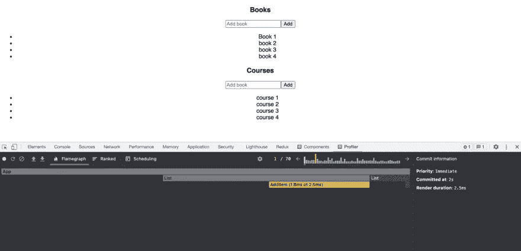
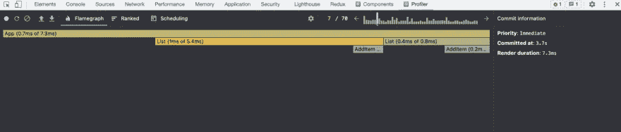
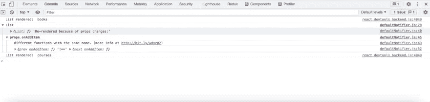
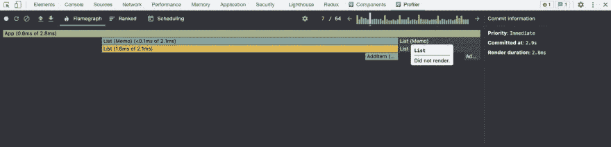

# 优化 React 应用性能

> 原文：<https://levelup.gitconnected.com/optimizing-react-app-performance-62924bf7eba2>

# 快速小结

本文旨在解释如何编写高效和高性能的 React 组件，以及一些我们可以使用的常见分析技术，我们可以使用这些技术来找出我们的应用程序中未优化的渲染行为并提高性能。

# 观众

本文的目标读者是中高级 React 工程师，他们非常熟悉这个库，并且对这个库的工作方式有很好的理解，尤其是虚拟 DOM、协调，以及这个库如何呈现和更新实际的 DOM。

React 是一个很棒的库，它允许您以声明方式编写应用程序。这种方法很棒，因为它抽象出了库如何实现特定 UI 状态的所有功能和内部细节，并确保 DOM 与您描述的状态保持同步。这是通过保持虚拟 DOM 和协调过程来实现的。让我们看看这两个术语，以便正确理解它们

# 虚拟 DOM 和协调

顾名思义，虚拟 DOM 基本上是 UI 的虚拟表示，您可以将它视为包含构建实际 DOM 所需的所有必要细节的蓝图。React 依靠虚拟 DOM 来高效地呈现已经更新的组件。与应用程序的任何与某个状态相关联的交互都可能导致应用程序触发重新呈现，但是 React 只通过首先更新虚拟 DOM 而不是实际 DOM，然后对新旧虚拟 DOM 应用比较算法来检测是否需要实际 DOM 更新，从而有效地完成了这一部分。这种不同的算法基本上使 React 能够决定更新哪些 DOM 元素或属性，并使之高效。

你可以在官方的 [React 文档](https://reactjs.org/docs/reconciliation.html)上阅读更多关于差分算法的内容。

React 应用程序中性能问题的主要原因之一是我们端的一些错误实现或不必要的重新渲染，特别是当它是资源密集型的，并且进行一些昂贵的计算时，会导致重复触发这个差异和渲染循环，并触发对实际 DOM 的更新，这可能会导致性能下降和缓慢的体验。

为了在我们的应用程序上实现良好的性能，我们需要确保 React 只更新受状态变化影响的组件，并且理想情况下忽略所有其他组件，这将导致节省为重新渲染未受影响的组件而浪费的 CPU 周期和资源，并为我们的应用程序提供性能提升。

在不进行概要分析或基准测试的情况下优化 React 应用程序不会给我们带来太多好处，因为优化技术会产生相关的成本，如果做得不正确，性能提升可能不值得代码库中引入的复杂性，并且可能会影响性能

让我们从我创建的一个非常简单的应用程序开始，一路剖析它，看看优化是否对我们有好处

```
// Clone the repo and switch to profiling branchgit clone https://github.com/asjadanis/react-performance-tutorial
git checkout profiling
```

通过运行 yarn 安装节点模块，然后通过运行 yarn start 启动应用程序，您应该会在浏览器中看到如下内容。



示例-应用

现在打开浏览器控制台，使用应用程序添加一些书籍，课程，如果您看到一些奇怪的渲染行为太好了，如果您不能解决它，我会为您分解当您添加一本书时，您会注意到课程列表也会被渲染，反之亦然。这是次优的，不是期望的行为，我们将优化我们的组件，以确保只有那些受状态变化影响的组件才会被渲染。在我们深入剖析之前，让我们快速浏览一下代码，这样我们就知道我们在处理什么了。

App.js

AddItem.js

List.js

我们的应用程序由三个组件组成，首先是我们的主要组件`App.js`，它包含添加书籍和课程的逻辑，并将处理程序和书籍/课程状态作为道具传递给`List`组件。
`List`组件提供输入控件，使用`AddItem`组件添加书籍或课程，并映射书籍和课程列表以呈现它们。

这很简单，每次我们添加一本书或一门课程，我们都在更新我们的`App.js`组件的状态，使它呈现和它的孩子。到目前为止，我们可以直接进入我们的 IDE 并修复这种行为，但在本文中，我们将后退一步，首先分析我们的应用程序，看看发生了什么。

我用一个漂亮的包[预配置了 repo，这个包基本上可以让你在开发模式下看到应用程序中任何可以避免的重新渲染。](https://github.com/welldone-software/why-did-you-render)

您可以查看软件包文档，看看如何用您的设置来配置它。

*注意:不要在你的生产版本中使用这个包，它应该只在开发模式中使用，并且应该在你的 devDependencies 中。*

# 压型

首先，你需要设置 [React 开发者工具](https://chrome.google.com/webstore/detail/react-developer-tools/fmkadmapgofadopljbjfkapdkoienihi?hl=en)，它是一个浏览器扩展，允许我们分析 React 应用。您需要为您的浏览器设置它，以便跟随概要分析部分，一旦您设置好它，就可以直接访问`[http://localhost:3000/](http://localhost:3000/)`上的应用程序并打开开发人员工具。

现在转到 profiler 选项卡，您应该能够在您的开发工具中看到类似下面的截图



分析-示例-应用程序

为了分析我们的应用程序的性能，并了解渲染是如何进行的，我们需要在使用应用程序时记录下来，让我们开始吧。点击录制按钮，然后与应用程序互动，添加一些书籍和课程，然后停止录制。你应该可以看到你的应用程序组件的火焰图，以及每个组件花费了多长时间渲染。灰色显示的组件表示它们在提交期间没有进行渲染。



分析-示例-应用程序

从这里开始，您可以单步执行图中的各种提交，并记录哪些组件花费了最多的时间进行渲染，以及是否有任何浪费的渲染。条形峰值是一个快速的可视指示器，显示提交花费了最多的时间，然后您可以单击它来进一步查看导致它的每个组件。在我们的例子中，我们可以看到一个黄色的峰值，后面跟着几个绿色的峰值，这表明当我们添加一本书或课程时正在进行渲染。



分析-示例-应用程序

在这里，我们可以看到我们的应用程序组件正在呈现，这在我们更新状态时是有意义的。虽然两个列表的呈现都没有优化，因为我们在给定时间只能更新一个列表，并且我们只希望呈现各自的列表，但是在我们的例子中，两个列表都与它们组成的 AddItem 组件一起被重新呈现。现在我们已经清楚了发生了什么，让我们通过将我们的列表组件包装在 React.memo 中来修复这种行为，React . memo 是一个高阶组件，它使 React 能够跳过对特定组件的渲染，因为新的道具与旧的道具相同。请注意，React.memo 只比较属性，因此如果您的包装组件包含内部状态，更新仍然会导致组件重新呈现所需的状态。

# 优化组件

为了修复这种行为，请使用`List`组件，从 React 导入`memo`，并用`memo`包装默认导出

```
// List.js
import { memo } from "react";const List = (props) => {
 ...
 ...
}export default memo(List);
```

看起来不错，现在让我们试一试保持浏览器控制台打开，并向列表中添加一本书您应该注意到，即使在 React.memo 中包装了我们的组件，我们的两个列表听起来仍然很奇怪，对吗？您还应该注意到一些额外的控制台日志，它们告诉我们为什么列表组件会重新呈现如下



分析-示例-应用程序

这些控制台日志来自我们之前讨论过的[为什么渲染](https://github.com/welldone-software/why-did-you-render)包，它使我们能够在 React 应用中看到任何可避免的重新渲染。这里它告诉我们，由于道具的改变，特别是`onAddItem`函数，组件被重新渲染。发生这种情况是因为 JavaScript 中的引用相等，每次我们的`App`组件渲染时，它将为我们的处理程序创建新的函数，引用相等将失败，因为两个函数不会指向内存中的同一个地址，这就是 JavaScript 的工作方式。为了更好地理解这个概念，您应该阅读更多关于 JavaScript 中的引用相等的内容。

要修复 React 中的这种行为，我们可以做的是将我们的处理程序包装在一个 [useCallback](https://reactjs.org/docs/hooks-reference.html#usecallback) 钩子中，这个钩子基本上返回我们处理程序的一个记忆版本，并且只有当其中一个提供的依赖关系改变时，它才会改变。这将确保不会创建函数的新实例，并防止重新呈现。这里要注意的是[记忆化](https://en.wikipedia.org/wiki/Memoization)并不是 React 特有的东西，而是编程中使用的一种通用优化技术，用于存储昂贵计算的结果，并在计算完成后返回缓存的结果。

让我们用一个`useCallback`来包装我们的句柄

```
import { useCallback } from "react";const onAddBook = useCallback((item) => {
    setBooks((books) => [...books, { item, id: `book-${books.length + 1}` }]);
  }, []);const onAddCourse = useCallback((item) => {
  setCourses((courses) => [
    ...courses,
    { item, id: `course-${courses.length + 1}` },
  ]);
}, []);
```

我们传递一个空的依赖列表，因为我们不希望在每次渲染时都重新初始化我们的处理程序，但是如果需要的话，您可以在那里添加依赖，现在让我们运行应用程序，看看它是如何工作的。 如果您现在添加任何书籍或课程，您会立即注意到只有相应的列表得到了重新呈现，这很好，但让我们也对其进行分析，看看我们是否获得了任何显著的性能提升虽然我们的示例应用程序非常简单和直接，但如果它有点复杂，请考虑每个列表项都有一个子数组，可以进一步列出，并包括一些资源密集型的逻辑，等等。您可以想象在这样的场景中，重新呈现肯定会是一个问题。 下面是分析后的结果，你也可以自己试试。



分析-示例-应用程序

我们可以在上面看到，在记忆化之后，我们的火焰图中最高峰的总渲染持续时间大约为**2.8 毫秒**，相比之前的**7.3 毫秒**，我们的第二个`List`组件没有渲染，这听起来很棒，我们通过投入大约 15-20 分钟的调试、分析， 在我们的案例中，优化和性能优势不会产生任何视觉差异，因为应用程序非常简单，在重新渲染时不会占用大量资源，但这并不意味着我们这样做是徒劳的。我们的目的是理解重新渲染背后的行为和推理，并客观地优化应用程序，而不是随机地将一切都包装在`React.memo`和`React.useCallback`中。 现在，我们已经开发了一个基本的心智模型，可以在 React 应用程序中处理与性能相关的问题时使用。

这里要记住的另一件事是，React 足够智能，可以确定实际更新哪些 DOM 节点，在上面的示例中，即使我们的列表组件不必要地重新呈现，React 也不会触发实际的 DOM 更新，除非有必要，否则您可以在浏览器开发工具中验证这一点，因为 React 负责更昂贵的部分，即上面简单示例中的 DOM 更新，我们甚至不需要优化我们的组件。当我们的组件渲染起来很昂贵，或者在渲染阶段包含一些昂贵的计算，只是浪费 CPU 周期，而不是必需的时候，这样的优化会更有成效。

# 一般准则

使用`React.memo`时谨记以下几点

*   React.memo 默认做一个[浅](https://github.com/facebook/react/blob/v16.8.6/packages/shared/shallowEqual.js)的道具比较
*   你可以传入一个自定义函数作为`React.memo`的第二个参数，添加你的自定义逻辑来比较道具。
*   如果你需要对道具进行深入的比较，请记住，根据道具的复杂程度，这需要额外的费用。
*   当你的组件使用相同的道具渲染相同的东西，或者渲染起来计算量很大，不像上面的列表组件，使用`React.memo`是有意义的。

如果你正在使用 React 类组件，你可以使用`shouldComponentUpdate`生命周期方法或者`React.PureComponent`来实现相同的行为，但是要确保你用概要文件来帮助它。

你可以使用 [useMemo](https://reactjs.org/docs/hooks-reference.html#usememo) 钩子在每次渲染时记忆任何计算量大的计算，确保提供一个依赖数组，以防记忆的值依赖于其他一些字段，如果这些字段中的任何一个发生变化，就需要重新计算。

# 结论

这篇博客的目的是在 React 应用程序中处理优化问题时建立一个心智模型，并强调客观实现它的剖析技术。如果使用不当，优化技术是有代价的，将所有东西包装在`memo`或`useCallback`中不会神奇地让你的应用程序变得更快，但是正确使用它们并在过程中进行剖析绝对可以成为救命稻草。
一如既往，欢迎在评论区与我分享你的想法，或者在 [Twitter](https://twitter.com/asjadanis) 上与我联系。