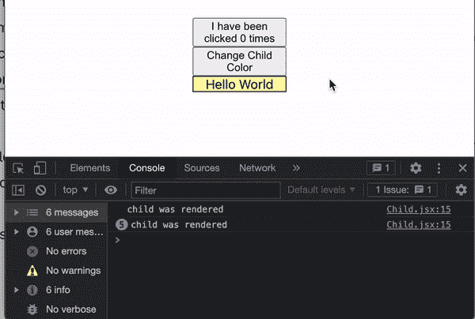
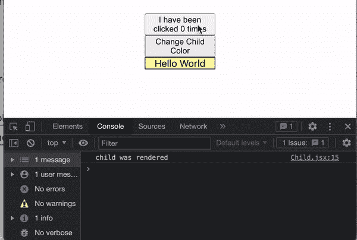
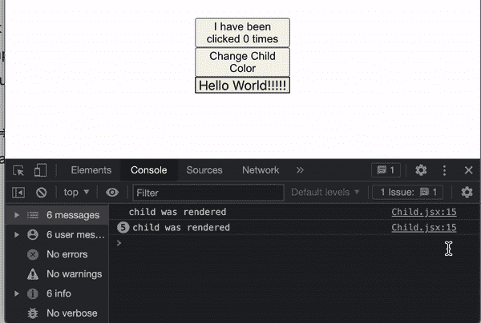

# 使用 PureComponents 和浅层比较优化 React.js 性能

> 原文：<https://levelup.gitconnected.com/optimizing-ui-performance-with-react-purecomponent-and-shallow-comparison-a10cc3073e78>


今天，我们将讨论如何使用 React。PureComponent 来加速我们前端应用程序的性能！在我们开始这篇博客的演示之前，让我们讨论一下是什么使得 PureComponent 不同于常规的 React 组件。

**PureComponents 和 shouldComponentUpdate()**

PureComponents 隐式地引入了一个`shouldComponentUpdate()`生命周期方法来提高性能并防止不必要的重新渲染。如果你不熟悉这个生命周期钩子，它决定了一个组件是否应该更新，假设我们满足某些条件。关于`shouldComponentUpdate()`的更多信息，你可以看这里:

[](https://reactjs.org/docs/react-component.html#shouldcomponentupdate) [## 做出反应。成分-反应

### 该页面包含 React 组件类定义的详细 API 参考。它假设您熟悉…

reactjs.org](https://reactjs.org/docs/react-component.html#shouldcomponentupdate) 

在纯组件的情况下，`shouldComponentUpdate`方法对组件的状态和属性进行简单的比较，以确定是否需要重新呈现。

**浅薄的比较**

在 PureComponents 的情况下，React 在一个深度级别上观察状态和道具，以确定是否需要进行任何重新呈现。

根据 React 文档对浅层比较的描述，“它通过对被比较对象的键进行迭代，并在每个对象中的键值不严格相等时返回 true。”

假设我们有某种状态:

```
state = {
 name: 'Jay',
 address: {
  street: 'Apple Way',
  houseNumber: 123,
  town: 'Townsville'
 }
}
```

我们的浅层比较将检查`name.`的值的状态变化之间的相等性。如果名称更改为‘John’，那么我们的浅层比较将提取该值并触发重新呈现。

我们的浅层比较将根据我们的状态对象中的地址条目来比较对象在内存中的引用位置。如果内存中的位置发生变化(如果创建了一个新对象并将其设置为 state)，浅层比较将触发重新呈现。

道具对比一般也是如此。

**演示:**

下面是我创建的一个示例应用程序，演示了我们如何使用 PureComponents 来优化我们的性能。


可以在此处找到该库的链接:

[](https://github.com/jonathanbrierre/pure-component-demo) [## GitHub-jonathanbrierre/纯组件-演示

### 这个项目是用 Create React App 引导的。在项目目录中，您可以运行:在…中运行应用程序

github.com](https://github.com/jonathanbrierre/pure-component-demo) 

这个应用程序有两个组件:作为父组件的 App.jsx 和名为 Child.jsx 的子组件。

App.jsx 看起来像这样:

Child.jsx:

在我们的父组件中，我们使用 useState 钩子设置了两个状态变量:一个跟踪我们点击第一个按钮的次数，第二个改变子组件的颜色。颜色的状态作为道具传递给子组件。

如果你不熟悉 React 中的 useState 钩子是如何工作的，我建议你在这里看看我的博文！

[](https://betterprogramming.pub/get-to-know-the-usestate-hook-in-react-js-d87797cb5a7) [## 了解 React.js 中的 UseState 钩子

### 因为功能组件很牛逼

better 编程. pub](https://betterprogramming.pub/get-to-know-the-usestate-hook-in-react-js-d87797cb5a7) 

在子组件中，我们有一个扩展常规 React.Component 的类组件。我们有一个设置为“Hello World”的状态变量`text`和一个调用`setInterval`函数的`componentDidMount`生命周期方法，该函数每秒将我们的文本状态设置为“Hello World”。这样做是为了帮助模拟我将很快演示的性能问题。

最后，在我们的 render 方法中有一个`console.log`语句来显示我们的子组件被重新呈现的频率。

事不宜迟，下面我们就来观察**这里的问题**！



如我们所见，我们有一个不擅长表演的孩子！每当父组件重新呈现时，无论其更改是否会影响子组件，子组件也会重新呈现。此外，不管我们孩子的状态是否用相同的值更新，它将继续每秒重新呈现一次。这是*低效的*，因为当我们改变传递给它的颜色属性时，或者当子组件的状态值改变时，我们会想要重新渲染子组件。为此，我们从 React 扩展了子组件。PureComponent！

**优化**

首先，您可以像这样从 React 导入“PureComponent ”:

```
import { PureComponent } from ‘react’
```

然后我们延伸:

```
class Child extends PureComponent
```

当我们查看应用程序的性能时，我们可以看到我们已经完成了我们想要的！



更新`count`状态只影响父级；只有父级会重新呈现，而子级不会，因为计数不会作为道具传递。

此外，我们在子组件中调用的`setInterval`函数不再每秒触发一次重新渲染，因为它不会改变我们的状态值。

**但是**假设我们确实想每秒在子组件中的文本末尾添加一个感叹号。我们需要更新 setInterval 函数，如下所示:

```
 setInterval(() => {
    this.setState(prevState => ({ text: prevState.text + ‘!’ }))
 }, 1000)`
```



由于我们现在每秒都在有效地改变我们孩子的状态，我们的 PureComponent 的浅层比较检测到这种变化，并允许重新呈现。这些更改会根据需要反映在用户界面上。

**注意事项:**

作为反应。PureComponent 使用浅层比较来决定何时重新渲染，我们必须在创建和更新组件状态时遵守规则。通常建议不要在 PureComponents 中使用深度嵌套的状态。这是为了在操作状态数据时避免任何不必要的直接状态突变。更新状态时，总是创建新的或重复的状态对象和数组。

有关如何不改变状态的指南，请查看这篇博文:

 [## 不要在反应中改变状态

### 这篇文章描述了在 react 中不改变状态的重要性。

medium.com](https://medium.com/@kkranthi438/dont-mutate-state-in-react-6b25d5e06f42) 

此外，根据 React 文档，“如果[状态或属性]包含复杂的数据结构，它可能会对更深层次的差异产生假阴性。”

您可以在 React 上找到更多信息。此处为纯组件

[](https://reactjs.org/docs/react-api.html#reactpurecomponent) [## 反应顶级 API -反应

### React 是 React 库的入口点。如果从一个标签加载 React，这些顶级 API 可以在…

reactjs.org](https://reactjs.org/docs/react-api.html#reactpurecomponent) 

此外，PureComponent 将用于类组件。如果您想为您的功能组件添加类似的性能优化，请查看我在 React.memo 上的博客！

[](/optimizing-performance-using-react-memo-cc7d954de309) [## 使用 React.memo 优化性能

levelup.gitconnected.com](/optimizing-performance-using-react-memo-cc7d954de309) 

编码快乐！