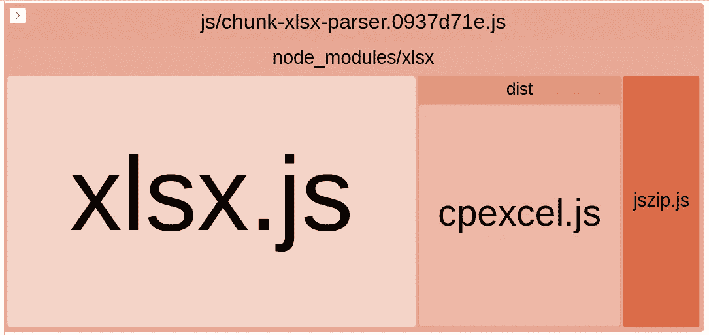

# 通过异步加载大型库来优化 vendor.js

> 原文：<https://levelup.gitconnected.com/optimizing-vendor-js-by-asynchronously-loading-large-libraries-5b5432d7015f>

所以你已经建立了一些很棒的东西，一切都运行得很好；但是你看了一下你的 vendor.js 和引导时间，它们并不漂亮。关于如何解决这个问题，有一大堆共同的智慧——自动将您的路线和代码分割成块，编写您的导入，这样您就可以通过树抖动，使用较小的库，只从较大的库中导入您需要的内容。但是尽管如此，有时您不可避免地需要一个更大的库，并且拉入这些数据会对您的首次加载时间产生重大影响。



这个库比 vendor.js 大，但是我确实需要它。

例如，在我最近的项目中，我希望能够为客户提供从 XLSX 文件导入和导出的能力。退一步说，即使是最小的库对于这些操作来说也是相当大的，我绝对不希望它们加重那些不使用该功能的人的负担！我已经设置了很棒的 web pack[SplitChunksPlugin](https://webpack.js.org/plugins/split-chunks-plugin/)，它可以自动分离这些库，所以理论上它们不会影响其他页面，只会影响使用它们的路径。但是，由于网络开销和 JS 解析开销，它们仍然为每个用户预加载，这影响了我的性能数据。那么，我们如何针对这种情况进行优化呢？


懒惰？不。效率。

答案是及时手动延迟加载供应商 JS 的较重部分，这在现代 webpack + ES6 环境中通过使用`import`函数非常简单。我更喜欢将它包装在 JS 服务文件中，原因如下:

*   它提供了一个为 webpack 预处理器提供注释的单一位置。
*   当你只需要库的一部分时(像`import { Foo } from 'bar'`)，它可以通过只导出你需要的那部分库来简化你的代码。
*   它为使用该服务的文件中的其他`import`语句提供了一致的接口。
*   这使得手动预加载变得非常容易，只需在预期可能需要时调用服务即可。

自己处理比依赖自动代码分割有几个关键的优势。您可以准确地决定何时需要它，这样您就不会不必要地为您的用户拉入数据。如果将加载和解析大型库的时间推迟到真正需要的时候，应用程序可能会启动得更快。至关重要的是，它给你一种方法，通过自己处理基于承诺的接口，挂钩到加载过程本身，并向用户提供 UI 反馈，这样他们就不会觉得你的应用程序“慢”了。

我假设您已经有了一个安装了 webpack 的现代前端开发环境。您需要的第一件事是包装您的目标库的服务，在我的例子中是极好的(但是很重！) [xlsx](https://www.npmjs.com/package/xlsx) 。最简单地说，这个服务不需要做太多事情——它只需要保存一个对由`import`调用返回的单个承诺的引用并返回它。

**重要提示:**如果您已经在项目中设置了 webpack 的预取插件，您还需要确保它在编译项目时不预加载您的文件！对于默认启用的 Vue.js，您可以在您的 Vue 配置中自定义它，如下所示:

对于其他框架，您将在配置了`PrefetchPlugin`的地方寻找。

现在您已经配置了您的服务文件和 webpack，而不是您典型的`import xlsx from 'xlsx'`，您现在将`import xlsx from './async-xlsx'`。然后，您可以调用您的服务来预加载(例如，作为可能需要它的组件生命周期的一部分)并等待结果来使用它。在我的导入工作流中，我有一个在 mount ( `xlsx()`)上预加载服务的导入视图和一个回调函数，该函数只在用户选择要导入的文件时运行:

```
xlsx().then(parser => parser.read(...))
```

一旦输入了导入回调，还会启动一个带有加载微调器的视图状态，因此如果在加载库以继续导入过程时出现延迟，UI 中的所有内容都会迅速响应。

我想谈的另一种情况是`import { Foo } from 'bar'`情况——您只需要库的一小部分。当你以这种方式使用`import`时，不幸的是，你将会加载整个库。您可以通过在服务中处理它来使您的调用代码更清晰:

```
asyncFoo = import('bar').then(bar => bar.Foo)
```

或者，如果您确实需要库中的一些东西，在应用程序代码中通过对服务的结果使用析构来处理可能会更干净:

```
asyncBar().then(({Foo}) => ... )
```

总之，这个小提示我就知道这么多了。一旦你第一次这样做了，自动分割并不需要太多的额外工作，而且通过精确地推迟你实际需要下载和解析这些较大的库的时间，它确实提高了你的应用程序的性能和响应能力。