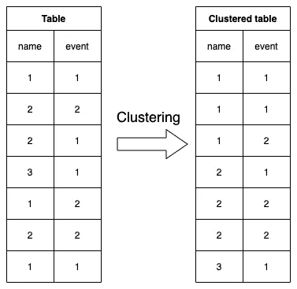
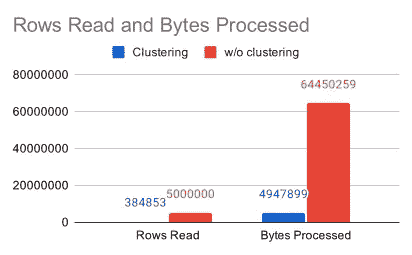

# 使用聚类优化 BigQuery 表

> 原文：<https://levelup.gitconnected.com/optimizing-your-bigquery-tables-using-clustering-4d2b4255b461>

除了通过表分区来提高 BigQuery 的性能和成本，还有另一种技术叫做*集群*。

**提醒一下:**集群和分区并不互相抢占。在大多数情况下，两者结合使用是有意义的。


照片由[卡斯帕·卡米尔·鲁宾](https://unsplash.com/@casparrubin)在 [Unsplash](https://www.unsplash.com/) 上拍摄

# 什么是聚集表？

使用聚集表，BigQuery 根据一个或多个选定的列自动组织和存放相关数据。这里需要注意的是，为集群指定的列的顺序非常重要。但稍后会详细介绍。

由于 BigQuery 几乎自动完成所有的事情——关于集群——您唯一要做的事情就是告诉 BigQuery 您希望 BigQuery 对哪些列以及以什么顺序对您的数据进行集群。

然后，BigQuery 将数据存储在内部 BigQuery 存储的多个块中。将数据存储在预先排序的块中意味着 BigQuery 可以根据查询过滤子句使用这些块来防止扫描不必要的数据。

根据官方文档，当扫描的表(或表分区)超过 1 GB 时，使用集群将显著提高性能。

BigQuery 提供了自动重新聚集，这意味着即使您向表中添加新数据，BigQuery 也会自动将它们分类到现有的块中。

**集群表与非集群表的一个小例子**

在下图中，您可以在左侧看到一个带有随机插入数据的表，在右侧看到一个带有*名称*和*事件*列的聚集表。

如您所见，具有相同*名称*的行位于彼此正下方。并且在相同*名称的范围内，具有相同*事件*的*行也位于同一位置。



以这个例子为例，您已经可以想象在查询数据时可能的改进。作为一个例子，让我们假设您想要查询所有的值，其中*名称*等于*“1”*。

如果没有集群，BigQuery 将不得不扫描整个表，因为每一行都可能在其*名称*列中包含值 *"1"* 。

使用集群，BigQuery 知道只有前三列符合这个过滤条件。这导致扫描的列减少了 50%,因为所有可能的结果行都在彼此的正下方，BigQuery 可以跳过另外 50%。此外，减少 50%的检查行也意味着减少 50%的成本，因为 BigQuery 对读取的字节收费。尽管这可能不是 100%准确，但正如我们将在后面看到的那样，它足够准确，可以对表中的数据进行聚类。

扫描时跳过特定块的过程也称为*块修剪*。即使 BigQuery 不一定要为聚集列中的每个不同值创建一个块。BigQuery 创建的块数很大程度上取决于存储的数据量。对于 1 MB 的数据，即使它在聚集列中可能包含 100 个不同的值，BigQuery 也不会创建 100 个块，并在筛选一个特定值时节省 99%的读取字节。但是表中可用的(不同的)数据越多；聚类将变得越有效。正如上面已经提到的，Google 建议最小表大小为 1 GB，这样使用集群就可以看到显著的改进。但是我们将在下一节看到，改进将更早开始。

# 亲自动手

现在是时候进行一些实际的动手编码并查看一些真实的例子了。我把动手部分分成了四个小部分。

1.  简单的脚本来创建一些我们可以导入和查询的测试数据。
2.  将测试数据作为普通表和聚集表导入 BigQuery。
3.  用相同的查询查询两个表并比较结果。
4.  基于一个真实的例子对 Google 的集群块大小做一个假设。

**创建测试数据**

我们将根据本文中的第一张图来创建测试数据，其中我们展示了与普通表相比，BigQuery 如何组织一个集群表。

这意味着我们将有两列。一列代表一个*名字*，另一列代表一个*事件*。

[](/optimizing-your-bigquery-tables-using-partitioning-time-unit-column-partitioned-tables-c93cfbf3828d) [## 使用分区优化 BigQuery 表:时间单位列分区表

### 尤其是在处理大数据时，当数据开始变得不稳定时，成本会迅速激增，性能会迅速下降

levelup.gitconnected.com](/optimizing-your-bigquery-tables-using-partitioning-time-unit-column-partitioned-tables-c93cfbf3828d) 

与上一篇文章不同([使用分区优化 BigQuery 表:时间单位列分区表](/optimizing-your-bigquery-tables-using-partitioning-time-unit-column-partitioned-tables-c93cfbf3828d))，我们将通过 JavaScript 脚本动态创建数据，并将其写入 CSV 文件。我们需要最少量的数据—我们将创建 5，000，000 行，生成一个 28 MB 的 CSV 文件—这样我们就可以看到集群的一些效果。

因此，让我们来看看生成测试数据的实际代码。

如你所见，我们使用 *csv-writer* NPM 模块来编写 csv 文件。所以确保你通过 *npm i 安装它——在运行脚本之前保存 csv-writer* 。

剧本本身应该容易理解。首先，我们定义一些常量来确定行数、不同名称的数量以及脚本将随机生成的事件。为了简单起见，我使用简单的数字来表示名称。

当您使用我的默认值时，该脚本将生成一个 28 MB 的 CSV 文件，其中正好包含 5，000，000 行数据—外加一个列标题—以及 1，000 个不同的名称和 10 个不同的事件。该脚本将名称定义为 0 到 999 之间的值，将事件定义为 0 到 9 之间的值。

当然，每次运行时，生成的 CSV 文件都会包含一点点不同的数据。但是由于出现的次数很多，您可以预期每个名称会出现大约 5.000 次。

既然测试数据已经准备好了，是时候将它发送给 BigQuery 了。

**通过 CSV 导入创建包含数据的新表格**

如果您查看下面的代码片段，您会发现与上一篇文章的 CSV 导入脚本有许多相似之处([使用分区优化您的 BigQuery 表:时间单位列分区表](/optimizing-your-bigquery-tables-using-partitioning-time-unit-column-partitioned-tables-c93cfbf3828d))。的确，大部分都是相同的代码。主要区别是 *importCSV()* 方法的第四个参数。在我们使用*时间分割之前，*我们现在使用*集群*来定义 BigQuery 应该集群的字段。

在脚本中，我们将聚类字段定义为 *["name "，" event"]* ，这意味着 BigQuery 首先对*名称*进行聚类，然后对*事件*列进行聚类。

在您成功运行该脚本之后——将大约 28 MB 的 CSV 文件导入到 BigQuery 并等待集群完成可能需要一点时间——我们可以通过 CLI 验证 BigQuery 是否正确地添加了集群。

*bq show—format = pretty JSON*

*您的 _ GCP _ 项目:您的 _ 数据集 _ID.my_clustered_table*

这个命令将把 BigQuery 表的元数据打印到 CLI。在那里，您应该会发现一些类似于下面的*集群*的条目:

```
*“clustering”: {
  “fields”: [
    “name”,
    “event”
  ]
},*
```

如果您对 *non_clustered_table* 运行相同的命令，您应该看不到*集群*的任何条目。

**对导入的数据进行查询**

现在，我们已经将所有数据导入到普通表和集群表中，并验证了 BigQuery 在集群表上正确地启用了集群，现在可以对它运行一些查询来比较它们的统计数据。

同样，我们使用了前一篇文章中的大量代码，因为大部分代码独立于任何集群或分区。

与之前相比，我们向我们的 *runQuery* 方法添加了一些 *printConfig* 来定义它应该打印什么——查询结果或作业统计数据，或者两者都打印。

在我们的标准搜索查询——*create query*——中，我们通过特定的*名称*和值 *"1"* 来过滤行。理论上，这应该会影响大约 5，000 行，因为我们已经创建了 5，000，000 行，其中有 1，000 个不同的名称，每个名称大约有 5，000 个条目。

我们添加了一个额外的查询——*create count query*——我们将运行并打印它的结果。我们运行这个查询来验证我们的假设，即大约有 5，000 行会受到我们的文件管理器条件的影响。

**查询结果**

当您运行上面的脚本时，您应该会得到与下面类似的结果:

因为我们这里没有很多数据，所以两个查询中花费的*时间*是相似的。正如开始时所解释的，当表的大小接近 1 GB 或更大时，可以看到显著的性能改进。

但是你可以看到，读取的*行和处理的*字节*——Google 向你收费——显著减少了。*

从 5，000，000 行读取和 64，450，259 字节处理，我们减少到 384，853 行读取和 4，947，899 字节处理。这在理论上节省了 92.3%的成本！仅仅因为我们使用了聚类。

您也可以在下图中看到这种巨大的差异:



细心的观众还会注意到，计费的*字节并没有减少 92.3%，尽管这是意料之中的。是的，完全正确。但这是因为谷歌对每个查询收取最低 10 MB 的费用，而不考虑实际处理的字节数。当*处理的*字节高于 10 MB 时，计费*的*字节几乎总是与*处理的*字节相同。*

**谷歌的聚类块大小，一个假设**

除此之外，您可能还会注意到，读取的*行的数量远远高于我们预计只为查询扫描的 5000 行。这是由于 BigQuery 的一些 Google 内部配置，其中存在一个集群范围的最小大小。尽管谷歌的“魔力”不仅仅在于协同定位数据的大小。*

您可以假设，当您将数据量增加到某个点时，读取的*行应该与受影响的行具有相同的值。因为我们在上面看到，即使只有 5，000 行应该受到影响—查询读取了 384，853 行—我们可以认为在这个值附近的某个地方，可能有一些“神奇的数字”。*

举个小例子——我还不想深入这个话题——我将上面的测试数据集修改如下:

*   我把条目总数增加到 1000 万。
*   我把不同的名字减少到 20 个。

理论上，这些变化会产生 20 个不同的名称，每个名称在表中大约出现 500，000 次。有了这个，我们的出现次数就比之前的查询读取的行数要多。

让我们来看看结果:

乍一看，结果可能看起来有些混乱。即使我们现在有 500，000 个条目符合我们的过滤标准，BigQuery 只读取了将近 400，000 行？我们还用我们的 *createCountQuery* 验证了大约有 50 万行符合我们的过滤器。

但是等等！如果您还记得的话，我们在查询中使用了一个*限制 1* ，因为我们对实际结果从不感兴趣，而只是查看了作业统计数据。

让我们将这个*限制 1* 更改为*限制 600000* ，这样我们将检索所有受影响的行，并再次查看我们脚本的结果:

我们现在可以清楚地看到，该作业总共读取了 799，675。这几乎是*极限 1* 情况下读取行数的两倍，即 798，948。那里可能有一些东西…

尽管我没有找到任何官方文档，但它可能会为您提供一些关于聚集表的可能块大小的提示。但到目前为止，这纯粹是我的调查，当然还涉及到其他因素。我想更进一步，但我认为这超出了本文的范围，因为它应该是对集群的一些介绍，而不是对其内部结构的深入探究。

# 需要注意的集群限制和常见陷阱

**聚集列的最大数量** — BigQuery 最多支持四列进行聚集。

**字符串*类型*的聚类** —当您使用*字符串*类型进行聚类时，必须注意 BigQuery 仅使用单元格值的前 1024 个字符进行聚类。BigQuery 的聚类算法不会考虑超出该限制的所有内容，即使将更长的值写入单元格是有效的。

**聚集列的顺序** —定义用于聚集的列的顺序对于良好的性能至关重要。如果希望从聚类机制中受益，有必要在筛选表达式中以从左到右的排序顺序使用所有的聚类列或它们的子集。如果您有集群列 *A* 、 *B* 和 *C* ，您将必须对它们全部进行过滤，只过滤 *A，或者 A* 和 *B* 。仅仅对 *B* 和 *C* 进行滤波不会产生预期的性能提升。作为最佳实践，您应该始终首先指定最频繁筛选或聚合的列。实际 SQL 过滤器表达式中的顺序不会影响性能。重要的是要过滤哪些列。

## 你想联系吗？

如果你想联系我，请在 LinkedIn 上给我打电话。

另外，请随意查看我的书籍推荐📚。

[](https://mr-pascal.medium.com/my-book-recommendations-4b9f73bf961b) [## 我的书籍推荐

### 在接下来的章节中，你可以找到我对所有日常生活话题的书籍推荐，它们对我帮助很大。

mr-pascal.medium.com](https://mr-pascal.medium.com/my-book-recommendations-4b9f73bf961b) [](https://mr-pascal.medium.com/membership) [## 通过我的推荐链接加入 Medium—Pascal Zwikirsch

### 作为一个媒体会员，你的会员费的一部分会给你阅读的作家，你可以完全接触到每一个故事…

mr-pascal.medium.com](https://mr-pascal.medium.com/membership)