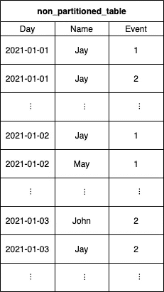
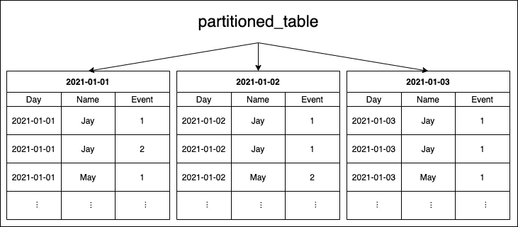
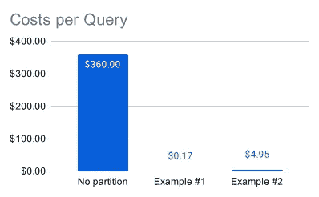
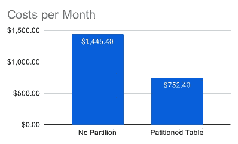

# 使用分区优化 BigQuery 表:时间单位列分区表

> 原文：<https://levelup.gitconnected.com/optimizing-your-bigquery-tables-using-partitioning-time-unit-column-partitioned-tables-c93cfbf3828d>

尤其是在处理大数据时，当数据开始堆积时，成本可能会迅速爆炸，性能可能会迅速下降。

卡斯帕·卡米尔·鲁宾在 [Unsplash](https://www.unsplash.com/) 上的照片

BigQuery 提供了创建分区表的可能性，这有助于防止成本激增和性能下降。

当然，用例必须符合分区背后的理念，尽管大多数大数据用例应该以某种方式符合这一理念。

Google 提供了三种不同的方法来划分 BigQuery 表:

**摄取时间** —表根据它们摄取的时间进行分区。

**时间单位列** —基于时间单位列对表进行分区。这里的有效值是*时间戳*、*日期*和*日期时间*。

**整数范围** —基于整数列对表进行分区。

# 什么是时间单元划分，它是如何工作的？

对一个表进行分区就像把这个表分成几个“子”表。这些分区表中的每一个都有其唯一的键，便于快速访问。

当使用分区时，您可以只在一组特定的已分区表上运行查询，这样可以保存许多行，您的查询不必迭代来检查您的条件。

在 BigQuery 中使用“时间单位列”分区的工作方式如下:

您用类型*时间戳*、*日期*或*日期时间*指定表中的一列，并指定分区的粒度。这里的有效值是每小时、每天、每月和每年。如果选择 daily，所有分区表都将包含特定日期的所有行，因此您可以快速获取所有行或筛选特定日期的行，而无需遍历所有其他分区表。

假设您在一年(365 天)内每天至少写一个条目，并且使用每日分区，那么到年底您将有 365 个分区表。这是因为每个分区反映一天的数据。

在下面的两幅图中，您可以看到一个“普通的”未分区表，紧接着是在“Day”列上有每日分区的同一个表。

未分区表

分区表

请记住，在实际使用分区时，您的查询也必须反映分区。例如，当您按日期列对表进行分区，但没有按日期进行筛选，这会导致再次进行全表扫描，这样做没有好处。

**它能在多大程度上提高性价比？**

既然我们已经讨论了基础知识，那么最关键的问题之一就是“它能在多大程度上提高成本/性能？”。没有适合所有用例的答案，但是让我们提供一个例子，您可以使用它作为计算的蓝图。

为了得到一些具体的值，让我们假设如下:

*   您使用每日分区，因为您必须查询一天或一天范围内的数据。
*   您已经有了六年的数据，产生了大约 2190 天/分区表。
*   您将数据均匀地分布在所有的日子里(当然，有点不太可能，但是我们必须在这里做一个假设)。
*   您的数据总大小为 72 TB ->每年 12tb->每月 1tb->每天约 33 GB

对于未分区表，您的查询将始终必须进行全表扫描，导致每次查询需要处理 7，2e+13 字节(72 TB)的数据并进行计费。

**示例#1:在某一天运行查询**

只请求一个特定日期的数据意味着查询可以直接访问所需的分区并处理这一个分区，而不必处理另一个分区 2189。

上面，我们假设一天/分区包含大约 3，3e+10 (33 GB)的数据。这意味着我们将只处理整个数据集的大约 0.046% (33 GB / 72，000 GB 或 1 / 2190)，导致数据使用量**减少 99.954%** ，从而降低成本！

**示例 2:运行 30 天范围的查询**

请求 30 天的范围类似于上面的例子，可以简化为 30 / 2190 => 1.37%。尽管这比示例 1 中的多得多，但与全表扫描相比，它仍然在大小和成本上减少了 **98.6%** ！

**实例的实际成本:**

现在让我们来看看与未分区表相比，上述示例查询的成本是多少。Google 根据其官方定价文档收取每 TB 美元的费用，从而得出以下值。

未分区表:5.00 美元* 72tb =**；360.00 美元**

示例# 1:5.00 美元* 0.033 TB =**；0.165 美元**

示例 2:5.00 美元* 0.99 TB =**；4.95 美元**

每次查询的成本

差别非常惊人，对吧？😏

当然，分区将提高与成本降低成比例的性能。当查询需要评估的行数减少了 99%时，您可以想象它需要减少大约 99%的时间来完成。

**为什么使用分区可以节省更多资金**

尽管上面的例子已经大大降低了成本，但当我们考虑 BigQuery 中的第二个成本驱动因素时，还有更多的问题。存储成本。

 [## 谷歌大查询是怎么回事，它的成本是多少？

### 本文的目的是让您对 BigQuery 有一个大致的了解，并对它的定价因素有一些见解。

levelup.gitconnected.com](/whats-the-deal-with-google-bigquery-and-what-does-it-cost-9077c3f2fed0) 

正如在[第一篇文章](/whats-the-deal-with-google-bigquery-and-what-does-it-cost-9077c3f2fed0)中已经提到的，BigQuery 有主动和长期存储的概念。虽然谷歌对长期存储只收取一半的费用，但这并没有带来任何不利。唯一的标准是至少 90 天没有修改表数据。当您使用分区表时，从长期存储定价的角度来看，每个分区都是单独考虑的。

让我们采用上述关于数据大小(每天 33 GB)和分布(平均)的假设，并检查其存储成本。此外，我们进一步假设，在过去的 90 天里，我们每天都添加一些数据。

这种假设导致未分区表永远不会达到长期存储状态，因为表每天都有变化。另一方面，分区表在活动存储中总是只有 90 个分区，其余 2100 个分区在长期存储中。

对于主动存储，谷歌目前对美国地区(多地区)收取每 GB 0.02 美元的费用。

未分区表:每月$ 0.02 * 33 GB * 2190 =**$ 1445.40**

分区表:0.02 * 33 GB * 90 天+0.01 * 33gb * 2100 天= 59.40 美元+693.00 美元=**每月 752.40 美元**

****

**每月费用**

**如您所见，通过分区，您不仅可以显著降低按需分析成本，还可以大幅降低存储成本。**

# **亲自动手**

**现在让我们动手做一些实际的实现，并分析查询结果。**

** [## 使用 Node.js 在 BigQuery 中处理数据

### 本文将介绍 BigQuery 的实际用法，并展示如何使用 Node.js 读写数据。

javascript.plainenglish.io](https://javascript.plainenglish.io/working-with-data-in-bigquery-using-node-js-4738561f5329) 

由于我们已经在[上一篇文章](https://javascript.plainenglish.io/working-with-data-in-bigquery-using-node-js-4738561f5329)中处理了 Node.js BigQuery 项目的设置，这里就不再赘述了。我还希望在下面的代码片段中存在一个名为“bigquery”的全局初始化变量，并且 BigQuery 数据集是可用的。

我们首先必须用相同的数据集创建两个表，以便将一些实际的(即使相对较小的)未分区表与已分区表进行比较。

**使用 CSV 文件中的数据创建新表格**

对于这个例子，我准备了一些包含大约 72k 行的 CSV 文件，格式如下:

日期、名称、事件

亚当，4 岁

汤姆，2 岁

杰伊，1 岁

杰伊，3 岁

….

第一行“日期”的类型为*日期时间*，因此格式如下: *YYYY-MM-DD HH:MM:SS[。SSSSSS]*

实际值并不那么重要；我只是确保这里提到了四个不同的日期，所以 BigQuery 创建了四个分区，我可以在以后相应地查询。然后，我将 CSV 文件命名为“dump.csv ”,并将其添加到我的脚本文件“importCSV.js”下，其内容可以在下面的代码片段中看到。

上面代码片段中的' importCSV()'方法类似于您应该从[上一篇文章](https://javascript.plainenglish.io/working-with-data-in-bigquery-using-node-js-4738561f5329)中了解的内容。不同之处在于，我们不是调用一些“createTable(…)”，而是引用“Table(…)”，然后通过“load(…)”方法将初始数据和一些模式定义一起加载到其中。

“importCSV”方法的“特定于分区”部分只是传递给函数的“timePartitioning”变量。

当您检查对象时，脚本为该参数传入；这很简单。我们将类型定义为‘DAY ’,告诉 BigQuery 应该创建每日分区表。此外，通过' field '属性，我们命令 BigQuery 使用名为' date '的列作为分区列。你可以在这里找到“时间分割”对象[的官方文档。](https://cloud.google.com/bigquery/docs/reference/rest/v2/tables#timepartitioning)

在运行了上面的脚本并创建了两个表之后，我们现在可以运行查询并与下面的代码片段进行比较。

脚本保持非常简单。在“runQueryWithStatistics()”中，我们运行提供的查询，然后将完成的作业传递给某个方法，该方法将作业统计信息打印到控制台。这里的关键部分是我们设置了“useQueryCache: false ”,这样 BigQuery 就不会在后台使用任何缓存。这一点很重要，因为我们无法比较缓存提供的指标。当然，在生产环境中运行时，您应该始终将此标志保持为“true ”(默认值)!

“printJobStatistics()”方法甚至更简单。它或多或少只访问某些相关的属性，并将它们打印到控制台。稍后我们将讨论各个指标。

让我们进一步转到“main()”方法。这里定义了用于创建查询的变量和辅助方法。“createQuery()”仅将“tableId”作为输入参数，以便为未分区和已分区的表生成相同的查询，不同之处仅在于被引用的表。

之后，我们运行“runQueryWithStatistics()”方法。一次在' non _ partitioned _ table '-表上，一次在' partitioned _ table '-表上，并记录结果。

您可以在下面的代码片段中看到上面脚本的输出。

**了解统计数据**

现在我们有了工作统计数据，我们必须相应地理解和解释它们，以验证我们的假设。

**缓存命中** —这个值只告诉我们缓存没有被命中，我们可以确定我们没有收到篡改我们指标的缓存结果。

因为我们显式地将缓存设置为禁用，所以它应该始终为“false”。如果它看起来是“真的”，那就一定是出了问题。

**耗时** —定义从开始到结束运行查询所花费的时间。

这里我们可以看到分区表快了一点(~19%)。根据我的经验，我可以说这在我们的例子中没有意义，因为我们仍然在毫秒的范围内，并且只有大约 2 MB 的数据。这里，与实际查询相比，副作用占用了太多的时间。

如果查询处理时间达到几秒或几分钟，这个指标就变得非常重要。

**已处理的分区** —指示查询读取了多少个分区。对于非分区表，该值始终为 0。

在分区表的输出中，我们可以看到它只读取了一个分区，因为只查询了一个特定的日期，而不是一个日期范围。

**读取的行数** —查询必须读取多少行才能完成。

这里我们已经可以看到这两种变体有很大的不同。在非分区表的情况下，我们有大约 73k 行，而在分区表中只有大约 12k 行。读取的行数已经减少了大约 83.6%，反映在下面的指标“处理的字节数”中。

**已处理的字节数** —查询必须处理的字节数。

与“读取的行数”类似，我们可以看到这里的大小明显减小。非分区查询必须扫描全部约 1.6 MB 的数据，而分区查询只需处理约 0.26 MB 的数据，从而减少了约 83.4%。

**计费字节数** —谷歌就此查询向你收取的字节数。

通常情况下，人们会认为“计费字节数”也会相差 83%左右。但是机警的读者会注意到这些值是相同的。

这第一个意外的行为有一个相对简单的起源。在查看 BigQuery 的[定价详情页面时，您会发现以下报价:](https://cloud.google.com/bigquery/pricing#on-demand-pricing-details)

“…每个查询至少处理 10 MB 的数据。”

在我们的例子中，我们在两个查询中只处理了 1.6 MB 和 0.26 MB，Google 将成本向上舍入到最少 10 MB 的计费字节，反映在我们的统计数据中。

在实际数据的情况下，当您有几 GB、TB 甚至 PB 的数据时，“计费字节”会有很大不同，并与“处理字节”成比例。

# 配额分区和需要注意的常见缺陷

**分区的最大数量** —在 BigQuery 表上使用分区，每个分区表有 4，000 个分区的硬性限制。

示例:

当您在表上使用每日分区时，您最多可以覆盖 4，000 天(10.96 年)的数据。向表中写入更多天的数据将导致 BigQuery 方面的错误或拒绝。

即使使用每日分区不太可能很快遇到这种情况，但使用每小时分区，大约 5.47 个月后就会遇到这种情况。

**将数据流式传输到已分区表** —当将数据流式传输到已分区表时，可以预期 BigQuery 会立即将数据添加到正确的分区。[不幸的是，事实并非如此。](https://cloud.google.com/bigquery/streaming-data-into-bigquery#streaming_into_partitioned_tables)当数据在流缓冲区时，BigQuery 首先将流数据写入名为“*_ _ 未分区 __* ”的临时分区。目前，没有办法手动刷新这个缓冲区。因此，在一定量的未分区数据可用或一定量的时间过去后，您必须等到 BigQuery 自动刷新该缓冲区。谷歌没有提供任何关于上述金额的确切数字。

即使在运行 BigQuery 命令时:

*' bq show—format = pretty JSON YOUR _ GCP _ PROJECT:DATASET _ ID。TABLE_ID*

您可以检查“streamingBuffer”对象的属性“estimatedBytes”和“estimatedRows ”,以查看流缓冲区中当前有多少字节和多少行。

**需要分区过滤器** —使用已分区表时，最好在创建已分区表时启用“Require partition filter”标志。有了这个标志，BigQuery 将总是要求对试图访问表的 SQL 查询使用谓词过滤器。此标志有助于防止意外触发全表扫描而不是访问特定分区或一组分区的查询，这些查询会导致高成本。

**不要“或”您的分区过滤器** —有人可能认为在他的 SQL 语句的过滤条件中有分区列就足够了。尽管使用' OR '仍然会触发全表扫描，但它不需要分区过滤器来匹配。

示例:

将触发全表扫描:

*WHERE(partition _ column = " 2021–01–01 "或 f = "a"*

不会触发全表扫描:

*其中(partition _ column = " 2021–01–01 "和 f = "a"*

作为一个最佳实践，我总是建议隔离分区过滤条件，然后将它与您想要应用于行的实际过滤器进行“与”运算。这也有助于防止错误/昂贵的查询。

示例:

*WHERE partition _ column = " 2021–01–01 " AND(ALL _ THE _ OTHER _ CONDITIONS)*

# 下一步是什么？

在下面的文章中，我们将学习如何在 BigQuery 中创建和使用聚簇表，以进一步提高性能。** 

## **你想联系吗？**

**如果你想联系我，请在 LinkedIn 上联系我。**

**另外，可以随意查看[我的书籍推荐](https://medium.com/@mr-pascal/my-book-recommendations-4b9f73bf961b)📚。**

** [## 我的书籍推荐

### 在接下来的章节中，你可以找到我对所有日常生活话题的书籍推荐，它们对我帮助很大。

mr-pascal.medium.com](https://mr-pascal.medium.com/my-book-recommendations-4b9f73bf961b)  [## 通过我的推荐链接加入 Medium—Pascal Zwikirsch

### 作为一个媒体会员，你的会员费的一部分会给你阅读的作家，你可以完全接触到每一个故事…

mr-pascal.medium.com](https://mr-pascal.medium.com/membership)**