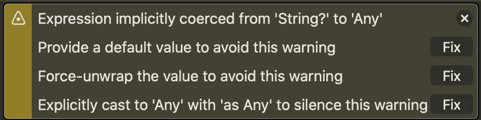
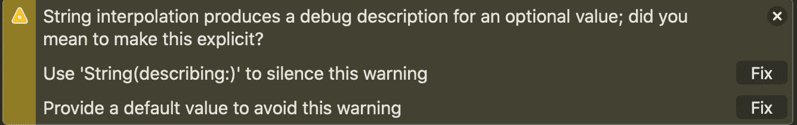

# Swift 中的选项

> 原文：<https://levelup.gitconnected.com/optionals-in-swift-3831f1ca5dfb>

如果你对 iOS 开发感兴趣或者喜欢开始使用 Swift 那么你需要知道你会遇到一些你之前可能不会遇到的符号，像**问号这样的标记？**或者**感叹号！**。

Optional 是 swift 为避免变量的零值而开发的一个伟大特性，你可以通过看到一个问号**来发现它？**这意味着这个变量是可选的或者通过查看**！标记**，这意味着你不再需要这个变量是可选的。

假设你有一些电影，但每一部都有自己的名字，你会在特定的时间观看。

```
class Movie {
    var movieName: String?
    var movieQuality: Int?
    var movieTime: String?
}
```

然后，您尝试打印您的电影名称以进行检查:

```
var optionalMovie = Movie()
print(optionalMovie.movieName)
```

> 输出:零

所以这里我们从字符串**中定义了一个名为 movieName 的变量，并通过使用**将其标识为可选变量。**标记，movieName 的默认值为 **nil** 这意味着该变量默认为空。这就是为什么我们在给它一个值之前试图打印名称时会面临一个警告，它将打印出 **nil。****



我们应该如何避免这些警告？有许多方法可以避免这种情况，让我们来找出它们:

```
if optionalMovie.movieName == nil {
    print("Sorry, the movie has no name")
}
else {
    print("optionalMovie name is \(optionalMovie.movieName)")
}
```

> **输出:**抱歉，电影没有名字

前面的代码显示了我们如何避免 nil 值，但是在 print 语句中还有另一个警告:



这个警告意味着我们需要为这个名称提供一个默认值，以避免将来出现任何错误，特别是当我们有任何变量依赖于这个名称的时候。

```
if optionalMovie.movieName == nil {
    print("Sorry, the movie has no name")
}
else {
    print("optionalMovie name is \(optionalMovie.movieName!)") //Sorry, the movie has no name
}
```

> **输出:**抱歉，电影没有名字

这里唯一不同的是我们加了**！**在**optional movie . movie name**结束时静音警告，还有这个**！标记**意味着我确信变量名有一个值，因为如果变量不等于零，你 100%确定变量有一个值。

```
guard optionalMovie.movieName != nil else {
            print("This movie has no name")
            return
        }
        print("movie name is \(optionalMovie.movieName!)") 
```

这里的 guard 语句用于检查我们的变量，如果变量有值，它将跳过 else 语句并遍历最后一个 print 语句行。

我们没有给它赋值，所以输出将是:

> 输出:这部电影没有名字

如果你不知道一部电影的名字，那么你看这部电影是没有意义的，这就是为什么我们将使用这个为变量设置一个值的解决方案:

```
optionalMovie.movieName = "The fault in our stars"
if optionalMovie.movieName == nil {
    print("Sorry, the movie has no name")
}
else {
    print("optional movie's name is \(optionalMovie.movieName!)") 
}
```

> **输出:**可选电影的名字是《我们的星星里的错》

这里我放了**！标记**因为我确信 movieName 已经有了一个值，因为我之前已经初始化了它。

最后一个解决方案是使用 **if let** 语句**【可选绑定】:**

```
if let movieName = optionalMovie.movieName {
    print("optional movie's name is \(movieName)")
}
else {
    print("Sorry, the movie has no name")
} 
```

> **输出:**可选电影的名字是《我们的星错》

我们已经把我们的变量放在一个常数中，并在我们的条件中使用这个常数。

我们不需要把任何**标记** **？**或者**！**因为我们已经把它转化成了另一个常数。

感谢 reading️！帮助传播消息&等待即将到来的文章…

对即将发布的博客文章有问题、建议、评论或想法吗？在 [LinkedIn](https://www.linkedin.com/in/ahmed-menaim-22cm/) 上联系我或者写评论！你也可以在 [GitHub](https://github.com/CryptoOo/) &上关注我，查看我的 [Stackoverflow](https://stackoverflow.com/users/14437411/menaim) 答案和问题。