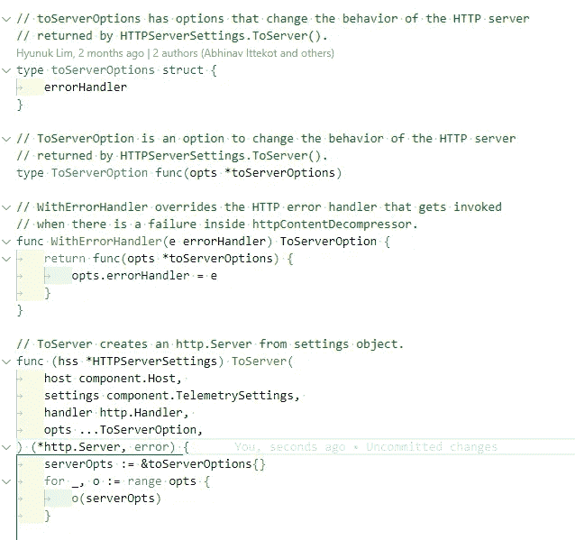

# Golang 的期权模式

> 原文：<https://levelup.gitconnected.com/options-pattern-in-golang-9a0384a9d8db>

在浏览其中一个[开源库](https://github.com/open-telemetry/opentelemetry-collector)时，我遇到了很多这样的代码。

重点介绍`ToServerOption`及其用途。我花了相当多的时间试图理解它，但无法理解为什么需要这样做。我理解我面前的所有代码，但无法将它们拼凑在一起。

直到我在其中一期上读到这句话。

突然，我灵机一动。我知道它指的是我一直看到的那段代码。它重新点燃了我的好奇心，因为我有了一个明确的方向，即“期权模式”，所以我开始对它进行更多的研究。

# 那么，什么是“期权模式”？

选项模式是一种函数式编程模式，用于为函数提供可选参数，这些参数可用于修改函数的行为。

如果您有 python 背景，您可能对此很熟悉。

如果不需要，客户端可以选择跳过这个`lastName`参数，或者在需要时使用它。

这种能力在 API 设计中非常有用

*   允许客户端使用最少的配置来使用您的 SDK，同时仍然为有经验的用户提供充足的配置选项。
*   允许您在不破坏向后兼容性的情况下添加新选项。

然而在 Golang，这是不可能的。该语言没有提供添加可选参数的方法。

这就是“选择模式”的由来。它允许您的客户端在调用您的 SDK 时传递附加选项，然后 SDK 可以相应地修改其行为。我们来看一个小例子。

假设我们有一个名为`Server`的结构，它有 3 个属性`port, timeout`和`maxConnections`

我们的工厂方法看起来会像这样。

但是我希望`timeout`和`maxConnections`是可选参数。在许多情况下，这些值的默认值就足够了。还有，我也不想用这些不必要的配置去轰炸刚刚学习或者试用我的 SDK 的新用户。让我们看看如何实现这一点。

首先，让我们定义一个名为`Option`的新`type`

`Option`是一个将指针指向我们的`Server`的函数。这很重要，因为我们将使用这些选项修改我们的服务器实例。

现在让我们定义我们的选项。事情会变得明朗。惯例是在我们的选项前面加上一个`With`前缀，但是您可以随意选择适合您的领域语言的名称

我们的两个选项`WithTimeout`和`WithMaxConnections`接受配置值并返回一个`Option`。`Option`只是一个函数，它将一个指针指向我们的服务器对象，并将所需的属性设置为所提供的值。例如，`WithTimeout`获取超时持续时间，然后返回一个函数(其签名与`Option`相同)，该函数将我们服务器的超时属性设置为所提供的值。

这里我们使用了一种被称为“[闭包](https://go.dev/tour/moretypes/25)的技术，几乎所有现代语言(包括 Golang)都支持这种技术。

我们的工厂方法`Server`现在需要修改以支持这种变化。

如果你愿意，你也可以添加`port`作为选项。

在这里，您可以看到我们的客户端现在可以创建一个只有端口的最小服务器，但如果需要，还可以自由地提供更多的配置选项。

你可以看看[这个](https://www.youtube.com/watch?v=5ZZwmMI897c)我为了更好的理解而参考的 YouTube 教程。

这种设计具有高度的可伸缩性和可维护性，甚至比我们在 python 中看到的可选参数更是如此。它允许我们添加更多的选项，而不会膨胀我们的函数签名，也不会触及工厂方法中的代码。

# 小切线

发生在我身上的这件事说明了名字的力量以及为什么需要名字。当我不知道这种模式的名称时，我努力理解这段代码在做什么，或者为什么需要它。每次看到这段代码，我的大脑都有一种解析它的开销。但我一知道它的名字，就本能地理解了这个代码。现在，当我在代码库中看到它时，我就知道它在做什么，它的目的是什么，并且代码更容易解析。

# 资源:

*   [开放式遥测/开放式遥测采集器:开放式遥测采集器(github.com)](https://github.com/open-telemetry/opentelemetry-collector)
*   [Go (Golang)功能选项模式— YouTube](https://www.youtube.com/watch?v=5ZZwmMI897c)
*   [Go 中的功能选项:在 Golang(sohamkamani.com)中实现选项模式](https://www.sohamkamani.com/golang/options-pattern/)