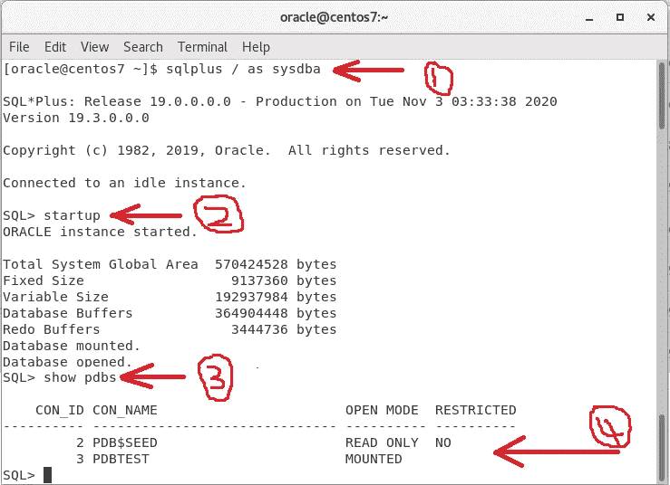

# Oracle 数据库 19.3c—多租户架构，打造 CDB 和 PDB

> 原文：<https://levelup.gitconnected.com/oracle-database-multitenant-architecture-create-cdb-and-pdb-4a9bb954803b>

在前面的故事中，我们介绍了如何在 CentOS 7([**https://kalanaejayasuriya . medium . com/install-Oracle-database-19-3c-on-CentOS-7-52036876436**](https://kalanaejayasuriya.medium.com/install-oracle-database-19-3c-on-centos-7-52036876436))上安装 oracle 19.3c。在这一部分中，我们将介绍 CDB 和 PDB 的安装。在开始安装之前，让我们来谈谈什么是 CDB 和 PDB。

# **多租户架构**

*   继 Oracle 12c 之后，Oracle 推出了名为“多租户架构”的新架构
*   在以前版本的 Oracle 数据库中，主要问题是，如果用户启动一个新实例，每个实例都有特定的后台进程。这个过程是一种内存浪费，严重影响系统性能。
*   因此，Oracle 提出了将不同的数据库连接成一种数据库技术的新思路。这个想法被称为“多租户架构”
*   其中一个主数据库称为“CDB”(容器数据库)，用于连接主数据库的其他数据库称为“PDB”(可插拔数据库)

(多租户架构示例)

# **多租户架构的主要组件**

1.  **CDB** —集装箱数据库

*   这是母容器(主容器)。
*   “控制文件”和“重做日志文件”是 CDB 的主要文件。

**2。CDB$Root** —根容器

*   每个 CDB 都有一个根容器(CDB＄Root)。
*   所有可插拔数据库(pdb)都由根容器控制和管理。
*   所有 pdb 都属于根容器。
*   根容器不存储用户数据。

**3。PDB** —可插拔数据库

*   可以将一个或多个 pdb 连接到容器数据库。
*   这是一个单独的数据库，由用户创建或为用户创建以存储特定数据。
*   我们可以将数据存储在支持特定应用的 pdb 中。

**4。PDB $种子** —种子容器

*   这是系统提供的模板
*   此模板可用于创建新的 pdb。
*   我们不能在种子容器(PDB＄Seed)中添加或修改对象。

# **多租户架构的优势**

*   可以一次合并多个数据库
*   补丁和升级可以很容易地应用到 CDB
*   pdb 可以从一个 CDB 上拔下，并可以连接到另一个 CDB 上。
*   可以同时管理多个数据库。

# **用 PDB 创建 CDB—安装指南**

第一步-: 1。第一步，您必须运行位于 **Home/database/bin** 中的“dbca”向导。

**步骤 2 -:** 但是您不能直接运行向导。因此，你必须使用终端。和我一样做。打开终端并键入以下内容

**步骤 3 -:** 然后向导将在几秒钟内打开，看起来像这样。这是我们第一次。因此，选择**“创建数据库”**

**步骤 4 -:** 选择高级配置，仅手动设置 CDB 和 PDB。

第五步-: 下一步非常重要。在这里，我们必须设置 CDB 和 PDB 的名字。在我的例子中，我将我的名字(kalana)设置为 CDB 名，将“PDBTEST”设置为可插入的数据库名。

然后跟着我的步骤走，直到我们找到听众部分。

**步骤 7 -:** 通常，每个人总是在安装期间创建，但是让我们尝试通过设置不同的端口号来手动配置监听器。因此，取消选中**“创建新的监听器”**

**步骤 8 -:** 再次跟随我的步骤，直到我们遇到设置数据库凭证

**第 8 步-:** 设置密码时，选择“对所有帐户使用相同的管理密码”并输入您记得的任何密码。

**第 9 步-:** 然后和我一样，完成安装。

现在，您可以启动您的实例并检查新创建的 PDB 是否连接到系统。为此，打开终端并运行“ **sqlplus / as sysdba”。**之后，sqlplus 将打开并键入**“startup”**来启动实例。然后输入**“显示 pdb”**查看已经创建的 pdb 列表。

要关闭实例，请键入**“shut down immediate”**并输入。要退出 sqlplus，请键入**“exit”**或**“exit()”**退出 sqlplus。

在本教程中，我们没有创建监听器。在下一个教程中，我将教你如何创建自定义监听器并注册 PDB。谢谢大家！

1.  *第 3 部分* — **Oracle 数据库—创建自定义监听器并将其注册到 Oracle 数据库 19.3c 中的 PDB-:**[https://kalanaejayasuriya . medium . com/Create-custom-Listener-and-register-it-to-a-PD b-f6c 709d 23054](https://kalanaejayasuriya.medium.com/create-custom-listener-and-register-it-to-a-pdb-f6c709d23054)