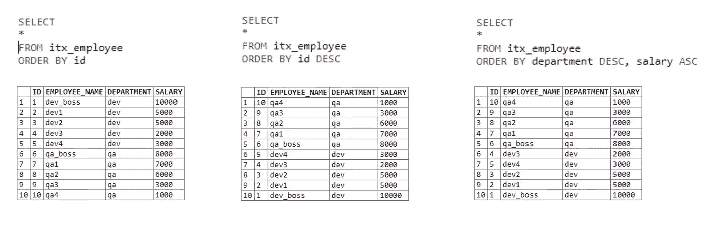
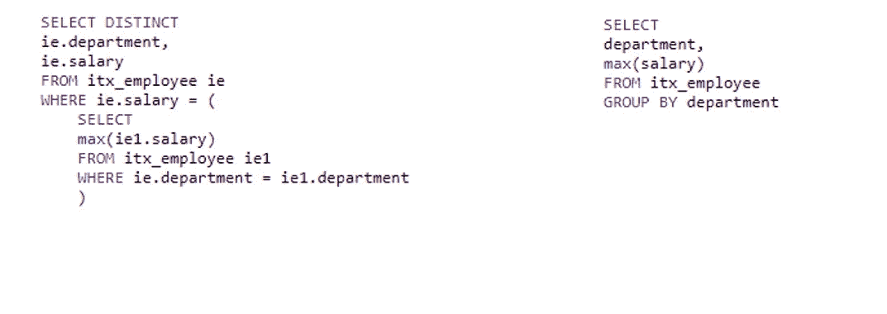
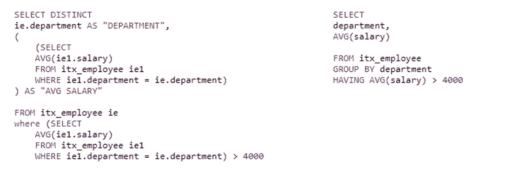
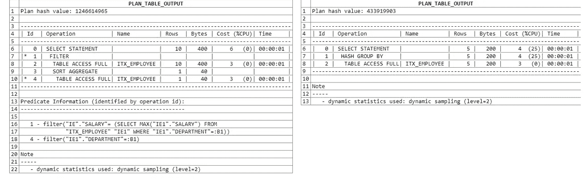
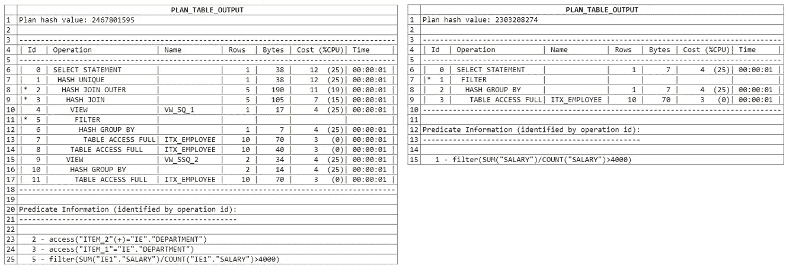
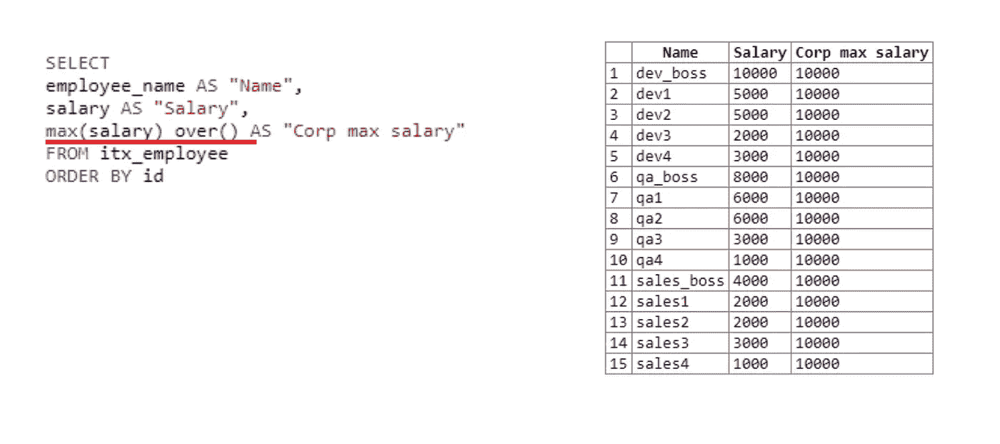
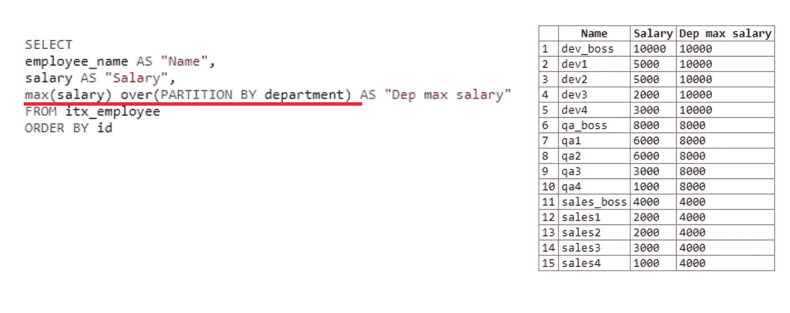

# Oracle: Order by/Group by/Having 子句和窗口函数

> 原文：<https://levelup.gitconnected.com/oracle-order-by-group-by-having-clauses-and-window-functions-d15194dc885b>


首先，值得一提的是，Oracle 在这里是作为一种集合 SQL 语言出现的。聚合函数及其应用方式适合整个 SQL 家族，适用于考虑到每种语言语法的所有查询。

我将分两部分简要快速地解释所有的细节。这篇文章很可能对初学者有用。

# 第 1 部分
排序依据、分组依据、拥有

## 以...排序

ORDER BY 子句允许对输出值进行排序，即按特定列对检索到的值进行排序。排序也可以由子句定义的列别名来应用。

ORDER BY 的优点是它可以应用于数值列和字符串列。字符串列通常按字母顺序排序。

默认情况下，应用升序(ASC)排序。对于降序排序，使用了一个附加的 DESC 子句。

语法:

```
SELECT column1, column2,... (indicates the name
FROM table_name
ORDER BY column1, column2... ASC | DESC;
```

让我们考虑一下例子:



在第一个表中，我们获取所有数据，并按照 ID 列对其进行升序排序。

在第二个示例中，我们还使用 DESC 将所有数据按 ID 列降序排序。

第三个表使用几个字段进行排序。首先，我们按部门排序。如果第一个语句对于具有相同部门的字段是相等的，则应用第二个排序条件；在我们的情况下，是工资。

这很简单。我们可以指定多个排序条件，这使得我们可以更有效地对输出列表进行排序。

## 分组依据

在 SQL 中，GROUP BY 子句收集从数据库中特定组检索的数据。分组将所有数据划分到逻辑集合中，以便可以在每个组中单独执行统计计算。

此子句用于按一列或多列组合选择结果。分组后，列中使用的每个值只有一个条目。

GROUP BY 的使用与聚合函数和 HAVING 语句的使用密切相关。SQL 中的聚合函数是对一组列值返回单个值的函数。例如:**计数()，最小值()，最大值()，AVG()，总和()。**

语法:

```
SELECT column_name(s)
FROM table_name
WHERE condition
GROUP BY column_name(s)
ORDER BY column_name(s);
```

GROUP BY 出现在选择查询中的条件 WHERE 子句之后。或者，您可以使用 ORDER BY 对输出值进行排序。

根据上例中的表格，我们需要找到每个部门的最高工资。最终的数据选择应该包括部门名称和最高工资。



在第一个示例中，我们不分组而是使用子查询来解决任务，即将一个查询嵌套到另一个查询中。在第二个解决方案中，我们使用分组。

第二个例子更短，可读性更好，尽管它执行的功能与第一个例子相同。

GROUP BY 在这里是如何工作的:它首先将两个部门分成 QA 和 dev 组，然后寻找每个部门的最高工资。

## 拥有

HAVING 是一个过滤工具。它表示聚合函数性能的结果。HAVING 子句用于不能使用 WHERE 关键字的情况，例如聚合函数。

虽然 WHERE 子句为行筛选定义了谓词，但是 HAVING 子句在分组后使用，以建立一个逻辑谓词，根据聚合函数值筛选组。该语句对于检查通过聚合函数从多组返回行中获得的值是必需的。

语法:

```
SELECT column_name(s)
FROM table_name
WHERE condition
GROUP BY column_name(s)
HAVING condition
```

首先，我们定义平均工资高于 4000 的部门，然后使用过滤定义最高工资。



第一个示例使用了两个子查询:第一个用于查找最高工资，第二个用于筛选平均工资。第二个例子更简单、更简洁。

## 查询计划

通常情况下，查询会运行很长时间，消耗大量内存资源和磁盘。为了理解为什么查询运行时间长且效率低，我们可以检查查询计划。

查询计划是查询的预期执行计划，即 DMS 将如何执行它。DMS 描述了将在子查询中执行的所有操作。分析完一切之后，我们将能够理解查询中的弱点，并使用查询计划来优化它们。

在 Oracle 中执行任何 SQL 语句都会检索所谓的执行计划。该查询执行计划描述了 Oracle 将如何根据正在执行的 SQL 语句获取数据。计划是一棵树，包含一系列的步骤以及它们之间的关系。

允许我们获得查询的估计执行计划的工具包括 **Toad、SQL Navigator、PL / SQL Developer** 等。这些工具提供了许多查询资源密集度的指标，其中主要的有:成本——执行的**成本**和**基数**(或**行**)。

这些指标的值越高，查询效率越低。

下面是查询计划分析。第一种解决方案使用子查询；第二种使用分组。请注意，在第一种情况下，处理了 22 行，在第二种情况下，处理了 15 行。



另一个查询计划分析使用两个子查询:



这是一个无效使用 SQL 工具的例子，我们不建议在查询中使用它。

上述所有特性将使您在编写查询时更加轻松，并提高代码的质量和可读性。

# 第二部分
窗口功能

Microsoft SQL Server 2005 中出现了窗口函数。它们对 SELECT 子句中给定范围的行执行计算。简而言之，“窗口”是一组进行计算的行。“窗口”允许我们减少数据并更好地处理它。这种特性允许我们将整个数据集分割成多个窗口。

窗口函数有一个巨大的优势。不需要为计算形成一个数据集，这允许我们用它们唯一的 ID 保存所有的数据集行。窗口函数操作的结果被添加到另一个字段的结果选择中。

语法:

```
SELECT column_name(s) Aggregate function (column for calculation) OVER ([PARTITION BY column to the group] FROM table_name [ORDER BY column to sort] [ROWS or RANGE to delimit rows within a group])
```

OVER PARTITION BY 是定义窗口大小的属性。您可以在这里指定附加信息；例如，行号。

让我们考虑下面的例子:另一个部门被添加到我们的表中，现在那里有 15 行。我们将尝试导出员工、他们的工资以及组织的最高工资。



在第一个字段中，我们取名字，在第二个字段中—取薪水。接下来，我们使用 **over ()** 窗口函数来获得整个组织的最大工资，因为没有指明窗口大小。 **Over ()** 带空括号适用于整个选择。所以工资最高一万。窗口函数的结果被添加到每一行。

如果我们从查询的第四行中删除对窗口函数的提及，也就是说，只剩下 **max (salary)** ，该查询将不起作用。最高工资根本无法计算。由于数据将被逐行处理，并且在调用 **max (salary)** 时，当前行将只有一个值，即当前雇员的值。这就是窗口函数的优势所在。在调用时，它处理整个窗口和所有可用的数据。

让我们考虑另一个例子，我们需要得到每个部门的最高工资:



这里我们设置窗口的框架(窗口函数操作的一组行)，将它分成几个部门。我们有三个部门:开发部、质量部和销售部。

该窗口查找每个部门的最高薪金。作为选择的结果，我们看到它首先找到了开发人员的最高工资，然后是 QA，然后是销售。如上所述，窗口函数的结果被写入每一行的获取结果中。

这就是分区的工作原理。

# 结论

SQL 并不像乍看起来那么简单。上面描述的都是窗口函数的基本功能。在他们的帮助下，你可以“简化”你的查询。但是其中隐藏着更多的潜力:有一些实用子句(例如，行或范围)可以组合起来为查询添加更多的功能。

我希望这篇文章对每个对这个话题感兴趣的人都有用。

*原载于 2020 年 8 月 31 日 https://intexsoft.com**的* [*。*](https://intexsoft.com/)