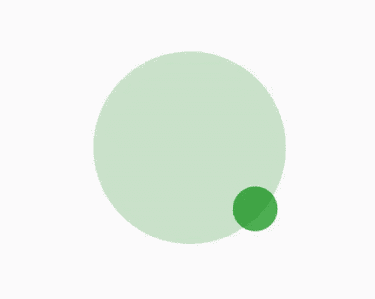

# 带颤动的动态观察动画

> 原文：<https://levelup.gitconnected.com/orbit-animation-with-flutter-5f59ef136f13>

轨道动画

在这篇文章中，我们将学习如何重新创建这个动画。这是一个基本的动画，主要利用了这两个部件，**堆栈**和**旋转过渡。**

在我继续之前，我假设您熟悉 flutter 的基础知识，并且对 Flutter UI 布局的工作原理有很好的了解。但是，让我们看看这些小部件是什么，以及如何使用它们。

**Stack** :这个小部件相对于其盒子的边缘定位其子部件。如果你想以一种简单的方式重叠几个孩子，Stack 类是很有用的，例如有一些文本和一个图像，用一个渐变和一个按钮覆盖在底部。可以在这里 ***了解更多**栈** widget [***。***](https://api.flutter.dev/flutter/widgets/Stack-class.html)***

**RotationTransition:** 这个小部件将它的‘子’小部件的旋转动画化。

使用小部件和一些代码，我们创建了上面的动画

这两个小部件的组合可以用来创建更令人印象深刻的动画设计，这篇文章只是让我们了解如何以最原始的形式使用它。

好吧！！！这就把我们带到了文章的结尾，如果这对你有帮助的话，请点击鼓掌按钮。下次再见👍