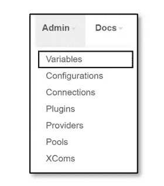
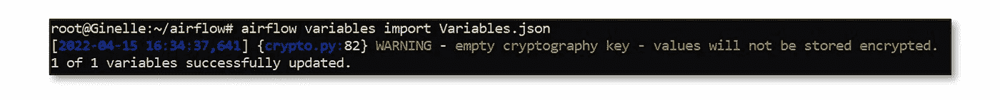
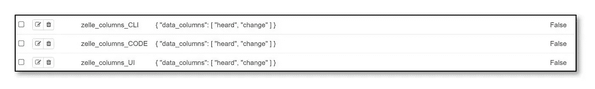
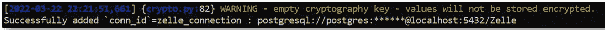
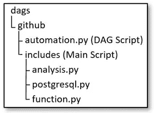
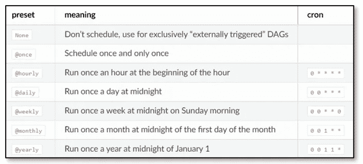
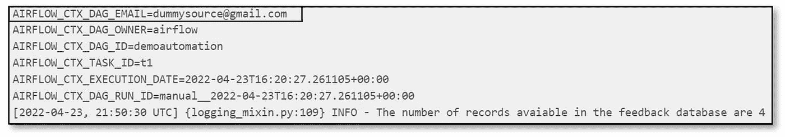

# 用 Apache Airflow 编排数据管道！

> 原文：<https://levelup.gitconnected.com/orchestrate-data-pipelines-with-apache-airflow-7dae6338fe90>

## 需要每天执行数据管道？阿帕奇气流就是你需要的。

## 只需几个基本和必要的步骤，即可创建生产就绪的项目。


来源:阿帕奇气流官方网站

每个组织每天都执行一组活动。那么，为了执行这些活动，每天运行相同的脚本或整个过程不会令人沮丧吗？我们将这个过程自动化或者将这样的任务分配给一台机器怎么样？这肯定会节省我们很多精力和时间，对吗？感谢现代世界，我们有了气流！

Apache Airflow 是一个开源工具，用于创建、调度和监控称为**工作流**的流程和任务。换句话说，Apache Airflow 是一个编排数据管道生命周期的工具。它有一个丰富的用户界面，可以轻松地可视化工作流、监控进度，并在需要时解决问题。我们可以将这些工作流的数据与多个数据源连接起来，并在任务完成或失败时通过电子邮件发送警报。

Airflow 利用**有向无环图(Dag)**来管理工作流的编排。DAG 由任务和任务依赖关系组成。它们涉及任务的执行、运行它们的顺序，以及超时时执行任务的重试。DAG 可以在特定时间触发，也可以基于外部触发器触发。气流概念非常广泛。因此，我们将涉及某些领域，如

*   存储变量和连接
*   使用多个脚本
*   DAG 调度程序
*   生成电子邮件

> 在我们开始之前，请随意访问我的 GitHub 库，找到下面这篇文章的源代码— [气流](https://github.com/ginelledsouza/Airflow)！

# **存储变量和连接**

几个模块组合在一起完成一项特定的任务。每个模块都需要配置文件来连接数据库和云服务。一些模块可能还需要静态变量来设计和处理它们的活动。那么这可能吗？当然！我们现在将研究如何将安全连接凭证和静态变量存储到 airflow 服务器中。

## **变量**

Airflow 允许用户存储和检索多种类型的变量，如整数、字符串、列表、字典等。Airflow 将变量存储为一个简单的键值对。可以直接从用户界面列出、创建、更新和删除变量。然而，这种方法有一个问题。我们丢失了每个新的 airflow 服务器实例的存储变量。但是，我们不必担心，因为有几种方法可以创建、更新和删除变量。我们将寻找其他方法来永久保留我们的变量。

**1。气流网络服务器用户界面**

*   从气流用户界面选择`Admin → Variables` 。



管理→变量

*   点击`Choose File`，从你的电脑中找到你的变量 JSON。


导入的变量“zelle_columns_UI”

*   点击`Import Variables`。现在，变量存储成功。

**2。命令行界面**

如果您正在使用基于 Linux 的机器或者已经在 windows 机器中安装了相同的机器，那么可以使用命令行界面来创建变量。通过命令行界面，我们可以使用以下语法将变量导入到 airflow web 服务器。

```
airflow variables import <filepath>
```



Ubuntu CLI —变量

其中，Variables.json 是

```
{"zelle_columns_CLI" : {"data_columns": ["heard","change"]}}
```

**3。Python 代码**

气流模型库提供了两种方法— `Variable.set()`和`Variable.get()`。顾名思义，`Variable.set()`是用来在气流上创建变量的。而`Variable.get()`检索变量的值。使用气流模型模块中的`Variable.set()`方法，我们导入所需的变量。按照语法，我们可以导入变量

```
Variable.set(KEY,VALUE)
```

例子

```
from airflow.models import Variableimport jsonf = open('Variables.json')data = json.load(f)Variable.set('zelle_columns_CODE',data)
```

变量导入成功



变量

## 连接

我们可以将值作为变量存储在 airflow 服务器中。但是，我们绝不能选择将敏感信息存储为变量。气流提供了我们可以用来存储和维护敏感信息的连接。连接值可以导入到 airflow web 服务器，如下所示。

```
airflow connections add 'my_prod_db' **\**
    --conn-type 'my-conn-type' **\**
    --conn-login 'login' **\**
    --conn-password 'password' **\**
    --conn-host 'host' **\**
    --conn-port 'port' **\**
    --conn-schema 'schema'
```

例子

```
airflow connections add zelle_connection --conn-type postgresql
    --conn-login postgres --conn-password <password>
    --conn-host localhost --conn-port 5432 --conn-schema zelle
```



Ubuntu CLI —连接

# 使用多个脚本

DAG 脚本从单个或多个文件导入并执行任务。为此，我们从另一个脚本中导入一个函数，并根据它们的优先级将它们排列成任务。当我们使用另一个文件中的函数/方法时，我们必须定义该函数的完整路径。我的文件结构如下。



项目文件结构

analysis.py 脚本由三种方法组成— record_analysis、table_analysis 和 extract_database。我们现在将通过下面的代码行从 analysis.py 访问 record_analysis。

```
from github.includes.analysis import record_analysis
```

一旦我们导入了函数/方法，我们就把它分配给一个任务。

```
with dag:t1 = PythonOperator(task_id='t1',python_callable=record_analysis)
```

# **DAG 调度器**

DAG 接受参数 schedule_interval，该参数接收 CRON 表达式或字符串作为输入。此参数负责在指定时间执行 DAG 中的任务。schedule_interval 接受一个字符串或 CRON 表达式作为输入。

## 串表达式

Airflow 提供了现成的调度表达式。我们可以使用以下任何字符串来计划我们的 DAG。



[DAG 运行](https://airflow.apache.org/docs/apache-airflow/1.10.1/scheduler.html#dag-runs)

**示例**

```
dag = DAG('demoautomation', schedule_interval='[@daily](http://twitter.com/daily)',   
           default_args=default_args, catchup=False)
```

## CRON 表达式

借助 CRON 表达式，我们可以根据需要设置触发时间。CRON 表达式是一个由五到六个字段组成的字符串，由空格分隔，表示一组时间。以下示例将在每天凌晨 4:00 运行 DAG。

**举例**

```
dag = DAG('demoautomation', schedule_interval='0 4 * * *',   
           default_args=default_args, catchup=False)
```

# 生成电子邮件

气流数据管道负责执行几个过程。我们很有可能会遇到复杂情况或错误。对于这种情况，建议启用 SMTP 服务。当任务使用 Airflows SMTP 服务完成或失败时，用户可以通过电子邮件发送警报。因此，让我们将此分为两步:

**1。在** `airflow.cfg`【使用 Gmail 代理】中设置 SMTP 连接

开始之前，我们需要生成一个 16 位密码。我们将使用 Google 帐户设置中的应用程序密码页面创建一个密码。在这里，有必要通知我们的谷歌帐户，一个外部设备将需要访问和使用我们的邮件。谷歌账户将提供一个在 airflow.cfg 内使用的 16 位密码。

*   登录您的 Gmail 帐户并访问→ [应用程序密码](https://security.google.com/settings/security/apppasswords)
*   在底部，点击**选择应用**并选择**邮件**。
*   点击**选择设备**并选择您的设备。
*   选择**生成**。
*   复制并保存 16 位密码。
*   选择**完成**。

我们现在可以设置`airflow.cfg`

```
#airflow.cfg[smtp]
smtp_host = smtp.gmail.com
smtp_starttls = True
smtp_ssl = False
smtp_user = <youremailaddress>
smtp_password = <16digitgeneratedpassword>
smtp_port = 587
smtp_mail_from = <youremailaddress>
```

**例子**

```
#airflow.cfg[smtp]
smtp_host = smtp.gmail.com
smtp_starttls = True
smtp_ssl = False
smtp_user = [dummysource@gmail.com](mailto:dummysource@gmail.com)
smtp_password = jfhdyetagsbfhtuf
smtp_port = 587
smtp_mail_from = [dummysource@gmail.com](mailto:dummysource@gmail.com)
```

**2。在 DAG 脚本中设置电子邮件触发器**

一旦我们在`airflow.cfg`中生成并配置了 SMTP 服务，我们将使用`email`和`email_on_failure`参数。这里，参数 email 可以是单个电子邮件地址，也可以是由逗号或分号分隔的一系列电子邮件地址。email_on_failure 指示当任务失败时是否应该发送电子邮件警报

**例子**

```
default_args = {'owner': 'airflow', 'start_date': datetime(2021, 1, 1),'email': ['[dummysource@gmail.com](mailto:dummysource@gmail.com)'],'email_on_failure': True}
```



气流日志

万岁！我们终于完成了这篇激动人心的文章。

感谢您的阅读！:)