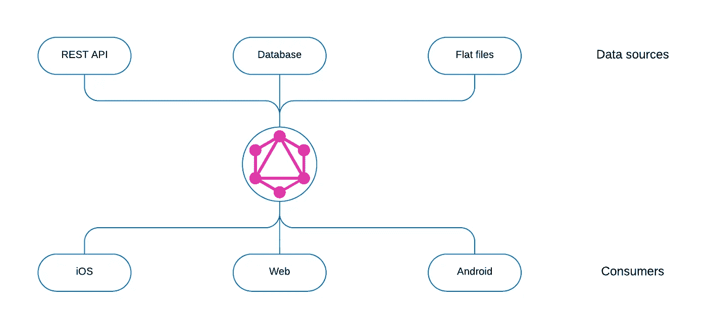
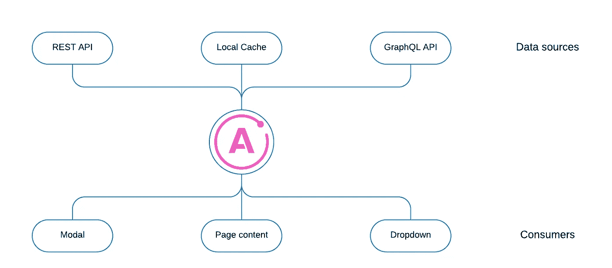

# 用 Apollo 编排 Web 工人

> 原文：<https://levelup.gitconnected.com/orchestrating-web-workers-with-apollo-ee206e65d098>

# 介绍

一些人认为我们应该总是使用网络工作者，而另一些人认为 T2 我们应该只在特定的情况下使用他们。总的来说，人们一致认为网络工作者对于处理大量数据是有价值的。

不久前，我在用 Apollo GraphQL 后端开发 React.js 项目，该项目有一个很好的 web workers 用例，我想出了一个实验来尝试:如果我们用 Apollo 编排 web workers 会怎么样？

# 使用 Apollo 的本地解析器🚀

GraphQL 使用解析函数来获取客户机请求的数据。这些解析器可以从多个来源提取数据:

消费者只有一个真实的来源，并不关心原始数据来自哪里。

Apollo 客户端在本地使用 GraphQL 来执行查询，也可以使用本地解析器来与数据交互:

# 阿波罗的网络工作者

Web workers 使用起来有点棘手，对于习惯了传统单线程思维方式的许多 JavaScript 开发人员来说并不太直观。 [Comlink](https://github.com/GoogleChromeLabs/comlink) 是一个库，它包装了一个函数，在一个 web worker 中运行它，并返回一个带有结果的承诺。这是我安排网络工作者最简单的方法。

因为 Apollo 解析器可以返回承诺，所以我们可以使用 comlink 包装的函数来解析数据，并使用 GraphQL 查询获得结果:

演示如何使用 Apollo 客户端和 comlink 编排 web 工作人员

虽然上面的例子非常简单地展示了这个概念，但它也可以应用于需要很长时间来处理和返回数据列表供用户查看的计算。

comlink 相对于普通 web workers 的一个缺点是不再能够用进度条向用户显示一段时间内的进度，也不能在计算时显示数据。使用 Apollo 编排 web workers 允许我们构建一种方法来计算数据块，类似于应用程序可能使用分页来获取数据块。

# Apollo 编排的 web 工人的好处

使用 Apollo 来编排 web workers 将提供一种与所有数据交互的一致方式。不需要组件使用任何额外的钩子或代码来使用 web workers。从 web worker 获取结果与从远程 API 获取结果是一样的。

来自 web workers 的任何结果都将利用 Apollo 的缓存，无需任何额外的设置。如果将来需要运行相同的计算，缓存的结果将立即返回。

这种一致的数据交互方式有助于维护。React.js 现在的趋势很高和[阿波罗](https://2019.stateofjs.com/data-layer/)也是如此；许多开发人员一起使用这一对。通过使用这些工具与 web 工作者进行交互，随着时间的推移，许多开发人员会发现很容易掌握和构建，甚至初级开发人员也是如此。

# 最终结果

我最初的目标是尝试使用 Apollo 来编排 web workers，我发现设置的简单性和小巧性带来了很大的好处。

感谢您的阅读！希望这能启发你寻找与网络工作者[互动的其他方式，比如 Daishi Kato 的 hook](https://blog.axlight.com/posts/how-i-developed-react-hooks-for-web-workers/)，并找到 Apollo 本地解析器的其他用途。