# 用有向无环图组织 GPU 工作

> 原文：<https://levelup.gitconnected.com/organizing-gpu-work-with-directed-acyclic-graphs-f3fd5f2c2af3>

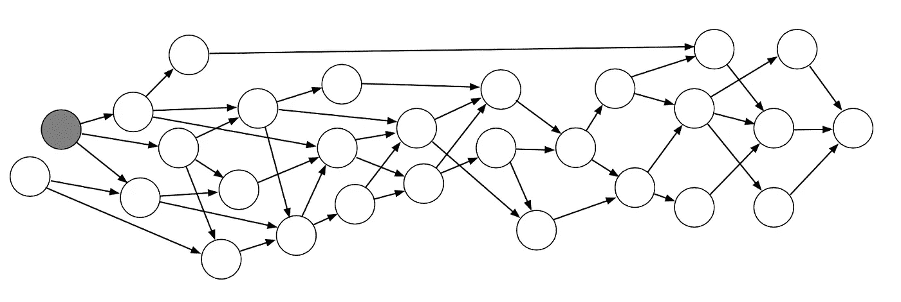

# 有什么好整理的？

> DirectX 11 和 OpenGL 风格的 API 要求驱动程序调用复杂的试探法来确定何时以及如何在 GPU 上执行关键的调度操作。接口的即时模式特性需要复杂的簿记和状态跟踪来处理每一种边缘情况，最终会对性能产生负面影响并阻碍并行性。
> 
> 现代图形 API，如 DirectX 12、Vulkan 和 Metal 2，已经脱离了这种模式，而是选择将低级 GPU 管理的负担转移到应用程序本身。

这给了我们一个机会来设计一个系统，该系统拥有对帧中的渲染工作的高级知识，并预先确定执行它的最佳方式。这包括优化 GPU 和内存状态，内存重用，队列同步。这种系统还可以用于验证框架工作流的正确性，剔除冗余作业，响应于用户动作重新优化自身。并且**图**是底层数据结构的自然候选。

在本文中，我们将涉及几个主题:构建图，用它来批处理工作和插入适当的同步点，安排资源障碍。

*以下算法的设计灵感来自 DirectX 12 API。代码示例和实现细节将在最后提供。*

# 构建图表

让我们从基础开始。我们想要组织工作，所以让我们定义一个工作单元，称之为**渲染过程。**工作如果不能使用它的结果是没有好处的，所以我们需要定义它的**输出**和**输入**，分别用读写的 GPU 资源来表示。这是构建图形所需的所有信息，图形的节点表示渲染过程。

最简单的节点示例

图形可以是简单的平面节点列表

一个类接口的例子，用于注册图的节点中的依赖关系

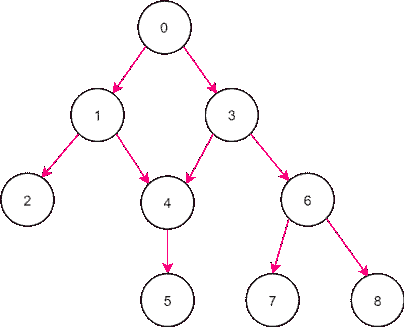

一组具有各种依赖关系的渲染过程，没有循环

既然我们已经建立了基本的定义，让我们采用一组无序但相关的渲染过程，并以确定的、不矛盾的方式对它们进行排序。

这些是使图形构建完全自动化所需的重要属性。

这就是无循环性的来源。它强加了一些我们在构建图表之前必须考虑的限制。

当算法无法判断哪个循环节点必须先出现，哪个必须最后出现时，任何循环依赖性都会带来模糊性。因此，首先，我们必须禁止循环依赖。

另一个警告是同一资源的多个写依赖关系。如果两个或多个渲染过程将相同的资源注册为它们的输出(写入)依赖关系，则该算法也将无法建立单个节点顺序，因为将有多个可能的解决方案。因此，第二，我们禁止对同一资源的多个写依赖，因此每个渲染过程必须注册它自己的新输出。虽然要求单一写依赖是有争议的，并且将在最后额外讨论，但是现在我们将接受它。

现在，考虑到这些限制，我们将通过基于修改版的**深度优先搜索**算法执行**拓扑排序**来对示例图进行排序。它可以在线性时间内对有向无环图进行排序。

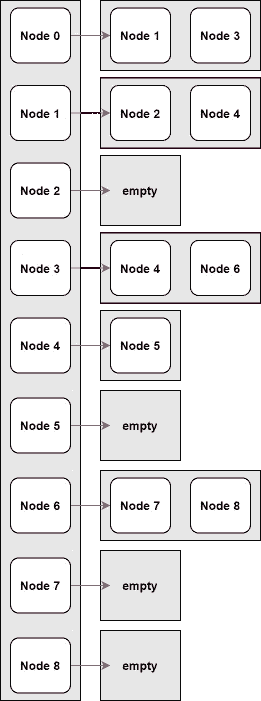

图的邻接表

该算法需要节点和边作为其输入。我们有渲染过程节点，但我们实际上还没有边，我们只知道每个渲染过程读取和写入了哪些资源。我们可以使用该信息构建一个名为**邻接表**的数据结构，它只是一个数组的数组，其中为图中的 N 个节点创建了 N 个数组，每个数组都包含对连接节点的引用。我们通过检查每个可能的节点对之间的写-读依赖性来做到这一点。

现在有了邻接表，我们可以对图进行排序。为此，我们需要两个布尔辅助数组，每个数组的大小为 N，其中 N 是图中节点的总数。一个用于标记“访问过的”节点，另一个用于标记“堆栈上的”节点，以检测循环依赖。

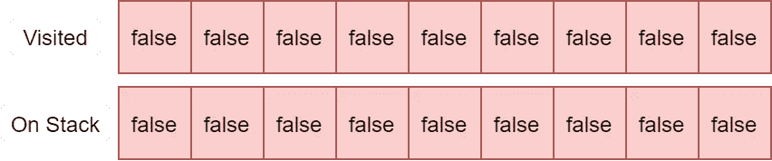

图形的辅助数组

我们遍历图中的每个节点，对于每个节点，我们通过后代开始递归搜索，将遇到的节点标记为“在堆栈上”和“已访问”。

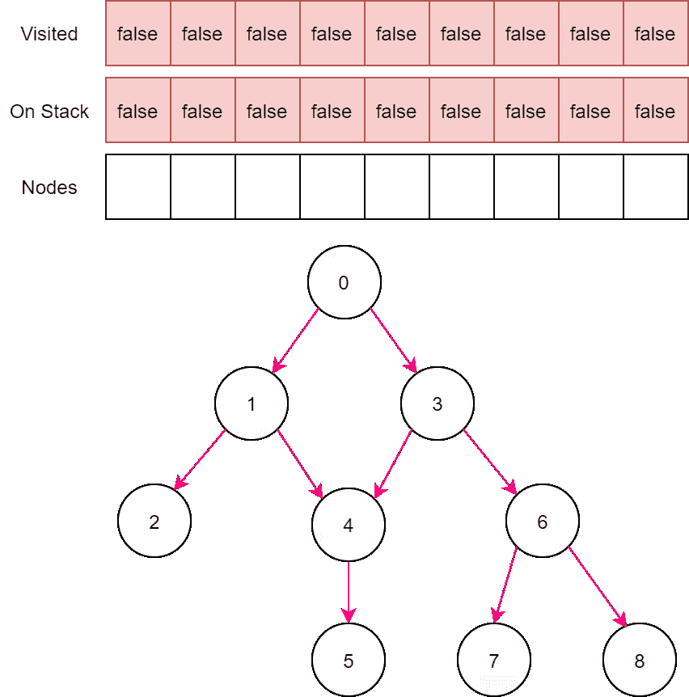

拓扑排序

当找不到更多的后代时，我们将节点添加到最终的数组中。当栈展开时，我们移除“栈上”标志，但保留“已访问”标志，这将帮助我们避免多次处理一个节点。如果在搜索过程中，我们遇到了一个已经被访问过并且也在堆栈中的节点，那么我们发现了一个循环依赖，必须中止。

在上面的例子中，我们从节点 0 开始，所以我们能够通过一次递归搜索对整个图进行排序，但在一般情况下，我们可能需要更多，这就是为什么应该对每个节点进行后代搜索。

最后一步，我们反转生成的数组。

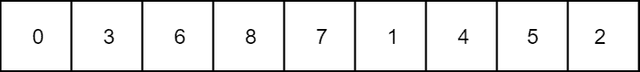

拓扑排序的节点

我们现在可以按照确定的顺序执行渲染过程，并且依赖关系将被考虑。

但是在我们继续之前还有一件事要考虑。让我们再看一下图表。

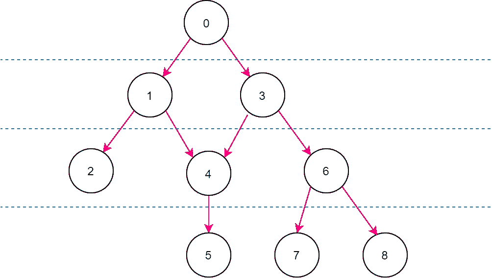

我们可以看到存在相互不依赖的节点组。让我们称这些组为**依赖级别**。单个依赖级别内的渲染过程可以以任意顺序执行，这对于并行工作执行和我们稍后将讨论的某些优化非常有用。

这里的一个重要关系是依赖级别中的通道共享相同的递归深度，或者更确切地说是从根节点开始的 DAG 中的*最大*递归深度，也称为**最长路径。我们可以使用**最长路径搜索**算法来找到每个节点的依赖程度。**

为此，我们定义了一个到每个大小为 N 的节点的距离数组，其中 N 是图中节点的数量，并用零初始化它。我们还需要图的拓扑排序，但我们已经有了。然后，我们按照拓扑顺序遍历节点，对于每个被处理的节点，我们使用当前节点的距离来更新其相邻节点的距离。为每个节点确定的距离将对应于它们的依赖性等级索引。然后，节点被分派到它们的依赖级别。

算法非常简单，只用四行伪代码就能解释清楚:

最长路径搜索

# 使用图表:同步

我们刚刚构建了一个工作图，但是该工作可以使用现代图形 API 公开的命令队列并行执行。这给我们带来了一个挑战，即找到适当的同步点，以尊重在不同队列上执行的渲染过程之间的依赖关系，同时最大限度地减少同步量，以批量处理更多工作，并最大限度地减少 Execute…()调用的数量，从而提高性能。

在这一节中，我们将开发一种算法，通过研究几种场景并试图找到一种适用于所有场景的通用解决方案来实现队列之间的最佳同步。

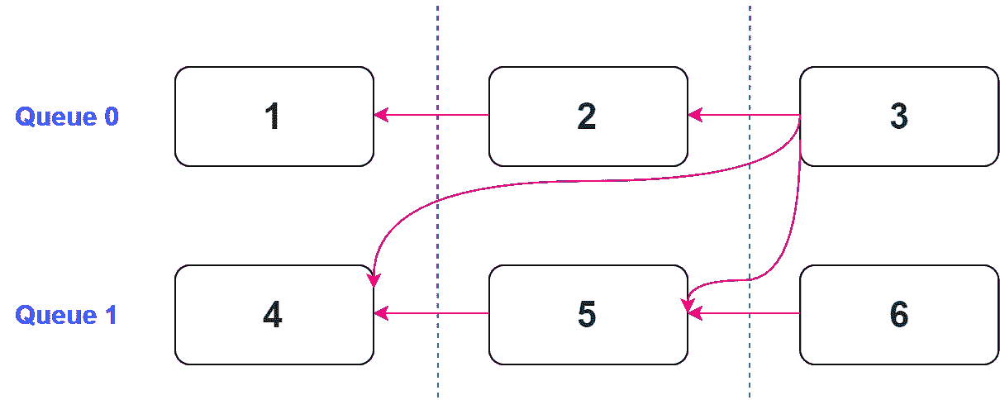

同步场景 1

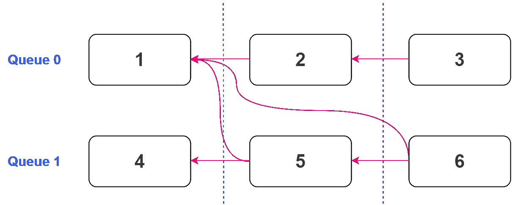

同步场景 2

我们先来看两个案例。我们有两个队列，每个队列有三个通道(我们将关注跨队列的工作依赖，因为否则事情就微不足道了)。每次传递都分配一个单调递增的索引(索引可以从每个队列的 0 开始，但这无关紧要，只有单调递增才重要)。

在第一种情况下，我们有一个 pass **(3)** ，它需要与另一个队列中的另外两个 pass**(4，5)** 同步。在第二种情况下，我们有两个通道 **(5，6)** 需要与一个公共通道 **(1)同步。**

仅通过查看图片，我们可以看出，在第一种情况下，同步 **(3)** 与 **(4)** 是多余的，因为该同步自动被 **(3)** 与 **(5)** 之间的同步所覆盖。那么这里的算法是什么呢？取 **(3)** ，遍历其他队列 **(4，5)** 上的依赖项，只取最接近的一个，具有最高的索引——**(5)**，丢弃其余的。

那么，这两种情况都足够好吗？实际上不是，第二张图片告诉我们不是。

如果我们只在第二种情况下寻找最近的依赖关系，我们会得到相同的结果: **(5)** 将与其最近的依赖关系 **(1)** 同步，**(6)**也是如此，因为其最近的依赖关系也是 **(1)** 。但是我们可以清楚的看到，因为 **(5)** 和 **(1)** 之间的同步，所以 **(6)** 和 **(1)** 同步是多余的。第二种情况的解决方案并不明显。

那我们现在怎么办？

我们首先引入**充分同步索引集** (SSIS)的概念，这是分配给图中每个节点的一组数字，该图包含节点需要与之同步的每个队列上最近节点的索引。

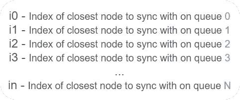

足够的同步索引集

现在，我们以前面的两个示例为例，将 SSIS 分配给每个节点。

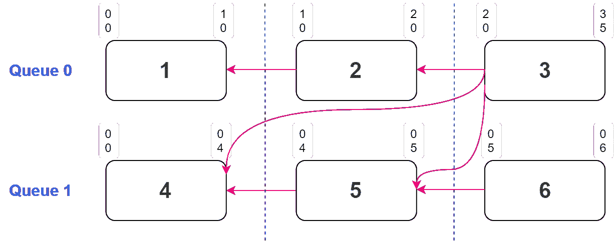

分配了 SSIS 值的同步场景 1

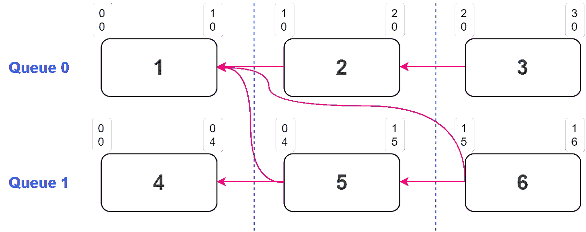

分配了 SSIS 值的同步场景 2

我们从 SSIS 中的全零开始，然后遍历每个节点，对于每个节点，遍历其在另一个队列上的依赖关系，并将最接近的依赖关系的索引存储到其 SSIS 中。节点对应的队列的 SSIS 值设置稍有不同(队列 0 上的节点为 SSIS[0]，队列 1 上的节点为 SSIS[1]，依此类推)。在这些情况下，我们分配的不是一个依赖项的索引(它是队列中的前一个节点)，而是节点本身的索引。同一队列上的当前节点和先前节点可能不依赖于资源读/写，但是为了使算法工作，我们需要添加先前节点作为当前节点的依赖。当然，前提是前一个节点存在。

遵循这些规则，在第一个示例中， **(3)** 的 SSIS 变为(3，5)，在第二个示例中， **(5)** 的 SSIS 变为(1，5)，而 **(6)** 的 SSIS 变为(1，6)。

现在我们已经为每个节点构建了 SSIS，我们可以寻找间接依赖来剔除冗余同步并解决我们在第二个示例中遇到的问题:节点 **(6)** 通过 **(5)** 与 **(1)** 间接同步，同步**(6)——>****(1)**是冗余的。

为了找到间接依赖性，我们引入了算法的第二遍。

再次遍历每个节点，并再次查看每个节点的依赖项。但是这一次将节点的 SSIS 中的值与依赖项的 SSIS 中的值进行比较。

通过将当前 SSIS 与依赖关系的 SSIS 进行比较，我们可以*确定如果我们仅与该依赖关系同步，我们将与之同步的队列的数量*。我们直接比较“其他”队列的值，并通过首先从当前节点的 SSIS 中减去 1 来比较“当前”队列的值，以说明我们上面讨论的对同一队列的依赖性的不同 SSIS 分配规则。

所以让我们取节点 **(6)** 和它的第一个依赖节点 **(1)** ，比较队列 0 的 SSIS 值。SSIS(节点 6)[0] < = SSIS(节点 1)[0] (1 < = 1)为**真**，所以我们知道与队列 0 的同步被与节点 **(1)** 的同步所覆盖。现在比较第二个队列的值。SSIS(节点 6)[1] < = SSIS(节点 1)[1]((6–1)<= 0)为**假**，这意味着我们将**而不是**通过专门与节点 **(1)** 同步来与队列 1 同步，因此我们必须考虑其他依赖性来实现所需的全套同步。现在取节点 **(6)** 的下一个依赖项，也就是节点 **(5)** 。通过比较 SSIS 值，我们看到与两个队列的同步被仅与 **(5)** 的同步所覆盖，因为 1 < = 1 和(6–1)<= 5 都是**真**。同步**(6)——>(1)**现在是多余的，可以剔除。

在具有 N 个队列的更一般的情况下，我们建立一个我们需要同步的队列列表和一个依赖节点列表，该列表具有它们在该队列列表中覆盖的同步数量。然后，我们挑选具有最大数量的覆盖同步的节点，并丢弃其余的。

这种概括足以最小化我们所研究的案例中的同步，但仍不足以涵盖所有场景。让我们检查另一种情况，这种算法不成立，并为它开发一个改进。

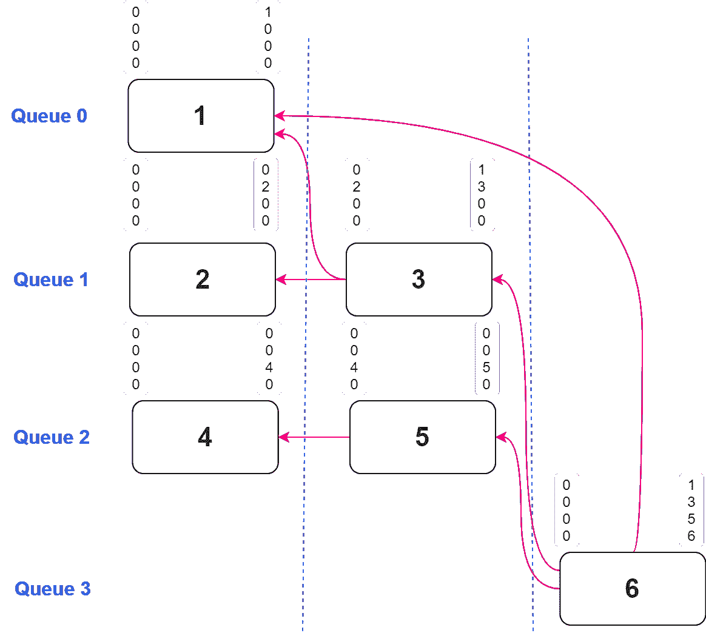

一个更复杂的同步场景，一遍搜索间接依赖是不够的

这里我们可以看到，节点 **(6)** 需要与节点 **(1)** 之后的队列 0 同步，但是与 **(1)** 的同步是多余的，因为可以通过与节点 **(3)** 的同步来实现。让我们尝试使用目前为止的算法来剔除多余的同步。

生成要与之同步的队列列表:0，1，2。通过比较 SSIS 值，找到将使我们与最大数量的所需队列同步的依赖节点。

可能的同步:

**6 - > 1** : 1 队列被覆盖，因为 1 < =1 **真**，3 < =0 **假**，5 < =0 **假**

**6 - > 3** : 2 个队列被覆盖，因为 1 < =1 **真**，3 < =3 **真**，5 < =0 **假**

**6 - > 5** : 1 队列被覆盖，因为 1 < =0 **假**，3 < =0 **假**，5 < =5 **真**

根据我们的算法，我们采用覆盖最大队列( **6 - > 3)** 的同步，并丢弃其余的，但是现在我们有一个问题，因为只执行与队列 0 和 1 的同步，而忽略了队列 2。

我们可以通过扩展算法来解决这个问题。

在搜索覆盖最大数量队列同步的相关性的第一遍之后，从我们需要与之同步的队列列表中移除覆盖的队列，并且从要在下一次迭代中考虑的相关性列表中移除这样的相关性节点(如果有)。还要用所覆盖队列的已接受依赖关系的 SSIS 值更新当前节点的 SSIS 值，因为依赖关系的 SSIS 值实际上可能大于当前节点的预期值(这是正常的)。现在检查我们是否还有任何队列需要同步。如果是这样，重复搜索上一次迭代留下的节点列表中的最佳匹配节点。重复该循环，直到列表中没有队列。现在，作为依赖项留下的节点是可以安全剔除的同步节点。

就这样，给定任意队列/节点组合，找到最佳同步点的算法的最后一部分。

*注意:将来自同一个队列的节点作为依赖项仅作为查找间接同步的工具有用，它们实际上不会通过 fences 转换为 API 同步，因为同一个队列上的工作是隐式同步的。*

让我们回顾一下。

> 通过遍历每个节点来执行第一遍，并通过查看每个队列上最近的依赖关系来确定它们的 SSIS。
> 
> 通过使用 SSIS 比较，确定要同步的相关队列列表，并迭代查找满足所有所需队列同步的最小节点同步集，来执行第二遍以剔除冗余同步。

# 使用图表:资源状态转换

我们已经完成了较简单的部分，并继续进行资源状态转换，这在我们已经拥有的基础上又增加了一层复杂性。让我们从简单的案例开始。最简单的是渲染过程的单个队列或多个独立队列。

单队列

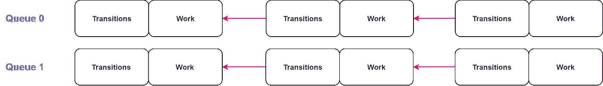

几个独立的队列

过渡很简单:渲染，过渡，重复。无聊。

当我们在一个队列上使用另一个队列上产生的资源进行渲染时，事情开始变得有趣起来。

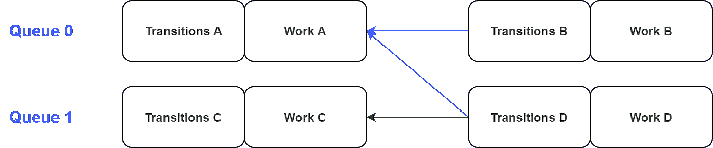

跨队列资源读取

我们必须处理两个限制。

首先，资源转换可能包含接收队列不支持的状态。例如，在图形队列上生成的 **RenderTarget** ，在计算队列上作为 **NonPixelShaderAccess** 使用。

其次，一个公共资源可以被多个队列读取，因此转换必须放在那些队列上执行的工作之外的某个地方，并且同步必须相应地调整。

我们还可以有两种情况的组合，当资源被多个队列读取，但是在一些或者甚至所有的接收队列上不支持转换到公共读取状态。

这里需要注意的一点是，即使队列不支持状态转换，它仍然可以在该状态下使用资源，只是转换必须在其他地方发生。例如，如果图形队列上产生的 **UnorderedAccess** 资源稍后在图形和计算队列上都被读取为图形上的 **PixelShaderAccess** 和计算上的 **NonPixelShaderAccess** ，我们必须将 **UnorderedAccess** 转换为适合两个队列的组合读取状态(**AnyShaderAccess**=**PixelShaderAccess**|**NonPixelShaderAccess)这种转换只能在图形队列中进行，因为计算机不知道任何有关像素着色器信息。但是，在 graphics 执行转换后，它会愉快地使用 **AnyShaderAccess** 状态，因为它只关心组合读取状态中存在的**非像素 ShaderAccess** ，其他状态，无论它知道还是不知道，都会被忽略。**

现在，让我们看几个我们刚刚讨论过的挑战的例子，并尝试提出一个(或多个)策略来克服它们。

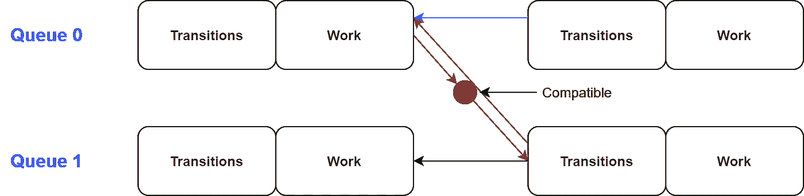

兼容的跨队列读取

在这里，一个队列读取另一个队列产生的资源，并且可以执行状态转换，因为所有状态都是兼容的。在这种情况下，由前面讨论的算法发现的通道之间的同步停留在相同的位置，并且在处理接收队列之前可以正常执行转换。

现在考虑相同的跨队列依赖性，但是具有不支持的状态转换。

队列 1 不能转换它读取的资源，所以我们必须找到一个可以转换的队列。让我们从图形 API 中抽象出一点，称之为**最胜任队列**。如果我们假设队列 0 是图形队列，队列 1 是计算队列，那么最有能力的是队列 0。现在同步和过渡策略必须偏离。我们必须**将**转换重新路由到最有能力的队列上的一个单独的命令列表中，并重新安排同步以从两端“插入”这个命令列表。

现在**转换**必须等待状态转换重新路由中涉及的队列，所以我们有额外的同步没有被同步优化算法考虑。我们还必须在**转换**之后插入一个 sync，并用它同步我们的队列。

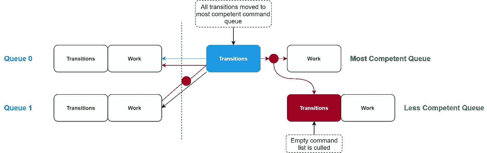

重新路由转换。同步被“插入”到一个公共转换命令列表中。

通过多个队列读取一个公共资源怎么样？事实证明，策略几乎是一样的:将转换移到最有能力的队列上的一个单独的命令列表中(即使最有能力的队列实际上并不读取这个资源),并将队列与这些转换同步。这样，我们可以一起处理多队列读取和不支持的转换。

现在让我们对着房间里的一头大象讲话。如果我们在不同的队列组中进行跨队列读取，会发生什么情况？

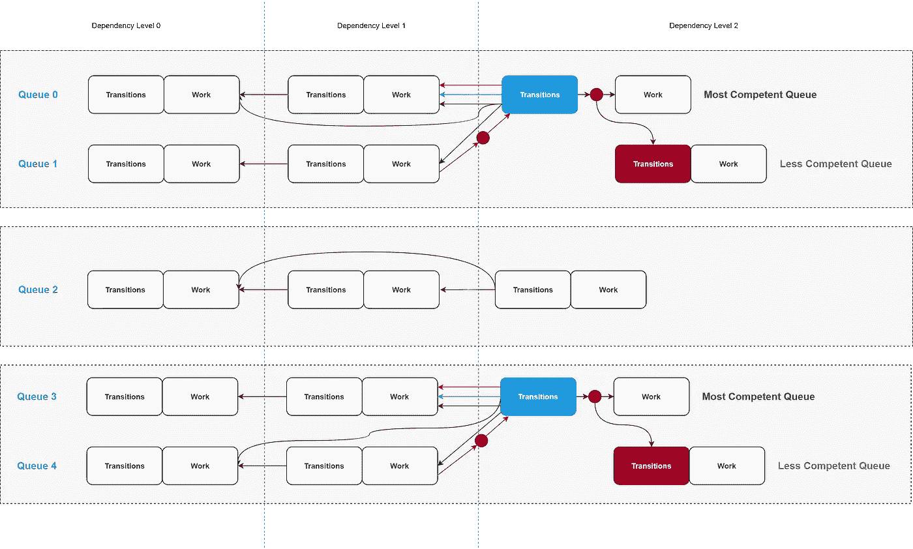

相互依赖的队列的单独集合

在具有 N 个队列和 M 个通道的一般情况下，我们可以对相互依赖的队列的单独集合具有更复杂的依赖性，并且必须在每个集合内确定最有能力的队列。我们现在必须问自己，我们真的需要通过引入这样的集合来使事情变得更加复杂吗？如果不止一个集合不包含足以执行所需转换的队列，会发生什么呢？答案是复杂的，整个事情可能很快变成同步地狱，所以我们需要确定一个合理可管理且性能良好的算法。但在我们这样做之前，让我们看看渲染过程的重新排序，以及将每个单独的过渡移动到一个公共命令列表中的必要性，而不是让其中一些靠近渲染过程工作。

依赖级别中渲染过程的任意顺序实际上并不是最佳的，因为 API 为我们提供了一种通过分割障碍尽早启动过渡的能力。确定这种最优性的度量是每个资源转换的开始和结束障碍之间的距离。让这些距离尽可能大，让 GPU 有更多的时间来隐藏过渡和相关的停顿，这将是一个很好的选择(性能方面)。那么，我们是否想出一种启发式方法来尽可能多地间隔渲染过程，并庆祝性能胜利？在真空中，是的，我们有。但是仔细观察一下，如果我们考虑它们带来的多队列资源读取和同步的情况，我们可以看到这种转换“间隔”和它带来的转换分离实际上对性能的损害大于它带来的好处。

让我们来看一个依赖级中多遍多队列读取的例子。

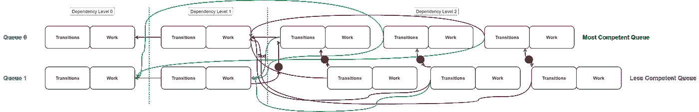

由于分离状态转换的要求，独立同步传递处于依赖级别

因为我们想要增加转换之间的时间距离，所以我们必须分别执行与每个通道相关的转换。这意味着我们不再有一个单独的**重新路由的**命令列表来执行所有转换，我们有多个这样的列表，并且队列 0 和 1 上的每对工作必须单独同步。这可能会扼杀并行性。

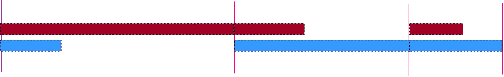

不良并行性

由于跨队列资源读取，当我们有多个同步点时，这就是依赖级工作的样子。我们每个队列上都有讨厌的货摊。

让我们看看，如果我们像前面提议的那样，将所有的转换转移到一个单独的**重新路由的**命令列表中，会发生什么。

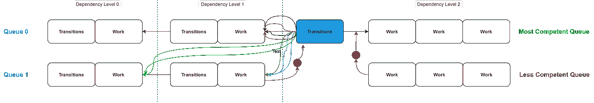

依赖级别中的常见转换和同步传递

在这个例子中，我们放弃了智能通道重新排序的想法，也不在公共的专用命令列表中执行转换。

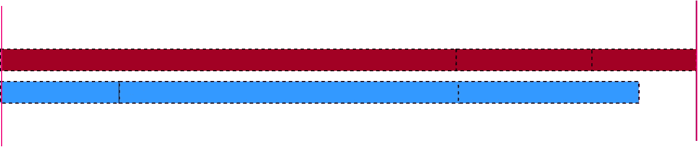

良好的并行性

现在，同步只在依赖级别开始，我们有一个很好的并行工作。

因此，当跨队列依赖发生在单个依赖级别时，将转换移动到单个命令列表中似乎是比其他方法更好的方法。但是，不涉及复杂关系的队列或者只包含一个队列上的工作的依赖级别又如何呢？对于那些看起来没有障碍的智能通行证重新排序和资源转换分离。这是真的，所以我们实际上应该把这两种情况分开，这就引出了管理转换的最终算法。

> 使用单个条件收集多队列资源读取中涉及的队列集:如果资源由依赖级别中的多个队列读取，则将这些队列添加到该集中。然后，另外，检测由于状态不兼容而将状态转移到的队列，并将这些队列添加到同一个集合中。现在取集合中最有能力的队列，**重新路由**所有转换和同步到该队列，如前所述。我们可能还有队列没有包含在如此复杂的关系中。我们分别处理它们，不进行同步和转换重新路由。

# 使用图表:特定于 API 的细微差别

既然算法的“大”部分已经过去了，让我们深入到更小但仍然重要的主题。

## 分裂壁垒

它们是很好的优化，但并不总是适用的。分割屏障实际上是前后状态相同的两个屏障，因此在调度帧时，我们需要检查接收和发送队列是否都支持这些状态的转换。如果是，那么我们使用分离屏障，如果不是，只在接收队列上使用正常屏障。

## 命令列表批处理

我们收集由栅栏等待和/或信号包围的命令列表数组。每个数组(批处理)都是一个单独的 ExecuteCommandLists 调用。

通过图的依赖级别，我们首先处理需要转换重新路由的队列传递。如前所述，我们将通用转换命令列表移到它自己的批处理中，并用等待和信号包围它。然后，我们通过将同一队列上的传递添加到同一批来批量处理该依赖级别中的传递，直到检测到栅栏信号要求。如果检测到信号，我们将创建一个新的批次，后续渲染过程将添加到该批次中。

然后我们批量传递那些**不**需要状态转换重路由的队列。在这里，我们通过在需要信号时创建新的批次来类似地向批次添加通行证，但是我们也在需要等待时创建新的批次，唯一的区别是需要等待的通行证将进入新的批次，而不是停留在旧的批次中。

## GPU 内存负载

还有一个 GPU 内存负载的问题。因为我们有一个限制，即在一帧中只能产生(写入)一次相同的资源，所以我们可能会创建比其他渲染器设计更多的资源。我们可以像 DX11 那样通过引入具有相同属性的资源池来解决这个问题，并使用一些名称别名机制，但现在实际上并不需要这样做。在较新的 API 中，通过**放置的资源**和重叠在不相交的时间段中使用的资源的存储区域的能力实现的存储器别名解决了这个问题。使用资源使用时间线寻找最佳重叠内存区域的算法是一个独立的主题，将在另一篇文章[中讨论。](https://medium.com/p/45933681a15e)

# 使用图表:拐角情况

关于循环依赖的一个注记。我们可能会遇到循环依赖似乎是必要的情况，例如从上一帧执行时间重新投影，并在写入重新投影之前读取纹理，然后将当前帧数据写入其中，然后出于不同目的在同一帧中再次读取。如果我们接受这样的场景，那么我们必须设计手动机制来解决循环依赖，这是最糟糕的选择。一个更好的方法是只设计渲染管道来避免循环依赖。上面的例子可以通过引入两个纹理而不是一个来解决，并且在帧之间来回切换它们，而不调度来自前一帧的纹理来写入当前帧。

例如，当在一次渲染过程中单独模糊图像时，我们可能需要读写资源访问。在图中，这看起来像一个节点，有一个循环。解决方案是在构建图形时将这种情况视为只写依赖，没有什么实际上阻止我们在同一渲染过程中写入和读取资源。

我们忽略的另一件事是多重写依赖。当渲染过程仅写入现有目标的一部分时，可能需要在多个过程中写入同一资源以减少内存带宽消耗。在这种情况下，当遇到多个写依赖时，我们可能不得不硬着头皮设计额外的机制来解决渲染传递顺序。举个简单的例子:**写一个**，**读一个**，**写一个**。阅读渲染 pass 应该放在哪里？第一次写后还是第二次写后？一种方法是查看“无序”渲染过程的初始列表，并将其用作提示。这当然意味着我们最初不能以随机的顺序将渲染过程放入图形中，我们添加它们的顺序必须类似于它们最终的执行顺序。其他解决方案可能是实现某种规则列表，当图形遇到歧义时会参考这些规则。

# 结论

我们经历了相当多的挑战，以实际利用现代图形 API 提供的低级框架控制，到目前为止，我们大概可以想象驱动程序以前是如何在没有框架工作负载高级知识的情况下，通过即时模式方法使一切保持一致的。我并不声称提出了最好的解决方案，因为每个引擎可能需要不同的设计，但我认为上面讨论的方法是一个很好的妥协。

# 谢谢

我感谢来自基辅育碧公司的 Oleksandr Novytskyi，他帮助我开发了充分同步索引集概念背后的直觉。

# 密码

完整的实现请见我的引擎[探路者](https://github.com/man-in-black382/PathFinder)。

选定的代码参考:

构建邻接表

拓扑排序

使用最长路径搜索构建依赖级别

使用 SSIS 确定最佳同步

收集资源转换障碍，同时检测队列之间的状态不兼容性

需要转换重新路由的队列上的批处理命令列表

队列上的批处理命令列表**不**需要转换重新路由

为渲染过程收集和剔除障碍

执行和同步批处理命令列表