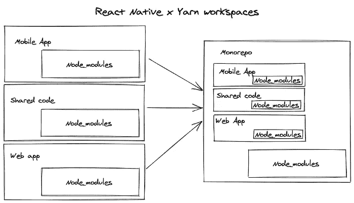

# 用 Gradle 构建管理将项目组织成一个 MonoRepo

> 原文：<https://levelup.gitconnected.com/organizing-projects-into-a-monorepo-with-gradle-build-management-53b499cdb21f>

## 促进跨多个团队和项目的可见性和标准化！


从 [Unsplash](https://images.unsplash.com/photo-1611047606025-a74bfb5eeb30?ixid=MnwxMjA3fDB8MHxwaG90by1wYWdlfHx8fGVufDB8fHx8&ixlib=rb-1.2.1&auto=format&fit=crop&w=1778&q=80)

C 将项目组合成一个单一的**单一存储库**已经成为软件工程中的一个新兴趋势，这对开发人员的工作流程有着广泛的好处。当您听到术语 MonoRepo 时，您可能会想到具有高度耦合服务的可怕的整体架构——但这与 MonoRepo 毫无关系！整体存储库是一种将多个项目整合到单个代码库中的方法，以便为任何参与团队共享依赖关系和标准化项目工作流。

在本文中，我们将讨论 MonoRepo 的一些特征和权衡，并展示一个真实的例子。我们还将介绍使用 Gradle 标准化构建过程背后的思考过程。最后，你可能会发现 MonoRepo 非常适合你自己的项目！

# 单回购结构

一个完整的存储库不需要遵守任何严格的标准。在很大程度上，如何组织他们的项目完全取决于你自己的开发团队。MonoRepo 的一个主要优点是，您不必在将不同的项目加载到您的 IDE 中、筛选多个合并请求(MR)位置之间转换，或者拥有负责共享依赖项的独立项目。相反，一切都在一个地方，以增加组织和便利！



图片来自 [Brigad 工程博客](https://engineering.brigad.co/react-native-monorepos-code-sharing-f6c08172b417)。

## 一个简单的打字稿例子

让我们从一个由两个基于 TypeScript 的项目组成的 MonoRepo 示例开始。您可以使用 [Lerna](https://lerna.js.org/#getting-started) 或 [yarn 工作空间](https://classic.yarnpkg.com/en/docs/workspaces/)来创建 MonoRepo 结构，并根据它们之间的依赖关系对包进行符号链接。从头开始设置你自己的 MonoRepo 将需要额外的计划来链接你的依赖项，所以上面的工具可能更适合你。这是一个用 Lerna 和 yarn 制作的 MonoRepo 示例:

```
<Your Awesome Team Name>
├── package.json
├── packages
│   ├── app-web/
│   │   ├── package.json
│   │   ├── src/
│   │   │   └── index.ts
│   │   │   └── tsconfig.json
│   │   ├── test/
│   │   │   └── test.spec.ts
│   │   │   └── tsconfig.json
│   │   ├── tsconfig.build.json
│   │   └── tsconfig.json
│   ├── app-ios/
│   │   ├── package.json
│   │   ├── src/
│   │   │   └── index.ts
│   │   │   └── tsconfig.json
│   │   ├── test/
│   │   │   └── test.spec.ts
│   │   │   └── tsconfig.json
│   │   ├── tsconfig.build.json
│   │   └── tsconfig.json
├── tsconfig.build.json
└── tsconfig.json
```

如果您有在`app-web`和`app-ios`中使用的服务，您可以将这两个包链接到一个`dependencies`包中，以获得额外的模块化。您不仅合并了项目，而且还标准化了结构，以便您的团队成员可以更容易地在包之间转换。

## 真实世界的例子

MonoRepos 正在整个科技领域获得牵引力，甚至在谷歌和脸书等大型科技公司也是如此。事实上，谷歌的 MonoRepos 可以包含数百万行代码的万亿字节数据。我在一个专注于用户帐户和服务端点的团队中工作，我们的技术堆栈由多个在 Go 中编写的微服务和几个 Angular 项目组成。下面是我们使用的一般基础设施:

```
Mobile Services
├── <project_name>/
│   └── <service_name>/
│       ├── cmd/
│       │   └── main.go
│       ├── internal/
│       │   ├── config/
│       │   │   └── settings.go
│       │   │   └── settings_test.go
│       │   ├── endpoints/
│       │   │   └── endpoints.go
│       │   │   └── endpoints_test.go
│       │   ├── service/
│       │   │   └── service.go
│       │   │   └── service_test.go
│       │   └── transport/
│       │       ├── grpc/
│       │       └── http/
│       ├── .gitlab-ci.yml
│       ├── build.gradle.kts
│       ├── Dockerfile
│       ├── gradle.properties
│       ├── settings.gradle.kts
│       └── <service_name>.proto
├── infra/
├── setup/
│   ├── gradle.rb
│   └── README.md
├── shared/
│   └── golang/
│       └── <library_name>/
├── tools/
│   └── plugins/
│       └── <PluginName>/
├── .gitignore
├── .gitlab-ci.yml
├── .golangci.yml
├── go.mod
├── go.sum
└── README.md
```

这种结构允许我们的团队拥有由多个服务组成的更大的项目。我们不包括 Angular 项目的指南，因为那些已经标准化了。相反，我们对每个基于 Go 的服务都有一个可复制的结构，它由`cmd`中的主要源代码和`config`中的版本控制组成。我们还使用 [go-kit](https://github.com/go-kit/kit) 来帮助构建每个微服务，并将`http`功能添加到传输层。

这个 MonoRepo 设计还有很多可以提高我们团队总体生产力的地方。我们有一个`setup`文件夹，其中包含一个 Gradle 公式来安装我们想要的特定版本，此外还有一个`README.md`用于开发人员入职。还有共享的 Go 库，甚至还有一个包含我们用 Kotlin 编写的自定义 Gradle 插件的`tools`文件夹。例如，我们有插件来标准化跨项目的 Go `build`、`test`和`lint`任务。说到 Gradle，我们已经在每个服务中整合了一个构建脚本来自动化我们的构建和任务系统，但是在下一节中会有更多的介绍。

最后，我们为 CI/CD 准备了顶级 git 配置文件，如`.gitignore`和`.gitlab-ci.yml`。根级别也有用于版本控制的`go.mod`和`go.sum`以及用于一般回购文档的顶级`README.md`。一切都是可见的，可以很容易地转移到一个简化的开发人员工作流程中！

# Gradle 构建管理+ Kotlin DSL


来自 [LordCodes 博客](https://www.lordcodes.com/assets/img/articles/kotlin-gradle.png)

在管理构建和部署过程时，一个基本的解决方案包括在 shell 脚本中运行连续的命令，或者将构建逻辑封装到服务本身中。然而，shell 脚本正在变得过时，因为它们变得越来越难以扩展和维护——尤其是在项目相互依赖的情况下。Gradle 是一个灵活的构建管理工具，它极大地提高了标准化项目构建过程的能力。

> 例如，假设您有一个包含框架和语言组合的 MonoRepo。您不必记住每个工具的客户端命令，而是可以在每个项目中创建一个 Gradle 任务。这样，您可以转换到任何项目，并简单地运行`gradle test`来查看该项目当前的代码覆盖率——但是为什么要就此打住呢？您也可以使用 Gradle 来标准化每个项目是如何构建、链接的，甚至是如何使用 Gradle 众多插件中的一个来组合多个 docker 容器。

此外，您可以扩展这一策略，以保持与 CI/CD 渠道的对等性！理想情况下，无论您的环境如何，您都可以运行 gradle test 之类的基本任务。如果每个环境都需要特定的配置，您可以很容易地在任务中反映出来。以 Docker 为例，您可能希望拥有单独的任务`dockerBuildLocal`或`dockerBuildPipeline`，以便进行特定的标记、推送等。封装在每个任务中。

这里有几个更好的 Gradle 插件:

*   [**palantir**](https://github.com/palantir/gradle-docker) —为 Docker 添加基本的可配置任务，如构建图像、标记、推送、运行容器等。
*   [**avast**](https://github.com/avast/gradle-docker-compose-plugin) —简化 [Docker Compose](https://www.docker.com/docker-compose) 在 [Gradle](https://gradle.org/) 环境中的本地开发和集成测试的使用。
*   [**gradle-proto buf-plugin**](https://github.com/tcawley/gradle-protobuf-plugin)—[Gradle](http://gradle.org/)插件，用于在您的 Gradle 项目中使用 [Google 协议缓冲区](https://developers.google.com/protocol-buffers/)。
*   [**rest-gradle-plugin**](https://github.com/noamt/rest-gradle-plugin)—一个 Gradle 插件，提供一个任务基础设施来执行 REST 请求
*   [**gradle-aws-plugin**](https://github.com/classmethod/gradle-aws-plugin)—管理 S3、EC2、Lambda 等 AWS 资源的 Gradle 插件。

如果你想看到更多令人敬畏的 Gradle 插件，请查看这个 Git repo:

[](https://github.com/ksoichiro/awesome-gradle) [## ksoichiro/awesome-gradle

### 一个令人敬畏的 Gradle 插件和资源的精选列表，用于更好的开发工作流自动化。灵感来自…

github.com](https://github.com/ksoichiro/awesome-gradle) 

# MonoRepo 利弊

像任何设计模式一样，为了确定某个策略是否适合您的团队，必须考虑一些权衡。首先，确保您的项目和包从一开始就是松散耦合的，这是一个好主意。在 MonoRepos 的情况下，仍然有缺点，可能太多，以至于无法将您的项目整合到一个单一的代码库中。以下是将 MonoRepo 整合到您的基础架构中的一些主要利弊:

## **优点:**

*   **更好的可见性和协作**—您团队的所有合并请求都可以在单个项目中找到。此外，您不必为了一个特性变化(如新的 API 集成)而跨多个位置工作。相反，你可以打开 MonoRepo，并留在 MonoRepo！
*   **单一的可重用代码库**——保持项目间的依赖和模块共享是一个巨大的性能提升。指出代码的味道和识别重复的逻辑会更容易，因为每个项目都在另一个项目的旁边。
*   **大规模代码重构**——由于依赖关系在整个代码库中被充分利用，我们可以进行一个单独的更改，并在所有的包中反映这些更改，这再次提高了开发人员的速度。

## **缺点:**

*   **CI/CD 管道** —如此多的项目和如此大的代码库，很难组织一个有效的管道构建结构。一个最初的解决方案是调整您的版本控制系统(VCS ),只为已经被更改或更新的项目运行 CI/CD。
*   **VCS 工具挑战**——说到版本控制，对于像 Git 这样的文件跟踪系统来说，MonoRepo 可能是一项艰巨的任务。仔细考虑需要在系统中跟踪什么是很重要的，否则会陷入节点模块的疯狂。
*   **访问控制的限制** —你可能不希望每个工程师都能访问每个项目。在这种情况下，如果您想为您的团队维护一个 MonoRepo 结构，您可能需要更复杂的权限系统。

总而言之，我认为 MonoRepos 在适当的情况下具有显著的优势，值得研究。每个团队和组织都是不同的，所以当然要仔细考虑利弊，才能做出最终决定。然而，MonoRepos 在统一和标准化项目以提高跨团队的可见性和生产力方面提供了巨大的好处。你对 MonoRepos 有什么看法？