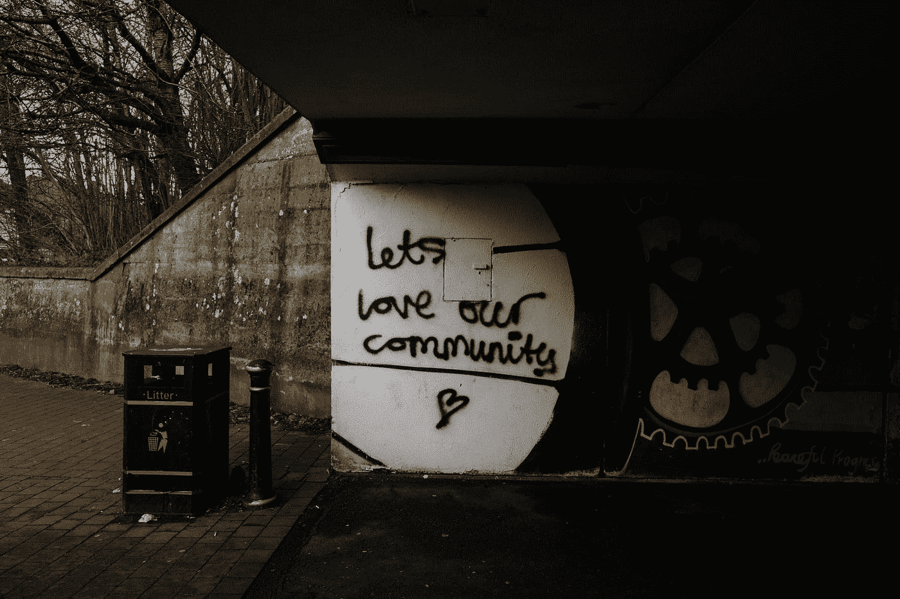

# 我们的代码库就是我们的社区

> 原文：<https://levelup.gitconnected.com/our-codebase-is-our-community-1d884d8c94d8>

## 探索破窗理论

迈克·厄斯金在 [Unsplash](https://unsplash.com?utm_source=medium&utm_medium=referral) 上的照片

随着项目的进展，许多创始成员可能已经离开了。随着时间的推移，团队成长，收缩，新的管理层被引进。唯一不变的是代码，所以对于新手来说，使用代码库来引用可接受的内容是很自然的。

如果你已经在一个项目上工作了一段时间，你可能已经看到了所写代码质量的下降，解决同一个问题的多种模式，以及与代码库创始人曾经梦想的愿景的普遍偏离。

看到这类事情可能有很多原因；对我来说，我把它很大程度上归因于[破窗理论](https://en.wikipedia.org/wiki/Broken_windows_theory):

> **破窗理论**是一种[犯罪学](https://en.wikipedia.org/wiki/Criminology)理论，该理论认为[犯罪](https://en.wikipedia.org/wiki/Crime)、[反社会行为](https://en.wikipedia.org/wiki/Anti-social_behavior)和[社会秩序混乱](https://en.wikipedia.org/wiki/Civil_disorder)的明显迹象创造了一种[城市环境](https://en.wikipedia.org/wiki/Urban_area)，鼓励进一步的犯罪和混乱，包括严重犯罪。——[维基百科](https://en.wikipedia.org/wiki/Broken_windows_theory)。

程序员，真是一群罪犯和堕落者！

想象一下，一个所有人都乐于开发的全新代码库——众所周知的绿色领域。团队很小，模式正在建立和交流，拉请求包含有用和有意义的反馈，以保持代码库的健康。

最好的。

现在产品已经发布了，我们有交付压力来以真正的敏捷风格迭代。“**拿过来 doneᵗᵐ”**这个词来自你的产品所有者。生产中有缺陷。为了“降低风险”，有人决定复制一些代码。也许他们没有正确地进行单元测试，但是 PR 无论如何是被批准的；毕竟是缺陷，需要我们反应 ***快*** 。

这是第一扇破窗。

> 根据破窗理论，一个整洁有序的环境，一个被维持的环境，会发出一个信号，即该区域受到监控，犯罪行为是不被容忍的。相反，一个混乱的环境，一个没有得到维护的环境(破窗、乱涂乱画、垃圾过多)，会发出一个信号，即该地区没有受到监控，犯罪行为几乎没有被发现的风险。

一扇破碎的窗户向*罪犯*(读作:**工程师**)传递着这样一个信息:一个社区(读作:**代码库**)显示出缺乏非正式的社会控制，并且不能或不愿意保护自己免受犯罪入侵。

这有点抽象，但我确实喜欢这种比较。现在，我们能做些什么呢？

# 预防

一如既往，预防胜于治疗。我们需要在我们的功能开发(和缺陷修复)中保持警惕，并小心不要在技术债务上再扔一张牌。这可能需要与您的产品所有者进行一些争论，但这是非常值得的投资。

## 拉取请求

在 PRs 和代码审查上保持敏锐将会带来回报——这是一条双行道。创建 PR 时，请确保您已经解释了您的意图，以使审核更容易:

 [## 如何让你的代码评审员爱上你

### 当人们谈论代码评审时，他们关注的是评审者。但是写代码的开发人员就像…

mtlynch.io](https://mtlynch.io/code-review-love/) 

当扮演代码评审员的角色时，重要的是要感同身受、诚实和深思熟虑。提出建议和指导，而不是生硬的`this can be improved`类信息，或者更糟，只是耸耸肩，让代码库退化。

## 童子军规则

如果你还没有浏览过罗伯特·c·马丁的《干净的代码》( T7 ),我怎么推荐都不为过。这是十多年前写的，不管你现在用什么语言，内容听起来都是真实的。在最初的几页中，他将谈到童子军规则。

> 让露营地比你发现时更干净。

这个想法是，仅仅写好代码是不够的。随着时间的推移，代码必须保持干净——我们必须在保持我们的代码库(我们的环境)健康方面发挥积极的作用。我在看你，科技债。

> 清理工作不一定要做得很大。将一个变量名改得更好，分解一个有点太大的函数，消除一点重复，清理一个复合的 *if* 语句。

照片由[陈嘉里](https://unsplash.com/@gary_at_unsplash?utm_source=unsplash&utm_medium=referral&utm_content=creditCopyText)在 [Unsplash](https://unsplash.com/s/photos/trash?utm_source=unsplash&utm_medium=referral&utm_content=creditCopyText) 拍摄

## 证明文件

源代码控制的 markdown 文档形式的良好文档是前进的方向。

 [## 初学者指南写一个牛逼的自述✍

### 嘿初学者，

meakaakka.medium.com](https://meakaakka.medium.com/a-beginners-guide-to-writing-a-kickass-readme-7ac01da88ab3) 

架构决策记录(ADR)是跟踪我们所做的任何重要决策的一个很好的方式，并且让参与项目的任何人都可以访问它们。通常对于某些决定有`reasons`，并且它们应该在这里被记录。**为了获得最佳结果，请将它们置于代码回购本身的源代码控制之下。**

 [## 什么是架构决策记录？

### 了解为什么你的公司或团队做出某些软件设计决策

better 编程. pub](https://betterprogramming.pub/what-is-architecture-decision-record-110c597c13d) 

# 包扎

我们的代码库就是我们的社区——个人贡献者来来去去，但是他们的代码在他们离开后仍然存在。

保持代码库健康很难；项目运行的时间越长，难度就越大。破窗问题就像滚雪球，一旦形成势头，就很难停下来。

尽早并经常投资于你的代码库的健康。将来你会感激它的。