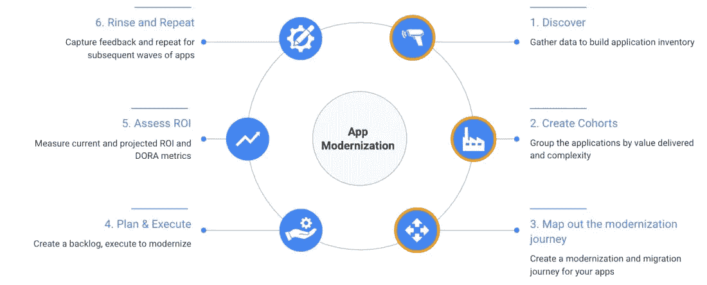
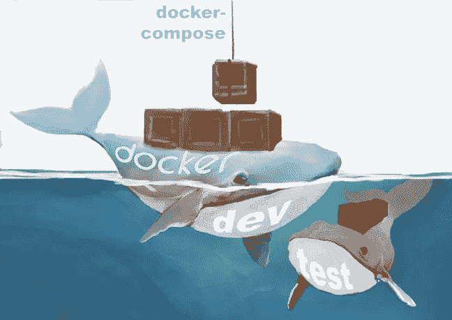

# 我们面向云迁移的企业 Docker 解决方案

> 原文：<https://levelup.gitconnected.com/our-enterprise-docker-solution-for-migration-to-the-cloud-d7bb9d1a796b>

这是一个关于我们第一次推出 Docker 的故事，它发生在我以前作为承包商工作过的一家公司。代码，以及我们遇到的陷阱，都有详细介绍。被警告；这篇博客文章不是对 Docker 的介绍。



*图一。我们的目标是实现向云迁移的应用现代化。图片:* [*风镜云博客*](https://cloud.google.com/blog/products/application-development/application-rationalization-what-why-and-how) *。*

## 一开始，是有要求的。

我在一个*开发*团队中，该团队被重新定向为创建 Docker 图像，以便在全公司范围内使用。

无论我们得出什么样的解决方案，都必须有助于向云的迁移。我们决定先循序渐进，解决本地问题，然后再考虑云需求。

我们让我们的决定变得简单，注意到我们所有的应用都需要从单片架构升级到微服务架构。

坦白地说，我们还没有准备好带着重构建议去找上层管理人员。目标是降低成本，而不是增加迁移到云的开发时间和成本。这是以后的另一篇博客文章。

## 我们从需要解决的本地开发和测试问题开始。

以前，每个开发人员都有自己独特的沙箱来进行开发。如果开发人员必须恢复他们的开发环境，这将需要几个小时。由于*历史*特性，一些开发人员转而使用 Pycharm。这个特性有助于解决 Python 包的版本控制和名称空间冲突，但没有解决。

*测试*需要一天或更长的时间来创建一个 requirements.txt 环境，通过查看源文件来解开导入语句。——他们不快乐。

我们为每个项目使用私有的 Github，为*开发*、*测试*、*阶段*和*生产*使用单独的回购(sitories)。开发过程。

开发人员完成单元测试。代码在提交到 Github repo(sitory)之前必须通过单元测试。其他*开发*团队执行代码审查、集成测试，并合并到*开发* Github repo(sitory)中。

技术决策者认为这是开发/运营部门的责任。一旦这样一个团队有了工作人员，与 Docker 相关的东西将会移交给他们。

***注*** *:被称为测试的组是验收测试。性能测试决定了阶段和产品是否接受代码更改。*

## Docker 图像的第一个 alpha 版本

我们开始从一组*开发*和*测试* Python 包和工具构建 Docker 映像。

我们向六个*开发*团队中的两个发布了 alpha 版本。第一个 alpha 版本是一个失败，因为只有一个开发组(我们的)会/可以使用这个 Docker 映像。

我们被告知 Docker 图像的第一个 alpha 版本(未显示)是 DOA(到达时死亡)。事实证明，我们严重偏向于 Python-机器学习-后端类型。我们将大多数开发人员排除在第一批 alpha Docker 映像之外。

## Docker 图像的第二个 alpha 版本

然后我们出去听听，看看其他小组，看看他们在用什么。*开发*和*测试*使用一个大范围的封装。其中一些 Python 包并不是生产所必需的。*测试*需要一个用于*生产*的 Docker 映像，它是验收测试所需包的子集。

起初，我们认为这些是相互冲突的需求。然后我们意识到这些额外的需求并不是我们的需求。这是我们第一次发布的错误。

第二个 alpha 版本是成功的，因为所有的*开发*团队都部署了 Docker 映像来进行*测试*。他们通过 git 克隆一个 URL 与其他人分享他们的工作。URL 在标记为 Docker 的子目录中有 *Dockerfile* 和 Docker image。开发人员将定制说明和构建说明放在 README.md 中。 *Dev* 需要的 Python 包的最小集合在`requirements.txt`文件中列出。

这种方法虽然简单，但已经成功地扩展到所有六个*开发*团队和两个*测试*团队。更重要的是， *Test 发现【the requirements.txt 文件是关于开发人员使用了什么以及 *Production* Docker 映像需要什么的文档。*

*开发人员的*和*测试人员的*最显著的回报是在标准 Docker 映像中创建和测试应用程序，尽管*开发人员的*操作系统是 MacOS，而*测试、试运行和生产的操作系统是* Ubuntu。

基于这次展示，官方的公司目标是将每个人都转移到 Docker: <config>。</config>

我希望这为我们迁移到持续集成/持续交付(CI/CD)文化奠定了基础。

当用户说“我在 Docker: *Dev* 或 Docker: < config >上”时，就是成功的量度而不是“我在苹果电脑上:<什么的>”我们想要创造一个比电脑操作系统更重要的世界。

## Docker 和 Docker-撰写

Docker 用于管理应用程序的单个容器映像。

Docker-Compose 用于为同一个应用程序同时管理几个容器。这个工具提供了与 Docker 相同的功能，但是允许您拥有更复杂的应用程序。



插图由[雷切尔·科特曼](http://ralvearcottman@gmail.com)绘制

目前，我们只对一个 Docker 图像使用 Docker 合成。在某些时候，我们认为我们在云上使用 Docker 图像和 Kubernetes。

*开发、测试和阶段*的`dockerfile` 为:

```
**FROM** python:3.7
**FROM** jupyter**/**minimal-notebook
**WORKDIR /**dev-base
**RUN** python **-**m pip install **--**upgrade pip
**RUN** python **-**m pip install jupyterthemes
**RUN** python **-**m pip  install **--**upgrade jupyterthemes
**RUN** python **-**m pip  install jupyter_contrib_nbextensions
**RUN** jupyter contrib nbextension install **--**user
**COPY** requirements.txt .**/**requirements.txt
**RUN** python **-**m pip  install **-**r requirements.txt**COPY ../**requirements.txt .**/**requirements.txt
**RUN** python **-**m pip install **-**r requirements.txt
```

参考**:**[https://docs.docker.com/engine/reference/builder/](https://docs.docker.com/engine/reference/builder/)

第二个 alpha 版本的主要特点是使用本地`<project-name>/requirements.txt.`我们发布了一个`dockerfile`模板，使得*开发*和*测试*能够通过`dockerfile.`定制每个 Docker 图像

`python -m pip install ...`是因为`pip install ...` 被弃用。

Docker Compose 可以将多个 Docker 容器合并到一个运行时映像中。将来，当我们的本地环境需要多个容器映像时，我们将需要这个工具。

*Dev* 的`dockerfile-compose.yml` 为:

```
**version**: '3'
**services**:
  **notebook**:
    **build**:
      **context**: ./docker
    **ports**:
        - "8888:8888"
    **volumes**:
      - ../../.:/docker**working_dir**: /docker
```

参考:[https://docs.docker.com/compose/compose-file](https://docs.docker.com/compose/compose-file/)/

使用以下命令构建、运行和关闭 docker 容器映像:

```
*#  compose all containers (services) into one image
#    $ cd to docker-compose.yaml directory;
$ docker-compose build**# runs docker-compose image in background
$ docker-compose up &**# shuts down docker-compose image in background
$ docker-compose down*
```

## 第二个 Alpha 版本的开发目录结构

我们有一个共享磁盘，任何人都可以将模板文件复制到他们的本地目录结构中。

```
|-- dockerSeasons
     |-- dev
         |-- Docker
             |--- Dockerfile
         |--- docker-compose.yml
```

这有点苛刻，但是我们要求 *Dev，*实际上任何涉及到我们软件服务生命周期的人，将他们开发目录结构的顶层节点命名为`PROJECTS.`

开发人员创建了以下目录结构:

```
- PROJECTS
.
.
.
    |-- <project-name>
        |-- docker
            |--- Dockerfile
        |--- docker-compose.yml
        |-- src
        |-- test
        |--- requirements.txt
        |--- README.md
.
.
```

然后开发者创建`<project-name>/docker/requirements.txt`(在`<project-name>/docker`目录下):

```
*$ ln ../requirements.txt requirements.txt*
```

*测试*创建了以下目录结构:

```
- PROJECTS
.
.
.
    |-- <project-name>
         |-- src
         |-- test
             |-- docker
                 |--- Dockerfile
             |--- docker-compose.yml|-- test
             |--- requirements.txt
             |--- README.md
         |-- stage
             |-- docker
                 |--- Dockerfile
             |--- docker-compose.yml
             |--- requirements.txt
             |--- README.md
.
.
.
```

*测试*将暂存文件移动到 3 台冗余生产服务器。服务器场是内部的。

## 我们 Docker 解决方案的说明在 README.md 中

`README.md` 文件是:

```
*# docker-compose commands
# ref email: deploying <name-withheld> docker for your <project-name>
# 1\. copy http:<devBase>/dist/dockerSeasons/docker directory 
#    in each of your <project-name>s directories.
# 2\. copy http:<devBase>/dist/dockerSeasons/docker-compose.yaml file 
#    in each of your <project-name>s directories.
# 3\. symbolically link your  <project-name>s requirements.txt 
#    to /docker/requirements.txt
#    (goto <project-name>/docker);
#    $ ln ../requirements.txt requirements.txt
# ref:* [*https://pip.pypa.io/en/stable/user_guide/#requirements-files*](https://pip.pypa.io/en/stable/user_guide/#requirements-files)*# 4\. compose all containers (services) into one image
#    $ cd to docker-compose.yaml directory;
#    $ docker-compose build**# 5.runs docker-compose image in background
#    $ docker-compose up & (add to <home>/<uid>/.prolile)
#  note:
#    $ docker-compose up -d
#    will NOT output 
#* [*http://127.0.0.1:8888/?token=a5bcd81e7c5b126cb1b67ddf7fa6ce4a49eff7cef9f48ad*](http://127.0.0.1:8888/?token=a5bcd81e7c5b126cb1b67ddf7fa6ce4a49eff7cef9f48ad) *(example)
# 6.shuts down docker-compose image in background
#    $ docker-compose down**# note: image is a running container**#  show all docker images 
#  $ docker ps -a
#  show all container that can make images
#   $ docker images**# stops all docker images
#### docker stop $(docker ps -a -q)
# removes all stopped docker images
#### docker rm $(docker ps -a -q)**#  delete containers and images
#  - all stopped containers
#  - all networks not used by at least one container
#  - all dangling images
#  - all dangling build cache
# $ docker system prune
# and all unused images 
# $ docker system prune -a**# if using Pycharm
# ref:* [*https://www.jetbrains.com/help/pycharm/using-docker-as-a-remote-interpreter.html*](https://www.jetbrains.com/help/pycharm/using-docker-as-a-remote-interpreter.html) *#**# if you want add to .bashrc_profile or bashrc.txt
#    alias up<project-name>="cd ~/Documents/PROJECTS/paso; docker-compose up &"
#    alias down<project-name>="cd ~/PROJECTS/paso; docker-compose down"
#    alias buil<project-name>="cd ~/PROJECTS/paso; docker-compose build"*
```

## 该公司没有使用云

财务部门决定公司是否应该将部分或全部*开发*、*测试*和*生产*转移到云上。公司决策者认为这是外包。

如果让我猜测，我们会通过转移我们的一些*生产*服务，与至少两家云提供商进行试验。可靠性和可扩展性是首要的，而成本也是该公司优先考虑的问题。内部服务器群的生产仍然存在。

我们楼层从来没有停电过。(好吧，打印机有时候会离线。).此外，还有一个备份位置，以防这个网站关闭。

我意识到我们的足迹很不寻常。然而，该公司的资金比成本更大，以保证停机时间少于全球金融市场停机时间。公司希望承担比我们所知的世界末日概率更小的风险，

## Docker 资源

许多有用的资源解释了 Docker 如何以及为什么是目前领先的虚拟化平台。我仅列举其中几个参考文献。

[](https://docs.docker.com/engine/docker-overview/) [## Docker 概述

### Docker 是一个开发、发布和运行应用程序的开放平台。Docker 使您能够分离您的…

docs.docker.com](https://docs.docker.com/engine/docker-overview/) [](https://www.guru99.com/docker-tutorial.html) [## Docker 初学者教程:什么是，架构，安装，命令

### 早期，部署服务的过程缓慢而痛苦。首先，开发人员正在编写代码；然后…

www.guru99.com](https://www.guru99.com/docker-tutorial.html) [](https://github.com/docker/labs/tree/master/12factor) [## 码头工人/实验室

### 如今，许多应用程序都是部署在云中的服务，部署在云提供商(如 Amazon)的基础设施上…

github.com](https://github.com/docker/labs/tree/master/12factor) 

# 摘要

在这篇文章中，我详细介绍了我们为什么以及如何在公司中启用 Docker 解决方案。我展示了目录结构和 Docker 代码。我们发现使用 Docker-Compose 解决方案更加灵活。

本文中显示的所有代码都是[这里。](https://github.com/bcottman/dockerSeasons)

我被允许分享我们迄今为止的旅程。当我们做出重大改变时，将会有更新。

编码快乐！