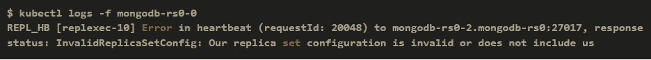
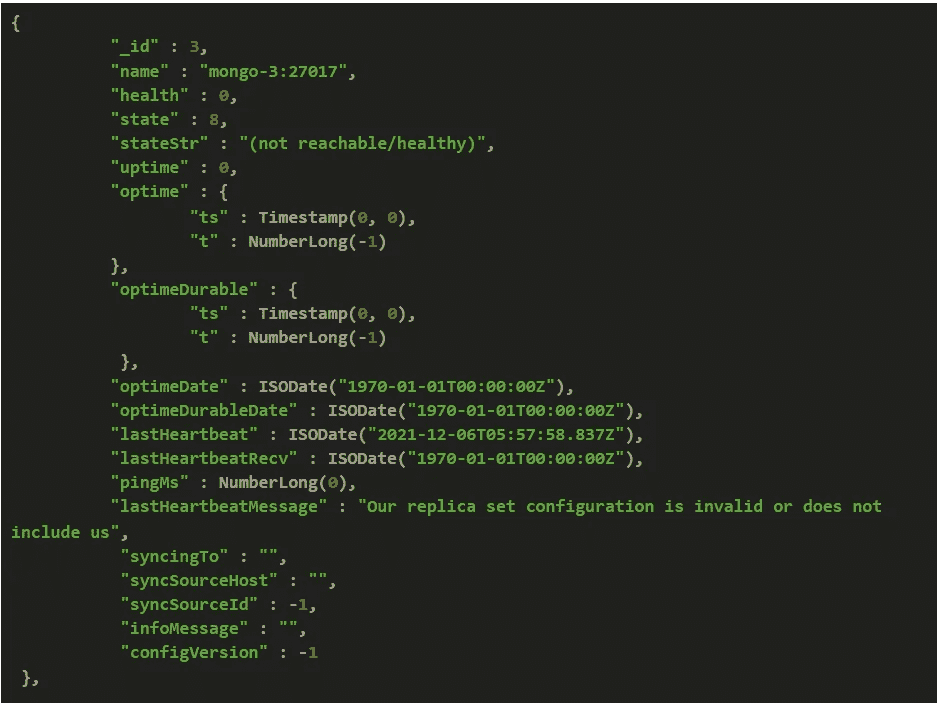

# 我们的副本集配置无效或不包括我们

> 原文：<https://levelup.gitconnected.com/our-replica-set-configuration-is-invalid-or-does-not-include-us-af12a587d74a>


马库斯·温克勒在 [Unsplash](https://unsplash.com/s/photos/replica?utm_source=unsplash&utm_medium=referral&utm_content=creditCopyText) 上拍摄的照片

以下错误在未正确同步的 MongoDB 副本集中很常见。原因可能是，由于某种原因，实例长时间无法与主实例或辅助实例同步，然后它进入了一种永远不允许与另一个实例同步的状态。

长时间的群集故障和长时间的连接问题可能是发生此错误的原因。



mongo 日志

## 让我们确认受害者的身份

在进入解决方案之前，让我们收集一些信息。

## 1。检查副本集的状态

进入主 mongo，以数据库管理员身份登录

*ku bectl exec-it*`*podname*`*mongo*

*使用管理员*

*db . auth(*`*username*`*”，*`*password*`*)*

使用`rs.status()`查看副本集状态



您将看到 HeartBeatMessage 显示为*“我们的副本集配置无效或不包括我们”*，并且还将观察到`syncSourceId`为负，并且`syncingTo`属性值为空。

# 2.这个计划

我们需要将副本集恢复到健康状态，并且所有 mongo 实例都应该正确同步。首先请检查所有网络连接是否正常工作。确保拥有 MongoDB 副本的机器可以相互通信。

简单地说，我们要做的是，
*从副本集中删除特定的容易出错的 MongoDB 实例，并相应地重新添加它。同时，您必须允许成员通过删除特定节点的数据文件夹来正确地重新同步。*

在我的例子中，数据库不是太大，因此删除数据文件夹效果很好。但是，当您的数据库太大时，您可以从另一台正确同步的辅助机器上复制数据文件夹。

# 3.遵循步骤

**第一步**

识别具有损坏的副本集成员的机器。

**第二步**

在特定节点停止 mongodb pod。

当 mongodb pod 在特定节点上运行时，您不能删除节点的数据文件夹。因此，您必须停止该特定节点中的 mongodb pod。这是一个棘手的情况，因为您仍然要删除 pod，因为 Kubernetes 会自动重启 pod 来维护副本的数量。

为了避免创建 pod，您可以按照对 mongodb 实例进行限制的方式来标记 pod。

例如:我的节点标有`database=yes`，只有这些节点被用来创建 mongodb pods。我将受损节点的标签更改为`databse-`,这样这个节点就没有资格使用 mongodb pods。

假设`worker1`是具有易错副本集成员`mongo-3`的节点。

`kubectl label node worker1 database-`

`kubectl delete pod mongo-3`

这将避免 Kubernetes 在特定的节点中制作 mongodb pod。请注意，标签名称取决于您的应用程序设置。

**第三步**

删除数据文件夹。这将允许从头开始重新同步您的节点。

**第四步**

从副本集中删除成员

`*kubectl exec -it podname mongo
use admin
db.auth(“ username ”, “ password ”)*`

`rs.remove(‘mongo-3:27017”)`

**第五步**

恢复正确的标签并允许 pod 启动。请注意，标签名称取决于您的场景。

`kubectl label node worker1 database=yes`

现在 mongo pod 应该再次在这个节点中创建

**第六步**

重新添加 replicatet 成员。在此步骤中，请根据您的 senario 使用正确的属性。

`rs.add({_id:3 host: “mongo-3:27017”})`

```
rs.reconfig(rs.config(),{force:true})
```

现在你损坏的 mongo 节点应该再次启动并尝试同步。在几分钟内，你会看到这是一个秒变和同步源满足。

当`rs.config()`中有两个损坏的副本集成员时，照原样执行前 2 步，然后一次移除两个成员。然后一个接一个地执行剩下的过程。启动一个节点的 mongo，并将其添加到`rs.config()`中，然后等待一段时间，直到它的状态变为 Secondary。然后按照第二个节点的步骤操作。


恩库鲁列科·马亚涅在 [Unsplash](https://unsplash.com/s/photos/replica?utm_source=unsplash&utm_medium=referral&utm_content=creditCopyText) 上的照片

这是我处理`Our replica set configuration is invalid or does not include us`的方式，在整个过程之后，我的复制集状态变得正常而健康。

如果你知道任何其他方法来解决这个问题或任何逻辑原因，请让我知道作为回应。

谢谢你