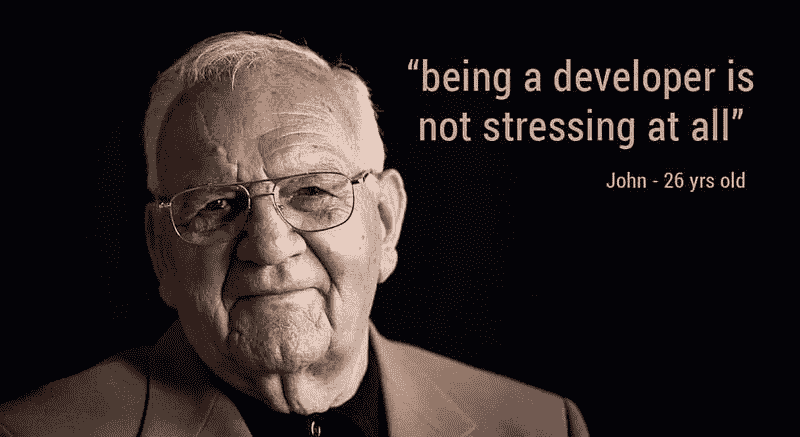
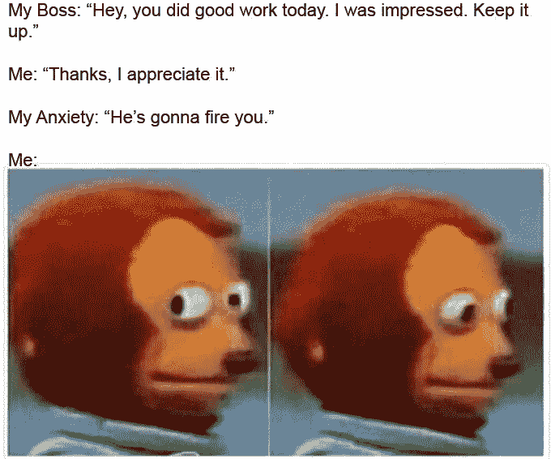
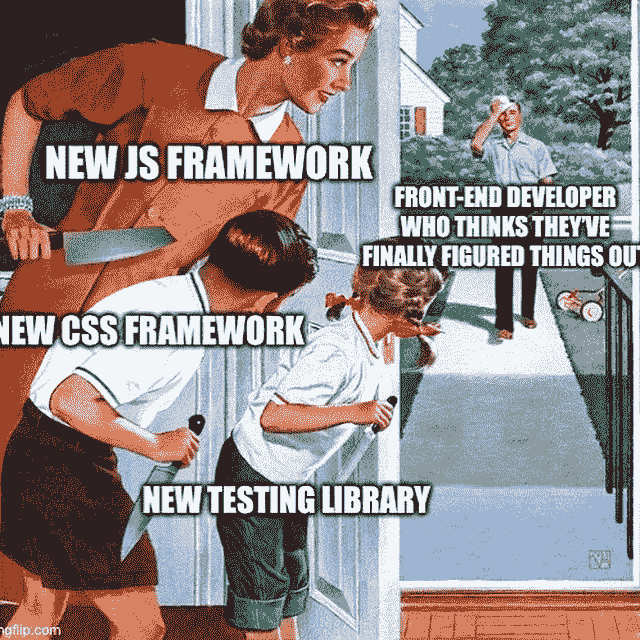

# 克服程序员的焦虑:如何面对你的恐惧

> 原文：<https://levelup.gitconnected.com/overcoming-programmers-anxiety-how-to-face-your-fears-7beaa7f0e30d>

## 作为一名开发人员，患有广泛性焦虑症

埃德温·胡珀在 [Unsplash](https://unsplash.com?utm_source=medium&utm_medium=referral) 上的照片

我能感觉到身体每一个细胞都在焦虑——胃里打结，手突然颤抖，眼睑迟钝，最糟糕的是，头骨里不断发出刺耳的声音。

一个天真的 16 岁少年，在一群经验丰富的开发人员中间，我感觉自己像一个永远的外地人。由于害怕被“抓住”，我疯狂地使用诸如 DOM、CI/CD 和 CLI 之类的行话，却对它们知之甚少。我想我要么得到这份工作，完美地完成它，要么失败。今天，当我回顾自己的时候，我是一个灾难。我的代码太糟糕了，我今天甚至不能看它。然而，我还没有成为一个“失败者”，至少现在还没有！但是一路走来我学到了很多。

值得注意的是，我发现我患有广泛性焦虑症。在接受了多种类型的治疗后，我发现其中一种对职场斗争特别有帮助:暴露和反应疗法。

***免责声明*** *:我不是健康专家。本文中对暴露和反应疗法的描述过于简单，并不是要取代专业的医学治疗。如果对你的精神健康有任何疑问，一定要寻求专家的建议。*

# 暴露和反应疗法

暴露和反应预防(ERP ),尽管它有一个吓人的名字，但有一个简单的基本原则:要消除你的恐惧，你必须面对它们。通过这样做，你改变了对新奇和不确定情况的看法，从一些令人害怕的东西变成了一些可以控制的东西。

在心理学术语中，将自己暴露在恐惧中的过程被称为行为实验，包括五个步骤:

## 1.列出你的担忧

列出你的“假设”想法。你害怕什么？为什么？例如，你可以说:“我害怕拒绝老板不切实际的最后期限。如果他因为我说不而解雇我呢？"

## 2.评定你对每一个问题的焦虑程度

现在，根据你的恐惧引起焦虑的程度，给你的恐惧打 1-10 分。

## 3.确定你的安全行为

安全行为是一种应对机制，通常基于回避，让你远离恐惧。安全行为的主要类型是过度重复检查、拖延、寻求再保证和不诚实。例如，你可能会避免在 Stackoverflow 中提问，担心其他成员可能会说你的问题很愚蠢。

安全行为可能会在短期内缓解你的压力，但长期来看，永远避免危险的情况会增加你的担忧。此外，通过躲避你认为危险的事情，你永远无法验证你的想法，它们变成了自我实现的预言。在前面的例子中，你永远不会知道你的问题是否真的“愚蠢”

## 4.设计一个实验来面对它们

根据他们的得分，在你的列表中选择最不可怕的恐惧，并找到一种简单的方法来解决他们相应的安全行为。例如，下次当你正忙于其他几个项目时，你的老板给你一个新任务，礼貌地拒绝它。对老板说不可能会让你焦虑或不舒服，但这是行为实验背后的全部理念。如果你在做实验时不焦虑，那一定是出了问题。

如果你在做实验时不焦虑，那一定是出了问题。

## 5.记录结果

发生了什么事？灾难发生了吗？你的密码被破解了吗？有没有人因为你不知道 Docker 是怎么工作的而取笑你？

**b .如果灾难发生了，你是如何应对的？**如果您编写了破损的代码，您和您的同事对此有何反应？Stackoverflow 用户称你的问题很蠢之后发生了什么？如果你花更多的时间担心，你能防止事故发生吗？

# 开发商的安全行为

自从经历了 ERP，我越来越意识到 IT 工作中令人焦虑的动态以及由此产生的破坏性安全行为。在本文的其余部分，我将解释一些我认为在行业中最常见和最有害的安全行为。

## 不诚实

软件开发是一个广泛的学科，有无数的工具、技术和理论。不仅有大量的课题需要研究，而且这个领域也在越来越快地发展。因此，开发人员应该 a)知道很多东西，b)聪明并且学东西快。

这种期望导致了许多开发人员圈子中的有毒环境，在那里你应该比别人知道得更多，比别人更聪明，比别人写得更好(不管这意味着什么)。我认识的大多数开发人员都经历过被形象管理和社会地位游戏弄得支离破碎的环境，在那里每个人都害怕承认他们犯了错误或者不知道一些事情。不诚信，在这个语境下，是一种逃避社会评判的安全行为。你可能认为接受失败的责任或承认对某个话题一无所知可能会导致威信的丧失(“如果别人认为我不称职怎么办？”).

形象管理是一种高效的进化工具(你不希望其他人认为你是不合格的成员)，但是，在工作场所，它可能很快变得非常低效。

形象管理是一种高效的进化工具(你不希望其他人认为你是不合格的成员)，但是，在工作场所，它可能很快变得非常低效。尤其是，当人们出于良好的意愿，在不安全感的压力下，诉诸于不诚实来保持他们的地位。我认识的大多数开发人员在他们的整个职业生涯中都有不同程度的不诚实，原因有很多。然而，以我的经验来看，通过写下你的担忧并进行一个行为实验来面对它，你可以克服职场中不诚实的恶性循环。

下次有人问你是否使用过你没听说过的新技术时，说没有，并表现出好奇心。然后，记录对话的结果。你可能会发现这个世界并不像你想象的那么危险！

## 拖延

虽然许多人认为拖延是一种被动的行为，但我在开发人员中看到了更多主动拖延的例子。当你应该完成一项让你感到害怕的任务时，通常是因为它模糊不清或新奇，你只是开始做另一项任务，一项更简单但不那么紧急的任务，以此来提高效率并避免面对你的担忧(见:[https://shouldideploy.today/](https://shouldideploy.today/))。这可能看起来是一个富有成效的策略，但不断避免新奇的情况会带来坏消息。

当你发现自己在拖延一项新奇的任务时，不要质疑自己的意志力，而是找到潜在的感知威胁，并进行行为实验来面对它。

## 过度重复检查

把事情做好是软件开发中唯一真正的最佳实践，因为其他的都是编造的，很快就会过时。

软件开发更多的是做决策，而不是打字。因此，编写干净的代码是一种决策艺术，可以节省时间、性能和心智健全。然而，这些决策的复杂性和庞大数量可能导致分析瘫痪。作为一名软件开发人员，你必须不断处理突发的复杂性，而行动中的复杂性很少像理论上的那样。因此，你永远无法为你的软件找到完美的架构。然而，如果你最近刚从大学毕业，你可能仍然有一个大学生寻找正确答案的心态——这种方法会在现实世界中引起失望。

理解三点可以帮助你克服对代码质量的焦虑:

1.  把事情做好是软件开发中唯一真正的最佳实践，因为其他的都是编造的，很快就会过时。你的工作不是写完美的代码，而是创造收入。如果您的代码对您的组织有所帮助，那么它的质量，如干净代码因素所定义的，是一个次要的关注点(但不是可以忽略的)。
2.  一致性往往比完美更重要。创建一个简单的风格指南并坚持使用它可以大大减少开发过程中需要做出的决策。
3.  你不需要发布一个完美的代码，甚至不需要发布一个好的代码！在大多数情况下，你可以先让它工作，然后让它足够好。通过快速构建一个不那么干净的软件，你会发现最终架构必须适应的复杂性的清晰概念，这在项目开始时很少被识别。

## 逃避

淹没在创新工具和技术中的软件开发并不是新恐惧症患者的天堂。软件工程师，不管他们的专业水平如何，由于行业的快速发展，他们的知识仍然有差距。尽管如此高的变化率让 IT 行业对一些人更有吸引力，但它也可能让你担心被超越。

虽然掌握所有的时尚没有必要也没有帮助，但是躲在安全地带会伤害你的精神健康和生产力。

许多有经验的开发人员，忠于以前的技术，或者害怕再次感觉像个新手，避免学习和使用新技术。同样，初级开发人员受到面前信息海洋的威胁，不会在新项目中实现他们的知识，直到他们“学到足够的东西”然而，回避新奇是被行业超越的必由之路。虽然掌握所有的时尚没有必要也没有帮助，但是躲在安全地带会伤害你的精神健康和生产力。就我个人而言，我认为躲避 ORM、无服务器架构和 PWAs 这样的概念和工具，害怕自己在学习它们时会感到愚蠢，是我职业生涯中犯的最大错误之一。

# 结论

尽管软件开发似乎是一个平静的职业，但它充满了隐藏的精神健康威胁，并且，为了富有成效和满足感，您应该开发处理这些威胁所必需的软技能。然而，在一个期限紧、期望值高的动态行业中工作，许多开发人员忽视了他们的心理健康。对我来说，IT 专家最重要的软技能是处理担忧和焦虑的能力。作为一名一直在处理广泛性焦虑的开发人员，我发现暴露和反应疗法是一种有用且易于使用的技术，可以控制我在工作场所的担忧并提高我的自我效能。希望对你也有帮助！