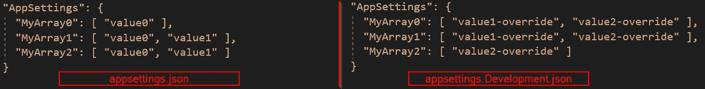
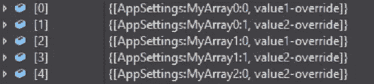
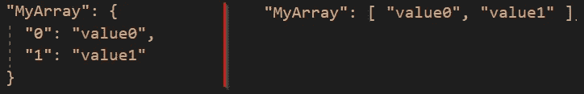

# 覆盖数组配置对象

> 原文：<https://levelup.gitconnected.com/overriding-an-array-configuration-object-4d93470e97d0>

## 惊喜！阵列不会被整体替换。


ASP。NET Core 使用配置提供程序从各种来源读取配置键值对。你可以在[的官方文档](https://docs.microsoft.com/en-us/aspnet/core/fundamentals/configuration/)中了解更多关于 ASP.NET 核心的配置，其中详细介绍了大量用例。

最近，当我在 ASP.NET 核心项目的`appsettings.json`文件中设置 JSON 数组时，最终配置数据的结果让我大吃一惊。该数组的行为与其他 JSON 对象不同，后者可以在特定于环境的`appsettings.json`文件中被覆盖。相反，最终数组的元素可能比预期的多。经过一番 googling，发现已经有很多栈溢出问题( [1](https://stackoverflow.com/questions/51614792/how-to-override-an-asp-net-core-configuration-array-setting-reducing-length-of-t) 、 [2](https://stackoverflow.com/questions/49136954/how-can-i-override-an-array-based-setting-from-appsettings-json-in-an-environmen) 、 [3](https://stackoverflow.com/questions/37657320/how-to-override-asp-net-core-configuration-array-settings-using-environment-vari) 、 [4](https://stackoverflow.com/questions/52755027/override-array-settings-in-appsettings-json-with-those-in-appsettings-production) 、 [5](https://stackoverflow.com/questions/45819524/removing-inherited-asp-net-core-appsettings) )和 GitHub 问题( [1](https://github.com/dotnet/runtime/issues/36569) 、 [2](https://github.com/dotnet/runtime/issues/36384) 、 [3](https://github.com/aspnet/Configuration/issues/836) 、 [4](https://github.com/aspnet/Configuration/issues/694) 、 [5](https://github.com/aspnet/Configuration/issues/727) 和[6](https://github.com/aspnet/Configuration/issues/773)[我认为写一篇短文来描述“问题”是值得的，这样你就不会被同一块石头绊倒。](https://github.com/aspnet/Configuration/issues/773)

# “问题”是什么

ASP.NET 核心配置中的一个众所周知的特性是，如果在不同的配置源中有一些具有相同键的键值对，那么稍后添加的配置提供程序将覆盖先前的键设置。例如，如果在`appsettings.Development.json`文件中没有设置连接字符串的值，那么在`appsettings.json`文件中设置的连接字符串将用于开发环境。另一方面，如果在`appsettings.Production.json`文件中设置了连接字符串，那么`appsettings.json`文件中的值将被覆盖，而`appsettings.Production.json`文件中的值将用于生产环境。

因此，我们通常将一些通用配置数据放在`appsettings.json`文件中，将特定于环境的配置放在`appsettings.{Environment}.json`文件和/或环境变量中。这样，当应用程序启动时，系统可以基于运行时环境覆盖设置。

然而，对于数组来说，它的工作方式并不完全相同。出于演示的目的，我创建了一个控制台应用程序，可以在[我的 GitHub 库](https://github.com/changhuixu/ConfigurationBuilderDemos)中找到。

演示控制台应用程序使用默认的`HostBuilder`。当我们在开发模式下运行应用程序时，应用程序首先从`appsettings.json`文件加载配置，然后从`appsettings.Development.json`文件加载。我们将配置对象定义为一个类`AppSettings`，如下所示。

类`AppSettings`包含三个属性，每个属性代表一个字符串数组。`AppSettings`类下面的代码行显示控制台应用程序绑定来自 JSON 文件的配置并输出它们的值。

在本演示中，我们将使用这三个阵列做一些实验来模拟阵列覆盖的效果。我们在每个 JSON 文件中用不同的数组长度为它们设置不同的值。两个 JSON 文件如下所示。



您可能认为三个数组的最终值都应该从`appsettings.Development.json`文件中读取，因为该文件是最后一个加载的文件。然而，你说对了一部分。最终输出如下。

```
MyArray0:        value1-override, value2-override
MyArray1:        value1-override, value2-override
MyArray2:        value2-override, value1
```

你看到棘手的部分了吗？

前两个数组具有来自`appsettings.Devleopment.json`文件的预期值。而第三个数组`MyArray2`的值来自两个`appsettings.*.json`文件，这与我们的直觉相矛盾。

# 发生了什么

[关于 ASP.NET 核心中配置的官方文档](https://docs.microsoft.com/en-us/aspnet/core/fundamentals/configuration/#bind-an-array)指出`ConfigurationBinder`使用配置键中的数组索引将数组绑定到对象。

如果我们使用 Visual Studio 调试器来检查配置对象，我们可以发现 JSON 提供程序从`appsettings.Development.json`文件中给出了以下配置数据。



数组中的元素由它们的索引来标识。例如，`MyArray1`中的第二个元素被标识为`AppSettings:MyArray1:1`。换句话说，如果我们将下面两个 JSONs(一个在对象样式，另一个在数组样式，见下面的截图)绑定到数组对象，它们将具有相同的值。



因此，如果我们在设置文件中使用 JSON 数组格式，`ConfigurationBinder`将利用每个元素的索引并设置其唯一的键。在上面的演示中，`appsettings.Development.json`文件中的`MyArray2`只有一个元素，因此`ConfigurationBinder`用关键字`AppSettings:MyArray2:0`覆盖配置数据，并保留来自`appsettings.json`文件的其他带有关键字`AppSettings:MyArray2:1`的配置数据。最后，`MyArray2`包含两个元素。

# 解决办法

由于这种行为是设计出来的，我们真的没有太多可以做的。对我来说，我更喜欢远离覆盖数组对象。我有两个选择。

1.  不要在我的基本配置中存储数组值，这样就消除了数组覆盖的可能性。
2.  使用逗号或分号分隔的字符串来存储配置数据，并将该字符串拆分为一个数组。

你呢？请分享你的想法。