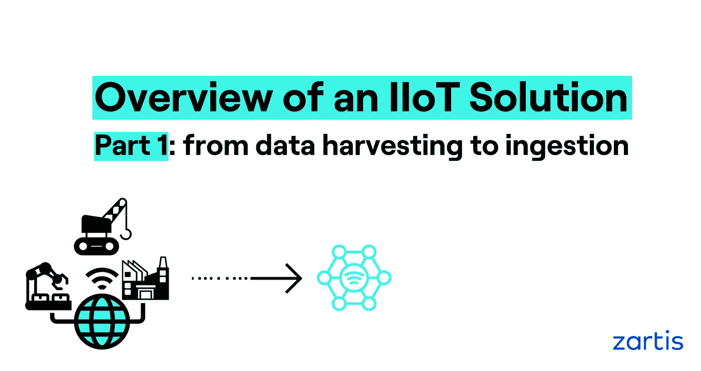
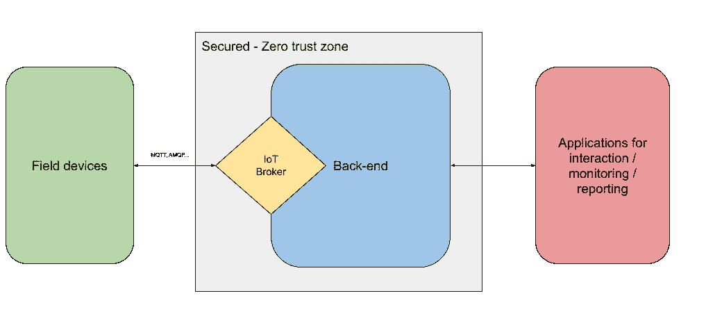
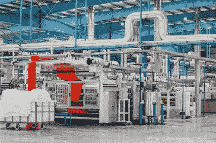
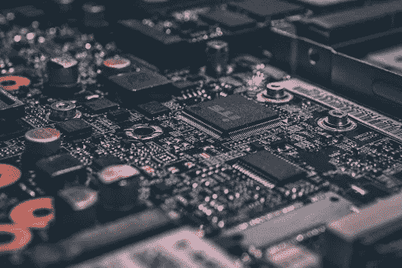
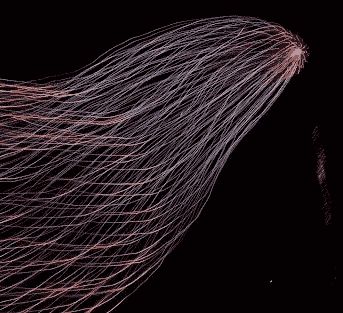

# IIoT 解决方案概述—第 1 部分

> 原文：<https://levelup.gitconnected.com/overview-of-an-iiot-solution-e69085449405>



## 详细了解 IIoT 解决方案，从数据采集到数据接收

您是否曾经在物联网和物联网宣传列车及其流行语中感到迷失？您是否担心 IIoT 系统将如何处理您当前的硬件？在本文中，我们将介绍 IIoT 解决方案的常用系统架构。我们还将描述您在工厂中可以找到的可能场景，以及使您的投资最大化的替代方案。

在过去的几年里，物联网已经成为最热门的话题之一。虽然从多个来源收集数据的设备的概念并不新鲜，但我们现在拥有的设备的规模和种类是前所未有的。此外，网络( [4G](https://en.wikipedia.org/wiki/4G) 和 [5G](https://en.wikipedia.org/wiki/5G) 移动网络)、连接性( [LoRa 和 LoRaWan](https://en.wikipedia.org/wiki/LoRa) 、[dash 7](https://en.wikipedia.org/wiki/DASH7)……)和技术(可用于实施强大物联网解决方案的选项)的发展让我们可以有把握地说，如今我们拥有所需的基础设施和所需的技术来实施有意义的解决方案，解决真正复杂的大规模问题。

## IoT 是什么？

一种说法是，物联网是硬件和软件技术的结合，使我们能够弥合物理世界和数字世界之间的差距。一旦弥合了这一差距，就可以实现许多有意义的事情，使我们的生活更加轻松和安全:从我们可以在自己家里使用智能手机监控和执行操作的家庭解决方案，到允许我们监控和管理超市能耗的复杂解决方案。有无数可能的解决方案和物联网可以发挥作用的地方！

## IoT 和 IIoT 的主要区别是什么？

工业物联网，或工业物联网实施，基本上是物联网技术、概念和方法在工业环境中的应用。换句话说，IIoT 解决方案可以让我们支持和改进，例如，制造流程或管理大型供水网络。

我们将重点关注 IIoT 方面，尝试概述典型的 IIoT 解决方案及其架构、构成这些 IIoT 解决方案的组件以及如何收集数据。

# 常见的意大利式建筑

我们先简单介绍一下 IIoT 解决方案的架构。它通常由四个不同的元素组成:现场设备、物联网代理、后端和用户应用。



**现场设备**负责数据采集，它们在物理上靠近工业过程，通常在车间。这些设备中的一些马也能够从系统接收指令，以便以特定的方式修改它们的行为。这些现场设备的示例可以是 PLC、传感器、执行器、特定物联网设备或任何其他能够收集信息的连接硬件。

**物联网代理**充当接收现场设备收集的所有信息的枢纽。这是任何物联网/IIoT 解决方案的关键支柱之一，因为该组件的性能、可靠性和可扩展性对于整个系统的正确行为至关重要。该组件如此重要的原因是，它可能会接收大量信息，处理数百或数千个现场设备发送的信息。这些信息应该实时处理。

然后我们有了**后端**。在这个图中对它进行了粗略的描述，因为根据我们尝试应用的解决方案的复杂性，后端实现有几个选项。现在，让我们假设后端组件负责处理收集的数据，并采取所需的任何行动，以确保应用业务规则来实现系统的目标。

最后，我们有**应用程序**，终端用户、车间操作员或白领员工使用它们与系统进行交互。例如，持续跟踪工业过程状态的监控工具、报告工具甚至是由 API 实现的集成层，该 API 允许外部系统使用 IIoT 系统生成的部分数据。

# 现场设备和数据收集



一切从数据收集过程开始。**车间或现场设备负责该过程**。这些设备中的一些甚至可以响应某些远程命令或事件，以便最大化工业过程的输出或简单地调整它们的行为。

很多时候，当想到物联网和 IIoT 设备时，脑海中会出现流行的设备:Raspberry Pi、Arduino 板或来自世界另一端的一些传感器。不幸的是，这些组件不适合工业环境。理解**并非所有硬件都适合工业过程**是至关重要的，因为它需要在非常特殊的条件下运行:热、湿度、灰尘…并且在非常长的时间内:24/7。这里的概念如[入口保护](https://en.wikipedia.org/wiki/IP_Code)代码、 [NEMA](https://en.wikipedia.org/wiki/NEMA_enclosure_types) 额定值、工业级元件等。对于确保系统有必要的基础来构建健壮和有弹性的东西是非常重要的。

通常，我们需要处理遗留的基础设施、硬件和设备。在构建 IIoT 系统时，它通常是在现有工业流程的基础上创建的。如果一家公司在 7 年前花费了 1000 万美元来更新他们的生产线，那么可以理解的是，他们仍然希望使用该硬件，而不考虑与花哨的 IIoT 解决方案的兼容性。**能够灵活地将我们的解决方案应用于这些现有的、可能并不智能的设备，这对于系统的真正成功至关重要**。

最后，工厂车间将会有很多这样的设备，智能的和不智能的，所有这些设备将协同工作，为 IIoT 系统提供大量数据。

# 物联网设备



纯物联网设备是能够执行任务并且能够通过网络发送信息的硬件。这些设备可以执行非常具体的任务(如[湿度**传感器**或机械**致动器**)或被设计为通用设备，能够实现真正复杂的任务(如](https://store.ncd.io/product/wifi-temperature-humidity-sensor-for-mqtt/) [**PLC**](https://new.siemens.com/global/en/products/automation/systems/industrial/plc/simatic-s7-1500.html) 或**微控制器**)。

除了信息发送能力之外，这些纯物联网设备中的一些能够从物联网系统接收消息。一个 [PLC](https://en.wikipedia.org/wiki/Programmable_logic_controller) 可以接收来自物联网系统的消息，以调整其行为，例如，如果仓库的容量目前低于 10%，则减慢将材料从仓库移动到生产线第一站的传送带。

# 不太智能的设备

不幸的是，**并不是工业过程中的所有设备都足够智能，至少与纯物联网设备**相比不是这样。在这里，我们不仅仅谈论传统硬件，我们谈论的是无法执行任务并与物联网代理通信的设备。

此外，现代硬件无法通过网络发送数据，或者无法使用与我们的物联网代理兼容的数据传输协议。这方面的例子有很多工业传感器和执行器。这是有意义的，因为如果所有组件都需要实现这些网络和物联网功能，组件的复杂性(和价格)会更高。如果 IIoT 只是一个选项，为什么这些组件要默认兼容 IIoT 解决方案？

记住所有这些，有什么可能的解决方案来克服我们没有足够智能的设备来实现 IIoT 系统环境中的数据收集的情况？让我们探索其中的几个。

## 1-纯硬件解决方案

我们拥有的一个场景是，如果我们当前的硬件允许的话，**利用某些工业规范**，比如 [IO 链接规范](https://en.wikipedia.org/wiki/IO-Link)。这种方法允许我们将多个 IO 链接设备(传感器和执行器)连接到单个 [IO 链接主](https://www.ifm.com/de/en/product/AL1350) r 设备。该主设备可以提供联网能力，而传感器和致动器可以提供执行所需任务的能力。

我们应该探索现有硬件连接到网络的所有可能选项，并使用所需的格式和协议发送信息。

## 基于 2 物联网网关的解决方案

现代硬件可以覆盖的另一个场景是，无法处理 IIoT 系统的多个**设备可以被安排为另一个智能设备**的从设备。这个智能设备将充当 [**物联网网关**](https://en.wikipedia.org/wiki/Gateway_(telecommunications)#IoT_gateway) ，除了其他功能，它还将能够与从设备进行交互，并代表它们发送/接收物联网信息。例如，看看 IIoT 网关的[西门子产品线](https://new.siemens.com/global/en/products/automation/pc-based/iot-gateways.html)。

如果由于某种原因无法投资额外的自动化硬件，或者现有硬件与开箱即用的物联网网关不兼容，我们总是可以选择使用带有软件(定制或第三方)的**工业计算机，直接连接到设备本身，例如使用 [**OPC**](https://en.wikipedia.org/wiki/Open_Platform_Communications) **通信标准**。这个软件将从不太智能的设备中检索数据，对其进行任何需要的操作，然后最终将其发送给物联网代理。**

# 供应设备和安全影响


**供应可视为使负责数据收集的设备对 IIoT 系统可用/可见的过程**。通常，这是在停电或重启后向系统添加新设备或重新连接现有设备的第一步。

安全性是任何现有软件系统的主要关注点之一。这对于 IIoT 系统来说更是如此，在 IIoT 系统中，允许未经授权的设备发送数据可能会导致工业流程对操作该系统的公司来说是灾难性的(DDoS 攻击、信息窃取、破坏……)，这可能会危及很多事情，从流程本身的安全到公司的声誉。

出于这个原因，在任何健壮和安全的 IIoT 系统中，**设备供应和安全性是携手并进的**。我们的系统应该能够确保只有授权的设备才能安全地向物联网代理发送数据。如果一个未经授权的来源正在发送一些东西，这些消息会被简单地拒绝。这种供应方法符合物联网中的首选安全模型:[零信任安全模型](https://en.wikipedia.org/wiki/Zero_trust_security_model)。

实现细节取决于物联网代理组件:其中一些具有内置服务，可以为您大规模地提供这种安全供应(对于 Azure [物联网中心](https://azure.microsoft.com/en-us/services/iot-hub/)，请参见 Azure [设备供应服务](https://docs.microsoft.com/en-us/azure/iot-dps/about-iot-dps)，而其他则利用其他软件基础设施在连接设备时提供这种安全供应(对于 [HiveMQ](https://www.hivemq.com/) ，请参见[选项之一](https://www.hivemq.com/blog/hivemq-enterprise-security-extension/authentication-of-iot-devices-with-ldap/))。

**不要忽视安全供应流程，因为它是 IIoT 系统的关键部分之一！**

# 数据摄取



IIoT 系统中的数据接收是检索现场设备生成的数据，然后决定如何处理的过程；发送到哪里或后端的哪个组件会处理它。在 IIoT 解决方案的环境中，这种数据分发过程通常由称为物联网代理的软件组件来完成。

# 物联网经纪人

物联网代理是一个处理引擎，充当工厂车间设备发送的事件和命令的中心枢纽。许多物联网经纪人利用各种机制来提供双向通信:车间到后端，反之亦然。

关于可用选项，我们有专用产品，如 [HiveMQ](https://www.hivemq.com/) 、 [Mosquitto](https://mosquitto.org/) 、 [RabbitMQ](https://www.rabbitmq.com/) 或主要云提供商提供的服务，如 [Azure 物联网中心](https://azure.microsoft.com/en-us/services/iot-hub/)、 [AWS 物联网核心](https://aws.amazon.com/iot-core/)或[谷歌物联网核心](https://cloud.google.com/iot-core)。

这些选项中的每一个都有一系列特征，可以为您的选择提供平衡:从它们运行的位置(云或本地)、可用的通信协议、创建实例集群的能力、围绕代理的服务、价格…

作为一项建议，**尝试选择在云环境中运行的代理，因为它们在自动扩展以适应工作负载方面更加灵活**。对于小型、单一工厂的解决方案，任何提到的经纪人都能够管理它。如果我们谈论复杂的多工厂和潜在的多地区解决方案，那么将推荐云提供商(Azure、AWS 或 Google Cloud)的产品，因为他们所有的周围基础设施都有助于解决方案的实施。

**如果云解决方案不是一个选项**并且一些东西刚刚在内部实施，**选择一个可以以集群模式配置的代理**以确保一个具有良好性能的弹性解决方案。

# 通信协议

处理 IIoT 系统时的另一个重要选择是决定将使用现场设备和 IoT 代理之间的哪个**数据传输协议**。有许多数据传输协议，但这里我们只提到最常见的协议。

[MQTT](https://en.wikipedia.org/wiki/MQTT) :基于发布/订阅方法的轻量级**协议，用于信息交换。IIoT 中最常见的协议之一，因为它占地面积小，可以用于嵌入式系统。专为带宽**有限的场景**而设计。**

[AMQP](https://en.wikipedia.org/wiki/Advanced_Message_Queuing_Protocol) :它是一个二进制的面向消息的协议，注重可靠性和安全性。它还提供事务、路由和排队功能。它特别关注**互操作性**，这使得它在多客户端环境中大放异彩。

选择将受到物联网代理功能的限制。所有最重要的物联网经纪人都支持 MQTT (Azure 物联网中心、谷歌物联网核心、HiveMQ、Mosquitto……)，只有少数人支持 AMQP (Azure 物联网中心、RabbitMQ)。其他协议目前在可用的物联网代理环境中没有真正的吸引力。

**最终，协议与我们提出的解决方案的契合度以及与物联网代理的兼容性将决定我们与物联网代理交换车间数据的方式。**

# 结论

我们希望我们已经为您提供了一个有趣的概述，并以一些关键要点结束:

首先，我们系统架构适应现有工厂设备的**灵活性**以及我们如何部署新设备是我们解决方案中的一个关键项目，其成功在很大程度上取决于此。

**安全性**是任何系统的基本要素，由于 IIoT 中使用的不同设备的数量，它在这些类型的解决方案中获得了新的维度。

最后，物联网经纪人的**选择也非常重要，因为其摄取数据的能力及其特征将在很大程度上决定我们在通信协议、可扩展性和相关服务方面的现实选择。**

记住这些关键方面将有助于您安全地成功实施 IIoT！

```
This article is written by [Javier Cervera Cano](https://www.linkedin.com/in/javier-cervera-cano-63549047/?originalSubdomain=es). Javi is a Senior Software Engineer at [Zartis](https://www.zartis.com/) with more than 13 years of experience specialized in .NET and Microsoft technologies. He has broad experience designing and building software solutions within the industrial field and worked more than 9 years with global manufacturer companies.
```