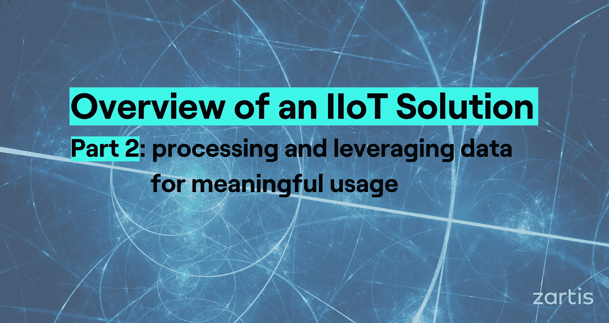
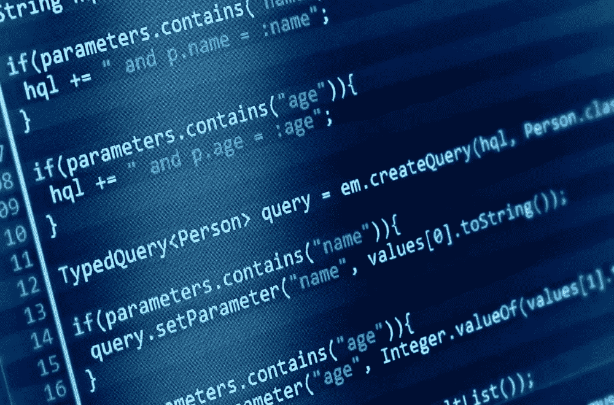
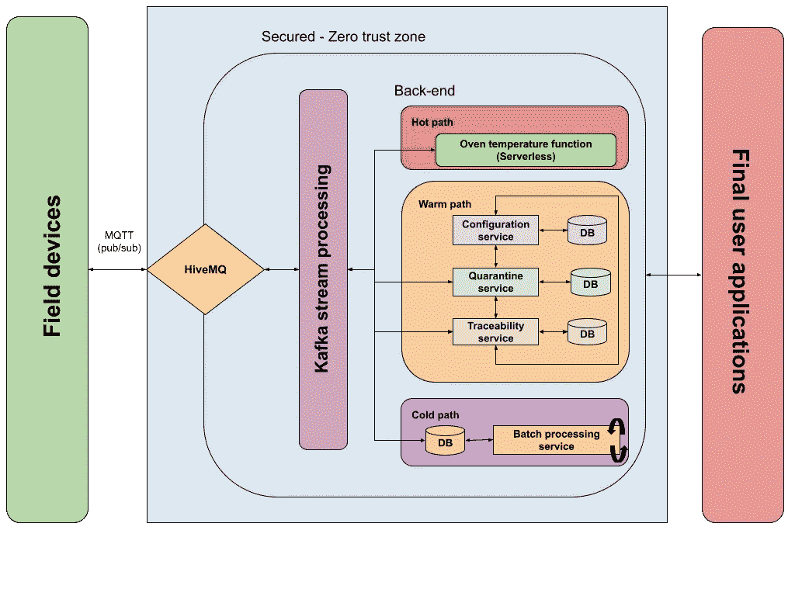

# IIoT 解决方案概述—第 2 部分

> 原文：<https://levelup.gitconnected.com/overview-of-an-iiot-solution-part-2-bf9b8588bdeb>

## 处理和利用数据进行有意义的使用

本文是关于 IIoT 系统和 IIoT 实现的两部分系列文章的第二部分，以利用现实生活中的见解。请随意阅读“[IIoT 解决方案概述:从数据采集到摄取](/overview-of-an-iiot-solution-e69085449405)”了解更多信息。

一旦在车间内收集了数据并被系统接收，您会如何处理这些海量信息？你如何理解所有这些原始数据？在本文中，我们将介绍 IIoT 后端实现的不同方法，如何处理收集到的数据，以及用户如何与系统交互。

# IIoT 在后端的实现

与任何其他系统一样，后端实现没有灵丹妙药，因为它依赖于我们试图解决的业务案例的细节，以及负责完成它的团队。某些系统非常适合[事件驱动架构](https://en.wikipedia.org/wiki/Event-driven_architecture)，而其他系统可以由一组[微服务](https://en.wikipedia.org/wiki/Microservices)组成。甚至[巨石](https://en.wikipedia.org/wiki/Monolithic_application)也能在这里发挥作用🙂

说到这里，我们将描述两种可能的场景，以及我们如何在后端处理 IIoT 实现:简单的业务案例和复杂的业务案例。这将提供一个可能的方法概述和一个实际的例子。

# 简单的解决方案

当谈到简单的解决方案时，我们指的是在处理物联网事件时不希望区分事件类型的解决方案。本质上，解决方案中存在没有优先级的**同构物联网消息处理**。

让我们设想一个系统，其中我们想要实现的业务案例是制造过程的质量跟踪。系统应该从车间收集某些信息，摄取、处理这些信息，最后将部分信息提供给最终用户。例如，我们可以通过一个简单的微服务解决方案来实施该系统，其中每个微服务在业务案例中都有其限定的上下文，其中一些服务订阅了工厂车间内生成的物联网事件。每个微服务都有自己的数据库作为物联网数据存储。

此解决方案的图表如下所示:

这个假设的系统生成两种不同类型的事件:可追溯性和隔离事件。实际上，这些事件是在生产线内处理制造的零件时发布给我们的物联网代理的 MQTT 消息(在本例中为 [HiveMQ](https://www.hivemq.com/) ，尽管这对任何其他发布/子物联网代理都有效)。

当每一个制造的零件到达生产线上的多个工位之一，并在那里对该零件进行操作时，就会生成可追溯性事件。例如机械加工操作。附加到该操作的物联网设备检索与之相关的所有数据(日期和时间、加工参数……)，然后发布该物联网事件。在后端方面，在利用物联网代理发布/订阅基础设施的同时，可追溯性微服务在订阅主题时检索该事件。一旦微服务处理了事件，就会应用业务逻辑:存储假设报告特性的信息，检查所有制造参数是否良好，等等

隔离事件由生产线内部的操作子集生成。让我们想象一下，一个应该附加在正在制造的主要零件上的部件是由第三方公司提供的。他们把这些部件装在大箱子里寄出，所有这些部件都属于一批。为了跟踪这些组件，有一个特定的工作站将这些组件装入生产线，并检查组件是否符合规格。如果出于某种原因，其中一个组件有缺陷，业务规则是隔离属于同一批次的所有组件以及它们所附着的部件(如果有的话)。当检测到有缺陷的组件时，IoT 事件被发送到后端，以触发指定的流程来实现该业务规则。与可追溯性事件一样，这一切都始于由这个组件加载站发布并由隔离微服务处理的 MQTT 事件。这个微服务将与其他微服务一起工作，以满足我们上面描述的业务规则。

上面描述的跟踪和隔离事件的方法可以根据您的需要进行扩展。这背后的关键思想是**现场设备正在发布 MQTT 事件，这些事件将由后端订户使用我们的物联网代理基础设施来消费。**这些后端消费者可以被设计成任何其他系统。从整体方法到旨在实现满足我们系统用例所需的业务规则的微服务组合。

# 高级解决方案

另一方面，我们拥有先进的 IIoT 解决方案。这些类型的解决方案在事件的多样性和这些事件的优先级方面处理了更多的复杂性。例如，在所有不同的事件中，有些是任务关键型的(可能涉及过程安全),有些只是数据，应该在一天结束时汇总以生成一些报告。我们如何应对这些情况？为了回答这个问题，让我们介绍另一个我们应该用 IIoT 系统处理的假设工业过程。

让我们想象一下一家钢铁工业公司生产其他制造商使用的钢条的工业流程。该公司希望监控广泛的过程部分，包括烘箱温度、棒材的质量跟踪(从烘箱到装运)以及工厂不同区域的温度，以分析劳动条件并做出中长期决策来改善工作场所的条件。

正如我们所看到的，就业务规则而言，我们谈论的是不同的元素。例如，烘箱温度应具有实时监控/数据收集功能，因为必须有一个硬阈值，如果烘箱温度超过某一温度，它将被快速冷却，以确保其组件的完整性:这涉及一个关键任务事件，因为它会影响过程的安全性。与工作场所报告中的数据聚合相比，这是一种非常不同的需求，在工作场所报告中，我们根本不需要实时监控。

为了实现这种数据分类，并决定我们希望如何处理每一个事件，**我们可以利用数据路径的概念**。

## 数据路径:

数据路径方法背后的想法非常简单:**实时分析摄取的事件，对它们进行分类，并决定 IIoT 系统的哪个部分应该处理它们。**这一想法与[流处理](https://en.wikipedia.org/wiki/Stream_processing)的概念紧密相关。

让我们来看一张把所有这些想法放在一起的图表。

当一个新事件被摄取时(在这个例子中是 [HiveMQ](https://www.hivemq.com/) ，但是你可以想到任何其他的物联网代理)，它被流处理引擎处理(图中显示了 [Apache Kafka](https://kafka.apache.org/) ，但是这里可以使用任何其他的流处理器)。基于预定义的规则，流处理引擎能够对刚到达的事件进行分类，将其发送到数据路径之一进行处理:热、暖或冷数据路径。这个分类可以理解为一个 [ETL](https://en.wikipedia.org/wiki/Extract,_transform,_load) 过程。

## 热门:

**热数据**路径旨在代表系统的一部分，该部分应**负责近实时处理的事件数据**。在此路径中，处理应该以非常低的延迟发生，并且可以理解为具有最高优先级的数据路径。

在我们假设的系统中，该路径将处理由烤箱发送的报告实际温度的 MQTT 事件。应该实时处理该事件以做出关键决策(在我们的假设情况下，当达到硬阈值时，系统可以启动冷却过程)。在我们的图中，这个决定是由一个无服务器的函数(例如 [Azure 函数](https://azure.microsoft.com/en-us/services/functions/))做出的，其中应用了适当的业务规则。

## 温暖:

**热数据路径**负责处理应该尽快**处理的事件，但可以适应更长的延迟**。该路径非常适合于正常的事件处理，并且可以被视为具有平均优先级的数据路径。

这转化为我们的假设系统，适合于制造钢棒的质量跟踪过程。生产线上的不同车站/操作将发布 MQTT 事件，跟踪每个单元、它们的位置以及对它们采取的措施。这些事件将被接收，然后由流处理器重定向到热数据路径。该数据路径类似于我们在“简单解决方案”部分描述的系统，由微服务子系统实现。

## 冷:

**冷数据**路径代表**在报文处理**方面的最低优先级。通常，这条路径与管理大量数据的 [**批处理**](https://en.wikipedia.org/wiki/Batch_processing) 活动相关，并被周期性地触发(例如，每小时或每天)。在这种数据路径中，系统可以适应大的延迟，因为在这里执行的信息和过程不是最高优先级。

在我们的系统中，这由批处理服务及其数据存储来表示。工作场所的温度由适当的传感器收集，并作为 MQTT 事件发布。然后，流处理引擎对这些事件进行分类，并将它们发送到存储这些信息的数据库，以便进行批处理，批处理将定期进行。这部分系统可以通过一个数据库和一个独立服务的组合来实现，也可以使用像 [Azure Batch](https://azure.microsoft.com/en-us/services/batch) 这样的云服务来实现。

# 回到车间

我们已经描述了后端如何处理收集到的数据的几个选项，但是有一个关键问题仍有待解决:**我们如何从后端与车间互动？**

这个问题并不简单，因为许多 IIoT 系统不能被设计成数据收集系统，因为我们想要对车间内发生的事件做出反应。让我们探索一下可行的选择。

# 1-发布/订阅:

如果正在使用的物联网代理支持发布/订阅模式，它可以用于实现物联网设备和物联网后端之间的双工通信。

物联网设备可以向某个主题发布消息，通常也能够订阅主题。通过利用这种场景，并**仔细组织主题**，物联网设备可以使用它们交换信息。让我们看一个实际的例子:

在本例中，我们有一个假想的物联网设备发布正在收集到特定主题中的信息:“设备/op10/数据”。该主题名称不是随机的名称，因为它包括发布者“设备”的性质、发布者“op10”的标识符以及发布者试图通过该主题“发布数据”实现的目的。

后端中订阅的组件(即可追溯性服务)将接收物联网事件并对其进行相应的处理。让我们想象一下，在事件处理之后，后端确定物联网设备应该执行一个额外的操作。这可以通过后端组件将另一个物联网事件发布到一个众所周知的主题中以接收响应来实现。题目是“设备/op10/结果”。还是那句话，应答题目的名字不是随便起的，它有目标“一个设备”的性质，有目标“op10”的标识符，有这个题目的目标“接收结果事件”。物联网设备订阅响应主题，并使用收到的信息来确定适当的操作。

建议在发布的数据和发布的响应中提供一个**关联标识符**，以允许物联网设备将发布的消息与其响应相关联。这允许您在多个事件到达结果主题时避免问题。

如果由于某种原因，我们希望在某些消息后采取行动的物联网设备无法订阅主题以接收其消息的响应，请考虑将该设备视为不太智能的设备，并利用我们在[的第一篇文章](https://www.zartis.com/iiot-solutions-overview-1/)中描述的一种可能的解决方案:探索硬件替代方案或在物联网网关后配置该设备。

# 2-内置功能:

一些物联网代理提供内置选项，用于将消息从后端大规模发送到物联网设备。在这里，我们将回顾主要云提供商为我们提供的帮助物联网和云计算平台集成的选项。

例如，在 [Azure 物联网中心](https://azure.microsoft.com/en-us/services/iot-hub/)的情况下，该平台允许[三种不同类型的云到设备通信](https://docs.microsoft.com/en-us/azure/iot-hub/iot-hub-devguide-c2d-guidance)用于 MQTT 和 AMQP 协议:

*   [直接沟通](https://docs.microsoft.com/en-us/azure/iot-hub/iot-hub-devguide-direct-methods)。这种方法旨在提供一种从云中调用设备上的直接方法的方式。这可以用来实现请求-响应模式，并允许我们将操作结果发送到我们的设备。
*   [设备双胞胎接近](https://docs.microsoft.com/en-us/azure/iot-hub/iot-hub-devguide-device-twins)。这种方法是控制设备元数据、设备配置或设备内部定义的长期条件的最佳方式。
*   [云到设备通知](https://docs.microsoft.com/en-us/azure/iot-hub/iot-hub-devguide-messages-c2d)。这种方法基本上实现了单向通信，可以用于通知系统内的事件，并且可以让设备在需要时做出相应的动作。

另一方面，[亚马逊物联网核心](https://docs.aws.amazon.com/iot/index.html)提供了一个内置选项来实现这种云到设备的通信:

*   [AWS 物联网设备影子服务](https://docs.aws.amazon.com/iot/latest/developerguide/iot-device-shadows.html)。该服务旨在提供一种可靠的方法，在我们上面描述的原始 MQTT 发布/订阅选项之外与设备交换信息。

相比之下，与其他云提供商相比，[谷歌物联网核心](https://cloud.google.com/iot)选项是围绕我们之前描述的发布/订阅方法构建的。参见[谷歌命令](https://cloud.google.com/iot/docs/how-tos/commands)。

如果出于某种原因，您想要与之通信的物联网设备无法处理这些内置功能，您可以随时考虑将其置于物联网网关之后，该网关可以处理这些通信类型的实现细节。

# 最终用户应用

那么，IIoT 的实施将如何惠及最终用户呢？

IIoT 系统为工业过程提供了透明度，并覆盖了物理世界和数字世界之间的鸿沟。这些系统使用户能够根据数据做出明智的决策，并允许我们提取所有必要的信息，使用这些信息来**监控、行动、发现和优化工业过程中的薄弱环节。**

在这种情况下，任何 IIoT 系统的最终目标之一是向最终用户提供信息，并允许他们通过 web 或移动界面与系统进行交互。这些是这些类型的应用程序的一些一般注意事项。

当处理允许用户**与系统**交互的应用程序时，利用像 [API 网关或前端后端](https://microservices.io/patterns/apigateway.html)这样的架构模式。这种用于用户交互的专用接口将为系统提供一个入口点，不同于物联网代理，物联网代理应只关注物联网事件摄取。

另一方面，**报告**总是任何系统的组成部分。**在可能的情况下，**利用**数据汇总系统**(参见 [Splunk](https://www.splunk.com/) 、[Times Series Insights](https://azure.microsoft.com/en-us/services/time-series-insights/)……)可以插入您的系统，并可用于生成报告。如果无法选择这些系统，请尝试将报告作为您系统的一个**附加层(** [**报告层**](https://www.linkedin.com/pulse/building-reporting-service-microservice-architecture-abdur-/) **)** ，它订阅用于生成报告的所需事件，而不会影响物联网事件的摄取/处理吞吐量。这个报告层有自己的针对报告优化的持久性，拥有数据是生成预期报告的唯一需求。

最后，**如果其他系统需要与 IIoT 系统集成，一个好的建议是提供一个集成层**(例如通过 [API 网关](https://microservices.io/patterns/apigateway.html))，它抽象出对负责事件处理的后端的访问。这允许我们实现上述相同的隔离，以避免影响处理吞吐量。

# 结论

我们希望您喜欢 IIoT 实施概述的第二部分。最后，我们想强调几个要点。

首先，**不要过度工程化你的后端**。在开始处理流处理引擎和数据路径之前，分析您的解决方案，以确定它是否符合简单解决方案的定义，因为它们看起来很酷。

其次，如果您的系统需要与车间通信，**评估您的物联网代理允许您向物联网设备发送消息的方式**。这是一个至关重要的部分，因为性能和易于实施可能会打破物联网经纪人之间的平衡。

最后，**避免在处理后直接使用系统生成的数据，**考虑使用集成层进行第三方集成(如果有的话)。或者，您可以使用报告层或数据聚合器系统来适当分离物联网系统的问题，并最大限度地提高后端的处理能力。

我们希望考虑这些关键方面将有助于您安全地成功实施 IIoT。

—

# 作者:

哈维尔·塞尔韦拉·卡诺是一名高级软件工程师，在以下领域拥有超过 13 年的专业经验。NET 和微软技术。他在工业领域拥有丰富的设计和构建软件解决方案的经验，并在全球制造公司工作了 9 年多。

如果您在开发物联网/物联网解决方案方面需要帮助，或者需要关于该主题的更多信息，请随时联系他并向他提出您的问题！