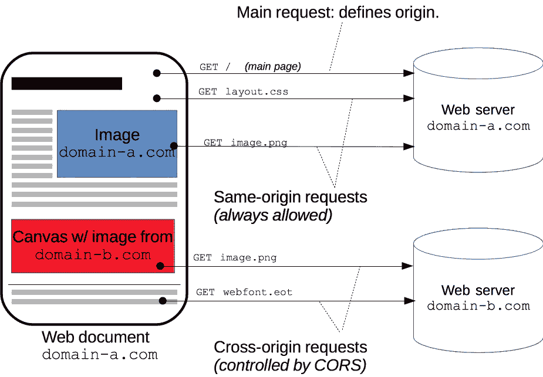
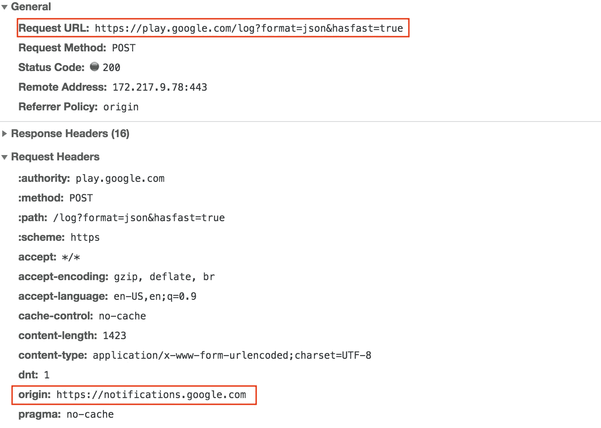
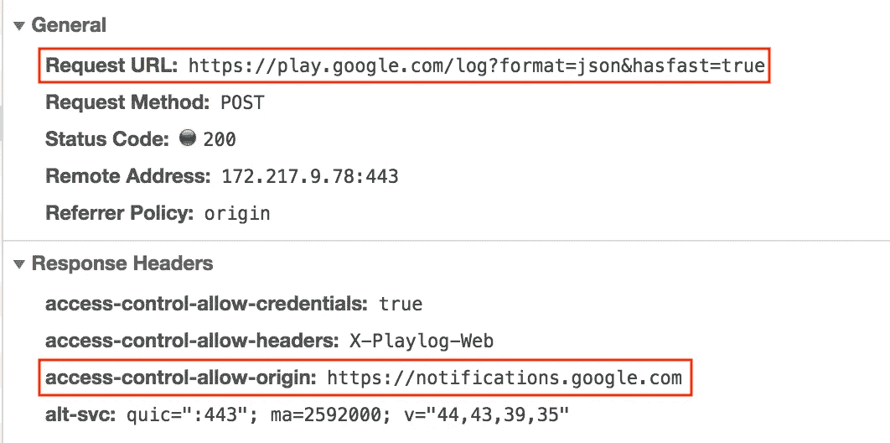
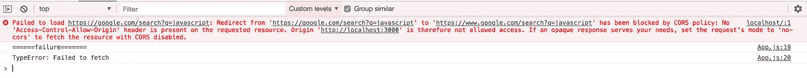
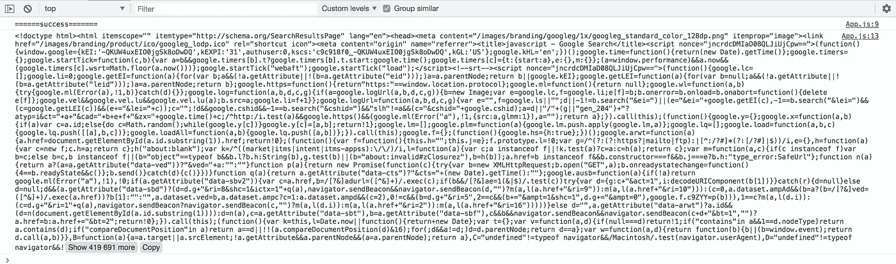
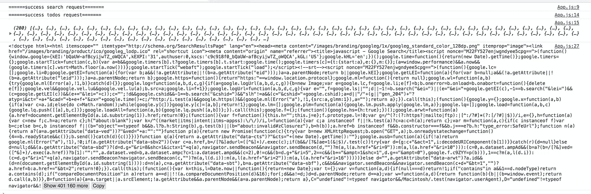

# 代理服务器概述，CORS，以及我们如何在 React 中使用它们

> 原文：<https://levelup.gitconnected.com/overview-of-proxy-server-and-how-we-use-them-in-react-bf67c062b929>


这个话题一直是过去[几](https://github.com/facebook/create-react-app/issues?utf8=%E2%9C%93&q=proxy+requests)年[年](https://stackoverflow.com/search?q=%5Bcreate-react-app%5D+proxy)几次讨论的焦点。而且，我在这里又要说一遍了。然而，我的方法将与我遇到的大多数其他文章略有不同。除了关注*如何*之外，我还将关注这个问题的*为什么*部分——这通常被认为是可以理解的。

## 什么是代理？

一般来说，*代理*是一个服务器或服务，它可以根据配置在我们的通信中引入额外的层来混淆或修改内容。

一个非常简单的例子就是代理我们的 IP 地址，同时发送访问 YouTube 视频的请求，这些视频目前在您的国家*不可用*。

## 为什么我们需要代理？

[在 web 开发的背景下](https://developer.mozilla.org/en-US/docs/Web/HTTP/CORS)，我们使用代理的主要目的是避免 CORS(跨源资源共享)“问题”，这是因为浏览器执行同源策略来保护用户免受 XSS 和其他几种类型的攻击。

简而言之，这意味着浏览器出于安全原因，会限制来自与托管 UI 不同的[](https://developer.mozilla.org/en-US/docs/Web/HTTP/Headers/Origin)*的请求，从而防止攻击者通过广告或插件向我们的应用程序中注入代码来窃取我们的凭据或其他敏感信息。*

*下面是来自 [MDN](https://developer.mozilla.org/en-US/docs/Web/HTTP/CORS) 的一张图片，它解释了一个支持 CORS 的网页执行什么请求。*

**

*但是服务器如何知道请求是否来自同一个*源*呢？以**请求头**的形式。浏览器附加一个名为`origin` *、*的请求头，用于跨源请求*、*以表示请求来自哪个`origin`。然后，服务器有权通过提供由浏览器解析的特定的**响应头**来允许或拒绝这些*源*。*

*例如，当我们加载 Google 的主页时，它向不同的*源*发出几个请求。跨来源请求的示例如下所示:*

**

*在响应中，我们接收到了`access-control-allow-*`报头，这使得这两个*起点*之间能够进行跨起点通信。*

**

*`access-control-allow-*`头具有各种职责，服务器可以通过这些头定义认证机制、可接受的头值和允许的 HTTP 方法类型。*

*由于缺少了`access-control-allow-origin`头，我们的请求虽然成功，但会被浏览器阻止，我们将无法访问请求的响应。*

## *代理服务器是如何出现的？*

*到目前为止，我们只讨论了一个服务器向另一个服务器发出请求的例子。对于上面的例子，`notifications`服务器被列入白名单，以便在`google.com`联系`play`服务器。但是，通过将`access-control-allow-origin`设置为`*`来将所有*源*列入白名单是不合理的，除非它是公共服务器。在开发过程中，另一个常见的模式是在`localhost:$port`运行我们的 UI 应用程序，但是为了方便 API 调用而加入白名单`localhost`是一个反模式，应该避免。*

*相反，我们应该使用代理服务器来处理浏览器施加的限制。在这种情况下，代理服务器负责处理我们的请求、响应，并进行必要的修改以促进跨源通信。为了理解代理服务器的一些内部工作方式，让我们看一下非常著名的 NodeJS 代理库 [node-http-proxy](https://github.com/nodejitsu/node-http-proxy) 。*

*从很高的层面来看，当使用 node-http-proxy 的应用程序发出请求时，会执行两个步骤，如本文档摘录所示:*

> *当一个请求被代理时，它遵循两个不同的管道(这里有)，这两个管道将转换应用到`*req*`和`*res*`对象。第一个管道(传入)负责创建和操作将客户端连接到目标的流。第二个管道(传出)负责创建和操作从目标向客户机返回数据的流。*

*更深入的调查显示，正在发出的请求被捕获，并基于所提供的配置被覆盖/修改[，这里是](https://github.com/nodejitsu/node-http-proxy/blob/master/lib/http-proxy/passes/web-incoming.js#L100)。请求路径到代理路径的修改可以在[这里](https://github.com/nodejitsu/node-http-proxy/blob/master/lib/http-proxy/common.js#L78-L104)找到。*

*类似地，响应被捕获和修改的主要是[这里是](https://github.com/nodejitsu/node-http-proxy/blob/master/lib/http-proxy/passes/web-outgoing.js#L85)。*

## *create-react-app 如何处理代理*

*既然我们对为什么需要代理服务器以及它们在内部如何工作有了基本的了解，现在我们可以继续了解 React 应用程序如何使用代理服务器。让我们看看在 React 应用程序中处理 HTTP 请求的几种最常见的方法。*

*在检查下面的用例之前，使用`create-react-app`创建一个新的应用程序，它使用`webpack-dev-server`来启动我们的开发服务器。`webpack-dev-server`可选地接受一个具有必要结构的代理对象，如这里的[所定义的](https://github.com/facebook/create-react-app/blob/next/packages/react-scripts/scripts/start.js#L101-L120)。让我们分解这些步骤，进一步分析使用`create-react-app`的 React 应用程序如何处理请求代理。*

```
*const proxySetting = require(paths.appPackageJson).proxy;*
```

*首先，它从`package.json`文件中提取代理配置。*

```
*const proxyConfig = prepareProxy(proxySetting, paths.appPublic);*
```

*然后，`[prepareProxy](https://github.com/facebook/create-react-app/blob/next/packages/react-dev-utils/WebpackDevServerUtils.js#L266-L385)`方法通过将上一步中提取的`proxySettings`与一些基于执行环境的有效缺省值相结合，准备必要的代理配置。现在生成的代理配置将最终传递给`node-http-proxy`，由`webpack-dev-server`用来代理请求。*

```
*const serverConfig = createDevServerConfig(
    proxyConfig,
    urls.lanUrlForConfig
);*
```

*下一步是使用`proxyConfig`创建`webpack`服务器配置。*

```
*const devServer = new WebpackDevServer(compiler, serverConfig);*
```

*最后，使用`serverConfig`和`compiler`设置`devServer`。*

## *常见使用案例*

*在下面的例子中，我们将研究在 react 应用程序中代理请求的不同方式。*

***1。使用 fetch***

*有了使用`create-react-app` CLI 创建的新应用，我们可以直接进入编码:*

*如果没有代理，请求将被`google.com`服务器拒绝，我们会在控制台上看到拒绝记录。*

**

*但是，当我们将`proxy`条目添加到`package.json`条目时，请求被成功代理，我们可以加载服务器返回的信息。在这种情况下，它是一个 blob，所以我们需要一些额外的处理来提取文本。*

*更新的组件:*

*并将结果记录到 UI 中，如下所示:*

**

***2。对不同路径使用自定义目标***

*由于不是所有的请求都到达同一个服务器，我们可以在我们的`package.json`文件中为每个`path`定义`paths`和`target`:*

*在我们的组件中，在发出请求时，会应用此配置，并将我们的请求发送到相应的服务器:*

*由于`blob`和`.json()`方法的`async`性质，响应是无序的，如下所示:*

**

*需要注意的一件奇怪的事情是，我们在`package.json`文件中使用了`changeOrigin`标志。该标志将主机头的*来源*更改为目标 URL，从而实现成功连接。这里还有其他类似的有用选项。*

***3。使用 axios***

*如果您的应用程序使用`axios`而不是`fetch`来发出`http`请求，那么设置代理与我们到目前为止所做的没有什么不同。*

*让我们添加另一条路径，使用`axios`从`typicode`获得`posts`。在继续更新`package.json`文件之前，使用`npm`或`yarn`安装`axios`，如下所示:*

*现在可以更新组件，以使用`axios`发出请求:*

*使用`axios`的好处是我们现在可以轻松地向我们的`http`请求添加额外的选项和特性。其中一个特性是使用拦截器来拦截每个应用程序的请求和响应，而不是每个请求。*

*上面例子的完整代码可以在[这里](https://github.com/40x/proxy)找到。*

**如果你喜欢这个博客，一定要为它鼓掌，* [*阅读更多*](https://medium.com/@kashyap.mukkamala) *或者关注我的*[*LinkedIn*](https://www.linkedin.com/in/kashyap-mukkamala/)*。**

*[](https://levelup.gitconnected.com)**[](https://gitconnected.com/learn/react) [## 学习 React -最佳 React 教程(2019) | gitconnected

### 前 45 名 React 教程。课程由开发人员提交并投票，使您能够找到最佳反应…

gitconnected.com](https://gitconnected.com/learn/react)*