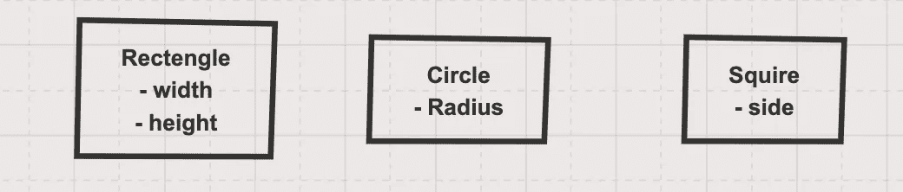
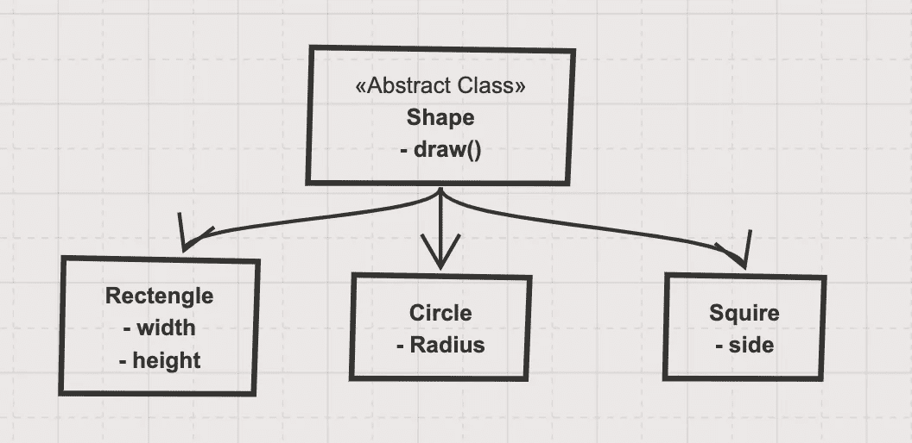
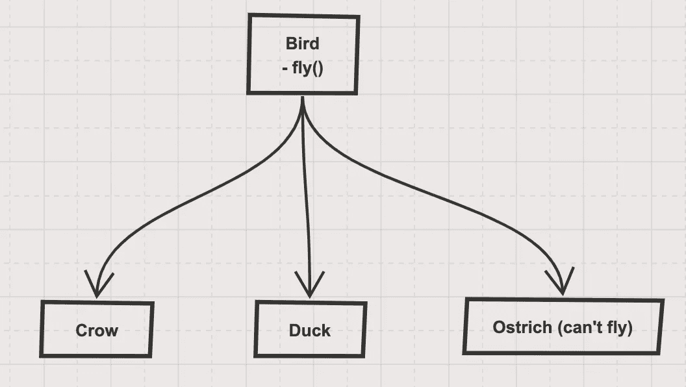
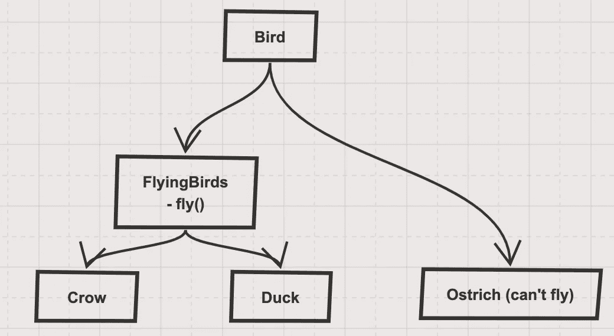
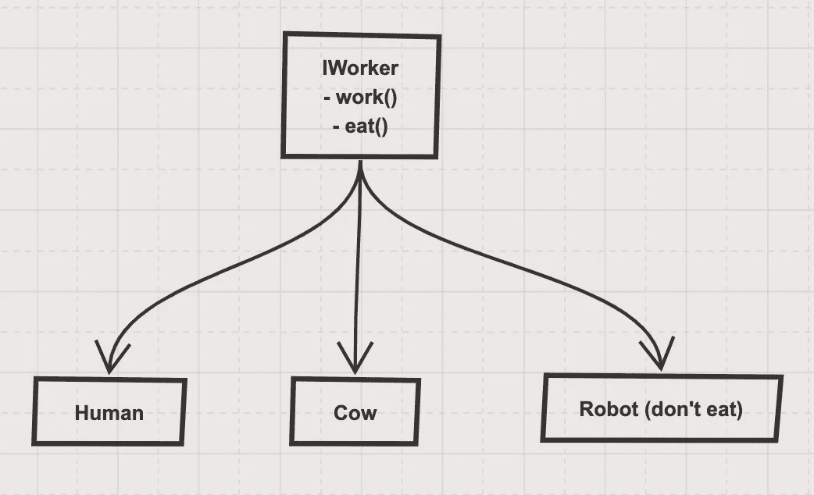

# 固体原理及其 JAVA 实现概述

> 原文：<https://levelup.gitconnected.com/overview-of-solid-principles-and-its-java-implementations-4ae37fa5bb1b>

## 创建可理解的、可读的和可测试的代码，许多开发人员可以协作工作


图片来源—[www.pexels.com](http://www.pexels.com)

坚实的原则是面向对象类设计的五个原则。它们是设计类结构时要遵循的一组规则和最佳实践。

SOLID 是 Robert C. Martin(也被称为[Bob 叔叔](http://en.wikipedia.org/wiki/Robert_Cecil_Martin))提出的前五个面向对象设计(OOD)原则的首字母缩写。

采用这些实践还有助于避免代码味道、重构代码以及敏捷或适应性软件开发。

## **今天我们将学习以下话题**

1.  什么是坚实的原则及其在软件工程中的重要性
2.  用最简单的方式描述每个原则，包括适当的图像和描述。
3.  使用可靠的原则重构旧的错误代码

## **什么是坚实的原则？**

在面向对象的计算机编程中，SOLID 是五个设计原则的助记首字母缩写词，旨在使软件设计更易于理解、灵活和维护。

著名计算机科学家罗伯特·j·马丁(又名鲍勃叔叔)在 2000 年的论文中首次介绍了这些坚实的原理。但是这个缩写词后来被迈克尔·费哲引入。

在实心首字母缩写词之后，它们是:

单一责任原则

O - **O** 关笔原理(OCP)

L-**L**伊斯科夫替代原理(LSP)

I-**I**界面分离原理(ISP)

D-**D**依赖反演原理(倾角)

# **坚实原则在软件工程中的重要性**

这些是通用的指导原则，如果遵循这些原则，就可以减少出现糟糕的应用程序设计的可能性。与这些原则密切相关的 Robert Martin 列出了糟糕设计应该避免的三个重要方面:

1.  僵化很难改变，因为每一个改变都会影响系统的太多其他部分。
2.  **脆弱** 当你做出改变时，系统中意想不到的部分会崩溃。
3.  **不动** 很难在另一个应用中重用，因为它无法从当前应用中脱离。

重要性如下所示:

*   为了获得好的软件，我们必须总是尝试低耦合和高内聚，坚实的原则帮助我们完成这个任务。
*   坚实的原则是软件设计编码标准，所有开发人员都应该对正确开发软件有清晰的概念，以避免糟糕的设计
*   坚实原则的广泛目标是减少依赖性，以便工程师在不影响其他领域的情况下更改软件的一个领域。
*   此外，它们旨在使设计更容易理解、维护和扩展。
*   最终，使用这些设计原则使软件工程师更容易避免问题，并构建适应性强、有效且敏捷的软件。
*   然而，这些额外的时间和努力是值得的，因为它使软件更容易维护、测试和扩展。
*   这些原则已经变得流行起来，因为当正确遵循时，它们会产生可读性、可维护性、设计模式和可测试性更好的代码。

# **单一责任原则**

> 一个阶级应该有一个，而且只有一个改变的理由——罗伯特·c·马丁

*   这个原则意味着每个类只做一件事，每个类或模块只负责软件功能的一部分。
*   确保低耦合代码。
*   确保编码更容易理解和维护。
*   单一责任原则是一个相对基本的原则，大多数开发人员已经在利用它来构建代码。它可以应用于类、软件组件和微服务。
*   利用这一原则可以使代码更容易测试和维护，使软件更容易实现，并且有助于避免未来变化的意外副作用。
*   为了确保在开发中遵循这一原则，可以考虑在构建时使用自动检查来限制类的范围。

让我们描述一个违反 SRP 的代码

假设我们有一个服务类，它接受来自控制器层的请求。它执行以下任务

*   构建客户域对象，并将其保存到客户存储库中。
*   构建通知对象，并向连接的设备发送短信、电子邮件或推送通知等通知

检查代码

这里，客户对象正在使用**客户仓库**进行保存。之后在 **sendNotification** 方法中，调用短信网关发送短信，建立 email 并直接发送，建立 push 通知并从这里直接发送通知。

这段代码的问题是

1.  这里是客户服务，它应该负责处理与客户相关的操作。但是在这里，我们也处理与通知相关的任务。
2.  对于新的开发人员/贡献者来说，理解代码库会很困难。
3.  如果你的通知相关的任务需要修改，那么你必须改变客户服务，这是一个有风险的过程。
4.  在单元测试期间，由于这里的混合逻辑，很难测试这个类。为了测试通知服务，应该对它们进行集成测试。

这个问题的解决方案

很简单。只需从客户服务部门转移所有与通知相关的代码。它会自动解决。检查以下代码

在这里，我们添加了 NotificationService，并将与通知相关的任务传递给 NotificationService。它将处理所有与通知相关的任务。

# **开闭原理(OCP)**

> 软件实体(类、模块、函数等。)应该对扩展开放，但对修改关闭

根据这一原则，软件实体必须易于扩展新功能，而不必修改其使用中的现有代码。

下面给出两个要点:

1.  **打开进行扩展** 可以添加新的行为来满足新的需求。
2.  **关闭用于修改** 用于扩展新行为不需要修改现有代码。

以下是解释:

*   开闭原则的思想是，当需要添加某些东西时，需要修改现有的、经过良好测试的类。
*   然而，改变类会导致问题或错误。你只是想扩展它，而不是改变类。
*   考虑到这个目标，Martin 总结了这个原则，“你应该能够扩展一个类的行为而不用修改它。”

检查以下违反开闭原则的代码



图片来源—作者

下面是类结构，它的类结构如下

现在，这里是绘制图形的代码。假设您的开发人员非常懒惰，他/她实现了下面的代码

这里，从 main 类构建对象后，将它传递给 ShapePrinterService 类的 drawShape 方法。这里它正在画形状。

调用结构如下所示

```
Circle circle = new Circle();
circle.setRadius(5);
sharePrinterService.drawShape(circle);
```

该代码存在以下问题

1.  对于像多边形这样的新形状，您必须在 drawShape 方法中添加一个新的 if close。这些新的变化/实现可能会产生一个 bug
2.  这种类型的代码很难调试来解决错误。

但是使用下面的代码你可以很容易地解决这个问题。检查下面的代码和结构。



图片来源—作者

在这里，所有具体的实现都实现了 Shape 抽象类。现在你的班级将会被咆哮

这里，抽象类 Shape 有抽象方法 draw，所有实现都必须实现这个抽象方法。所以这些具体的实现必须实现自己的实现。调用过程如下所示:

```
Circle circle = new Circle();
circle.setRadius(5);
circle.draw();
```

现在，对于新的实现，您不需要更改现有的代码。

# **利斯科夫替代原理**

> **如果类 *A* 是类 *B* 的一个子类型，那么我们应该能够用 *A* 替换 *B* 而不会中断我们程序的行为。**

这意味着每一个子类或派生类都应该可以替换或等价于它们的基类或父类。

这是预期的行为，因为当我们使用继承时，我们假设子类继承了超类的所有东西。子类扩展了行为，但从未缩小范围。

因此，当一个类不遵守这个原则时，就会导致一些难以察觉的讨厌的 bug。

这个原理是以芭芭拉·利斯科夫的名字命名的，她在 1987 年引入了行为亚分类的概念。

**它有两部分:**

1.  子类可以代替基类
2.  那么子类必须保持程序行为不变。

在五个坚实的原则中，利斯科夫替代原则可能是最难理解的一个。

这个原则有助于避免变更的意外后果，并避免为了进行变更而必须打开一个关闭的类。它使软件的扩展变得容易，虽然它可能会减慢开发过程，但是在开发过程中遵循这个原则可以避免更新和扩展过程中的许多问题。

很难实现，没问题。开始编码吧，我们会轻松实现的。

检查下面的例子作为一个坏的例子和架构



图片来源—作者

在这里，嗉囊和鸭子都是会飞的鸟，但是**鸵鸟**也是不会飞的鸟。如果我们设计下面的类，那么它将破坏 LSP

鸵鸟是鸟，但它不会飞，鸵鸟类是类鸟的一个子类型，但它应该不能使用 fly 方法，这意味着我们违反了 LSP 原则。

如何解决这个问题。让我们看看下面的例子:



图片来源—作者

在这里，我们做如下修改

*   我们从 Birds 类中移除了 fly()方法。鸟类只是所有鸟的共同属性。
*   创建新的类 FlyingBirds，并在该类中添加 fly()方法。
*   所有能飞的鸟都是复鸟。
*   鸵鸟直接扩展了鸟类。现在它不会创建任何异常。

# **界面分离原理(ISP)**

> 制作特定于客户端的细粒度接口。不应该强迫客户实现他们不使用的接口。

*   打破肥胖的界面。
*   该原则指出，许多特定于客户端的接口比一个通用接口更好。不应该强迫客户实现他们不需要的功能。
*   这个原则定义了一个类不应该实现不能使用的接口。
*   相反，首先构建一个新的接口，然后让您的类根据需要实现多个接口。
*   更小的接口意味着开发人员应该更喜欢组合而不是继承，更喜欢解耦而不是耦合。
*   不遵守这一原则意味着在我们的实现中，我们将依赖于我们不需要但却必须定义的方法。

检查下面的架构和代码。这打破了 **ISP**



图片来源—作者

这里，

*   IWorker 是一个接口，它有两个方法 work 和 eats。
*   这些方法适用于人和牛。
*   但是对于机器人来说，它可以工作但是不会吃东西。这里，我们强制机器人类实现 eat 方法。
*   在真正的软件工程中，客户端实现这个接口，并保留未使用的接口方法

这是代码

在这里，机器人将抛出一个异常，如果吃方法调用。

现在你可以按照下面的代码来克服这个异常

在这里，我们只是做了以下事情

*   我们为 IWorkable 和 IEatable 创建了两个不同的接口。
*   Human 类实现了接口 IWorkable 和 IEatable，因为它需要这两个属性
*   Robot 类只实现 IWorkable，因为它不需要 IEatable 接口。

# **依存倒置原则(DIP)**

该原则指出:

1.  高层模块不应该依赖低层模块。两者都应该依赖于抽象(例如接口)。
2.  抽象不应该依赖于细节。细节(具体实现)应该依赖于抽象

> *实体必须依赖抽象，而不是具体。它声明高级模块不能依赖于低级模块，但是它们应该依赖于抽象。*

依赖倒置原则声明我们的类应该依赖于接口或抽象类，而不是具体的类和函数。

鲍勃大叔在他的文章中总结了这个原则如下:

> *如果 OCP 陈述了面向对象架构的目标，DIP 陈述了主要机制*

该原则的第 1 点和第 2 点背后的思想是，当设计高级模块和低级模块之间的交互时，该交互应该被认为是它们之间的抽象交互。

这不仅对高级模块的设计有影响，而且对低级模块也有影响:低级模块的设计应该考虑到交互，并且可能有必要改变其使用界面。

下面是一个违反依赖倒置原则的例子。

*   我们有一个经理类，它是一个高级类，还有一个低级类，叫做 Worker。

这里，超类管理器依赖于 Worker 类，它是一个具体的类。

假设，我们需要向我们的应用程序添加一个新的模块，以模拟由新的专业工人的雇佣决定的公司结构的变化。我们为此创建了一个新的超级工人类。现在我们的开发将是 stack，因为管理器依赖于具体的类。如果员工类型发生变化，那么支持就变得至关重要。

下面给出了解决方案

现在，经理只依赖抽象 IWorker。管理器不依赖于它的实现。如果员工类型增加，则不会违反规则。

# 结论

如果你需要设计模式和工厂方法模式的清晰概念，那么你可以看看我下面的文章

 [## 工厂方法模式及其在 JAVA 中的实现

### 工厂方法模式及其在 JAVA 中的实现在软件工程中，设计模式是一种通用的

link.medium.com](https://link.medium.com/q025afGfIfb) 

我尽力解释了所有的话题。
快乐阅读:)