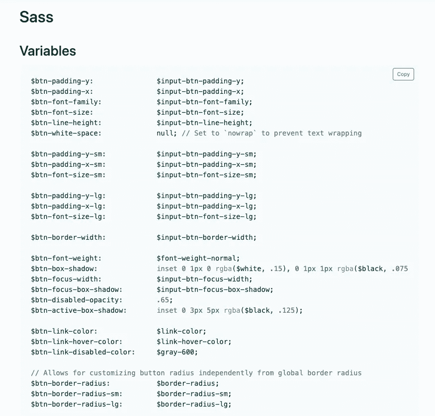

# 在 GatsbyJS 中覆盖引导主题

> 原文：<https://levelup.gitconnected.com/overwriting-bootstrap-themes-in-gatsbyjs-528ee527ec46>

使您的 GatsbyJS 引导配置成为您自己的最简单的方法。在 GatsbyJS 中覆盖 Bootstrap 主题变量。

在 GatsbyJS 中引导覆盖主题的最简单方法

我喜欢保持事情简单。刚开始用 GatsbyJS 的时候，我用 Bootstrap 快速搭建了一个网站。然而，我并不喜欢 reactstrap 库。我只是想抓住使用 npm 安装引导，并在这个项目中使用它。

## 1.使用 npm 安装引导

Bootstrap 5 不再需要 JQuery，但是需要 *popperjs* 。

*npm 安装引导程序*[*@ popper js/core*](http://twitter.com/popperjs/core)*—保存*

注意:Bootstrap 5 不支持 Internet Explorer。\

## 2.添加“盖茨比插件 sass”

将 gatsby-plugin-sass 添加到 GatsbyJS 的插件中

## 3.用您需要的覆盖变量创建 SCSS 文件

在导入上方添加自定义变量

## 4.导入布局组件或 gatsby-browser.js

导入布局组件或 gatsby-browser.js

## 5.如何找到要覆盖的变量

最好的方法是查阅 Bootstrap 5 文档，每个组件都在文档的底部列出了可以覆盖的变量。例如，下面是引导程序 5 [按钮](https://getbootstrap.com/docs/5.0/components/buttons/#sass)的 SASS 变量。

自举 5 个按钮可以覆盖

或者您可以进入 *node_modules* 并查看引导程序的内部。

# TL；速度三角形定位法(dead reckoning)

*   安装用于 sass 的 gatsby 插件并安装引导程序
*   在 *gatsby-browser.js* 和覆盖变量 SCSS 文件中包含引导库
*   查看 Bootstrap 5 文档，了解哪些变量可以被覆盖

# 其他开发文章

*   [帮助你开始网络开发的网站](/getting-started-in-web-development-b7b3322cd536)
*   [AWS 中的生产级静态站点](/production-level-static-sites-in-aws-39573c9bf4d5?source=your_stories_page-------------------------------------)
*   [Docker-Compose 项目之间的联网](/networking-between-multiple-docker-compose-projects-317922eb85d2)

[在 LinkedIn 上联系我](https://www.linkedin.com/in/stcalica/)。