# 使用这款出色的工具加快您的 Kubernetes 开发速度

> 原文：<https://levelup.gitconnected.com/pace-your-kubernetes-development-with-this-awesome-tool-8c0cdfd6f30b>

在为我之前关于如何在 Kubernetes 上管理多租户的博客[开发 Loft 之后，我偶然发现了 Loft 的另一个产品。这个工具是为开发 Kubernetes 的开发人员准备的，他们希望在实际的环境中开发他们的应用程序，也就是在集群中。](https://medium.com/geekculture/how-to-manage-multitenancy-on-kubernetes-62ed5d95fcfc)

凭借配置模板化、热重装、日志流和交互终端等特性， [DevSpace](https://devspace.sh/) 是解决方案。事不宜迟，让我们开始设置它并检查它的特性。

# 先决条件

## 1.安装 devspace CLI

安装 devspace CLI 有很多方法，我选择了 brew

```
brew install devspace
```

通过运行`devspace`检查安装，它应该列出所有可能的命令

## 2.准备应用程序代码

对于这个演示，我将创建一个用 Python 编写的简单 Flask 应用程序，它将在其一个端点上提供以下 HTML 文件。

> 注意:HTML 文件存储在名为 static 的目录中

python 代码看起来会像这样

最后，一个 Dockerfile 文件来封装应用程序。

## 3.准备好您的 Kubernetes 集群

我为此创建了一个 minikube 集群，并且我的 kubeconfig 已经配置好了。您可以从任何 Kubernetes 发行版中进行选择

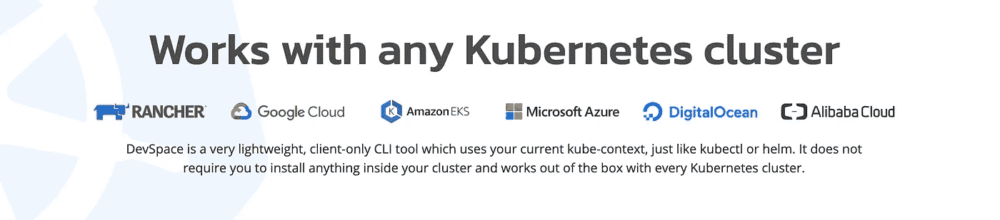

现在我们准备好探索 DevSpace 了！

# 演练

## 4.初始化

只需在您的工作目录中运行`devspace init`,您将看到以下提示

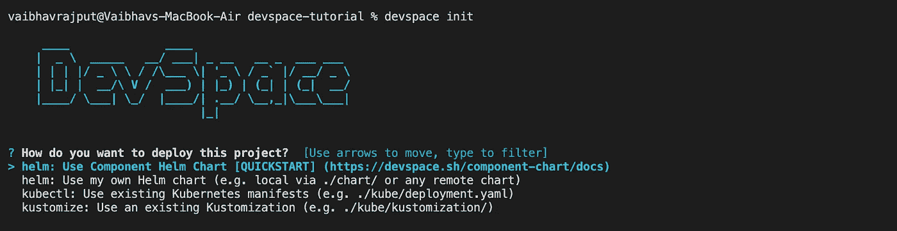

在这里，您将看到 4 个部署选项。我们将选择第一个选项，让 devspace 处理所有的配置，但是你也可以从舵图、清单 YAMLs 和 kustomization 中选择。

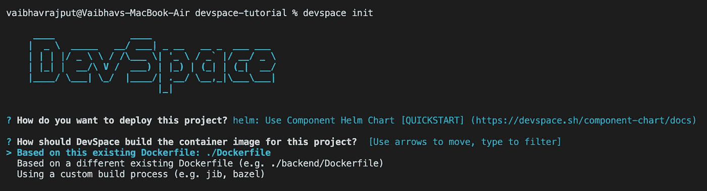

现在，我们选择构建过程。我们的是现有目录中的 docker 文件，所以我们可以继续前进。

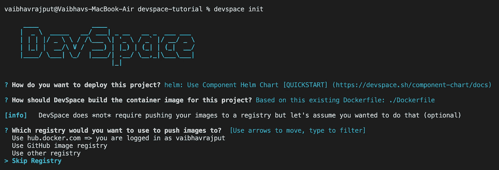

最后一个提示是一个可选功能，您可以在其中配置您的映像注册表并从 CLI 登录，devspace 也会为您推送映像。但是现在，让我们把它保持在本地(并跳过这个特性)。

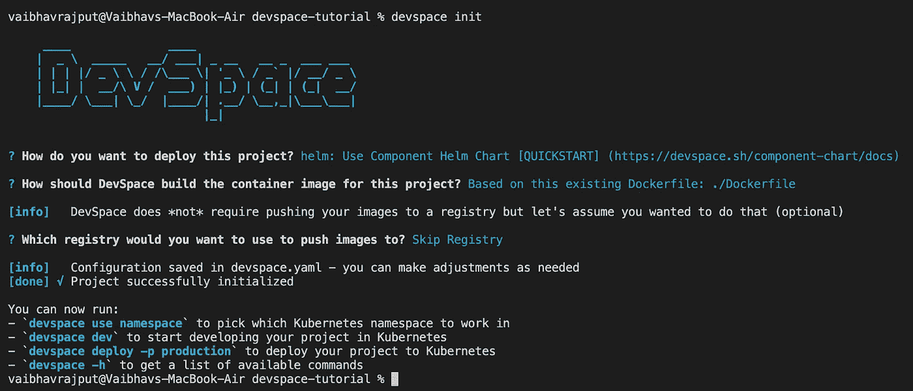

我们的配置完成了。它将创建一堆文件，如下图所示。

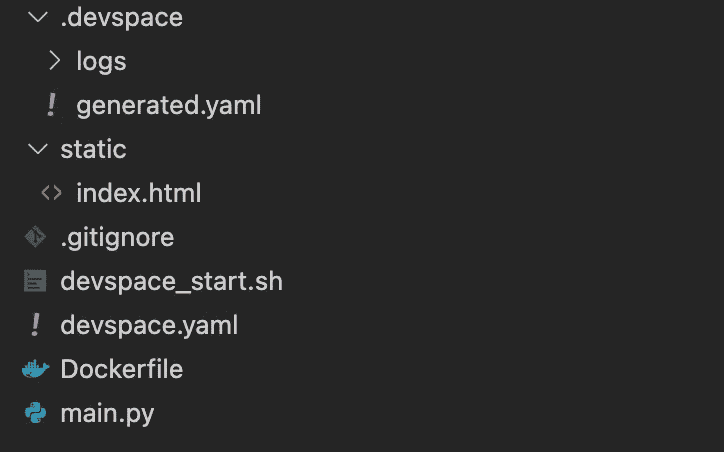

**devspace.yaml** 是通过这个过程创建的清单，而 **devspace_start.sh** 是可以用来部署它的 shell 脚本。

接下来，还有一个文件夹。 **devspace** 将获取所有的临时文件。这个目录会自动添加到 gitignore 和 dockerignore(如果存在的话)。

## 5.一些隔离，以防万一

出于理智，我使用命令创建了一个名为`devspace`的名称空间

```
kubectl create ns devspace
```

并通过运行以下命令将其设置为 devspace 上下文

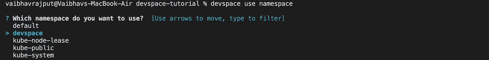

并选择该名称空间。

> 注意:也可以直接运行`devspace use namespace <namespace_name>`

## 6.表演时间到了。🎬

现在对于神奇的部分，我们将通过运行`devspace dev`开始开发

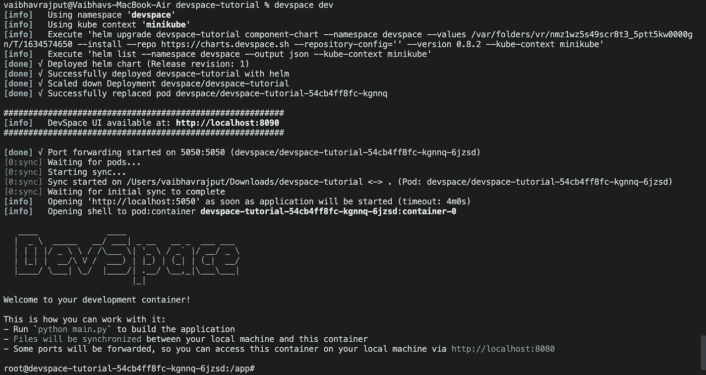

此过程以部署的形式部署应用程序，创建一个服务来公开 5050 端口，端口转发它，以便您可以在您的浏览器上测试它。您可以通过运行以下命令来查看这些资源

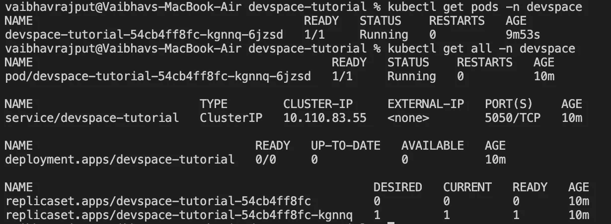

它还部署了一个类似这样的仪表板

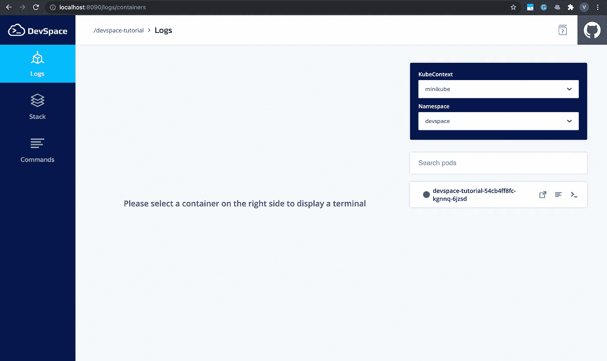

这个 UI 不限于 Devspace 管理的资源。它可以用来访问任何名称空间中任何 pod 的日志！点击 pod 旁边的`>_`图标可以直接进入 pod 终端。

此外，如果你看前面截图的最后一行，你会看到我的提示已经从`vaibhavrajput@Vaibhavs-MacBook-Air devspace-tutorial %`变成了`root@devspace-tutorial-54cb4ff8fc-kgnnq-6jzsd:/app#`，这意味着我现在在容器内部。

由于 Flask 是一个开发服务器，该应用程序现在还没有上线。因此，我们将运行`python main.py`来启动它。如果它是一个 WSGI 或另一个服务器，它将在部署期间启动。

现在，如果我点击端点`localhost:5050/file`，我会看到下面的页面

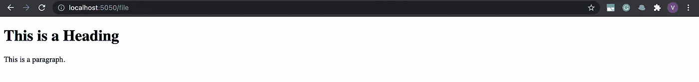

这也会反映在日志中，就像这样

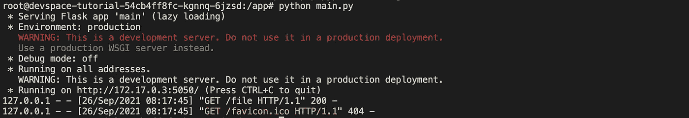

由于它处于部署模式，如果我简单地更新 HTML 文件并添加另一行，如下所示

```
<p>Now we are running version 2.</p>
```

页面将更改为

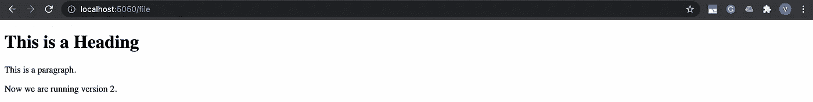

> 这意味着我们已经有效地连接到 kubernetes 集群中部署的 pod 内的工作区，并且我们可以通过即时热重装继续开发。

# 离别赠言

DevSpace 解决了一个主要问题，但并不仅限于此。要探索它的所有特性，请访问 [DevSpace 文档页面](https://devspace.sh/cli/docs/introduction)并尝试[挂钩](https://devspace.sh/cli/docs/configuration/hooks/basics)、[秘密管理](https://devspace.sh/cli/docs/configuration/pullSecrets/basics)、[插件](https://devspace.sh/cli/docs/guides/plugins)等等。