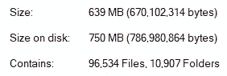
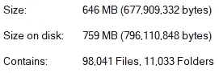

# Package-lock.json 和 Yarn.lock 是你最好的朋友

> 原文：<https://levelup.gitconnected.com/package-lock-json-and-yarn-lock-are-your-best-friends-7ec63c24fbe5>

## 为什么你想把它们留在身边，什么时候你想扔掉它们


图片由[皮克斯拜](https://pixabay.com/?utm_source=link-attribution&utm_medium=referral&utm_campaign=image&utm_content=155722)的 Gerd Altmann 提供

# 是否听过或*说过以下*中的任何一句话？

*   什么是 package-lock.json(或者 yarn.lock)？
*   我们为什么需要它？
*   我的 package-lock.json 文件中有冲突
*   它在我的拉取请求中占据了太多的屏幕！
*   我提交时会忽略它
*   ***我正要删除它***

对我来说一切都是。

更糟糕的是，也许你已经删除了它，并提交了你的拉取请求或直接推送到 master！

如果是这样的话，那么你已经修改了比你预期的大得多的源代码块。

> 您可以控制自己的源代码，但是 package-lock.json 和 yarn.lock 文件可以确保您的第三方代码不会在提交之间发生变化

# 将第三方软件包视为一等公民

这是解开包锁文件之谜时需要理解的关键思想。许多开发人员只考虑他们自己的源代码的变化，但是通过包管理器安装的第三方代码，像 npm 和 Yarn 同样重要，如果不是更重要的话。

为什么？因为它们有能力导致很难追踪的错误。

换句话说，如果没有锁文件，您将不知道代码中发生了什么变化，从而产生了您可能观察到的错误。你可能会盯着提交之间的代码差异挠头几个小时，认为这些变化*不会*导致*发出*。**

你是对的，是你看不到的代码导致了问题。

给你的第三方包应有的尊重，把它们当成你自己的代码。

> 把你的包想象成由多个开发者提交给你的项目的二进制代码，就好像它是开源的一样

让我们解决上述问题。

# 什么是包锁文件？水果和蔬菜的类比


[迪安·泽维尔](https://unsplash.com/@deanxavier?utm_source=medium&utm_medium=referral)在 [Unsplash](https://unsplash.com?utm_source=medium&utm_medium=referral) 上的照片

这样想吧。你喜欢吃水果和蔬菜。你知道每周你都需要买水果和蔬菜，所以你有一个很少改变的标准购物清单:

```
**Weekly Shopping List**Fruit
Veg
```

现在，你实际上喜欢某些种类的水果和蔬菜，所以你想让你的清单更具体一点:

```
**Weekly Shopping List**Fruit
    Apples    
    Grapes
    Tomatoes (they *are* a fruit)Veg
    Onions
    Potatoes
    Pumpkins
```

你知道你的口味比这个好一点，所以你添加了一些关于每种水果和蔬菜的细节:

```
**Weekly Shopping List**Fruit
    Apples: Red
    Grapes: White
    Tomatoes: RomaVeg
    Onions: White, red or brown
    Potatoes: Washed or brushed
    Pumpkins: Any kind
```

好了，我们有了清单，它相当详细，但是我们的一些水果和蔬菜留有一点变化的空间。所以我们出去买清单上的东西，最后我们得到一张收据:

```
**Receipt - 01/01/2020**Apples - Fuji
Grapes - White
Tomatoes - Roma
Onions - Brown
Potatoes - Washed
Pumpkins - Kabocha
```

看到这里发生了什么吗？尽管我们没有指定某些水果和蔬菜的确切种类，但我们不得不购买确切种类的。

现在，当我们回到家，吃了我们的苹果，煮了我们所有的蔬菜，我们对我们选择的非常满意，所以我们保留了收据，下次购物时带着它，还有我们的清单。

> 因为我们有收据，上面准确地列出了我们上周买的东西，所以我们这周买了完全一样的东西

这种情况可能会永远持续下去，但假设我们对苹果的口味发生了变化，那么我们会写一个新的列表:

```
**Weekly Shopping List**Fruit
    Apples: Green
    Grapes: White
    Tomatoes: RomaVeg
    Onions: White, red or brown
    Potatoes: Washed or brushed
    Pumpkins: Any kind
```

现在当我们去购物时，我们必须买某种绿色的苹果。我们出去，最后拿着下面的收据:

```
**Receipt - 02/01/2020**Apples - Granny Smith
Grapes - White
Tomatoes - Roma
Onions - Brown
Potatoes - Washed
Pumpkins - Kabocha
```

我们买了和上周一模一样的东西，只是我们的苹果换成了史密斯奶奶。

因为我们保留了收据，我们能够记住所有我们喜欢的水果和蔬菜，并继续购买同样的水果和蔬菜。

> 但是如果我们扔掉了收据呢？我们不得不从头开始，最后可能会吃到我们不喜欢的水果和蔬菜。

## 明白了。购物清单、收据、水果和蔬菜，但我认为这是一篇软件工程文章？

让我们回到软件的角度:

1.  `shopping list`代表你的`**package.json**`文件
2.  每个`fruit`和`vegetable`代表一个`package`
3.  水果或蔬菜的*类型*代表该包装的*精确版本*或*可接受版本范围*
4.  `receipt`代表您的`**package-lock.json**`或`**yarn.lock**`文件

当我们保持我们的`receipt`，也就是我们的`package lock file`，我们能够确保我们每周都得到相同包的相同版本，直到我们的`shopping list`，也就是我们的`package.json`，文件改变。

如果我们扔掉我们的`package lock file`，有可能我们最终得到的包不是我们所期望的。

## 包锁文件使您的提交保持不变

如果您在您选择的版本控制工具中打开提交图，图上的每个点代表一个版本的代码，如果被检索(拉取),它应该是不可变的——无论谁在何时检索它，它都应该是相同的。

如果你的代码库包含一个带有`dependencies`的`package.json`文件，而不是一个`package-lock.json`或者`yarn.lock`文件(或者其他包管理器用来锁定包版本的另一个文件)，那么这是**而不是**的情况。如上所述，如果在不同的时间访问提交，我们可能会得到不同版本的包。

这是因为软件包的新版本一直在发布，我们已经考虑到我们将接受的一些版本中的差异。例如:

Angular 应用程序的 package.json 文件示例

注意到所有的`~`和`^`了吗？如果在不同的时间安装，任何这些都可能导致下载这些软件包的不同版本。

> 保留 package-lock.json 或 yarn.lock 文件将锁定这些版本，尽管允许 package.json 文件中存在差异。

我让一些数字来说话:



在**初始纱线安装**后，node_modules 文件夹中文件的大小和数量


删除 node_modules 重新安装后的文件大小和数量，**保留 yarn.lock**



删除 node_modules 并重新安装后的文件大小和数量，**删除 yarn.lock**

上面的故障告诉我们，在仅仅删除我们的 node_modules 并重新安装我们的包之后，我们的 node_modules 文件夹在任何方面都没有**而不是**改变。

然而，在删除了我们的 node_modules 文件夹**和**我们的 yarn.lock 文件之后，还有一个额外的 **1507 文件**加起来超过了 **7mb** 。

那些额外的文件到底是什么？它们中的一些会进入我们应用程序的运行代码吗？可怕的是我们可能永远不会知道。

> 删除或不提交您的包——lock . JSON 或 yarn.lock 就像说“提交我的代码并随机修改我们剩余源代码的 X%”

# 删除包锁文件安全吗？

你曾经对你的代码库进行过大规模的重构吗？也许你已经*有意*更新了一个主要的库，比如你的前端框架，而你不确定是否有任何东西可能会崩溃，所以你对你的应用程序进行了全面的回归测试？

嗯，如果你要删除你的包锁文件，我可能会推荐同样的过程。为什么？因为很有可能你已经在不知不觉中修改了一些代码。

> 如果更改代码的大部分会导致您运行完整的回归测试，那么也应该更改第三方代码的大部分

如果你确实想根据你的`package.json`文件得到最新最好的包(所有的`~`和`^`都可以更新到最新的补丁和次要版本)，那么你可以删除你的包锁文件。

> 删除包锁文件可能是利用 package.json 文件的强大功能的好方法，但是要准备好运行完整的回归测试或者修复任何意外的行为

# 结论

除了在某些极端情况下，npm 包不会被删除，任何给定的版本也不会被修改。它们是不可改变的。

对于任何给定的提交，您自己的代码也应该是不可变的，如果为 [Yarn](https://yarnpkg.com/) 用户使用 [npm](https://www.npmjs.com/) 或`yarn.lock`，则允许这种情况的机制称为`package-lock.json` 文件。

该文件的存在确保了为给定的提交安装相同的包版本，这样您自己的源代码和您的第三方打包代码都是相同的，无论谁在何时使用它。

删除或不提交这些文件会导致您的应用程序出现不可预测的行为，因为对于相同的提交，实际安装的软件包版本可能会随着时间的推移而发生变化，并且如果这些错误是由错误的软件包引起的，则可能很难追踪到所观察到的错误的来源。

因此，建议您**提交**并且**不要删除**这些文件，除非您打算根据您的`package.json`规范更新您的包，并且您准备运行彻底的测试或者快速修复您在生产中观察到的任何 bug。

感谢阅读，我希望这能为你们中的一些人解释`package-lock.json`和`yarn.lock`文件。

## 资源

1.  [国家预防机制](https://www.npmjs.com/)
2.  [纱线](https://yarnpkg.com/)
3.  [package-lock.json](https://docs.npmjs.com/configuring-npm/package-lock-json.html)
4.  [yarn.lock](https://classic.yarnpkg.com/en/docs/yarn-lock/)
5.  [夜生活音乐](https://www.nightlife.com.au)