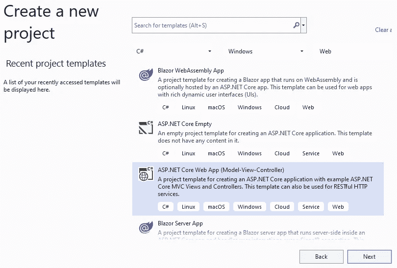
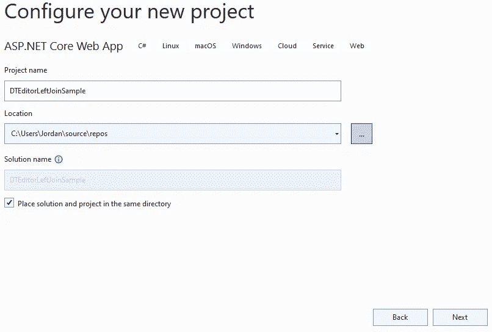
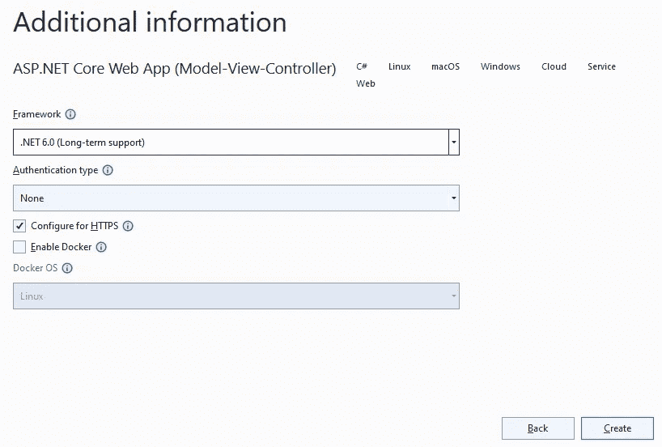
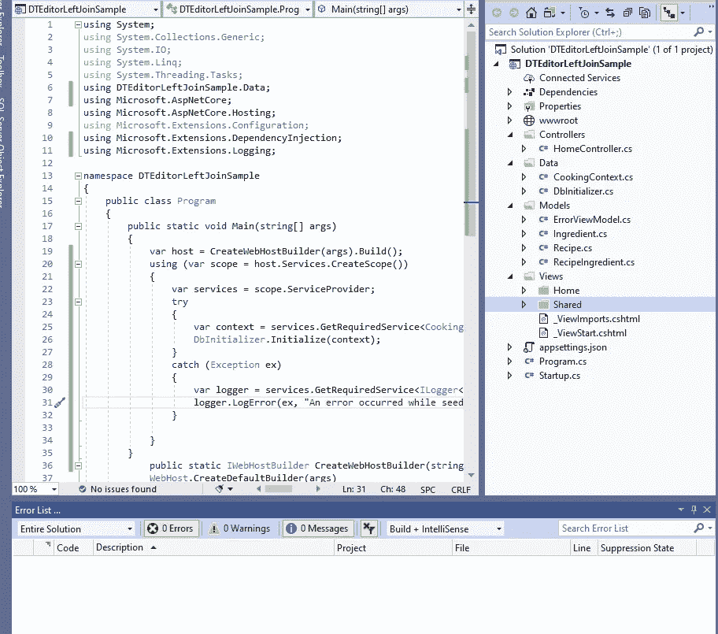
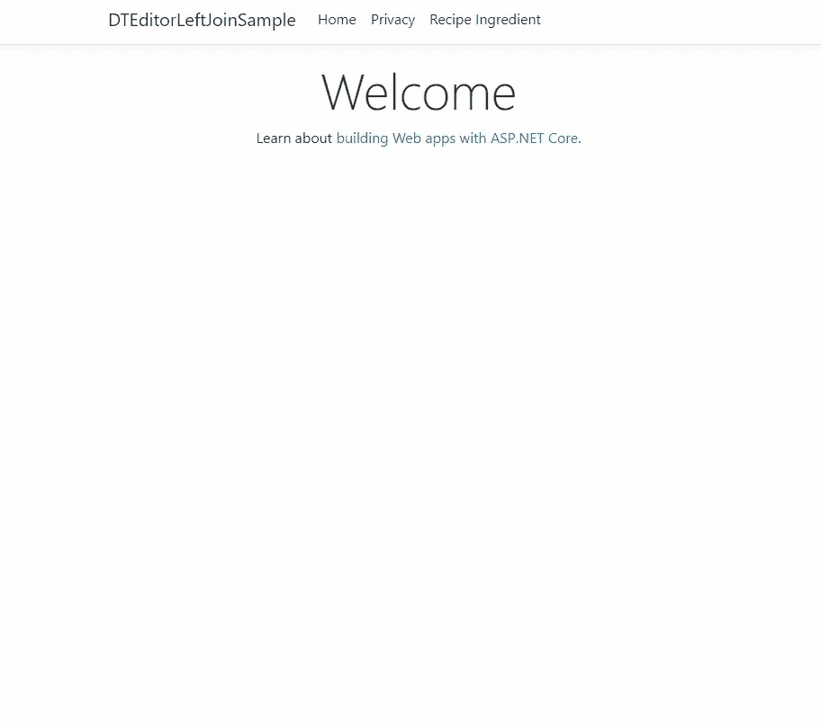

# 使用 ASP.NET 6 在数据表编辑器中对组合数据进行分页、搜索和排序

> 原文：<https://levelup.gitconnected.com/paginate-search-and-sort-combined-data-in-datatables-editor-with-asp-net-6-60c40e34a527>


照片由 [Pexels](https://www.pexels.com/photo/pondering-female-secretary-picking-folder-in-workplace-3791242/?utm_content=attributionCopyText&utm_medium=referral&utm_source=pexels) 的 [Andrea Piacquadio](https://www.pexels.com/@olly?utm_content=attributionCopyText&utm_medium=referral&utm_source=pexels) 拍摄

## 介绍

```
Table of contents
∘ [Intro](#81cf)
  ∘ [Recipe](#5e9a)
  ∘ [RecipeIngredient](#133d)
  ∘ [Create Ingredient class](#5f90)
  ∘ [Insert connection string into appsettings.json](#22c1)
  ∘ [Create CookingContext](#e009)
  ∘ [Install Entity Framework Core and other packages](#20d8)
  ∘ [Register CookingContext in Program.cs](#176d)
  ∘ [Startup.cs](#73f2)
  ∘ [Create DataSeed](#a363)
  ∘ [Call context and seed method and register factory for DataTables](#5c8e)
  ∘ [Program.cs](#1e8d)
  ∘ [Generate controllers and views with scaffolding engine](#467d)
  ∘ [Add Recipeingredient To Navbar](#2053)
```

在这里，我将向您展示如何在 ASP.NET 6 MVC 中使用数据表创建一个 SQL Left Join，您将在其中进行高级分页、排序和搜索。现在。NET 5 今年就要停止支持了，是时候升级到。NET 6，相信我，它的功能非常强大。

我有一个[完整的演示，你可以在这里下载。网 6](https://github.com/LayersOfAbstraction/DTEditorLeftJoinSample/tree/DT_local_version_.NET6) 。您也可以在演示中回顾以前的提交，我在这里列出了它已经升级到的版本。你应该知道我已经有条不紊地从 2.2 升级到 3.0，从 3.1 升级到 5…

而现在。NET 6。因为这就是微软在他们的迁移指南中的做法。困难的部分是将项目从 2.2 升级到 3.0。之后就是轻而易举了！

别担心，我将向您展示如何从头开始构建项目，这样您就不必从不同的框架中迁移它。

如果你已经知道如何建立一个 ASP.NET 核心 CRUD 应用程序[请跳到这里](https://medium.com/the-binaryator/paginate-search-and-sort-combined-data-in-datatables-editor-with-asp-net-6-part-2-96539ffb12ef)了解如何将它们与数据表编辑器集成。

下载并设置。网络 6

首先，检查命令行，看看你有没有。通过在 Windows 开始搜索栏中键入 cmd 来打开它，然后运行命令`dotnet --info`，已经安装了. NET 6。

如果您看到列出了任何`6.0`，那么您应该可以跳到下一个标题。

```
//.NET Core CLI output
.NET SDKs installed:
  3.1.415 [C:\Program Files\dotnet\sdk]
  5.0.209 [C:\Program Files\dotnet\sdk]
  5.0.301 [C:\Program Files\dotnet\sdk]
  5.0.303 [C:\Program Files\dotnet\sdk]
  5.0.403 [C:\Program Files\dotnet\sdk]
  6.0.100 [C:\Program Files\dotnet\sdk]
```

没看到吗？然后到这里[下载并安装](https://dotnet.microsoft.com/download)，然后使用相同的命令查看`6.0`是否列出。

微软的 ASP.NET 团队使用 Visual Studio 进行带有 EF 核心的 MVC 教程。所以让我们首先打开 Visual Studio 2022 并创建 ASP.NET web 应用程序模板。

一旦你完成了它，你可以随时用 VS 代码来玩这个应用。



确保您选择了`ASP.NET 6.0 (Long-term support)`，选择了`no authentication`，也选择了`configure for HTTPS`。



之后，创建项目。



我们现在将为 3 个不同的模型、配方、接收配料和配料创建一个配方数据库。在模型文件夹中创建每个类。

## 秘诀

## 接收内容

## 创建配料分类

## 将连接字符串插入 appsettings.json

在 appsettings.json 中创建连接字符串，然后将该连接字符串复制并粘贴到那里。

## 创建烹饪上下文

即使我们不能将实体框架核心直接与数据表编辑器集成，我们仍然可以通过 EF 核心生成数据库，以便与库一起使用。我们将通过创建数据库上下文类来做到这一点。创建一个数据文件夹并添加这个类。

## 安装实体框架核心和其他包

转到屏幕底部并转到开发人员 PowerShell。输入以下命令来安装本教程所需的软件包。目录路径应该已经指向应用程序，除非您在 PowerShell 中更改了目录。

```
dotnet add package Microsoft.EntityFrameworkCore --version 6.0.0
dotnet add package Microsoft.AspNetCore.Mvc.NewtonsoftJson --version 6.0.0
dotnet add package Microsoft.EntityFrameworkCore.Design --version 6.0.0
dotnet add package Microsoft.EntityFrameworkCore.SqlServer --version 6.0.0
dotnet add package Microsoft.VisualStudio.Web.CodeGeneration.Design --version 6.0.0
```

CookingContext.cs 和 Startup.cs 中的错误应该会消失。

## 在 Program.cs 中注册 CookingContext

使用依赖注入将 CookingContext 注册为程序中的服务。您可以通过将此代码添加到包括 Newtonsoft 在内的 Program.cs 中来实现这一点。Json 特性，所以我们可以在客户端使用 JSON。

## Startup.cs

## 创建数据种子

现在我们想用测试数据来播种数据库。这是一个可选步骤，但非常有益。如果对您不起作用，可以手动输入数据。在 Data 文件夹中创建 DbInitializer.cs 文件，并插入以下代码。

我们想从依赖注入容器中获取数据库上下文实例。

## 为数据表调用上下文和种子方法以及注册工厂

现在我们调用上下文实例，种子方法，并将其传递给上下文。然后在播种完成时释放上下文。在 **Program.cs** 中删除`Main`方法中的任何代码，并将所有代码添加到该方法中。

为了使用数据表，我们还必须注册数据库驱动程序`System.Data.SqlClient`。我们将在 **Program.cs** 中完成这一切，并记录任何与播种数据库相关的异常。

## 程序. cs

你必须写这个和任何在`app.Run`上面的代码，否则 C#在编译时会忽略它下面的任何代码。

现在在数据文件夹中添加一个空的。名为`GlobalNamespaces.cs`的 cs 文件删除文件中的任何内容，并将其复制粘贴到文件中。

再见，重复的名称空间。C# 10 通过将包含名称空间的所有代码文件集中到整个应用程序中的一个文件中，使我们能够最小化所有代码文件。

## 使用脚手架引擎生成控制器和视图

Windows CLI 上的脚手架引擎仍然存在问题，因此我们必须使用 Visual Studio 的 GUI 来访问脚手架引擎并生成项目。

首先使用我们制作的模型中的实体框架核心自动生成所有 CRUD 视图页面和控制器，然后编辑页面，这比手动编写更容易。我们将在脚手架引擎中生成。对此:

*   在**解决方案浏览器**中右键点击**控制器**文件夹，选择**添加>新搭建项目**
*   在**添加脚手架**对话框中:
*   使用实体框架，选择带有视图的 MVC 控制器。
*   单击添加。出现“使用实体框架添加带视图的 MVC 控制器”对话框。
*   在**模型类别**中选择**接收内容。**
*   在**数据上下文类**中选择 **CookingContext** 。
*   接受默认的 **CookingController** 作为名称。
*   点击**添加**。出现**使用实体框架添加带有视图的 MVC 控制器**对话框。



如果一切正常，那么 RecipeIngredient 文件夹将生成所有视图、索引、编辑、详细信息和删除。请注意，在 Controllers 文件夹中，新生成的控制器 RecipeIngredientsController.cs。

我想指出，如果你得到这样痛苦的不清楚的错误:

`There was an error running the selected code generator.`

`Package restore failed. Rolling back package...`

您可能需要将中的所有软件包更新到最新版本。NET 6。这就是对我的帮助。我最初写这个博客是为了。NET 3.1 核心，在 VS 代码 CLI 中生成控制器和视图时遇到了问题。去 Visual Studio 也没有帮助，所以我迁移到了有帮助的最新版本。

## 向导航栏添加 Recipeingredient

我们希望能够从我们的主页视图转到 Recipeingredient 视图页面。为此，请转到 our _layout.cshtml 文件。在标题的第二个 div 标签中，将这个列表项添加到导航栏中。

现在，我们需要添加迁移并更新数据库，然后才能运行它。将此输入我们的 PowerShell。

```
dotnet ef migrations add InitialCreate
dotnet ef database update
```

如果这些命令不起作用，您可能必须将全局工具更新到最新的可用版本，当时是 6.0.0。这是在这种情况下使用的命令。

`dotnet tool update --global dotnet-ef`

按 F5，运行程序将生成数据库并填写表格。如果不起作用，请使用 SQL Server 对象资源管理器手动填充这些表。

如果一切顺利，您应该能够直接进入索引视图中的表并呈现项目。但是正如我所说的，没有排序、分页和搜索。不仅如此，我们还想呈现其他表中的 RecipeTitle 和 IngredientName 字段，而不是外键 id！



现在我们已经在中建立了我们的项目。现在是时候建立数据表来添加排序、分页和搜索了。在第二部分的下一篇博客中加入我们的讨论。