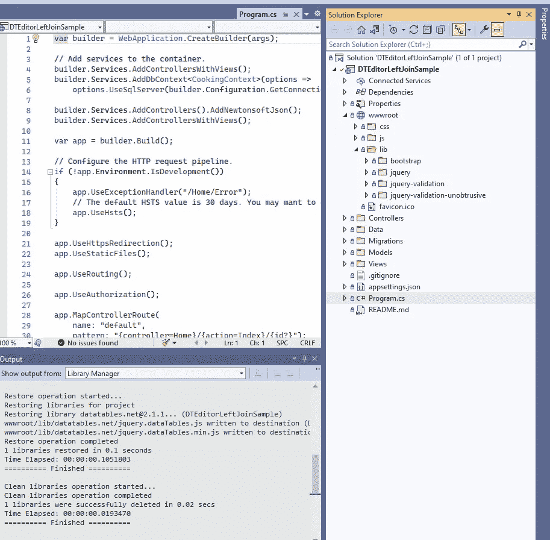
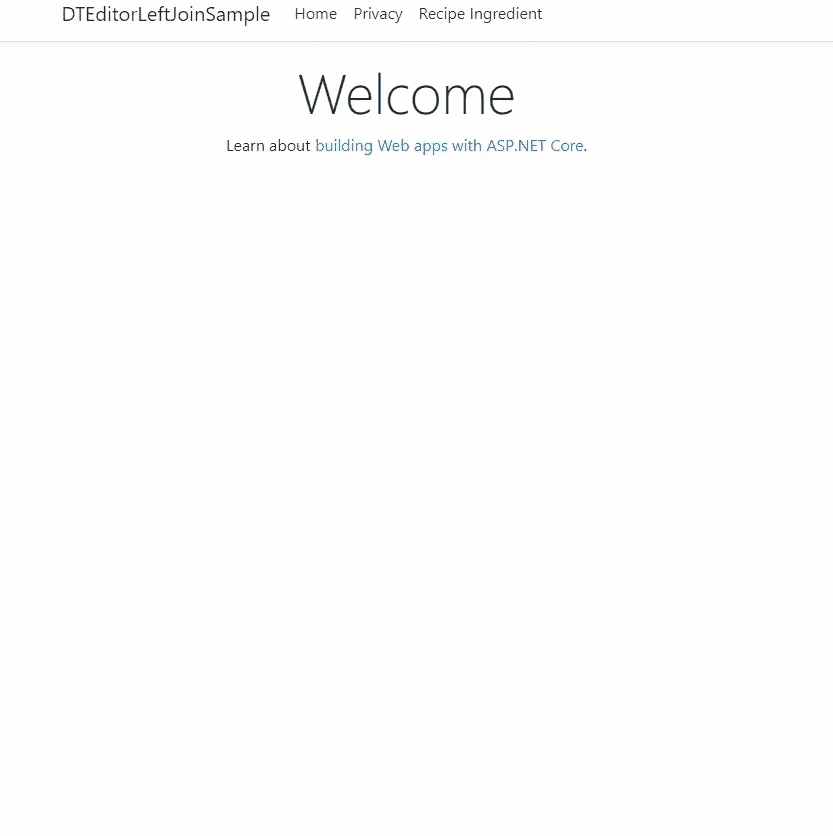

# 使用 ASP.NET 6 第 2 部分在数据表编辑器中对组合数据进行分页、搜索和排序

> 原文：<https://levelup.gitconnected.com/paginate-search-and-sort-combined-data-in-datatables-editor-with-asp-net-6-part-2-96539ffb12ef>

之前我向你展示了如何为基本的 CRUD 操作建立你的 ASP.NET 核心项目[。现在，我们将定制 UI，使用 DataTables Editor 进行高级分页搜索和排序。](https://medium.com/the-binaryator/paginate-search-and-sort-related-data-in-datatables-editor-with-asp-net-6-60c40e34a527)


照片由 [Pexels](https://www.pexels.com/photo/man-and-woman-sorting-samples-on-a-table-6583354/?utm_content=attributionCopyText&utm_medium=referral&utm_source=pexels) 的 [cottonbro](https://www.pexels.com/@cottonbro?utm_content=attributionCopyText&utm_medium=referral&utm_source=pexels) 拍摄

```
Table of contents
· [Install DataTables](#8978) 
  ∘ [OPTION 1 host it from DataTables CDN](#f65f)
  ∘ [OPTION 2 Local download](#b4ca)
  ∘ [OPTION 2.1 Go to Library Manager (LibMan) to install DataTables](#aa62)
  ∘ [OPTION 2.2 Go to their website to download and install files](#7055)
  ∘ [Call database directly from Program or Startup](#0780)
  ∘ [Bypass model and hardcode tblRecipeIngredient from the controller](#31cc)
  ∘ [Rewrite view Index in DataTables](#4fcc)
  ∘ [Run it one last time and enjoy 😊](#a055)
```

# 安装数据表

我们必须编辑索引并安装 DataTables Editor 服务器端库，以呈现另一个表中的相关字段。将此输入软件包管理控制台。

`dotnet add package DataTables-Editor-Server`

我们的首要任务是激活后端控制器中的数据表编辑器，然后编写代码将视图链接到我们的控制器。记住后端将使用免费的数据表编辑器服务器端库。

前端数据表编辑器库不是免费的，所以我们不会使用它。前端将使用数据表，这也是免费的，只要你不渲染外键，就可以与 EF Core 兼容。

我们也需要安装数据表。有两种方法可以做到这一点。

## 选项 1 从数据表 CDN 托管它

我们参考了 DataTables Content Delivery Network 的 javascript 和 css 库。将下面的代码添加到我们的`_Layout.cshtml`文件的头部。

继续把它和所有其他脚本一起添加到正文的页脚处。确保在项目中有任何 jquery 库之后加载它。

## 选项 2 本地下载

另一种方法是进行本地下载，如果您需要在演示期间离线运行所有东西，您希望说服您的团队或老板使用它，并在原型中展示它，以便您最终可以获得使用客户端库的资金，这将非常有用。

确保您在我们的`_Layout.cshtml`文件的头中声明了下面的代码。将此添加到`head`标签中。

继续把它和所有其他脚本一起添加到正文的页脚处。确保在项目中有任何 jquery 库之后加载它。

我将向您展示关于本地下载的两个选项。如果你想要最简单的下载，你可以只使用选项 2.1，跳过下一个选项。

## 选项 2.1 转到库管理器(LibMan)安装数据表

我们可以使用 Visual Studio 内置的库获取工具(LibMan)来下载数据表。我们现在就去做。

1.  在**解决方案浏览器**中转到**项目**。
2.  右击**项目**，选择**添加**。
3.  选择**客户端库**。
4.  在新窗口中，不要更改提供商，保留为 **cdnjs** 。
5.  在“**库**”字段中键入`datatables@1.10.21`，除非有更高的值。

这些文件将通过 LibMan 获得，并通过 CDN(内容传递网络)传递到您的本地系统，这样它们就可以在本地和离线使用。



## 选项 2.2 去他们的网站下载和安装文件

我们可以从这里下载库去[这里下载文件。](https://datatables.net/download/)保留默认值。应该有做什么的步骤。

## 从程序或启动时直接调用数据库

现在，我们将需要绕过 RecipeIngredient 模型，稍后使用

`DbProviderFactories.RegisterFactory`。请记住，您不能将实体框架与 DataTables Editor 服务器端库一起使用，除非您编辑控制器来绕过我们的依赖注入模型，并直接从 SQL Server 硬编码数据库表。

为了避免你必须为客户端库付费，我们只需要打破一些 MVC 规则来免费使用 DataTables Editor。

将此输入 Program.cs。

## 从控制器绕过模型和硬编码 tblRecipeIngredient

我们已经声明在应用程序中使用数据表。去我们的`Data/GlobalNamespaces.cs`文件夹添加这个。

然后去你的我们的**接收指令**控制器。

现在加上这个方法。

添加 IConfiguration 对象以获取连接字符串，并确保在构造函数中设置了它的值。

我会用评论把它分解给你。正如你所看到的，我在这里打破了 MVC 传统，而是用这种方法直接连接数据库。

确保您的**recipingredientscontroller**构造函数与我的匹配，并确保您的索引方法匹配！看起来会不一样。

大多数评论应该解释正在发生的事情。我指定了一个表，用于编辑从其他表插入到该表中的附加可选数据。也就是说，我通过执行 SQL 左连接将表连接到 tblRecipeIngredient，然后将其格式化为 json 对象，该对象将被传递到前端。注意，我正在创建一个免费的数据表编辑器服务器实例。但是前端的不是，所以我们必须使用数据表在前端解决这个问题。

后端代码完成后，让我们来看看前端。

## 重写数据表中的视图索引

转到这个目录**Views \ recipieng redients \**,查看 Index.cshtml 中的代码

我们将编辑其中的大部分内容。所以把模型标题改成这个。

现在将 HTML 表类值 table 更改为 recipeIngredientTable 的 ID 值。

删除 tbody 标记中的所有代码，使其看起来像这样。

```
<tbody></tbody>
```

现在，将所有这些内容添加到结束标记的外部。我们将尽可能地分解它。

oTable 对象包含我们的表头 ID，这样更容易维护。我们可以将头部与 oTable 对象的其余部分链接起来。下面，我们发出一个 ajax 请求来获取控制器方法的名称，该方法将显示我们在后端控制器中指定的所有数据。

当我们启动程序时，我们应该能够判断我们的后端是否正在与我们的前端通信。

我们需要主键值，这样当我们执行 CRUD 操作时，ASP 就知道从数据库中请求哪条记录。注意 renderDT_RowId 方法，在这里我调用了链接到其他视图 Details、Edit 和 Delete 的按钮。

```
renderDT_RowId(value.DT_RowId)
```

这将在 RAM 中存储每个 PK 值，也允许我们呈现记录。

现在你的整个视图应该是这样的。

## 最后运行一次，享受吧😊

现在运行您的程序并转到索引。它应该工作得很好。您可以看到数据表带来的强大功能。正如你所看到的，它有排序搜索功能，如果你输入更多的记录，你甚至可以把它分成多页，并决定显示多少。

如果我们在实体框架核心中这样做，那么所需的代码将会非常长，而且不会给我们带来太多的功能。提示:如果你现在在一家公司工作，你可以使用这个博客创建一个示例应用程序，向你的老板证明为什么他们应该为客户端库付费，以及它们如何适合在你的项目中做同样的事情。

