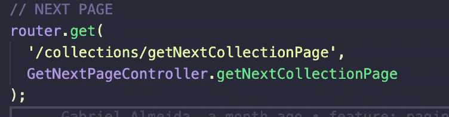

# 使用 NodeJS 的 ElasticSearch 分页

> 原文：<https://levelup.gitconnected.com/pagination-with-elasticsearch-using-node-js-3fd6c5d2adb1>


嘿，伙计们，今天我要谈谈我在后端使用 Elasticsearch 分页的策略。

*原因:*

我被分配了一项任务，开发一个包含 500 多种产品的页面，在这些页面上，除了许多产品图像之外，还会有许多产品数据，甚至一个产品可以包含不止一个图像。

在这个应用程序中，我们使用的是 Elasticsearch，所以最初我想看看一个页面加载所有产品而不分页会是什么样子。

举例来说，一个项目可以像这样排序:

```
{ "id": 123,"image": ["http://...",http://...,http://...], "base_produto": "", "categoria": "", "cor_produto": "", "data_primeira_venda": "2100-12-31", "desc_cor_produto": "", "desc_produto": "", "distribuicao": false, "programacoes": [ { "nome_programacao": "", "qtde_entregue": 0, "qtde_programada": 220 } ] *...*}
```

所以我测试了一下加载全部 500 个产品的页面，结果如下:

没有分页的网页

```
As can be seen, the page is not performing at all and loading takes extremely long, that's because it's very high load to the browser to render 500 hundred items and a lot of Images
```


显示物品数量的网络选项卡

好了，我们看到我们真的需要对这些数据进行分页。

现在，我将展示我的策略，这样我们就可以通过只查看后端来对数据进行分页。

**这里我们使用 NodeJS 和 express 来处理路由。**

弹性搜索已经有了一种处理分页的方法，它叫做**滚动**

[](https://www.elastic.co/guide/en/elasticsearch/reference/7.7/search-request-body.html#request-body-search-scroll) [## 请求身体搜索|弹性搜索参考[7.7] |弹性

### 将搜索标准指定为请求正文参数。GET/Twitter/_ search { " query ":{ " term ":{ " user ":" Kim chy " }…

www.elastic.co](https://www.elastic.co/guide/en/elasticsearch/reference/7.7/search-request-body.html#request-body-search-scroll) 

scroll 基本上有 2 个主要参数:
**scroll** : *scroll 参数告诉 Elasticsearch 在你花费的时间内保持搜索上下文打开。*

**scroll_id** : *是用于搜索下一页项目的参照。*

*滚动帖子示例:*

```
POST /_search/scroll 
{
    "scroll" : "1m", 
    "scroll_id" : "DXF1ZXJ5QW5kRmV0Y2gBAAAAAAAAAD4WYm9laVYtZndUQlNsdDcwakFMNjU1QQ==" 
}
```

所以，基本上在后端我们创建了一个函数来搜索我们的项目并接收两个参数: **indexName** 和 **query** 。

**索引名**:*elastic search 将搜索的索引名。*
**查询** : *我们用来过滤项目等的查询…*


搜索数据

这个 **searchData** 是什么？


基本上，它是我们的弹性应用程序的端点。

(*为了更好地研究这个问题，我推荐 elastic 的正确文档*:[https://www . elastic . co/guide/en/elastic search/client/JavaScript-API/current/index . html](https://www.elastic.co/guide/en/elasticsearch/client/javascript-api/current/index.html))


路线**getSingleCollectionProducts**

现在，我将向您展示一条路线，从我拥有的 500 种产品中选择前 10 种产品。

```
**async** **getSingleCollectionProducts**(req, res) { *const* *{* *collection,* *id_marca_estilo,* *next_page* } = await req.query; const payload = {
 ** //*HERE* *I`M JUST PUTTING TO ONLY RETURNS TO ME
  // 10 ITEMS*** *from*: 0, *size*: 10,
 }, query: {
 ** //here will enter your query, you can use your on query
  // on kibana.**
 },};try {                         **//*indexName***    **//*Query***
*const* *resp* *=* *await* *searchData('produto_cor',* *payload);*  
 **//*RETURNS* *TO* *ME* *AN* *ARRAY* *OF* *DATA* *FROM* *0* *TO* *10*** *const* *produtos* *=* *[];* ***// just creating an more useful array of datas*** *await* *resp.body.hits.hits.map(products* *=>* *{
  produtos.push({
   id*: *products._id*,
   *data*: *products._source*,
 });
}); const **pro** = {};
 // because i used the parameter **scroll** on my **searchData function**,
 // I have the **scroll_id** value pro.next_page = resp.body._scroll_id; 
 **// I create a value on my object that has the value from the next 
 // page**

 pro.data = produtos; return res.status(200).send(**pro**); // return the value } catch (err) {
 *console.log('Error* *getting* *products* *from* *a* *single* *collection',*     *err);* *return* *res.status(500).send(err);* }
}
```

当我们到达这条路线时，最终结果将是:


10 项，现在我们有了 scroll_id

**注意，我们的 *scroll_id* 现在叫做 *next_page。***

现在页面速度非常快，因为我们只加载前 10 项。

仅呈现 10 个项目的页面

我们现在的目标是加载下一个项目。我们现在有了被我****称为 next_page 的 **scroll_id** ，它拥有我们想要呈现的下一页项目的 id。****

****现在这是最简单的部分，我们只需要再创建一个包含 **scroll_id** 作为参数的路径，Elasticsearch 将负责返回我们下一个数据和一个包含页面上下一个项目的新 scroll_id。****

********

****下一页的路线****

********

****项目的下一页****

****实际上与之前创建的路线相同，唯一的细节是，现在我们不使用 searchData，而是创建一个名为 scrollData 的新函数，它与 elastic client([https://github.com/elastic/elasticsearch-js](https://github.com/elastic/elasticsearch-js))一起提供****

****([https://www . elastic . co/guide/en/elastic search/client/JavaScript-API/current/scroll _ examples . html](https://www.elastic.co/guide/en/elasticsearch/client/javascript-api/current/scroll_examples.html))****

****基本上，滚动函数接收两个参数:****

```
**scroll_id: String(id of the next page containing the next 10 items)
scroll: String(number of times that the id will exist)**
```

********

****scrollData 函数****

****在改变了前端的一些东西后，使用我创建的路线，我们得到了我们的结果:****

****使用滚动分页的页面****

****ElasticSearch 是一个拥有自己世界的神奇工具，一路上可能会出现很多疑惑，但是如果你需要帮助可以找我，希望我帮到你了！****