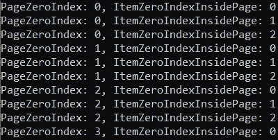

# 分页/分区——了解主要等式，使其变得简单

> 原文：<https://levelup.gitconnected.com/paging-partitioning-main-equations-to-make-it-easy-44fe89d5290b>

## 回归基础

## 学习分页/分区数学公式以及如何在 JavaScript 和。NET C#代码。

图片由[艾哈迈德·塔里克](https://medium.com/@eng_ahmed.tarek)

**分页**或**分区**的概念被用在很多领域。当您有一组项目，并且希望在某种容器或组之间平均分配它们时，您正在考虑分页或分区，但是您可能还没有意识到这一点

这个故事的主要目标是:

1.  解释一些数学公式，这些公式可以使您轻松实现分页或分区概念。
2.  提供一些如何实现分页的代码示例。

 [## 订阅艾哈迈德的时事通讯？

### 订阅艾哈迈德的时事通讯📰直接获得最佳实践、教程、提示、技巧和许多其他很酷的东西…

medium.com](https://medium.com/subscribe/@eng_ahmed.tarek) 

照片由[陈月嫦](https://unsplash.com/@whaleitsjessica?utm_source=unsplash&utm_medium=referral&utm_content=creditCopyText)在 [Unsplash](https://unsplash.com/s/photos/caution?utm_source=unsplash&utm_medium=referral&utm_content=creditCopyText) 上拍摄

# 放弃

1.  如果您期望在特定的应用程序(如操作系统、内存管理或文件系统)上找到分页概念的解释，那么您就看错了。
2.  每当提到“**页面**或“**分页**”时，“**分区**”和“**分区**”将有效。因此，为简洁起见，我将使用“页面”和“分页”。

照片由[西格蒙德](https://unsplash.com/@sigmund?utm_source=unsplash&utm_medium=referral&utm_content=creditCopyText)在 [Unsplash](https://unsplash.com/?utm_source=unsplash&utm_medium=referral&utm_content=creditCopyText) 拍摄

# 回归基础

解释分页的最好方式是应用一个例子。让我们假设我们收集了 10 件物品，任何种类的物品，可能是瓶子、铅笔、香蕉…任何让你开心的东西。

现在，我们要将这些 **10** 物品分组，每组包含 **3** 物品。

如果我们手动这样做，我们将有如下图所示的项目分布。

图片由[艾哈迈德·塔里克](https://medium.com/@eng_ahmed.tarek)拍摄

这很简单，对吧？

让我们解释一下上表中的内容。

1.  在 **0** 零索引页面内的 **0** 零索引位置找到第**个**项，以 **0** 为其零索引。
2.  在 **0** 零分度页面内的 **1** 零分度位置可以找到**第二个**项，以 **1** 为其零分度。
3.  在 **0** 零分度页面内的 **2** 零分度位置可以找到**第三**项，以 **2** 为其零分度。
4.  在 **1** 零分度页面内的 **0** 零分度位置可以找到**第四个**项，以 **3** 为其零分度。
5.  在 **2** 零分度页面内的 **1** 零分度位置可以找到**第五**项，以 **4** 为其零分度。
6.  诸如此类，…

这一次，您可以手动完成，因为项目计数不是很大，但情况并非总是如此。因此，我们需要分析上面的例子，并得出一些数学公式。

由 [Saad Ahmad](https://unsplash.com/@saadahmad_umn?utm_source=unsplash&utm_medium=referral&utm_content=creditCopyText) 在 [Unsplash](https://unsplash.com/?utm_source=unsplash&utm_medium=referral&utm_content=creditCopyText) 上拍摄的照片

# 公式

通过分析，我们可以得出以下公式:

图片由[艾哈迈德·塔里克](https://medium.com/@eng_ahmed.tarek)拍摄

我来解释一下；当你在**页面尺寸**上划分**项目零索引**时，你得到两个东西:

1.  代表**页面零索引的**结果**。**
2.  代表每页的**项目零索引的**余数**。**

你不相信我吗？好的，我会给你看…

马库斯·温克勒在 [Unsplash](https://unsplash.com/s/photos/truth?utm_source=unsplash&utm_medium=referral&utm_content=creditCopyText) 上拍摄的照片

# 斗牛中的最后一剑

让我们把这个公式应用到我们的例子中，看看结果如何。

第**个(0)** 项，将在**第 0 页**内的**位置 0** 找到

**第二(1)** 项，将在**第 0 页**内的**位置 1** 找到

**第三(2)** 项，位于**位置 2** ，在**第 0 页**内

**第四(3)** 项，位于**第 1 页**内的**位置 0**

第五(4) 项**位于第 1 页**的**位置 1** 处

第六(5) 项**位于第 1 页**的**位置 2** 处

第七(6) 项**位于第 2 页**内**位置 0**

**第八(7)** 项，位于**位置 1** ，在**第 2 页**内

**第九(8)** 项，位于**位置 2** ，在**第 2 页**内

**第十(9)** 项，位于**位置 0** ，在**第 3 页**内

第十一(10) 项**位于第 3 页**的**位置 1** 处

我想现在你相信我了。这个公式被证明非常有效。

照片由[Firmbee.com](https://unsplash.com/@firmbee?utm_source=unsplash&utm_medium=referral&utm_content=creditCopyText)在 [Unsplash](https://unsplash.com/?utm_source=unsplash&utm_medium=referral&utm_content=creditCopyText) 上拍摄

# 进一步分析

公式证明后，让我们做进一步的分析。

该公式可以转换为以下形状:

> **项目零索引** = ( **页面零索引** * **页面大小** ) + ( **项目每页零索引**)

这意味着，如果我们有一个**页面零索引值、**和一个**页面大小、**值，并且我们需要知道该页面上**第一项**和**最后一项**的**零索引**，我们可以使用上面的等式，如下所示。

**第一项零索引**
=(页面零索引*页面大小)+最小值(每页零索引项)
=(页面零索引*页面大小)+ 0
**=(页面零索引*页面大小)**

**最后一项零索引**
=(页面零索引*页面大小)+最大值(每页零索引项)
**=(页面零索引*页面大小)+(页面大小— 1)**

**但注意**如果计算的**最后一项零索引**大于整个集合中最后一项的索引，则取较小的数，即整个集合中最后一项的索引。

再说一次，你还是不相信我？

为了验证这些等式，让我们应用我们的示例:

*   在第一页上，(第一个项目零索引= 0 * 3 = 0)和(最后一个项目零索引=(0 * 3)+(3–1)= 2)
*   在第二页上，(第一个项目零索引= 1 * 3 = 3)和(最后一个项目零索引=(1 * 3)+(3–1)= 5)
*   在第三页上，(第一个项目零索引= 2 * 3 = 6)和(最后一个项目零索引=(2 * 3)+(3–1)= 8)
*   在第四页上，(第一个项目零索引= 3 * 3 = 9)和(最后一个项目零索引=(3 * 3)+(3–1)= 11，大于最大可用项目索引(9)，因此，最后一个项目零索引= 9)

努贝尔森·费尔南德斯在 [Unsplash](https://unsplash.com/?utm_source=unsplash&utm_medium=referral&utm_content=creditCopyText) 上的照片

# 让我们看看一些代码

已经证明了所有的等式，让我们看看如何在代码中应用它们。我将提供两个实现，一个在 **JavaScript** 中，另一个在**中。NET C#** 。

## JavaScript 代码

将扩展函数形式的方程应用到 **JavaScript** 数组**中。**

现在，执行这段代码

会回来

图片由[艾哈迈德·塔里克](https://medium.com/@eng_ahmed.tarek)拍摄

并且，执行这段代码

会回来

图片由[艾哈迈德·塔里克](https://medium.com/@eng_ahmed.tarek)拍摄

## 。NET C#代码

将扩展方法形式的方程应用于**。NET C#** **列表**。

现在，执行这段代码

会回来

图片由[艾哈迈德·塔里克](https://medium.com/@eng_ahmed.tarek)拍摄

并且，执行这段代码

会回来

图片由[艾哈迈德·塔里克](https://medium.com/@eng_ahmed.tarek)拍摄

格雷瓜尔·贝托在 [Unsplash](https://unsplash.com/?utm_source=unsplash&utm_medium=referral&utm_content=creditCopyText) 上拍摄的照片

# 最后的话

就是这样。这些是在任何情况下应用分页都需要了解的最重要的等式。

您还可以使用代码示例，通过您正在使用的任何语言或框架应用到您自己的项目中。

# 希望这些内容对你有用。如果您想支持:

如果您还不是**媒介**的会员，您可以使用 [**我的推荐链接**](https://medium.com/@eng_ahmed.tarek/membership) ，这样我可以从**媒介**中获得您的一部分费用，您无需支付任何额外费用。
▎订阅 [**我的简讯**](https://medium.com/subscribe/@eng_ahmed.tarek) 将最佳实践、教程、提示、技巧和许多其他很酷的东西直接发送到您的收件箱。

# 其他资源

这些是你可能喜欢的其他资源。

 [## 中的协方差和逆变。NET C#

### 很难理解吗？让我为你简化它。

levelup.gitconnected.com](/covariance-and-contravariance-in-net-c-c2b8576b2155)  [## 中设计界面的最佳实践。NET C#

### 定义 imin interface<t>够了吗？我也需要 IMyInterface 吗？</t>

levelup.gitconnected.com](/a-best-practice-for-designing-interfaces-in-net-c-2c6ebdb4f1c1)  [## 如何全面覆盖。带有单元测试的. NET C#控制台应用程序

### 知道什么吗？又是怎么做到的？使用 TDD、DI 和 IoC 完全覆盖您的控制台应用程序。

itnext.io](https://itnext.io/how-to-fully-cover-net-c-console-application-with-unit-tests-446927a4a793) 

就这样，希望你觉得读这个故事和我写它一样有趣。