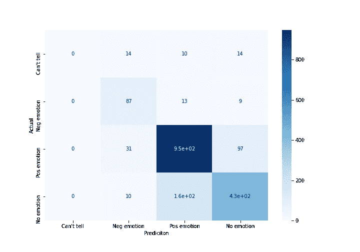

# 使用 RNN 的无痛文本分类

> 原文：<https://levelup.gitconnected.com/painless-classification-model-using-rnn-b90cb0982543>

## 使用递归神经网络和 Keras Python 库的示例 NLP 分类模型


米克·豪普特在 [Unsplash](https://unsplash.com?utm_source=medium&utm_medium=referral) 上的照片

这将是一个自然语言处理(NLP)的最小工作示例，使用深度学习和 Python 中的递归神经网络(RNN)。对于这个项目，你应该有一个坚实的 Python 和 Keras 神经网络(NN)的工作知识的掌握。

这里的目标是建立一个 NLP 深度学习模型来分析 Twitter 对苹果和谷歌产品的看法。我使用的数据集来自 CrowdFlower via data.world。在这个数据集中，人类评分者被要求对 9000 多条推文的情绪进行正面、负面或两者都没有的评分。我正在寻求使用这个标记的数据集来建立一个 NLP 模型，该模型可以根据其文本内容预测推文的情绪。(仅用于概念验证)。该数据集可以在下面的链接中找到。

[](https://data.world/crowdflower/brands-and-product-emotions) [## 品牌和产品情感——我们的 crowdflower 数据集

### 判断对品牌和产品的情感

数据世界](https://data.world/crowdflower/brands-and-product-emotions) 

我发现 NLP 相当令人困惑，直到我做了几个项目。通常，谷歌搜索会让我找到一些我能与之共鸣的教程或博客。对于 RNN，我很难找到一个适合我的，所以我想分享我在这里做的事情，希望能帮助另一个迷失的灵魂，避免拉起背后的梯子。

我也不会在这里讨论数学或理论。只是一个简单的概述和一些代码，应该得到一个工作的例子和一个新的主题/技能的人前进的道路。

## 预处理

我们从下载 csv 文件并将其放入本地项目文件夹开始(正如我们在大多数示例项目中所做的那样)。然后，我们用下面的代码将数据读入 Pandas 数据帧。(第 4 行)

我们的数据集在一个名为“tweet_text”的列中包含每条 tweet 的文本，为了方便起见，它有一个目标列，我将其重命名为“emotion ”(第 5 行)。我删除了所有 NaN 值(第 6 行),留下了 9000 多行。前 5 个看起来像这样:


我们的数据集

我使用 nltk(自然语言工具包)库来标记我们所有的文本，并确定我们所有推文中包含的字数(第 8-9 行)。我们最终得到超过 10，000 个独特的单词，并将在以后使用这个数字作为我们的神经网络的输入。

在下面的下一个代码块中，我们导入了构建深度学习神经网络所需的一切。然后，我们将“情感”列设置为我们的目标，我们使用一个热编码(第 12 行)来转换我们的目标，因为它可以是四个类别中的一个(积极、消极、中立或不能辨别)。由于我有四个类别，我们的目标/输出的形状也将是 4。这对我们以后的神经网络很重要。我早期与神经网络的斗争之一是让各层之间的形状匹配(特别是输入和输出层)。一旦我对这些层次有了更好的理解，我就明白了。

在上面代码块的后半部分，Keras 为我们做了很多工作:

*   第 15 行创建了一个 Keras Tokenizer 对象。我将分词器的单词数限制为最常见的 20，000 个(尽管我们已经确定我们只有 10k 多一点)。
*   第 16 行使用“fit_on_texts”方法，根据我们发送给它的文本列表更新记号赋予器的内部词汇表。这里发生的事情是，我们发送每条推文的文本，分词器建立一个 10，000+单词的词频字典。
*   第 17 行使用“text_to_sequences”方法将每条 tweet 中的单词转换成整数序列。然后，整个数据集存储在一个 NumPy 矩阵中，以便于处理。
*   第 18 行是我们将填充标记化文本的地方，因此它们的长度都相同，以便输入到我们的神经网络中。我选择每条微博最多 100 个单词。如果推文更长，它会被截断。如果它更小，则以零的形式添加填充。

在我们项目的这一点上，我们有了我们的“y ”,它是我们的神经网络的目标/输出，还有“X ”,它包含每个 tweet 的数字输入数组。现在我们准备制作我们的神经网络。

## 构建我们的模型

我们从 9000 多条推文开始，现在我们在建立我们的神经网络之前，对它们进行了标准的训练测试。

在继续之前，我认为谨慎的做法是大致了解我们每一层的目的。我们正在创建一个顺序模型，并使用“添加”方法来构建神经网络:

**嵌入层:**这一层要求输入数据是整数编码的，所以送入嵌入层的每个字都用一个唯一的整数表示。我们之前用记号赋予器完成了这项任务。

嵌入层用随机权重初始化，并将对训练数据集中的所有单词进行学习。

嵌入层的参数包括:

*   **input_dim** :这是我们已经计算过的文本数据中词汇的大小(10k 左右)
*   **output_dim** :这是单词将要嵌入的向量空间的大小。这个值是可以调整的。

这一层的输出是 2D 向量，对于输入单词序列中的每个单词都有一个嵌入。

**LSTM:** 我们的 RNN 图层将立即跟随输入，并且必须出现在任何密集或池化图层之前。这就是递归神经网络(RNN)的神奇之处。传统的 rnn 已经不再受欢迎，取而代之的是更强大的版本，如 LSTM(长短期记忆)和 GRU(门控循环单元)层。然而，它们的特别之处依然如故。RNN 人有记忆，有能力记住和/或忘记。

rnn 可以基于单词的重要性以及与文本中其他单词的相对位置来临时存储单词权重。它们非常适合基于时间序列数据进行分类、处理和预测，因为时间序列中的重要事件之间可能存在未知持续时间的滞后。这也使它们非常适合 NLP，因为它可以让您的模型使用文本中的相对位置来获取结构化语言的细微差别，如接近度和上下文，还可以通过记住文本中的重要单词。

我们使用 1D 池层来简化输出。

**密集层和漏层**:我们在网络中增加了一些标准的密集层。我们还添加了下降图层，目的是提高概化。如果想进一步调整模型，可以调整使用的层和节点的数量。

请注意，我们的最终输出层必须与我们的目标具有相同的形状。对于这个项目，我们使用大小为 4 的密集层来匹配我的输出(情感)的类别数。

## 训练我们的模型

现在该编译模型了。这里我们提供了重要的参数，比如使用哪个损失函数(“categorical _ crossentropy”，因为这是一个多类分类问题)，以及使用哪个优化器。

在编译完模型之后，我们可以快速地检查概要，看看模型是什么样子的，并确保输出的形状符合您的期望。

```
model.compile(loss='categorical_crossentropy', 
              optimizer='adam', 
              metrics=['accuracy'])model.summary() # check the shape
```

现在我们可以拟合编译后的模型了。根据您选择的参数，此步骤可能需要一些时间。

更多的历元改善了整体结果，但是也可以极大地影响训练时间。该模型生成符合该模型的评分输出。您可以查看它打印出来的验证分数，以了解模型是否仍在随着每个时期而改进，从而知道可接受的临界值可能在哪里。

批次大小限制了在执行重量更新之前向网络显示的样本数量。32 是较小数据集的常见大小。

```
model.fit(X_train, y_train, epochs=10, batch_size=32, validation_split=0.1)
```

现在，我们可以使用我们在拆分时留出的数据来测试我们的模型。我们可以使用许多评分标准中的任何一个来看看我们做得如何。虽然这里没有显示，但这也是您创建混淆矩阵并对结果进行额外评估的地方。为了简单起见，我们将只看模型的整体准确性。

```
from sklearn.metrics import accuracy_scorey_pred = model.predict(X_test) # get our predictionsacc = accuracy_score(y_test, y_pred) 
print('Overall accuracy of RNN: {:.3f}'.format(acc))Output: "Overall precision of RNN: 0.805"
```

我们最终获得了超过 80%的准确率，这对于这个多类问题来说是一个非常好的结果。通过进一步的调优，我们可以提高准确性(或其他所需的指标)。



这是我的困惑矩阵。

就是这样！自然语言处理的 RNN 工作模型。还不是一个完整的项目，但它应该给你一些工作代码。

我建议尝试从头开始构建另一个 NLP 项目。你可以尝试的数据集是 https://www.kaggle.com/uciml/news-aggregator-dataset 数据集。它收集了 400，000 个新闻标题，分类为['商业'，'娱乐'，'健康'，'科技']。您可以使用与这里展示的非常相似的技术来创建一个模型，通过只查看文章的标题来对文章进行分类。

如果你觉得这有帮助，我很乐意收到你的来信，但如果你发现任何错误或需要一点帮助。

祝你好运！