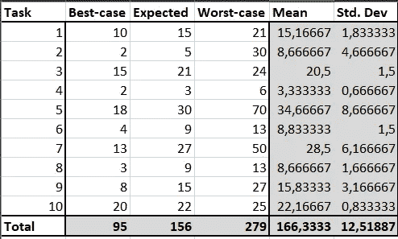
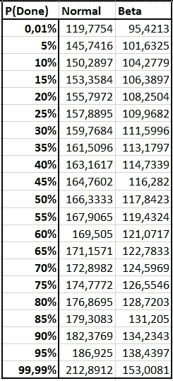
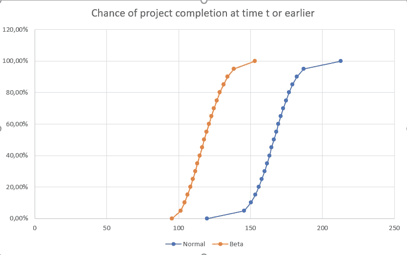

# 开发人员的无痛评估

> 原文：<https://levelup.gitconnected.com/painless-estimation-for-developers-8598bd3b2a87>


照片由[帕特里克·福尔](https://unsplash.com/@patrickian4?utm_source=medium&utm_medium=referral)在 [Unsplash](https://unsplash.com?utm_source=medium&utm_medium=referral) 拍摄

估计都是一种痛苦。你有多少次做了评估，却以“你有三周时间”而被驳回？我会给你指出一条脱离苦海的道路。这篇文章的目的是提供一种方法，让那些在评估领域之外具有初级专业知识的人能够产生一些可靠的评估，而没有太多的麻烦。这涉及到一些轻微的滥用统计数据，所以如果这可能会触发你，考虑这是一个公平的警告。另一方面，采取的捷径旨在提供足够好的估计，而不需要挖掘重型机械工具箱，如蒙特卡洛模拟和高级统计模型。

# 点估计的问题是

你可能习惯于提供点估计。一个要点估计是当你的老板问你，这个任务要花多长时间，你回答 3 天。我们之所以称之为点估计，是因为您提供了一个代表任务将花费多长时间的数据点。点估计有许多问题，其中大部分源于这样一个事实，即不可能考虑估计的不确定性。你可能听过这个建议，总是把你的估计值乘以 2 或者π或者别的什么。这是一种试图解释不确定性和偏向谨慎的尝试。这有后果。当你用一个人为因素夸大你的估计时，这个消息传到桌子的另一边只是时间问题。在桌子的这一边，时间被转换成货币价值，货币价值的东西是可以谈判的。知道预算经常被夸大，桌子的这一边认为降低预算是它的责任，这样它要么适合分配给部门的预算，要么花费尽可能少。战壕战争就这样开始了，一方害怕超过估计值而夸大估计值，另一方不信任估计值，因为他们知道估计值没有反映实际花费的时间。它们不再代表一项任务需要多长时间，而是变成了办公室政治的战场。

点估计的另一个问题是它们太有形了。你可能说过类似这样的话，“我预计这项任务将花费我两天时间，但是这个估计很大程度上依赖于 X 部门对他们的组件有良好的文档记录”。很可能你说这话的人只听到了你说两天的那部分。人类不擅长记住细微差别，但更擅长记住具体的数字和承诺。如果你超出了估计，你很可能会遇到这样的句子“你答应给我两天时间？怎么回事？”，当你开始详细描述 X 部门时，完全没有准备好文档，你必须加班才能做到这一步，与你交谈的人很可能会想“哦，又来了，借口…我答应我的老板要花两天时间，现在我看起来像个傻瓜”。虽然这显然不是最佳选择，但这样想是很自然的。我们需要一种方法让我们远离这些陷阱。这就是更细微的估计发挥作用的地方。

# 良好估计的清单

好的评估技术应该满足一定的要求才能有用

1.  他们必须提供预期时间的真实视图
2.  他们必须以易于理解的方式表达他们的不确定性
3.  他们必须写得很好
4.  它们必须是可调节的，以说明改变它们的后果
5.  评估的所有方面必须同等重要。
6.  当未知估计值变为已知值时，必须能够调整总估计值。
7.  必须有可能在分配的时间内评估项目结果的概率。

1 的原因。相当明显。如果这个估计不能给出这个任务需要多长时间的真实想法，那么这个估计就有点没用了。这得到了 2 的支持。当我们有机会描述我们对估计有多确定时，这也是对风险的一种度量，更具体地说是已知未知的大小。对于任何非平凡的项目，3。必须持有。如果不是这样，就不可能将任务分解成更小的子任务并对它们进行评估。评估一个小的原始任务比评估一个大的复合任务更容易。保持 4 的估计值也很重要。否则，一旦不可避免的谈判开始，他们将毫无胜算。加上 7。当有人试图压低你的估价，将你的估价减半时，这就提供了一个有力的论据。然后你可以毫不犹豫地说，现在“项目在那个日期完成的概率已经从 80%下降到 36%”。这不是你的观点和你老板的观点的问题。是你的模型预测的后果，你的老板现在在做决定之前就知道了这一点，不能把项目失败归咎于不知道。这样做也隐含着 5。不确定性不再是添加到估计中的模糊句子，而是估计画面中的一个相等部分。由于估计值很少被提供、呈现和遗忘，所以属性 6 也很重要。随着项目的进展和任务的完成，未知变成了已知。能够更新最终评估的模型以反映这些事实提供了有价值的见解，用于延长截止日期、削减或添加特性，或者确保其他团队准备好或通知您的进展。

# 多点估计:

一种更好的评估方式是在多种场景下为每项任务提供评估。这种技术的一个特殊变种叫做[三点估算](https://en.wikipedia.org/wiki/Three-point_estimation)。当给出一个三点估计时，你提供一个最好的情况估计，一个期望的估计，和一个最坏的情况估计。

很好，你现在可能会想。我必须算出 3 个数字，而不是只提供一个数字。这怎么能让我的生活变得更轻松呢？但是有一个窍门。首先，如果你有一个合格的意见，你真的只需要算出预期的估计。否则，就把它放在最好和最坏情况估计的中间，期望事情会在你估计的任务范围内达到平均。这种方法实际上非常有效。好吧，你这么说，但还是有一个最好和最坏情况的估计。

有趣的是，与最有可能的情况相比，四肢更容易估计。在对一项任务一无所知的情况下，你可以很快想象出 0 是最好的情况，而∞是最坏的情况。敏锐的读者会注意到，这些数字也出现在[计划扑克](https://en.wikipedia.org/wiki/Planning_poker)的一些变体中。人们可以肯定地说，这些估计并没有提供多少真知灼见，但这远非事实。假设你对你要评估的任务一无所知，评估的不确定性应该表达了这个事实。为了将这些琐碎的估计提炼为稍微有用的东西，收集您对任务的知识是有意义的，包括范围、需求、已经存在的先决条件。对于任何你不知道的事情，你必须做出假设。在这里，你必须描绘出最好和最坏的情况，并把它们写下来。这样做之后，你就可以对最坏的情况做出非常保守的估计，对最好的情况做出非常乐观的估计。请注意，这与第一部分中提到的整个谈判情况非常相似，但主要区别是，你还没有进行谈判。

# 合并估计

一旦您将所有的多点评估和它们相关的场景都准备好了，下一步就是将它们合并成项目的总评估。这就是 [PERT 分布](https://en.wikipedia.org/wiki/PERT_distribution)派上用场的地方，多点估计的均值和标准差定义为

```
Mean = (best_case + 4 * most_likely + worst_case) / 6Standard Deviation = (worst_case - best_case) / 6
```

如果你不知道什么是最有可能的，你可以把它设置为最好情况和最坏情况的平均值。这两个公式都很容易放入 Excel，因此您可以开始使用它们。Excel 中可能有一个类似这样的表。这个表格已经提供了一些有价值的估计。在底部，你有简单的总和估计。右边是标准差，也就是估计值的不确定性。



当对整个项目进行评估时，您现在需要合并这些评估。有几种方法可以做到这一点。请注意，我没有列出公式，而是在这篇文章的底部链接了我作为例子使用的电子表格，所以你可以在那里找到它们。

一种方法是相信[中心极限定理](https://en.wikipedia.org/wiki/Central_limit_theorem)，并假设你的所有任务都是独立的随机变量(尽管它们很可能不是)，当它们组合在一起时，将会收敛于一个正态分布。通过这种方式，您可以将均值和标准差结合起来，就像使用正态分布一样。

另一种方法是将三点估计的总和视为一个遵循 PERT 分布的巨大估计。与正态分布不同，Excel 没有内置的 PERT 分布。但是，它有一个内置的 Beta 分布，可以转换成 PERT 分布。

定义一个分布函数真的很方便，因为它允许你回答这样的问题:如果我只有 x 天，那么项目完成的几率有多大？或者，如果我想要 75 %确定的项目完成，我应该预计需要多长时间？



该表显示了前面表格中提供的数据的正态分布和 PERT 分布的逆累积分布函数。

在展示或协商项目时间时，带上这样一张桌子是一个强有力的工具。假设你决定了 PERT 分布，你被告知，你有 115 天的时间。现在你可以回答，“好吧，但是要知道根据我们的估计，到那时我们完成的可能性不到 45 %。不要说我们没有告诉你”。结合标准偏差表和前面产生的场景，您现在可以讨论估计值是什么以及为什么是这样。标准差最大的也是灾难场景最极端、知识最少的。涉众可以提供知识，当重新估计时，将会缩短所需的时间。给涉众带来较少价值的特性也可能花费不成比例的时间。在这种情况下，你可以决定不去做，以满足最后期限。最重要的是，现在讨论的是如何在分配的时间限制内确定项目的范围，而不是强加给你一个随机数。制作一些分布函数的图表可能也是有用的，就像这张图一样。



# 结论

虽然估计可能看起来是一项令人生畏的任务，几乎不可能精确地确定，但它也是一项可以用各种不同的方式处理的任务，利用不同复杂程度的技术。我希望给你介绍一种方法，用相对有限的努力产生合理的结果。我还希望向您展示了统计模型如何在讨论中帮助您，有时在协商您的估计时也会有所帮助。

最后，我给你留了一个链接，链接到我为制作本文中的表格和图表而制作的电子表格。我希望你将来可以用它来减轻你的评估工作。祝你好运！