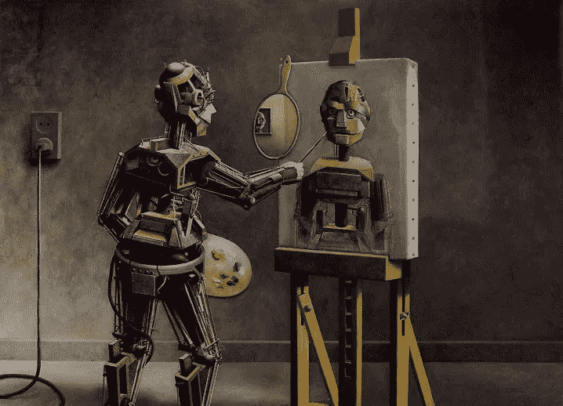
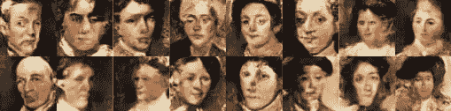
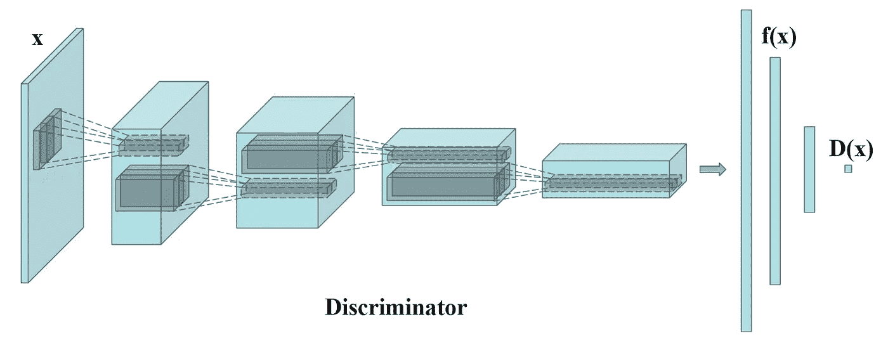
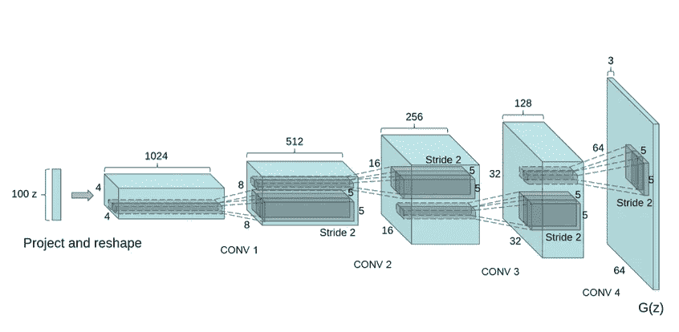
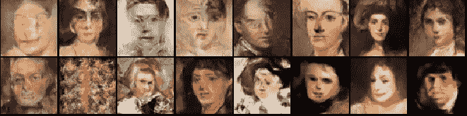

# 用 Pytorch 画肖像

> 原文：<https://levelup.gitconnected.com/painting-portraits-using-gans-with-pytorch-afeb69b1c5a1>

使用特征匹配和随机图像增强实现 DCGAN 模型以生成艺术品。

我只是最近才接触到生成性广告系列网络的概念，所以我开始研究其他研究人员和机构使用这项技术能够实现什么。我主要被使用 GAN 进行艺术生成的想法所吸引，所以我开始四处寻找人们设法创造的东西，我偶然发现了谷歌研究员 Mike Tyka 的作品，我发现这真的很吸引人，它促使我开始了自己的 GAN 项目。

当我开始这个项目时，我并不知道训练 GAN 模型有多难，而且需要大量的试验和错误才能得到令人满意的结果。因此，在本文中，我将介绍我构建 [DCGAN](https://arxiv.org/pdf/1511.06434.pdf) 模型的过程，以及我所面临的挑战和我为实现最终模型所做的工作。

虽然并不完美，但结果证明是不错的，因为我们只使用了无监督的 DCGANs 和随机图像增强&特征匹配，如这篇 [**论文**](https://arxiv.org/pdf/1606.03498.pdf) **中所提出的。**

精选生成的肖像

我不会在高层次上浏览 GANs，因为我认为有大量的文章和视频涵盖了这一点，相反，我将只关注技术细节，以及我的整个过程。你可以在这里 找到这个项目的[**完整代码。**](https://github.com/mohdabdin/Landscapes-GANs)

# 数据集和预处理

我使用了 wikiarts 数据集，可以在这里**下载。请记住，你不必下载整个东西，因为我在画肖像，所以我只下载了肖像文件夹，但也可以尝试其他东西。**

**接下来，我编写了一个 python 脚本 preprocessing.py 来获取数据集，为训练做准备。我们可以将原始图像的大小调整到所需的 64x64 的尺寸，但是如果您查看数据集，您会发现这可能会出错，我们不希望看到某人的挤压图或其手的裁剪正方形。理想情况下，我们想要面部在中间的正方形图像，为了实现这一点，我使用了[“面部识别”库](https://pypi.org/project/face-recognition/)，你可以用 pip 安装它，并使用它来检查每张图像，找到面部坐标，将它们偏移指定的量，并保存它们。**

**然后应用 **resize()** 方法，尽管人脸识别工具通常会创建方形或几乎方形的图像，所以简单地跳过这一部分，只使用 pytorch 的 resize 方法不会有太大的区别。PIL 的 resize 方法和下面定义的方法的区别在于，它调整图像的大小并裁剪它们，使它们适合特定尺寸的正方形图像，避免任何挤压。但是不管怎样，我为一个不同的项目建立了这个方法，所以不妨使用它。**

**下载完数据集后，创建另一个文件夹，用于输出调整大小后的图像。然后运行上面的方法，指定原始数据集的路径、刚刚创建的输出文件夹和所需的维度(64)**

**最后，我运行了 rename_images 方法，以数字顺序重命名文件，这是不必要的，但只是为了保持一切有序。**

# **DCGAN 模型**

## **鉴别器**

**现在是我们项目的核心。我创建了一个新文件“models.py ”,用来保存我们的鉴别器、生成器和初始化权重的方法。下图显示了具有特征匹配的 DCGAN 鉴别器架构。**

****

**改进的 DCGAN 架构**

**在最初的 DCGAN 论文中，定义了一系列具有 BatchNorm 和 LeakyReLU 的 2D 卷积层，以从图像中提取特征，并最终输出预测输入图像是假还是真的单个值。然而，在这个改进的版本中，最终的卷积层之后是全连接的线性层，因为该层将被生成器用来尝试和匹配。**

> **新目标不是直接最大化鉴别器的输出，而是要求生成器生成与真实数据的统计信息相匹配的数据，其中我们只使用鉴别器来指定我们认为值得匹配的统计信息。具体来说，我们训练生成器来匹配鉴别器中间层上的特征的期望值。**

**这种情况下的特征是张量形状的(batch_size，1024)，一旦我们开始训练，feature_matching 参数的使用将变得更加清楚。但是为了快速运行这段代码，我们定义了一个 helper function _block()，它添加了一个层，如 DCGAN 论文中所建议的，输入作为一个(batch_size，3，64，64)张量通过顺序模型，并卷积为一个具有 512*4*4 特征的向量，之后我使用一个 sigmoid 激活函数为假图像返回 0，为真实图像返回 1。如果尺寸令人困惑或没有意义，查看[这个关于卷积网络的指南](https://towardsdatascience.com/a-comprehensive-guide-to-convolutional-neural-networks-the-eli5-way-3bd2b1164a53)或者甚至玩玩模型，减去层，观察输出的尺寸，等等。我总是在我的项目中保存一个 playground.py 文件来打印变量和测试任何我不确定的东西。**

## **发电机**

**我们的生成器模型将简单地遵循与 DCGAN 完全相同的架构。**

****

**DCGAN 发生器架构**

**与生成器类似，但反过来，我们将接受一个随机噪声输入“z ”,并运行一系列去卷积，以达到所需的图像形状 **(3，64，64)，而不是将图像卷积为一组特征。****

**最后，我们只需添加一个 initialize_weights()函数，在训练之前应用于我们的两个模型:**

# **培养**

**现在我们有了数据和模型，我们可以从 train.py 文件开始，这里我们将加载数据，初始化模型，并运行主训练循环。**

## **超参数和导入**

**两个优化器可以使用相同的学习率，但是我发现对鉴别器使用稍高的学习率被证明更有效。在更复杂的数据集上，我发现 16 或 8 这样更小的批量有助于避免过度拟合。如果你没有安装 cuda，我真的建议你按照[这个指南](https://towardsdatascience.com/installing-tensorflow-with-cuda-cudnn-and-gpu-support-on-windows-10-60693e46e781)来设置它，因为卷积网络往往计算量大且速度慢。**

## **随机增强**

**改进 GAN 训练并充分利用数据集的技术之一是应用随机图像增强。在原始论文中，他们还提供了一种在生成器端还原增强图像的机制，因为我们不希望我们的生成器生成增强图像。然而，在这种情况下，我认为应用这些简单的不影响绘画质量的增强就足够了。如果我们试图达到照片般逼真的效果，那么使用完整的实现可能会是一个更好的主意。**

**我们对图像执行 3 种操作——镜像、饱和度调整和锐度调整。镜像图像对我们的图像质量没有影响，因为我们只是翻转它。对于饱和度和锐度，我使用了一个小的系数范围(0.5，1.5)，这样就不会对原始图像产生太大的影响。**

## **数据加载器**

**为了应用我们之前构建的随机扩充方法并加载我们的数据，我编写了一个自定义数据集，它使用了在它下面定义的转换。**

## **培养**

**最后，我们可以初始化我们的网络，并开始训练它们。对于鉴别器训练，我使用均方误差作为损失函数。我也尝试使用二进制交叉熵，但 MSELoss 是最有效的。在训练循环之前，我们还初始化了我们的 tensorboard writers，以便在 tensorboard 上实时查看我们的图像。查看本指南如果你需要帮助设置 tensorboard，非常简单。**

**在训练的第一部分，我们使用 MSELoss 在真实和虚假图像上训练我们的鉴别器。之后，我们用特征匹配来训练我们的生成器。我们先前将变量“特征匹配”添加到鉴别器中的正向传递中，以获得从图像中提取的感知特征。在传统的 DCGAN 中，您可以简单地训练生成器用假图像欺骗鉴别器，而在这里，我们尝试训练生成器生成与真实图像的特征紧密匹配的图像。这种技术通常提高了训练的稳定性。**

**100 个纪元后，我在我的 tensorboard 上得到以下结果。我已经尝试训练模型进行更多的迭代，但图像质量没有太大的改善。**

****

# **结论和最终想法**

**这篇文章的目的是记录我在这个项目上的工作历程。虽然网上有许多资源和论文探索这个令人兴奋的概念的不同方面，但我发现有些东西你只能通过经验来学习…就像其他任何东西一样。但是我希望您在本文中找到了一些可以在您自己的 GAN 项目中应用或试验的东西。由于我们获得的结果并不完美，我打算在我的下一篇文章中应用本文中提出的 [EvolGANs](https://arxiv.org/pdf/2009.13311.pdf) 来优化生成器。最后，如果你用不同的数据集做实验，我很乐意看到你的结果！**