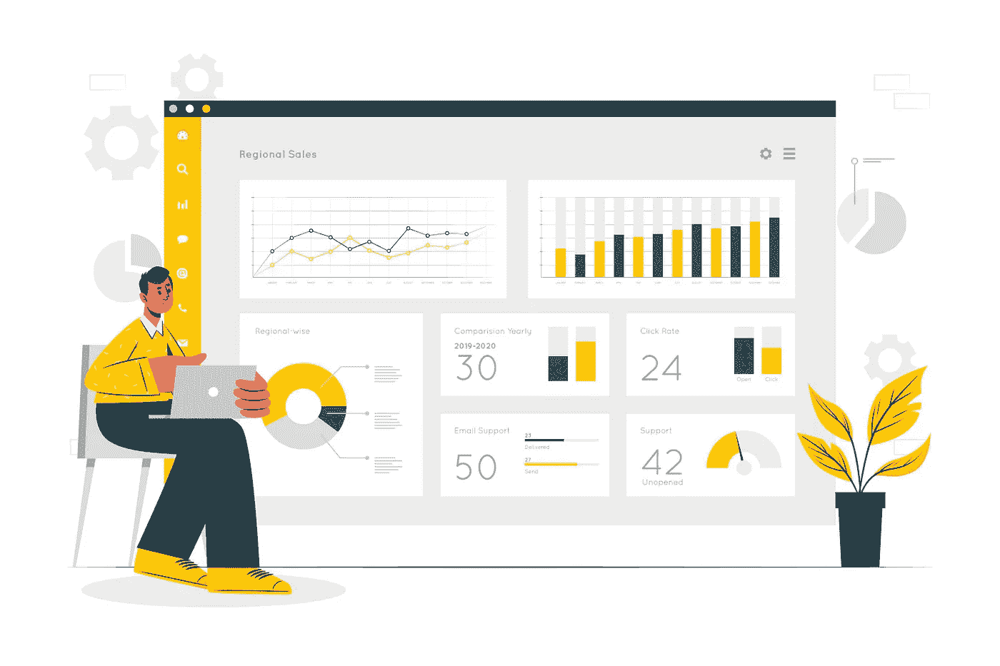
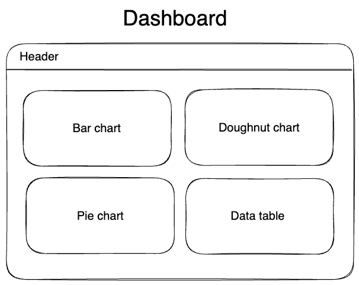
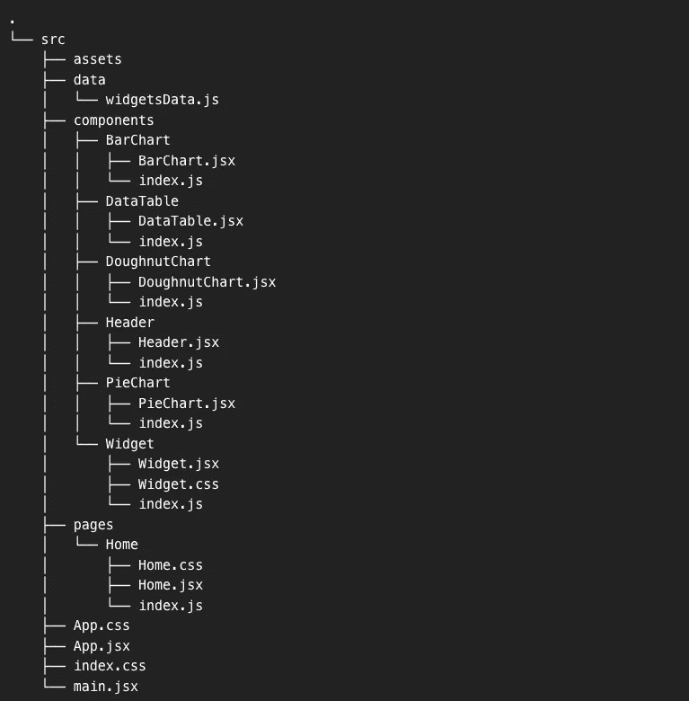
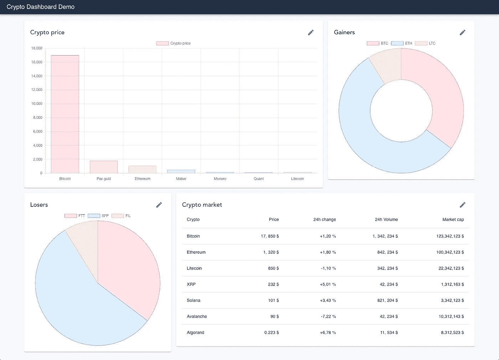

# 快速简单地构建 React 仪表板的一对工具。

> 原文：<https://levelup.gitconnected.com/pair-of-tools-to-build-react-dashboards-fast-and-easy-4c4420130083>



仪表板被广泛使用，是与复杂数据交互的一种很好的方式。在这里，我很乐意告诉你如何用最小的努力来创建它们。这将是非常有用的，尤其是当你需要为你的想法建立概念验证，或者你只是想得到一些建立仪表板的练习。我的演示应用程序将只包含 1 页和几个部件。但是，它将具有足够的可扩展性，所以你可以拿起它做附加组件或者只是玩玩。

正如我上面提到的，它将是 React 应用程序，所以首先，我们需要设置它，然后更多地了解这对工具，这对我们想要构建的这种类型的应用程序非常方便。

为了设置 React 应用程序，我决定使用 Vite。它是一个构建工具，是 create-react-app 的替代品，但速度更快。这是一个关于它的简短故事，如果你想知道更多，查看一下[文档](https://vitejs.dev/)。下面是我们需要运行并选择以下配置的命令。

```
npm create vite@latest
```

```
Project name: › dashboard-demo
? Select a framework: ›
    Vanilla
    Vue
❯   React
    Preact
    Lit
    Svelte
    Others
? Select a variant: ›
❯   JavaScript
    TypeScript
    JavaScript + SWC
    TypeScript + SWC
```

React app 已设置。在我们开始实现仪表板之前，我们需要一些关于初始设计和库的句子来实现所有这些。

正如我上面写的，该应用程序将包含一个页面和几个部件。除此之外，我们将添加一个基本的头。



开发前的最后一步将是获得这两对工具来帮助我们快速轻松地构建一切。为此，我选择了 MUI 和 ChartJS。

## **梅**

非常流行的 React 组件库。它很容易集成，并且拥有我们构建仪表板布局所需的一切。

## **ChartJS**

最受欢迎的图表库之一。这很容易理解，它提供了现成的图表，我们唯一需要的只是提供数据集。为了能够将其集成到 React 应用程序中，我们需要使用包装器 react-chartjs-2。让我们安装这些依赖项

```
npm install @mui/material @emotion/react @emotion/styled

npm install --save chart.js react-chartjs-2
```

一切都差不多准备好了。下面是我如何拆分应用程序。初始页面存储在 Home 组件中。小部件和图表存储在组件文件夹中。除此之外，我们有一个单独的文件夹来存储图表和数据表的虚拟数据集。



**Header.jsx**

我们可以从 MUI 组件中抓取现成的标题栏。这将非常简单。它将只包含应用程序标题，但如果需要，它可以通过添加菜单，动作按钮等进行缩放。

```
import * as React from 'react';
import AppBar from '@mui/material/AppBar';
import Toolbar from '@mui/material/Toolbar';
import Typography from '@mui/material/Typography';

export const Header = () => {
    return (
        <AppBar position="static" style={{backgroundColor: 'rgb(35, 48, 68)'}}>
            <Toolbar variant="dense">
                <Typography variant="h6" color="inherit" component="div">
                    Crypto Dashboard Demo
                </Typography>
            </Toolbar>
        </AppBar>
    )
};
```

**首页(Home.jsx)**

为了实现所需的布局，我们可以使用 MUI 中的容器和网格等元素。按照库文档中的例子来配置这些部分是非常容易的。这里我们把布局分成 4 个不同大小的盒子。它们每个都将包含一个小部件。

```
import * as React from 'react';
import Box from '@mui/material/Box';
import Grid from '@mui/material/Grid';
import { Container } from "@mui/material";
import { DataTable } from "../../components/DataTable";
import { PieChart } from "../../components/PieChart";
import { DoughnutChart } from "../../components/DoughnutChart";
import { BarChart } from "../../components/BarChart";
import { Widget } from "../../components/Widget";
import './Home.css';

export const Home = () => {
    return (
        <section className="dashboard">
            <Container maxWidth="xl">
                <Box sx={{ flexGrow: 1 }}>
                    <Grid container spacing={2}>
                        <Grid item xs={6} md={8} sm={12}>
                            <Widget title="Crypto price">
                                <BarChart/>
                            </Widget>
                        </Grid>
                        <Grid item xs={6} md={4} sm={12}>
                            <Widget title="Gainers">
                                <DoughnutChart/>
                            </Widget>
                        </Grid>
                        <Grid item xs={6} md={4} sm={12}>
                            <Widget title="Losers">
                                <PieChart/>
                            </Widget>
                        </Grid>
                        <Grid item xs={6} md={8} sm={12}>
                            <Widget title='Crypto market'>
                                <DataTable/>
                            </Widget>
                        </Grid>
                    </Grid>
                </Box>
            </Container>
        </section>
    )
}
```

**Home.css**

添加页边距，以便仪表板布局周围有足够的空间。

```
.dashboard {
    margin-top: 20px;
    margin-bottom: 20px;
}
```

**Widget.jsx**

对于小部件，我们需要一个 Paper 元素，为 div 添加一个漂亮的方框阴影，并且我们还为小部件添加了一些简单的自定义 CSS。

```
import { IconButton, Paper } from "@mui/material";
import { Edit } from "@mui/icons-material";
import './Widget.css';

export const Widget = ({title, children}) => {
    return (
        <Paper className="widget">
            <div className="widget-header">
                <div className="widget-title">{title}</div>
                <div className="widget-button">
                    <IconButton color="primary" aria-label="upload picture" component="label">
                        <Edit/>
                    </IconButton>
                </div>
            </div>
            {children}
        </Paper>
    )
}
```

**Widget.css**

```
.widget {
    background-color: rgb(35, 48, 68);
    padding: 20px;
}

.widget-header {
    display: flex;
    justify-content: space-between;
    align-items: center;
    color: rgba(0, 0, 0, 0.87);
    font-weight: 500;
    font-size: 20px;
}
```

是时候向小部件添加内容了。我们可以从图表开始，从图表组件[中抓取图表。](https://react-chartjs-2.js.org/components)

图表和数据表的所有数据集都将存储在 windgetsData.js 文件中。要添加图表，我们只需要导入它并传递一个简单的配置对象和数据。对于仪表板中的每个图表，将重复相同的过程。

**BarChart.jsx**

```
import * as React from "react";
import {
    Chart as ChartJS,
    CategoryScale,
    LinearScale,
    BarElement,
    Title,
    Tooltip,
    Legend,
} from 'chart.js';
import { Bar } from 'react-chartjs-2';
import { barChartData } from "../../dummyData/widgetsData";

ChartJS.register(
    CategoryScale,
    LinearScale,
    BarElement,
    Title,
    Tooltip,
    Legend
);

const options = {
    responsive: true,
    plugins: {
        legend: {
            position: 'top',
        },
    },
};

const data = {
    labels: ['Bitcoin', 'Pax gold', 'Ethereum', 'Maker', 'Monero', 'Quant', 'Litecoin'],
    datasets: barChartData
};

export const BarChart = () => {
    return (
        <Bar options={options} data={data} />
    )
}
```

**DoughnutChart.jsx**

```
import * as React from "react";
import { Chart as ChartJS, ArcElement, Tooltip, Legend } from 'chart.js';
import { Doughnut } from 'react-chartjs-2';
import { doughnutChartData } from "../../dummyData/widgetsData";

ChartJS.register(ArcElement, Tooltip, Legend);

const data = {
    labels: ['BTC', 'ETH', 'LTC'],
    datasets: doughnutChartData,
};

export const DoughnutChart = () => {
    return (
        <Doughnut data={data} />
    )
};
```

**PieChart.jsx**

```
import * as React from "react";
import { Chart as ChartJS, ArcElement, Tooltip, Legend } from 'chart.js';
import { Pie } from 'react-chartjs-2';
import { pieChartData } from "../../dummyData/widgetsData";

ChartJS.register(ArcElement, Tooltip, Legend);

const data = {
    labels: ['FTT', 'SFP', 'FIL'],
    datasets: pieChartData,
};

export const PieChart = () => {
   return (
       <Pie data={data}/>
   )
}
```

最后要添加的是一个数据表。让我们从 MUI 组件中获取一个。你可以从那里复制粘贴它。我就是这么做的。

**DataTable.jsx**

```
 import * as React from 'react';
import Table from '@mui/material/Table';
import TableBody from '@mui/material/TableBody';
import TableCell from '@mui/material/TableCell';
import TableHead from '@mui/material/TableHead';
import TableRow from '@mui/material/TableRow';
import { tableData } from "../../dummyData/widgetsData";

export const DataTable = () => {
    return (
            <Table sx={{ minWidth: 650 }} size="large" aria-label="a dense table">
                <TableHead>
                    <TableRow>
                        <TableCell>Crypto</TableCell>
                        <TableCell align="right">Price</TableCell>
                        <TableCell align="right">24h change</TableCell>
                        <TableCell align="right">24h Volume</TableCell>
                        <TableCell align="right">Market cap</TableCell>
                    </TableRow>
                </TableHead>
                <TableBody>
                    {tableData.map((row) => (
                        <TableRow
                            key={row.name}
                            sx={{ '&:last-child td, &:last-child th': { border: 0 } }}
                        >
                            <TableCell component="th" scope="row">
                                {row.name}
                            </TableCell>
                            <TableCell align="right">{row.price}</TableCell>
                            <TableCell align="right">{row.change}</TableCell>
                            <TableCell align="right">{row.volume}</TableCell>
                            <TableCell align="right">{row.cap}</TableCell>
                        </TableRow>
                    ))}
                </TableBody>
            </Table>
    );
}
```

现在让我们来看看结果。



## 包扎

正如您所看到的，使用 MUI 和 CharJS 使开发变得更加容易和快速。实现这个仪表板我们几乎不需要编码。正如我提到的，这是根据您的需求构建 POC 或初始应用程序的好方法。然后，通过添加更多的页面和业务逻辑，它很容易扩展。这里有一个[链接](https://github.com/MaksymM92/dashboard-react)到该项目源代码，您可以随意使用它或者为您将来的应用程序使用初始设置。

干杯！

# 分级编码

感谢您成为我们社区的一员！在你离开之前:

*   👏为故事鼓掌，跟着作者走👉
*   📰查看[升级编码出版物](https://levelup.gitconnected.com/?utm_source=pub&utm_medium=post)中的更多内容
*   🔔关注我们:[Twitter](https://twitter.com/gitconnected)|[LinkedIn](https://www.linkedin.com/company/gitconnected)|[时事通讯](https://newsletter.levelup.dev)

🚀👉 [**加入升级人才集体，找到一份惊艳的工作**](https://jobs.levelup.dev/talent/welcome?referral=true)