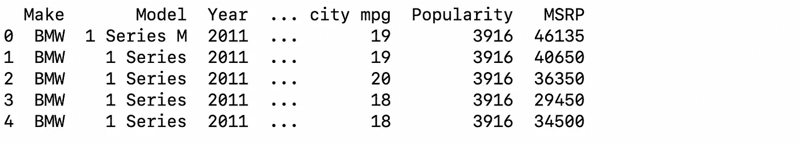
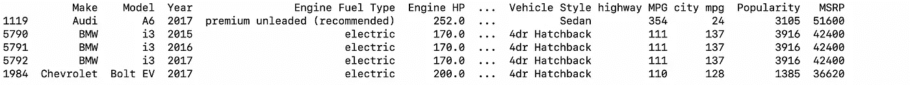
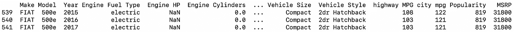

# 熊猫指南

> 原文：<https://levelup.gitconnected.com/pandas-complete-guide-fba59b69598c>

## 对熊猫陌生？你来对地方了。


照片由[埃里克·麦克莱恩](https://unsplash.com/@introspectivedsgn?utm_source=medium&utm_medium=referral)在 [Unsplash](https://unsplash.com?utm_source=medium&utm_medium=referral) 上拍摄

本文可以作为熊猫 python 库的参考。我们将介绍加载/存储不同文件格式、清理和操作数据集所需的基本功能。我们还将把数据帧转换成 numpy 数组，这些数组将用于输入到`sklearn`库的机器学习模型中。

让我们开始吧。

您可以使用以下方式安装 pandas:

```
pip3 install pandas
```

通常是这样导入的:

```
import pandas as pd
```

# **数据结构**

pandas 中有两种数据结构:

1.  **系列**

Series 是一个类似一维数组的对象，包含一系列值(与 NumPy 类型类似)和一个相关的数据标签数组，称为其*索引*。

示例:

```
In [2]: obj = pd.Series(['a','b','c','d'])In [3]: obj
Out[3]:
0    a
1    b
2    c
3    d
dtype: object
```

Pandas 从 0 开始自动分配*索引*。您可以使用`obj.loc[index]`调用特定的行。前往[该](https://pandas.pydata.org/docs/reference/api/pandas.Series.html?highlight=series#pandas.Series)获取文件。

```
In [4]: obj.loc[0]
Out[4]: 'a'
```

2.**数据帧**

DataFrame 代表一个矩形数据表，包含一个有序的列集合，每个列可以是不同的值类型(数字、字符串、布尔等)。).***data frame 既有行列索引***；它可以被认为是一系列共享相同索引的字典。

示例:

```
In [5]: df = pd.DataFrame({'c1':['a','b'],'c2':['c','d'],'c3':['e','f']})  #as a dict of seriesIn [6]: df
Out[6]:
       c1      c2      c3
0       a       c       e
1       b       d       fIn [10]: df.loc[1] #outputs a series datatype
Out[10]:
c1    b
c2    d
c3    f
Name: 1, dtype: object
```

您也可以像这样指定索引:

```
In [8]: df = pd.DataFrame({'c1':['a','b'],'c2':['c','d'],'c3':['e','f']}, index=['zero','one'])In [9]: df
Out[9]:
          c1      c2      c3
zero       a       c       e
one        b       d       f
```

DataFrame 对象可以用许多参数初始化。前往[此](https://pandas.pydata.org/docs/reference/api/pandas.DataFrame.html?highlight=dataframe#pandas.DataFrame)获取文件。

熊猫数据框架有两个轴。行是`axis=0`，列是`axis=1`。

# **读取文件/保存数据帧**

假设您有一个数据文件。它可以是任何格式(csv、xlsx、xls、json、html 或 sql 查询)。Pandas 提供了读取所有文件类型的功能。您也可以从指向数据文件的 url 读取数据。

同样，您也可以将清理和处理后的数据保存为您选择的文件格式。

```
**file_type**     **read**                          **save**csv           pd.read_csv('file.csv')       df.to_csv('name.csv')xlsx          pd.read_excel('file.xlsx')    df.to_excel('name.xlsx') xls           pd.read_excel('file.xls')     df.to_excel('name.xls')json          pd.read_json('file.json')     df.to_json('name.json')html          pd.read_html(html_file)       df.to_html(html_file)sql           pd.read_sql(sql_query)        df.to_sql(sql) or corresponding file urls
```

以上所有函数在读取时都有不同的参数。有关详细的参数描述，请参见[和](https://pandas.pydata.org/docs/user_guide/io.html?highlight=reading)。

在本文中，我们将使用汽车功能数据集来演示熊猫的使用。让我们阅读 csv 文件。

```
df=pd.read_csv('cars.csv')
df.head()
```



# **列名**

现在，我们的第一步是让列名知道它们各自代表什么。我们可以使用以下方法获得列名列表:

```
df.columns
```


Pandas 自动将列名设置为数据集的第一行，除非 read 函数中的`header`参数被指定为`None`。

# **检查数据类型**

每一列的数据类型可以使用以下方法检索:

```
df.dtypes
```


您也可以使用:

```
df.summary()
```

# **删除重复项**

可以使用`drop_duplicates`方法删除重复行:

```
df.drop_duplicates()
```

完成此操作后，比较与前一数据框相比减少的行数。

# **独特的价值观:**

您可以使用`df[column].unique()`获得每一列的唯一值，也可以使用`df[column].value_counts()`获得计数。让我们看看它是如何工作的。

```
df['Make'].unique()
```


```
df['Make'].value_counts()[:5] **#get only top 5**
```


计数前 5 名制造商

# **分拣**

假设您想通过`highway MPG`按降序对表格进行排序，可以使用:

```
df.sort_values(by='highway MPG', ascending = False).head()
```



按下行公路 MPG 排序的数据

# **条件提取**

比方说，你想得到公路行驶里程超过 100 英里的汽车。这可以通过以下方式实现:

```
df[df['highway MPG']>100].head(10)
```


公路 MPG > 100 的行

您还可以添加多个条件。假设您希望`highway MPG`大于`Make`菲亚特 100 的行。这可以通过以下方式实现:

```
df[(df['highway MPG']>100) & (df['Make']=='FIAT')]
```



公路 MPG > 100 的菲亚特汽车

菲亚特连续三年有三款车价格不变，MPG 递减。

**注意:**这些方法不会改变原始数据帧。它只是提取过滤后的数据并显示出来。您需要将其赋回原始数据框变量或新变量，以便使用它。

# **删除/过滤列**

假设您需要删除`Engine Cylinders`和`Engine HP`列，您可以使用:

```
df = df.drop(['Engine Cylinder', 'Engine HP'], axis=1)
```

这将删除列并将其分配回`df`。我们也可以把柱子放在这样的地方:

```
df.drop(['Engine Cylinder', 'Engine HP'] , axis=1, inplace=True)
```

以上两个代码做的是同样的事情。在后一种情况下，你不必把它赋回给变量。相反，删除了列的数据集在变量`df`中被更改。

***也可以通过输入相应的行索引和设置*** `***axis=0***` ***来删除行。***

现在，假设您需要删除许多列，并且只需要`Make, Model and Year`列，您可以使用`drop`方法或 ***您可以像这样过滤出您需要的列*** :

```
new_df = df[['Make','Model','Year']] 
```

# **替换数值**

让我们看看`Vehicle Size`列中的唯一值。

```
>>> df['Vehicle Size'].unique()
array(['Compact', 'Midsize', 'Large'], dtype=object)
```

将数据特征输入机器学习模型时，所有分类字符串值都必须转换为数字(整数)。`Vehicle Size`栏有 3 个类别。我们用`0, 1 and 2`来代替吧。

```
#create dict to replace values
key_val = {'Compact':0,'Midsize':1,'Large':2}df['Vehicle Size'] = df['Vehicle Size'].replace(key_val)**#Or use the inplace parameter**
df['Vehicle Size'].replace(key_val, inplace=True)
```

# **缺失值**

每列缺失值的数量可以使用以下方法找到:

```
df.isna().sum()
```

您可以用某个值来填充缺少的值，如下所示:

```
#filling all missing values in dataframe
df.fillna(value)#for filling values in a particular column
df[column].fillna(value, inplace=True)
```

# 转换为 Numpy

在清理和操作 DataFrame 中的数据后，我们需要将其转换为 numpy 数组，以提供给机器学习模型。DataFrame 作为一个整体可以转换为 numpy 数组，如下所示:

```
df.values
```

这将返回一个 numpy 数组，DataFrame 中的每一行都作为一个元素。我们可以分别过滤掉特征和目标，因为它们将被分别提供给机器学习模型。

```
X = df[list_of_feature_columns].values
y = df[target_column].valuesmodel=some_model()
model.fit(X,y)
```

# 结论

本文没有涵盖 Pandas 库的所有功能，尽管它涵盖了清理和操作数据所需的基本操作。