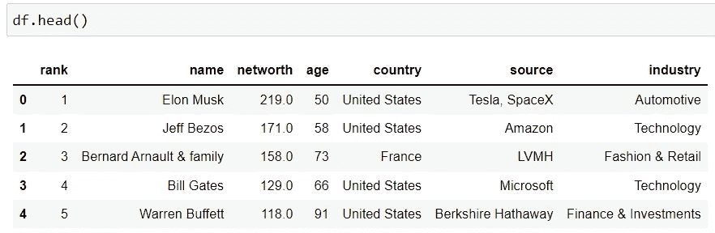
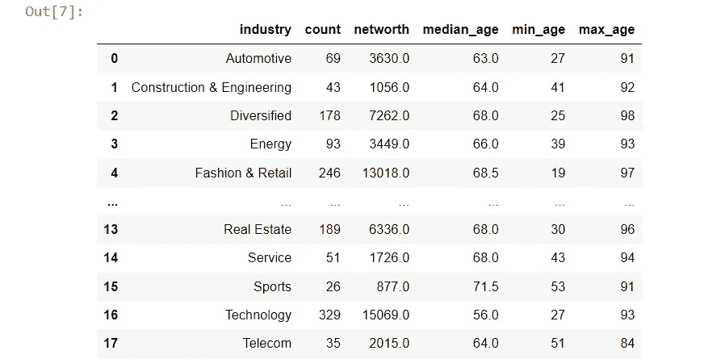
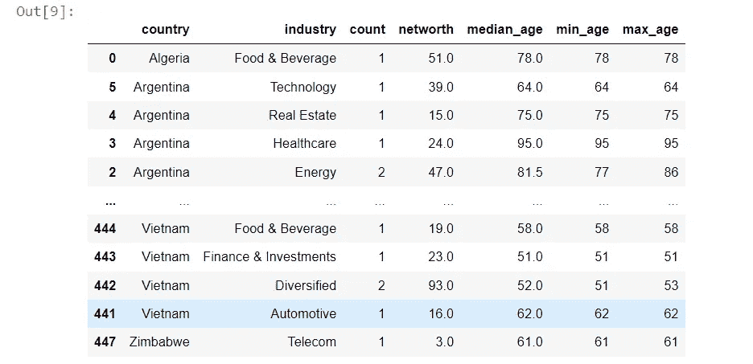
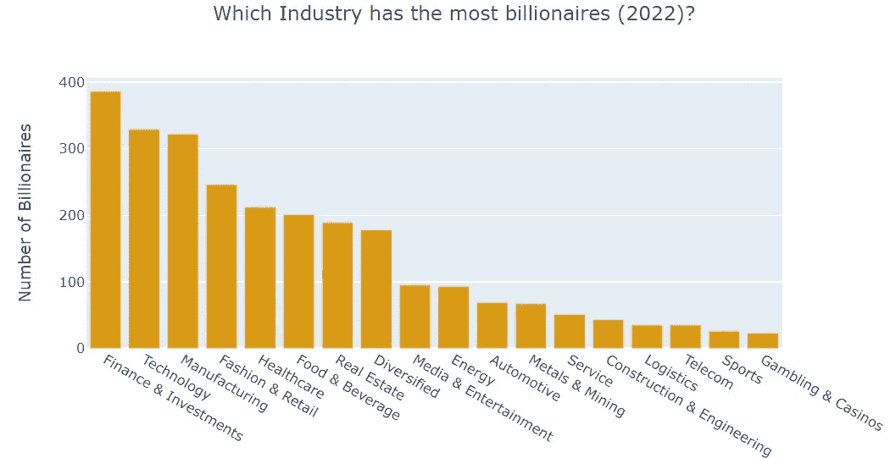
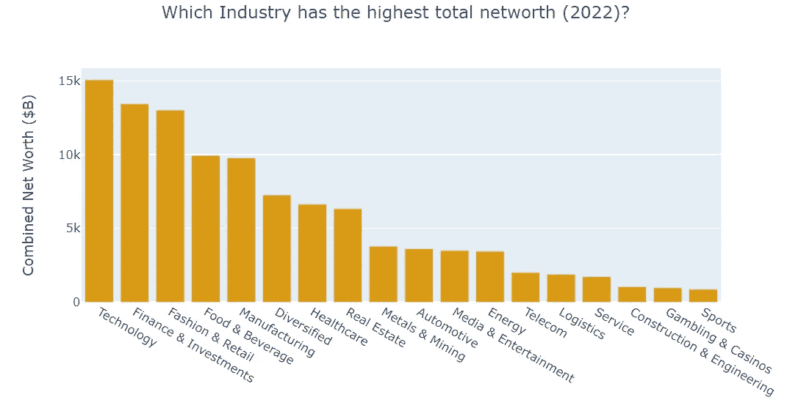

# Pandas 相当于 SQL 的方便的 GROUP BY 语句

> 原文：<https://levelup.gitconnected.com/pandas-equivalent-of-sqls-convenient-group-by-statement-9bdb6a91858a>

## 如何在 Pandas 中将不同的聚合应用于带有列标签的特定列


图片由 [Pixabay](https://pixabay.com/illustrations/panda-panda-bear-bear-endangered-2018774/)

聚合和分组数据是数据争论和分析中非常常见的任务。它允许您通过对选定列中的行进行分组来汇总数据，并相应地从其他列生成聚合视图。

当谈到按组聚合数据和分析结果时，没有什么比 SQL 简单而强大的`group by`语句更好的了。您可以轻松地按一个或多个列(组)对数据进行分组，应用不同的聚合(例如，sum、min、max、count 等)。)添加到不同的列中，并重命名所有聚合的列。

```
select group1_name, group2_name, count(field1) as cnt_field1, sum(field2) as sum_field2, max(field3) as max_field3, avg(field4) as mean_field4 
from table_name
group by group1_name, group2_name
```

SQL 的`group by`语句是我最喜欢的数据聚合方法。但是，如果我们需要用 Python 聚合数据，那么这个 SQL 语句在 Pandas 中的等效功能是什么呢？

让我们用一个例子来说明如何在 Pandas 中做和在 SQL 中一样的事情。你可以从[这里](https://www.kaggle.com/datasets/jjdaguirre/forbes-billionaires-2022)下载样本数据集。该数据集包含了 2022 年全球 2500 多位财富价值至少 10 亿美元的人的名单，以及福布斯根据他们各自的年龄、收入来源、居住国家、净资产和行业对他们进行的排名。



作者图片

我们感兴趣的是汇总行业层面的数据，并找出例如哪些行业拥有最多的亿万富翁，哪些行业拥有最高的综合净资产，以及每个行业亿万富翁的中值年龄等。您的 SQL 语句将如下所示。

```
select industry, count(name) as count, sum(networth) as networth, median(age) as median_age, min(age) as min_age, max(age) as max_age
from table_name
group by industry
```

但是你怎么能在熊猫身上做到呢？

要在 Python 中聚合一个或多个列上的数据帧，可以使用 Pandas 的`df.groupby().agg()`方法。在 Pandas 版本 0.25.0 中，它在`**GroupBy.agg()**` 中接受了一个非常简单而特殊的语法，即允许您轻松地将不同的聚合应用于特定的列，并重命名聚合的输出列。这种特殊的语法被称为“命名聚合”。

根据 Pandas 的[文档](https://pandas-docs.github.io/pandas-docs-travis/user_guide/groupby.html#named-aggregation)，在这个“命名聚合”语法中:

> 关键字是*输出*列名。这些值是元组，其第一个元素是要选择的列，第二个元素是要应用于该列的聚合。
> 
> Pandas 为名为`pandas.NamedAgg`的 tuple 提供了字段`['column', 'aggfunc']`,以便更清楚地说明参数是什么。通常，聚合可以是可调用的或字符串别名。

让我们看一下下面的代码作为例子。

在上面的代码中，我们使用`df.groupby(“industry”)`按照“行业”列对数据帧进行分组。然后，我们将不同的聚合应用于`df.groupby(“industry”).agg()`函数中的特定列。

例如，在第 2 行中，我们计算“name”列中的行数，并将输出列标记为“count”。在第 3 行中，我们计算“净值”列的总和，并将输出列标记为“净值”，等等。还要注意，如果不在第 7 行放置`reset_index()`,结果会将‘行业’列显示为索引列。



作者图片

如果您需要按多列对数据框进行分组，例如国家和行业，您只需在`groupby()`功能中指定您的列。



作者图片

现在我们可以很容易地创建一些可视化，显示哪些行业在 2022 年拥有最多的亿万富翁，哪些行业拥有最高的综合净资产，等等。



作者图片



作者图片

使用 Pandas `groupby().agg()`命名聚合，通过应用特定于列的聚合并控制输出列名，可以非常容易地聚合数据帧，就像您通常对 SQL 的`GROUP BY`语句所做的那样。我希望这篇文章对你有所帮助，并让你学到一些关于熊猫的新知识。感谢阅读！

# 数据源:

福布斯 2022 年亿万富翁:[https://www . ka ggle . com/datasets/jjdaguirre/Forbes-billionaires-2022](https://www.kaggle.com/datasets/jjdaguirre/forbes-billionaires-2022)

许可证: [CC0:公共领域](https://creativecommons.org/publicdomain/zero/1.0/)。据将该数据集上传到 [Kaggle](https://www.kaggle.com/datasets/jjdaguirre/forbes-billionaires-2022) 的作者称，数据是从[https://www.forbes.com/billionaires/](https://www.forbes.com/billionaires/)刮来的

你可以通过这个[推荐链接](https://medium.com/@insightsbees/membership)注册 Medium 会员(每月 5 美元)来获得我的作品和 Medium 的其他内容。通过这个链接注册，我将收到你的一部分会员费，不需要你额外付费。谢谢大家！