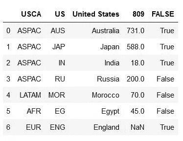

# 熊猫:蟒蛇

> 原文：<https://levelup.gitconnected.com/pandas-python-e69f4829fee1>

## Pandas 是一个功能强大且易于使用的开源工具，专门用于数据分析和操作。


锡德·巴拉钱德朗在 [Unsplash](https://unsplash.com/s/photos/pandas?utm_source=unsplash&utm_medium=referral&utm_content=creditCopyText) 上拍摄的照片

Pandas 是在 NumPy 包的基础上构建的，它的关键数据结构叫做 Dataframe。熊猫还支持另一种数据结构，叫做 Series。在本文中，我们将学习更多关于系列和数据框架的知识。

Pandas 主要用于数据操作、数据可视化、构建机器学习工具等。如果我们在 Python 中使用 Pandas，我们必须熟悉 NumPy 库。

Pandas 是 Python 中使用最多的库之一。要初始化 Pandas 库，使用的命令是:

```
import pandas as pd
```

如前所述，Pandas 中有两种主要的数据结构:

1.  系列
2.  数据帧

## 系列

系列是熊猫中最基本的对象。这是一个一维数组，能够保存任何类型的数据(整数、字符串、浮点等)。).与 NumPy 数组不同，Series 可以存储非数字数据(字符、时间、日期、布尔值等。).

我们通过使用以下命令从阵列创建 Pandas 系列:

```
pd.Series(data, dtype)
```

让我们创建一个简单的熊猫系列:

输出看起来会像这样。


熊猫系列

还有另一种称为**日期时间**的序列类型，一旦我们给出开始和结束日期，它将显示从开始到结束的日期。

代码的输出如下所示:


Python 中的日期序列

上述 series 对象的数据类型称为“Datetime”。

> 序列中的每个元素都有一个索引，索引从“0”开始。

## 数据帧

Dataframe 是一种二维数据结构，它允许我们按照行和列来存储和操作数据。数据帧主要是由行和列组成的表格。

创建数据帧的方法有很多，比如从字典、JSON 对象、从。txt，。csv 文件等。

**从字典创建数据帧:**

假设我们有一组国家的人口、首都及其面积的数据。现在，我们必须创建一个以“国家”、“人口”和“地区”为关键字的字典，并将它们与值对应起来。

上述代码的输出如下所示。


数据帧

**通过导入文件创建数据帧:**

创建数据帧的另一种方法是使用 Pandas 导入文件。

假设我们的系统中有一个 cars.csv 文件，其中包含以下数据:

*   区域码
*   国家
*   国家代码
*   人均汽车
*   向右行驶

文件中的数据如下所示


数据输入。csv 文件

现在，如果文件存储在我们当前的工作目录中，我们可以简单地通过 **read_csv** 命令导入数据:

上述代码的输出将是:



的输出。csv 文件

如果我们观察。csv 文件在输出中作为列标题，而不是值。让我们看看如何防止这种情况:

我们只需在 **read_csv** 命令中传递 **header = None** 。

输出将是:


没有标题的输出

如果文件不在我们的工作目录中，那么在 read 命令中我们必须传递文件位置的路径，以便从. csv 中读取数据。

如果我们传递上面的命令，我们将得到与上面相同的输出。

> 在传递文件的位置路径时，我们必须确保在位置路径中应该是“/”，而不是“\”。

数据帧中最重要的概念是**索引**和**标签。**

## 数据框架:索引

如果我们看到了上面的 dataframe 输出，我们可以观察到每一行都有一个从“0”开始的索引。

为了使输出更有意义，我们可以通过在 **read_csv** 命令中输入 **index_col** 来操作索引。

上述命令的输出将是:


删除默认索引

现在，删除索引“2”的标签。我们将编写以下命令

执行上述命令后，输出将是，


删除索引号

拥有有意义的行索引有助于我们轻松地对数据帧进行子集划分。现在，让我们看看如何标记列索引。

输出将是，


标记列索引

没有列标签，很难理解列中的信息是关于什么的。

我们也可以有多个索引作为行。被称为**多重分度**。

输出将是，


多重指数

如果我们需要数据帧中的索引信息，我们只需传递命令 **dataframe.index.**

```
cars.index
```

索引信息如下:


关于索引的信息

还有许多命令，如:

1.  **dataframe.head(n):** 这将给出 dataframe 中的前 n 个条目。
2.  **dataframe.tail(n):** 这给出了一个数据帧的最后 n 个条目。
3.  **dataframe.info():** 打印数据帧的信息，如索引数据类型和列数据类型，非空值的计数等。
4.  **dataframe.describe():** 这有助于生成数据帧的描述性统计数据，即平均值、中值、最小值、最大值等。

一旦我们开始使用 Pandas，我们会遇到更多这样的命令，比如使用 lambda 函数创建新列，如何在 dataframe 中创建分层索引，如何使用标签，以及使用**进行基于位置的索引。锁定**和**。iloc** 方法等。要了解更多关于这样的二元运算，你可以访问这个[链接](https://pandas.pydata.org/pandas-docs/version/0.25/reference/frame.html#binary-operator-functions)。

## 分组和旋转:熊猫

**分组**是数据分析中最常用的操作。分组分析有三个部分:

*   将数据分组
*   对每个组应用必要的函数
*   将结果合并到数据结构中

假设我们有一个名为“车辆”的 excel 表格，

现在，车辆数据框看起来像这样


> 上图所示的值是随机生成的。它只是用来学习概念的。

现在，如果我们想知道在 r.t. Market 上完成了多少订单和销售，我们可以直接对这两列进行分组，并在分组结束时通过传递 **sum()** 对完成的订单进行求和。

现在，车辆的输出看起来像，


分组西印度群岛市场

除了使用**sum()**方法，我们还可以根据自己的需要使用很多其他方法，如 **max()** 、 **min()** 、 **mean()** 。通过导入**Matplotlib**库，我们还可以使用 dataframe 根据列中的数据绘制图表。

上面代码的条形图看起来像，


数据帧的图形表示

你可以看我以前的文章**、**、 **Matplotlib: Python** 、、，在那里我解释了如何用 Python 实现图形。现在，让我们看看熊猫的旋转。

## **绕轴旋转**

**pivot()** 函数用于重塑由给定索引/列值组织的给定数据帧。使用透视使您可以使用一组分组标签作为结果表的列。

让我们看一个例子，

假设我们在一个数据帧中有以下数据。


透视前的数据帧

如果我们观察上面的图片，我们可以看到工作日索引和城市列有重复的条目。通过使用 Pivot，我们可以使数据框架更加精确。

结果数据帧看起来像这样，


旋转后的数据框架

我们可以看到原始数据帧和应用 **pivot()后的数据帧的差异。**

# 结论

Pandas 为 Python 中的数据分析提供了各种函数。我们已经了解了系列和数据框架，它们是 Pandas 及其功能提供的基本数据结构。熊猫是一个很大的话题，随着我们练习得越来越多，我们会遇到各种各样的方法和功能。但是，这些是我们在使用熊猫图书馆时需要知道的最基本的功能。

**感谢您阅读**和**快乐编码！！！**

# 在这里查看我以前关于 Python 的文章

*   [Matplotlib:Python](/matplotlib-python-ecc7ba303848)
*   [**NumPy: Python**](https://medium.com/coderbyte/numpy-python-f8c8f2bbd13e)
*   [**Python 中的时间复杂度及其重要性**](https://medium.com/swlh/time-complexity-and-its-importance-in-python-2b2ba03c786b)
*   [**Python 中的递归或递归函数**](https://medium.com/python-in-plain-english/python-recursion-or-recursive-function-in-python-5802c74c1844)
*   [**Python 程序检查阿姆斯特朗数(n 位数)和栅栏矩阵**](https://medium.com/python-in-plain-english/python-programs-to-check-for-armstrong-number-n-digit-and-fenced-matrix-bc84a1bf32aa)
*   [**Python:基础参考问题——对换、阶乘、倒位数、模式打印**](https://medium.com/python-in-plain-english/python-problems-for-basics-reference-swapping-factorial-reverse-digits-pattern-print-241dde763c74)

# 参考

*   **蟒蛇熊猫教程:**[https://www.tutorialspoint.com/python_pandas/index.htm](https://www.tutorialspoint.com/python_pandas/index.htm)
*   **熊猫基础知识**:[https://www.learnpython.org/en/Pandas_Basics](https://www.learnpython.org/en/Pandas_Basics)
*   **Python 熊猫教程:初学者完全入门:**[https://www . learn datasci . com/tutorials/Python-Pandas-tutorials-Complete-Introduction-for-初学者/](https://www.learndatasci.com/tutorials/python-pandas-tutorial-complete-introduction-for-beginners/)
*   **熊猫:**https://www.kaggle.com/learn/pandas
*   **Pandas DataFrame: pivot()函数:**[https://www . w3 resource . com/Pandas/data frame/data frame-pivot . PHP](https://www.w3resource.com/pandas/dataframe/dataframe-pivot.php)