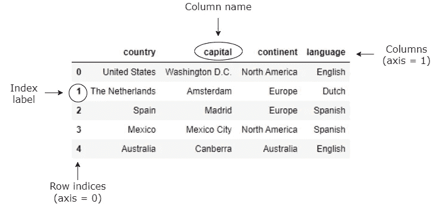
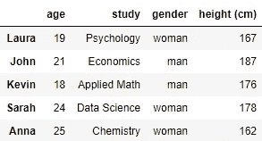
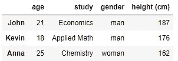
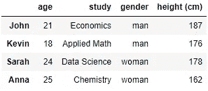
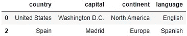
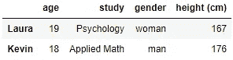
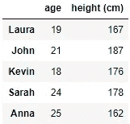
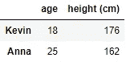
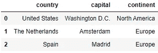

# 熊猫(蟒蛇):使用。loc 和。iloc

> 原文：<https://levelup.gitconnected.com/pandas-python-use-of-loc-and-iloc-ce4390930a0f>

## 选择熊猫系列和数据帧的子集。loc 和。iloc


熊猫 T4 是一个强大的开源数据分析和操作工具，建立在 Python 编程语言之上。pandas 库中的**系列**和 **DataFrame** 数据结构在用 Python 执行与数据分析相关的任务时几乎不可避免地要用到。在许多情况下，当利用这些数据结构时，我们希望只访问选定的一组行和列(也称为**子集选择**)。为了执行这个任务，我们可以使用`.loc`和`.iloc`方法。这两种方法到底有什么区别，我们如何使用？在本文中，我将解释 loc 和 iloc 方法的工作原理和区别。

简而言之，这两种选择方法可以解释如下:

*   **loc** :通过标签**访问一组行和列**。
*   **iloc** :通过**整数位置**(或，位置)访问一组行和列

为了充分理解标签和整数位置的含义，我们将通过在多个示例中应用它们来进一步解释这一点。

# 系列和数据框架

首先，让我们后退一步，考虑我们希望在哪些数据结构上执行 loc 和 iloc 方法。为了充分理解 loc 和 iloc 方法应该如何使用，我们需要知道这些数据结构是如何构建的。下面显示了包含国家数据的**数据帧**(二维)的图片，使用以下代码生成:

```
countries = pd.DataFrame({
'country': ['United States', 'The Netherlands', 'Spain', 'Mexico', 'Australia'],
'capital': ['Washington D.C.', 'Amsterdam', 'Madrid', 'Mexico City', 'Canberra'],
'continent': ['North America', 'Europe', 'Europe', 'North America', 'Australia'],
'language': ['English', 'Dutch', 'Spanish', 'Spanish', 'English']})
```



这里，箭头指向数据帧的不同部分。正如我们所见，该数据帧中的**行**由索引组成，其中**索引标签**在这种情况下只是整数值。这个整数索引是 DataFrame 的缺省值，但是请注意，索引标签不一定必须是整数，因为它们也可以是描述性名称。该数据帧中的**列**有**列名**(或列标签)，这些名称表示特定列中的值代表什么。

下面给出了一个学生数据集的例子，其中数据帧的行具有文本索引(学生的名字)而不是整数:

```
students = pd.DataFrame({
'age': ['19', '21', '18', '24', '25'],
'study': ['Psychology', 'Economics', 'Applied Math', 'Data Science', 'Chemistry'],
'gender': ['woman', 'man', 'man', 'woman', 'woman'],
'height (cm)': ['167', '187', '176', '178', '162']},
index=['Laura', 'John', 'Kevin', 'Sarah', 'Anna'])
```



在整篇文章中，我们将利用上面指定的两个数据帧。

**系列**是一维的。本质上，数据帧中的一列就是一个系列。

# 用`.loc`选择行

让我们从使用`.loc`方法时选择数据帧行的程序开始。回想一下，使用 loc，我们可以通过标签来访问行。考虑学生数据集，回想一下这里的*标签*是学生的名字。然后，要选择“Sarah”行，我们可以按以下方式使用`.loc`:

```
students.loc['Sarah']
```

输出:

```
age                      24
study          Data Science
gender                woman
height (cm)             178
Name: Sarah, dtype: object
```

因为我们选择了一个**单行**，所以输出是一个序列而不是一个数据帧。

接下来，假设我们要选择“John”、“Kevin”和“Anna”行。当使用`.loc`方法时，通过以下方式完成:

```
students.loc[['John', 'Kevin', 'Anna']]
```



由于我们选择了**多个**行，因此输出是由所选学生组成的数据帧。

当我们想要在一个数据帧中选择多个连续的行时，我们也可以使用**切片符号**。为了选择从“John”到“Anna”的行，我们可以使用冒号`:`符号:

```
students.loc['John':'Anna']
```



现在，考虑国家数据集。回想一下，这里的行有整数索引。由于索引标签是整数，所以在使用`.loc`方法时，我们必须根据整数标签来调用它们:

```
countries.loc[[0, 2]]
```



我想再次强调，我们能够在这里使用行的整数位置，因为索引标签是整数。现在，让我们尝试使用学生数据集中行的整数位置来选择位置 0 和 2 上的行:

```
students.loc[[0, 2]]
```

输出:

```
KeyError: "None of [Int64Index([0, 2], dtype='int64')] are in the [index]"
```

因此，实际上，当我们使用`.loc`时，当索引标签不是整数时，我们无法使用行的整数位置。

# 用`.iloc`选择行

除了使用 loc 方法，我们还可以在选择行时使用`.iloc`方法。回想一下，使用 iloc 时，我们可以通过行的整数位置来访问行。也就是说，当我们想要选择第一行时，我们使用 0 整数值，对于第二行，我们使用 1，以此类推。

考虑国家数据集，并假设我们想通过使用`.iloc`方法访问数据帧的第一行和第三行:

```
countries.iloc[[0, 2]]
```


注意，在这里，我们使用 iloc 方法的方式与 loc 方法完全相同，因为 countries 数据集的索引标签是整数。

回想一下，在 students 数据集中，我们无法使用 loc 方法通过整数位置选择行，因为索引标签是学生姓名。通过使用`.iloc`方法，我们*能够*使用行的整数位置来访问它们:

```
students.iloc[[0, 2]]
```



这样，我们看到了在选择数据帧的行时 loc 和 iloc 方法的主要区别。

# 用`.loc`选择列

当选择数据帧的列时，我们使用与行相同的方式使用`.loc`方法。

假设我们想要选择学生数据集中的“年龄”和“身高(厘米)”列。然后，正如我们看到的行一样，我们使用标签(列名)来选择这些列:

```
students.loc[:, ['age', 'height (cm)']]
```



其中冒号`:`表示我们想要选择所有行。

# 用`.iloc`选择列

使用`.iloc`方法时，列的选择与行的选择方式相似。就像对待行一样，我们必须使用我们希望选择的列的整数位置。

现在，为了确保我们不能在这里使用列名，让我们尝试使用 iloc 方法选择“年龄”和“身高(cm)”列，方法与使用 loc 方法时相同:

```
students.iloc[:, ['age', 'height (cm)']]
```

输出:

```
TypeError: cannot perform reduce with flexible type
```

事实上，当使用 iloc 方法时，这是行不通的。我们必须使用“年龄”和“身高(厘米)”列的整数位置来访问它们:

```
students.iloc[:, [0, 3]]
```


# 用`.loc`选择行和列

当选择行和列的子集时，我们可以结合前面看到的内容。然后，我们必须使用我们希望选择的行标签*和列标签*。

例如，假设我们要为学生数据集中的“Kevin”和“Anna”选择“年龄”和“身高(cm)”列。当使用`.loc`方法时，这通过以下方式完成:

```
students.loc[['Kevin', 'Anna'], ['age', 'height (cm)']]
```



当我们想要选择国家数据集中的前三列和前三行时，我们可以使用切片符号:

```
countries.loc[0:2, 'country':'continent']
```

or ( `:2`表示从开始直到索引标签为 2 的行)

```
countries.loc[:2, :'continent']
```



# 用`.iloc`选择行和列

当使用`.iloc`方法选择行和列时，我们必须使用我们想要选择的行和列的整数位置。

同样，假设我们要为学生数据集中的“Kevin”和“Anna”选择“年龄”和“身高(cm)”列。由于行在位置 2 和 4，列在位置 0 和 3，当使用`.iloc`方法时，这是通过以下方式完成的:

```
students.iloc[[2, 4], [0, 3]]
```


要使用 iloc 选择国家数据集中的前三列和前三行，我们可以使用切片符号:

```
countries.iloc[0:2, 0:2]
```

或者

```
countries.iloc[:2, :2]
```


# 感谢阅读！

在本文中，`.loc`和`.iloc`子集选择方法很有意思。在实例的基础上，说明了这两种方法的使用和区别。

我希望这篇文章能让你(更)清楚这两种方法。祝您在自己的项目中使用它们时好运！